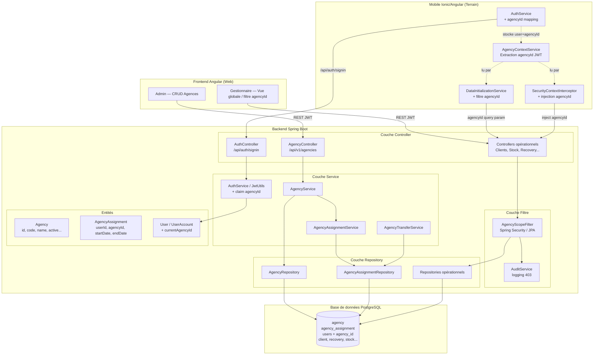
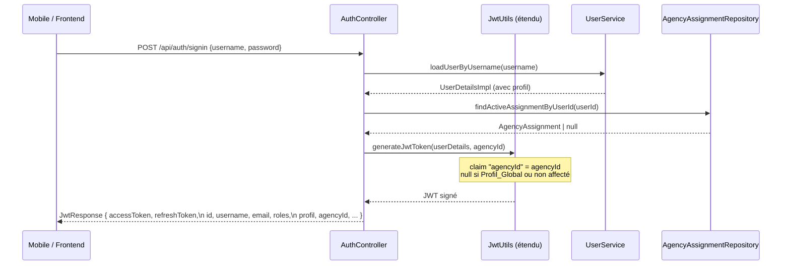
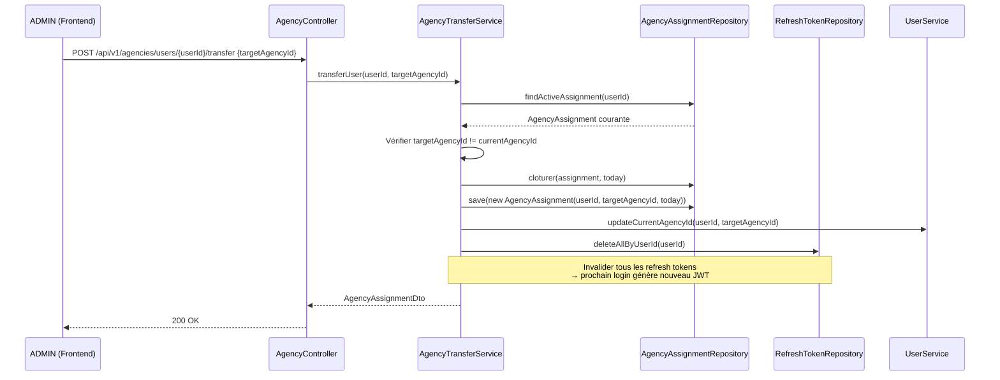
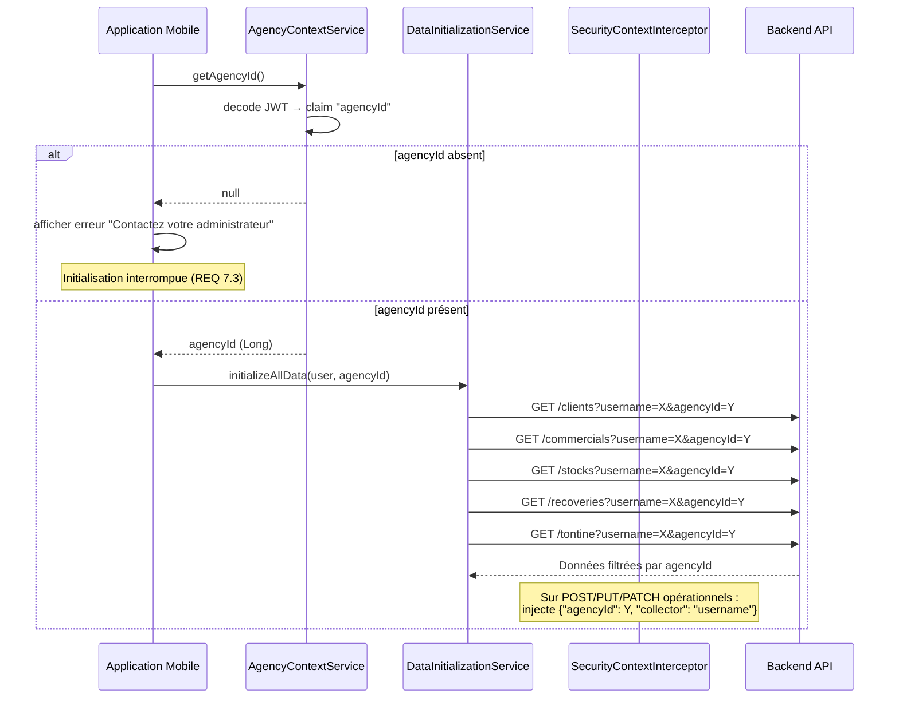
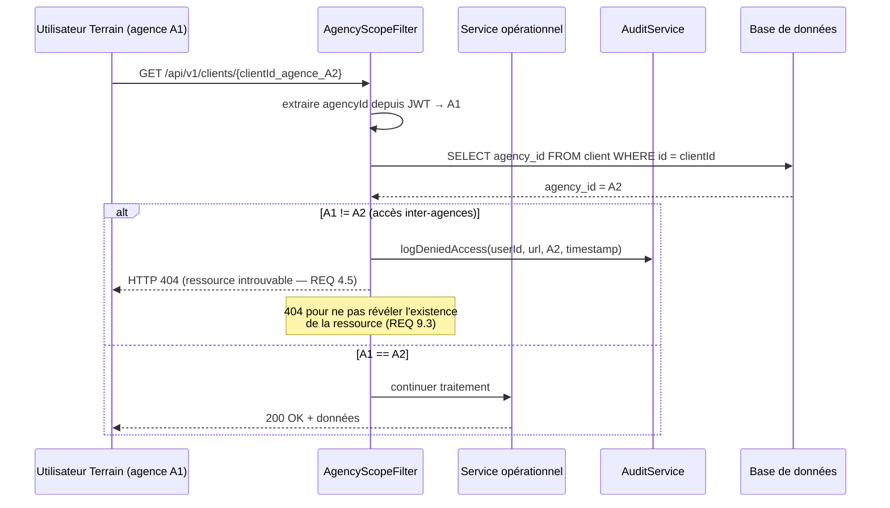
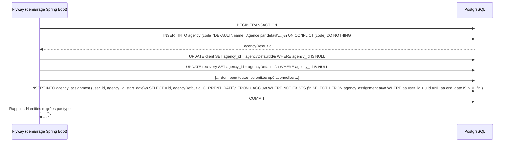

# Document de Design — Gestion Multi-Agences (Multi-Agency Management)

## Overview

Voir section **Vue d'ensemble** ci-dessous.

## Vue d'ensemble

Cette fonctionnalité étend ELYKIA d'une gestion **mono-site implicite** à une architecture **multi-agences explicite**. L'entité `Agency` existe déjà en base (utilisée pour les rapports financiers) ; cette feature lui confère un rôle de gouvernance centrale sur toutes les données opérationnelles.

Les **Profils_Terrain** (PROMOTER, STOREKEEPER, SECRETARY, RECOVERY_MANAGER) voient strictement les données de leur agence d'affectation. Les **Profils_Global** (GESTIONNAIRE, ADMIN, SUPER_ADMIN) disposent d'une vue consolidée ou filtrée. L'`agencyId` est propagé dans le JWT à chaque authentification, ce qui permet à chaque couche (backend, mobile) d'appliquer le cloisonnement sans requête supplémentaire à la base de données.

La migration Flyway est idempotente et crée une `Agence_Par_Défaut` (`code = 'DEFAULT'`) pour rattacher toutes les données existantes sans `agencyId`, garantissant la continuité de service lors de l'activation de la feature.

---

## Components and Interfaces

Voir section **Composants principaux** et **Design bas niveau** ci-dessous pour le détail des interfaces, entités et services.

---

## Data Models

Voir section **Design bas niveau — Backend** ci-dessous pour les entités JPA (`Agency`, `AgencyAssignment`, `UserAccount`) et section **Design bas niveau — Mobile** pour les interfaces TypeScript.

---

## Correctness Properties

### Property 1: Unicité du code d'agence
Pour toute paire d'agences actives `(a1, a2)` avec `a1.id ≠ a2.id`, la propriété `a1.code ≠ a2.code` est vraie après toute opération de création ou modification.

**Validates: Requirements 1.1, 1.2, 1.3**

### Property 2: Unicité de l'affectation active
Pour tout utilisateur Profil_Terrain `u`, le nombre d'`AgencyAssignment` actives (endDate = null) est toujours ≤ 1.

**Validates: Requirements 2.1, 3.1, 3.2**

### Property 3: Round-trip JWT avec agencyId
Pour tout utilisateur Profil_Terrain `u` affecté à l'agence `a` : `decode(generateJwt(u)).agencyId == a.id`.

**Validates: Requirements 6.1, 6.2, 6.3, 6.6**

### Property 4: Isolation des données terrain
Pour tout Profil_Terrain `u` affecté à l'agence `a`, toute entité `e` retournée par une requête de `u` vérifie `e.agencyId == a.id`.

**Validates: Requirements 4.1, 4.4, 9.2**

### Property 5: Filtrage global sous-ensemble du total
Pour tout Profil_Global `g` et tout `agencyId` valide `a` : `|results(g, filter=a)| ≤ |results(g, no_filter)|`.

**Validates: Requirements 5.1, 5.2, 5.3**

### Property 6: Idempotence de la migration
Pour tout état de base `S` : `migrate(migrate(S)) == migrate(S)`.

**Validates: Requirements 8.4, 8.6**

### Property 7: Cohérence historique des mutations
Pour tout historique `[a1, ..., an]` trié par startDate : `∀ i < n : ai.endDate = ai+1.startDate` et seul `an.endDate` peut être null.

**Validates: Requirements 3.1, 3.2, 3.5**

### Property 8: Condition d'erreur — accès inter-agences
Pour tout Profil_Terrain `u` affecté à `a1` et entité `e` appartenant à `a2` (`a1 ≠ a2`), l'accès à `e` produit HTTP 403 ou HTTP 404.

**Validates: Requirements 4.2, 4.5, 9.2, 9.3**

Voir section **Propriétés de correction (Property-Based Testing)** ci-dessous pour les implémentations jqwik complètes (P1–P8).

---

## Error Handling

Voir tableau **Gestion des erreurs** ci-dessous.

---

## Testing Strategy

Voir section **Stratégie de tests** ci-dessous.

---

Cette fonctionnalité étend ELYKIA d'une gestion **mono-site implicite** à une architecture **multi-agences explicite**. L'entité `Agency` existe déjà en base (utilisée pour les rapports financiers) ; cette feature lui confère un rôle de gouvernance centrale sur toutes les données opérationnelles.

Les **Profils_Terrain** (PROMOTER, STOREKEEPER, SECRETARY, RECOVERY_MANAGER) voient strictement les données de leur agence d'affectation. Les **Profils_Global** (GESTIONNAIRE, ADMIN, SUPER_ADMIN) disposent d'une vue consolidée ou filtrée. L'`agencyId` est propagé dans le JWT à chaque authentification, ce qui permet à chaque couche (backend, mobile) d'appliquer le cloisonnement sans requête supplémentaire à la base de données.

La migration Flyway est idempotente et crée une `Agence_Par_Défaut` (`code = 'DEFAULT'`) pour rattacher toutes les données existantes sans `agencyId`, garantissant la continuité de service lors de l'activation de la feature.

---

## Architecture

### Architecture haut niveau



---

## Diagrammes de séquence

### Flux 1 — Authentification avec agencyId dans le JWT



### Flux 2 — Transfert d'agence et invalidation JWT



### Flux 3 — Initialisation mobile avec filtre agencyId



### Flux 4 — Rejet d'accès inter-agences (403/404)



### Flux 5 — Exécution de la migration Flyway



---

## Composants principaux

### Backend — Nouveaux composants

| Composant | Rôle |
|-----------|------|
| `AgencyController` | Endpoints CRUD `/api/v1/agencies`, transfert, historique |
| `AgencyService` | Création, désactivation (check users actifs), CRUD |
| `AgencyAssignmentService` | Affectation initiale, activation compte utilisateur |
| `AgencyTransferService` | Transfert = clôture ancienne + nouvelle affectation + invalidation JWT |
| `AgencyScopeFilter` | Filtre Spring Security / JPA : restreint les requêtes par agencyId |
| `AuditService` (enrichi) | Log des accès refusés par AgencyScope |

### Mobile — Nouveaux composants

| Composant | Rôle |
|-----------|------|
| `AgencyContextService` | Extrait `agencyId` du JWT stocké localement ; source de vérité pour le mobile |
| `SecurityContextInterceptor` (enrichi) | Injecte `agencyId` en plus du `collector` existant |
| `DataInitializationService` (enrichi) | Passe `agencyId` comme query param à chaque appel d'initialisation |
| `AuthService` (enrichi) | Mappe `agencyId` depuis `AuthResponse → User` |

---

## Design bas niveau — Backend

### Entité `Agency` (enrichie)

```java
@Entity
@Table(name = "agency",
       uniqueConstraints = @UniqueConstraint(columnNames = "code"))
@Getter
@Setter
public class Agency extends BaseEntity<String> {

    @Id
    @GeneratedValue(strategy = GenerationType.IDENTITY)
    private Long id;

    @NotBlank
    @Column(name = "code", nullable = false, unique = true, length = 20)
    private String code;

    @NotBlank
    @Column(name = "name", nullable = false)
    private String name;

    // Champs existants conservés
    private String phone;
    private String secretaryName;
    private String secretaryContact;
    private String superviserName;
    private String superviserContact;

    // NOUVEAU
    @Column(name = "active", nullable = false, columnDefinition = "boolean DEFAULT true")
    private boolean active = true;

    @Column(name = "created_at", nullable = false, updatable = false)
    private LocalDateTime createdAt;

    @Column(name = "deactivated_at")
    private LocalDateTime deactivatedAt;

    @Column(name = "deactivated_by")
    private String deactivatedBy;

    @PrePersist
    protected void onCreate() { this.createdAt = LocalDateTime.now(); }
}
```

---

### Entité `AgencyAssignment` (nouvelle)

```java
@Entity
@Table(name = "agency_assignment",
       indexes = {
           @Index(name = "idx_aa_user_end", columnList = "user_id, end_date"),
           @Index(name = "idx_aa_agency_active", columnList = "agency_id, end_date")
       })
@Getter
@Setter
@NoArgsConstructor
public class AgencyAssignment extends Auditable<String> {

    @Id
    @GeneratedValue(strategy = GenerationType.IDENTITY)
    private Long id;

    // Référence vers USERS.USEID (via UserAccount.id ou User.id selon le modèle)
    @Column(name = "user_id", nullable = false)
    private Long userId;

    @ManyToOne(fetch = FetchType.LAZY)
    @JoinColumn(name = "agency_id", nullable = false)
    private Agency agency;

    @Column(name = "start_date", nullable = false)
    private LocalDate startDate;

    @Column(name = "end_date")
    private LocalDate endDate;   // null = affectation active

    @Column(name = "assigned_by", nullable = false)
    private String assignedBy;

    @Column(name = "notes")
    private String notes;

    public boolean isActive() {
        return this.endDate == null;
    }
}
```

---

### Extension `UserAccount` — champ `currentAgencyId`

```java
// Dans UserAccount.java (backend-lib/common-securities)
@Column(name = "current_agency_id")
private Long currentAgencyId;   // null pour Profil_Global
```

---

### Extension `UserDetailsImpl` — champ `agencyId`

```java
// Dans UserDetailsImpl.java
@Getter
@Setter
private Long agencyId;   // null si Profil_Global

// Dans UserDetailsImpl.build(User user) :
UserDetailsImpl details = new UserDetailsImpl(...);
details.setAgencyId(user.getUserAccount().getCurrentAgencyId());
return details;
```

---

### Extension `JwtUtils` — claim `agencyId`

```java
// Dans JwtUtils.java
public String generateJwtToken(Authentication authentication) {
    UserDetailsImpl userPrincipal = (UserDetailsImpl) authentication.getPrincipal();

    JwtBuilder builder = Jwts.builder()
        .setSubject(userPrincipal.getUsername())
        .setIssuedAt(new Date())
        .claim("authorities", userPrincipal.getAuthorities())
        .setExpiration(new Date(System.currentTimeMillis() + jwtExpirationMs));

    // NOUVEAU : inclure agencyId (null si Profil_Global)
    builder.claim("agencyId", userPrincipal.getAgencyId());

    return builder.signWith(key(), SignatureAlgorithm.HS256).compact();
}

// NOUVEAU : extracteur
public Long getAgencyIdFromJwtToken(String token) {
    Claims claims = Jwts.parserBuilder()
        .setSigningKey(key()).build()
        .parseClaimsJws(token).getBody();
    Object raw = claims.get("agencyId");
    return raw != null ? Long.valueOf(raw.toString()) : null;
}
```

---

### Extension `JwtResponse` — champ `agencyId`

```java
// Dans JwtResponse.java
@Getter
@Setter
private Long agencyId;   // null pour Profil_Global

// Constructeur étendu (ou setter appelé après construction)
// Dans AuthController.authenticateUser() :
jwtResponse.setAgencyId(userDetails.getAgencyId());
```

---

### `AgencyService` — signatures et algorithmes

```java
@Service
@Transactional
@RequiredArgsConstructor
public class AgencyService {

    AgencyDto createAgency(AgencyCreateDto dto);
    AgencyDto updateAgency(Long id, AgencyUpdateDto dto);
    AgencyDto deactivateAgency(Long id);
    AgencyDto getAgencyById(Long id);
    List<AgencyDto> getAllActiveAgencies();
    AgencySummaryDto getAgencySummary(Long agencyId);
}
```

**Algorithme `createAgency`** :

```pascal
ALGORITHM createAgency(dto)
INPUT: dto {code, name, phone, ...}
OUTPUT: AgencyDto

BEGIN
  currentUser ← securityContext.getCurrentUser()
  IF NOT currentUser.is(ADMIN) AND NOT currentUser.is(SUPER_ADMIN) THEN
    THROW ForbiddenException("Réservé aux profils ADMIN et SUPER_ADMIN.")
  END IF

  IF agencyRepository.existsByCodeAndActiveTrue(dto.code) THEN
    THROW CustomValidationException(
      "Le code '" + dto.code + "' est déjà utilisé par une agence active.")
  END IF

  IF dto.name IS BLANK OR dto.code IS BLANK THEN
    THROW CustomValidationException("Le nom et le code sont obligatoires.")
  END IF

  agency ← new Agency(code: dto.code, name: dto.name, ...)
  agency.active ← true
  RETURN agencyMapper.toDto(agencyRepository.save(agency))
END
```

**Algorithme `deactivateAgency`** :

```pascal
ALGORITHM deactivateAgency(id)
INPUT: id de type Long
OUTPUT: AgencyDto

BEGIN
  currentUser ← securityContext.getCurrentUser()
  IF NOT currentUser.is(ADMIN) AND NOT currentUser.is(SUPER_ADMIN) THEN
    THROW ForbiddenException
  END IF

  agency ← agencyRepository.findById(id)
  IF agency IS NULL THEN THROW NotFoundException END IF

  activeUsers ← assignmentRepository.findActiveUsersByAgencyId(id)
  IF activeUsers.isNotEmpty() THEN
    THROW CustomValidationException(
      "Impossible de désactiver : " + activeUsers.size() +
      " utilisateur(s) actif(s) rattaché(s) : " + activeUsers.usernames)
  END IF

  agency.active ← false
  agency.deactivatedAt ← now()
  agency.deactivatedBy ← currentUser.username
  RETURN agencyMapper.toDto(agencyRepository.save(agency))
END
```

---

### `AgencyAssignmentService` — signatures et algorithmes

```java
@Service
@Transactional
@RequiredArgsConstructor
public class AgencyAssignmentService {

    AgencyAssignmentDto assignUserToAgency(Long userId, Long agencyId, String notes);
    List<AgencyAssignmentDto> getAssignmentHistory(Long userId);
}
```

**Algorithme `assignUserToAgency`** :

```pascal
ALGORITHM assignUserToAgency(userId, agencyId, notes)
INPUT: userId, agencyId de type Long
OUTPUT: AgencyAssignmentDto

BEGIN
  currentUser ← securityContext.getCurrentUser()
  IF NOT currentUser.is(ADMIN) AND NOT currentUser.is(SUPER_ADMIN) THEN
    THROW ForbiddenException
  END IF

  agency ← agencyRepository.findById(agencyId)
  IF agency IS NULL OR NOT agency.active THEN
    THROW CustomValidationException("Agence inexistante ou désactivée.")
  END IF

  IF assignmentRepository.existsActiveAssignment(userId) THEN
    THROW CustomValidationException(
      "L'utilisateur a déjà une affectation active. Utiliser le transfert.")
  END IF

  assignment ← new AgencyAssignment(
    userId: userId, agency: agency, startDate: today(),
    assignedBy: currentUser.username, notes: notes
  )
  assignmentRepository.save(assignment)

  // Activer le compte si c'était un Profil_Terrain inactif en attente d'affectation
  user ← userRepository.findById(userId)
  IF user.isProfilTerrain() AND NOT user.getUserAccount().getActive() THEN
    user.getUserAccount().setActive(true)
  END IF
  user.getUserAccount().setCurrentAgencyId(agencyId)
  userRepository.save(user)

  RETURN assignmentMapper.toDto(assignment)
END
```

---

### `AgencyTransferService` — algorithme

```java
@Service
@Transactional
@RequiredArgsConstructor
public class AgencyTransferService {

    AgencyAssignmentDto transferUser(Long userId, Long targetAgencyId, String notes);
}
```

```pascal
ALGORITHM transferUser(userId, targetAgencyId, notes)
INPUT: userId, targetAgencyId de type Long
OUTPUT: AgencyAssignmentDto

BEGIN
  currentUser ← securityContext.getCurrentUser()
  IF NOT currentUser.is(ADMIN) AND NOT currentUser.is(SUPER_ADMIN) THEN
    THROW ForbiddenException
  END IF

  currentAssignment ← assignmentRepository.findActiveAssignment(userId)
  IF currentAssignment IS NULL THEN
    THROW CustomValidationException("L'utilisateur n'a pas d'affectation active.")
  END IF

  IF currentAssignment.agency.id = targetAgencyId THEN
    THROW CustomValidationException(
      "L'utilisateur est déjà affecté à cette agence.")
  END IF

  targetAgency ← agencyRepository.findById(targetAgencyId)
  IF targetAgency IS NULL OR NOT targetAgency.active THEN
    THROW CustomValidationException("Agence cible inexistante ou désactivée.")
  END IF

  // Clôturer l'ancienne affectation
  currentAssignment.endDate ← today()
  assignmentRepository.save(currentAssignment)

  // Créer la nouvelle affectation
  newAssignment ← new AgencyAssignment(
    userId, agency: targetAgency, startDate: today(),
    assignedBy: currentUser.username, notes: notes
  )
  assignmentRepository.save(newAssignment)

  // Mettre à jour le currentAgencyId du UserAccount
  user ← userRepository.findById(userId)
  user.getUserAccount().setCurrentAgencyId(targetAgencyId)
  userRepository.save(user)

  // Invalider tous les refresh tokens → forcer reconnexion avec nouveau JWT
  refreshTokenRepository.deleteAllByUserId(userId)

  RETURN assignmentMapper.toDto(newAssignment)
END
```

---

### `AgencyScopeFilter` — logique de filtrage

```pascal
ALGORITHM AgencyScopeFilter.doFilter(request, response, chain)
INPUT: requête HTTP entrante
OUTPUT: continuation ou rejet HTTP 403/404

BEGIN
  authentication ← SecurityContextHolder.getContext().getAuthentication()
  IF authentication IS NULL OR NOT authentication.isAuthenticated() THEN
    chain.doFilter(request, response)
    RETURN
  END IF

  userDetails ← (UserDetailsImpl) authentication.getPrincipal()
  profil ← userDetails.getProfil()

  IF profil IN [GESTIONNAIRE, ADMIN, SUPER_ADMIN] THEN
    // Profil_Global : accès sans restriction
    // Si query param agencyId présent → filtrage optionnel au niveau service
    chain.doFilter(request, response)
    RETURN
  END IF

  // Profil_Terrain
  agencyId ← userDetails.getAgencyId()
  IF agencyId IS NULL THEN
    auditService.logDeniedAccess(userDetails.getId(), request.getUrl(), null, now())
    response.sendError(403, "Aucune agence assignée à ce compte.")
    RETURN
  END IF

  // Injecter agencyId dans le contexte de requête pour que les repositories l'utilisent
  AgencyContext.setCurrentAgencyId(agencyId)

  chain.doFilter(request, response)

  AgencyContext.clear()
END

// AgencyContext : ThreadLocal permettant aux services de récupérer l'agencyId courant
class AgencyContext {
    static ThreadLocal<Long> current = new ThreadLocal<>()
    static void setCurrentAgencyId(Long id) { current.set(id) }
    static Long getCurrentAgencyId() { return current.get() }
    static void clear() { current.remove() }
}
```

**Application dans les repositories JPA** :

```java
// Exemple dans ClientRepository
@Query("SELECT c FROM Client c WHERE " +
       "(:agencyId IS NULL OR c.agencyId = :agencyId) AND c.state = 'ENABLED'")
Page<Client> findAllByAgency(@Param("agencyId") Long agencyId, Pageable pageable);

// Dans ClientService.getAllClients() :
Long agencyId = AgencyContext.getCurrentAgencyId();
// null → Profil_Global (voir toutes)
// non-null → Profil_Terrain (filtre appliqué)
return clientRepository.findAllByAgency(agencyId, pageable);
```

---

### Endpoints REST

| Méthode | Chemin | Rôle requis | Description |
|---------|--------|-------------|-------------|
| `POST` | `/api/v1/agencies` | ADMIN, SUPER_ADMIN | Créer une agence |
| `PUT` | `/api/v1/agencies/{id}` | ADMIN, SUPER_ADMIN | Modifier une agence |
| `DELETE` | `/api/v1/agencies/{id}/deactivate` | ADMIN, SUPER_ADMIN | Désactiver une agence (check users actifs) |
| `GET` | `/api/v1/agencies/{id}` | ADMIN, SUPER_ADMIN | Détail agence + nb utilisateurs actifs |
| `GET` | `/api/v1/agencies/all` | GESTIONNAIRE, ADMIN, SUPER_ADMIN | Liste toutes les agences actives |
| `GET` | `/api/v1/agencies/{agencyId}/summary` | Profil_Global | Résumé (clients, crédits, recouvrements, caisse) |
| `POST` | `/api/v1/agencies/users/{userId}/assign` | ADMIN, SUPER_ADMIN | Affecter un utilisateur terrain à une agence |
| `POST` | `/api/v1/agencies/users/{userId}/transfer` | ADMIN, SUPER_ADMIN | Transférer l'utilisateur vers une autre agence |
| `GET` | `/api/v1/agencies/users/{userId}/history` | ADMIN, SUPER_ADMIN | Historique des affectations (ordre décroissant) |

---

## Design bas niveau — Mobile (Ionic/Angular)

### Modèles TypeScript mis à jour

```typescript
// auth.model.ts — MODIFICATIONS

export interface User {
  id: string;
  username: string;
  email: string;
  roles: string[];
  profil?: string;
  accessToken: string;
  refreshToken: string;
  passwordHash?: string;
  mustChangePassword?: boolean;
  agencyId?: number | null;  // NOUVEAU — null pour Profil_Global
}

export interface AuthResponse {
  id: string;
  username: string;
  email: string;
  roles: string[];
  profil?: string;
  tokenType: string;
  accessToken: string;
  refreshToken: string;
  deviceRestrictionActive?: boolean;
  mustChangePassword?: boolean;
  agencyId?: number | null;  // NOUVEAU
}

export interface MobileSsoPayload {
  accessToken: string;
  refreshToken: string;
  id: string;
  username: string;
  email: string;
  roles: string[];
  profil?: string;
  mustChangePassword?: boolean;
  agencyId?: number | null;  // NOUVEAU
}
```

---

### `AgencyContextService` (nouveau)

```typescript
// agency-context.service.ts

import { Injectable } from '@angular/core';
import { Preferences } from '@capacitor/preferences';
import { Store } from '@ngrx/store';
import { selectAuthUser } from '../../store/auth/auth.selectors';
import { LoggerService } from './logger.service';

@Injectable({ providedIn: 'root' })
export class AgencyContextService {

  constructor(
    private store: Store,
    private log: LoggerService
  ) {}

  /**
   * Retourne l'agencyId de l'utilisateur connecté.
   * Source primaire : store NgRx.
   * Fallback : Preferences (connexion offline).
   * Retourne null si Profil_Global ou non affecté.
   */
  async getAgencyId(): Promise<number | null> {
    return new Promise(resolve => {
      this.store.select(selectAuthUser).pipe(take(1)).subscribe(async user => {
        if (user) {
          resolve(user.agencyId ?? null);
        } else {
          // Fallback offline
          const { value } = await Preferences.get({ key: 'currentUser' });
          if (value) {
            const stored: User = JSON.parse(value);
            resolve(stored.agencyId ?? null);
          } else {
            resolve(null);
          }
        }
      });
    });
  }

  /**
   * Indique si l'utilisateur courant est un Profil_Terrain
   * nécessitant un agencyId valide.
   */
  async isProfilTerrain(): Promise<boolean> {
    return new Promise(resolve => {
      this.store.select(selectAuthUser).pipe(take(1)).subscribe(user => {
        const terrainProfils = ['PROMOTER', 'STOREKEEPER', 'SECRETARY', 'RECOVERY_MANAGER'];
        resolve(!!user?.profil && terrainProfils.includes(user.profil));
      });
    });
  }

  /**
   * Vérifie si l'agencyId stocké localement correspond à celui du JWT courant.
   * Déclenche une purge + rechargement si un changement est détecté.
   */
  async hasAgencyChanged(previousAgencyId: number | null): Promise<boolean> {
    const currentAgencyId = await this.getAgencyId();
    if (previousAgencyId !== null && currentAgencyId !== null &&
        previousAgencyId !== currentAgencyId) {
      this.log.log(
        `[AgencyContextService] Agency change detected: ${previousAgencyId} → ${currentAgencyId}`
      );
      return true;
    }
    return false;
  }
}
```

---

### `AuthService.processAuthResponse()` — mapping agencyId

```typescript
// auth.service.ts — méthode processAuthResponse modifiée

private async processAuthResponse(response: AuthResponse, passwordPlain: string): Promise<boolean> {
  const user: User = {
    id: response.id,
    username: response.username,
    email: response.email,
    roles: response.roles,
    profil: response.profil,
    accessToken: response.accessToken,
    refreshToken: response.refreshToken,
    passwordHash: this.hashPassword(passwordPlain),
    mustChangePassword: response.mustChangePassword === true,
    agencyId: response.agencyId ?? null,  // NOUVEAU
  };

  // Détection de changement d'agence (mutation entre deux connexions)
  const storedUser = await this.getUserLocally();
  if (storedUser?.agencyId != null && user.agencyId != null &&
      storedUser.agencyId !== user.agencyId) {
    this.log.log('[AuthService] Agency change detected on login — local data purge required.');
    // Signal au DataInitializationService de purger les données de l'ancienne agence
    await Preferences.set({ key: 'agency_changed', value: 'true' });
  }

  this._user = user;
  await this.saveUserLocally(user);
  this.store.dispatch(AuthActions.loginSuccess({ user }));
  await this.dailyConsentState.restoreFromPreferences(user.username);
  return true;
}
```

---

### `SecurityContextInterceptor` — injection agencyId

```typescript
// security-context.interceptor.ts — MODIFIÉ

@Injectable()
export class SecurityContextInterceptor implements HttpInterceptor {

  // URLs des endpoints stock (comportement existant)
  private readonly stockTargetUrls = [
    '/api/stock-requests',
    '/api/stock-returns',
    '/api/v1/stock-tontine-'
  ];

  // NOUVEAU : tous les endpoints opérationnels mutants
  private readonly operationalTargetUrls = [
    '/api/v1/clients',
    '/api/v1/credits',
    '/api/v1/recoveries',
    '/api/v1/tontine',
    '/api/v1/distributions',
    '/api/v1/accounting',
    '/api/v1/orders',
    '/api/v1/expenses',
    '/api/v1/inventory',
    '/api/stock-requests',
    '/api/stock-returns',
    '/api/v1/stock-tontine-'
  ];

  constructor(private authService: AuthService, private log: LoggerService) {}

  intercept(request: HttpRequest<unknown>, next: HttpHandler): Observable<HttpEvent<unknown>> {
    const isMutatingMethod = ['POST', 'PUT', 'PATCH'].includes(request.method);
    if (!isMutatingMethod) return next.handle(request);

    const isOperational = this.operationalTargetUrls.some(url => request.url.includes(url));
    if (!isOperational) return next.handle(request);

    const user = this.authService.currentUser;
    if (!user) {
      this.log.log(`[SecurityContextInterceptor] WARNING: no authenticated user for ${request.url}`);
      return next.handle(request);
    }

    const isStock = this.stockTargetUrls.some(url => request.url.includes(url));
    const body = isStock
      ? this.injectCollectorAndAgency(request.body, user.username, user.agencyId)
      : this.injectAgency(request.body, user.agencyId);

    return next.handle(request.clone({ body }));
  }

  private injectCollectorAndAgency(
    body: unknown, username: string, agencyId: number | null | undefined
  ): unknown {
    if (!body || typeof body !== 'object' || Array.isArray(body)) {
      return { collector: username, agencyId };
    }

    const record = { ...(body as Record<string, unknown>) };

    // Cas StockRequestCreateDto : { request: { items, collector? }, forNextMonth? }
    if (record['request'] && typeof record['request'] === 'object' && !Array.isArray(record['request'])) {
      const requestBody = { ...(record['request'] as Record<string, unknown>) };
      if (!requestBody['collector']) requestBody['collector'] = username;
      if (!requestBody['agencyId'] && agencyId != null) requestBody['agencyId'] = agencyId;
      record['request'] = requestBody;
    } else {
      if (!record['collector']) record['collector'] = username;
      if (!record['agencyId'] && agencyId != null) record['agencyId'] = agencyId;
    }
    return record;
  }

  private injectAgency(body: unknown, agencyId: number | null | undefined): unknown {
    if (agencyId == null) return body;
    if (!body || typeof body !== 'object' || Array.isArray(body)) {
      return { agencyId };
    }
    const record = { ...(body as Record<string, unknown>) };
    if (!record['agencyId']) record['agencyId'] = agencyId;
    return record;
  }
}
```

---

### `DataInitializationService` — signatures enrichies

```typescript
// data-initialization.service.ts — MODIFICATIONS

// Chaque méthode utilise désormais agencyId en plus du username.
// AgencyContextService est injecté dans le constructeur.

constructor(
  // ... dépendances existantes ...
  private agencyContextService: AgencyContextService  // NOUVEAU
) { ... }

/**
 * Vérifie que l'agencyId est disponible avant toute initialisation.
 * Interrompt si absent pour un Profil_Terrain (REQ 7.3).
 */
private async resolveAgencyId(): Promise<number | null> {
  const isTerrainProfil = await this.agencyContextService.isProfilTerrain();
  const agencyId = await this.agencyContextService.getAgencyId();

  if (isTerrainProfil && agencyId == null) {
    throw new Error(
      'Votre compte n\'est pas encore associé à une agence.\n\n' +
      'Veuillez contacter votre administrateur pour obtenir une affectation.'
    );
  }
  return agencyId;
}

// Méthode principale modifiée
public initializeAllData(user: User): Observable<boolean> {
  return from(this.resolveAgencyId()).pipe(
    switchMap(agencyId => {
      // Détecter un changement d'agence depuis la dernière session
      return from(Preferences.get({ key: 'agency_changed' })).pipe(
        switchMap(async ({ value }) => {
          if (value === 'true') {
            await this.purgeLocalDataForAgencyChange();
            await Preferences.remove({ key: 'agency_changed' });
          }
          return agencyId;
        })
      );
    }),
    switchMap(agencyId =>
      this.initializeParameters().pipe(
        concatMap(() => this.initializeArticles()),
        concatMap(() => this.initializeCommercial(agencyId)),
        concatMap(() => this.initializeLocalities()),
        concatMap(() => this.initializeClients(false, agencyId)),
        concatMap(() => this.initializeStockOutputs(agencyId)),
        concatMap(() => this.initializeCommercialStock(agencyId)),
        concatMap(() => this.initializeDistributions(agencyId)),
        concatMap(() => this.initializeAccounts()),
        concatMap(() => this.initializeRecoveries(agencyId)),
        concatMap(() => this.initializeReliquats(agencyId)),
        concatMap(() => this.initializeTontine(agencyId)),
        concatMap(() => from(this.validateInitialData()))
      )
    )
  ) as Observable<boolean>;
}

// Exemple de signature enrichie (même pattern pour toutes)
initializeClients(forceRefresh: boolean = false, agencyId?: number | null): Observable<boolean>;
initializeRecoveries(agencyId?: number | null): Observable<boolean>;
initializeTontine(agencyId?: number | null): Observable<boolean>;
initializeCommercial(agencyId?: number | null): Observable<boolean>;
initializeStockOutputs(agencyId?: number | null): Observable<boolean>;
initializeCommercialStock(agencyId?: number | null): Observable<boolean>;
initializeDistributions(agencyId?: number | null): Observable<boolean>;
initializeReliquats(agencyId?: number | null): Observable<boolean>;

/**
 * Purge toutes les données locales liées à l'ancienne agence.
 * Appelée automatiquement en cas de changement d'agencyId détecté au login.
 */
private async purgeLocalDataForAgencyChange(): Promise<void> {
  await this.dbService.clearAllOperationalTables();
  this.log.log('[DataInitializationService] Local data purged after agency transfer.');
}
```

---

## Migration Flyway

```sql
-- V102__multi_agency_management.sql
-- Gestion multi-agences : Agency, AgencyAssignment, agencyId sur entités opérationnelles
-- Idempotent : toutes les opérations utilisent IF NOT EXISTS / ON CONFLICT DO NOTHING

BEGIN;

-- =========================================================
-- 1. Compléter la table agency (ajout des nouveaux champs)
-- =========================================================
ALTER TABLE agency
  ADD COLUMN IF NOT EXISTS active          BOOLEAN     NOT NULL DEFAULT TRUE,
  ADD COLUMN IF NOT EXISTS created_at      TIMESTAMP,
  ADD COLUMN IF NOT EXISTS deactivated_at  TIMESTAMP,
  ADD COLUMN IF NOT EXISTS deactivated_by  VARCHAR(255);

-- Contrainte d'unicité sur code (si pas encore existante)
DO $$
BEGIN
  IF NOT EXISTS (
    SELECT 1 FROM pg_constraint
    WHERE conname = 'uq_agency_code' AND conrelid = 'agency'::regclass
  ) THEN
    ALTER TABLE agency ADD CONSTRAINT uq_agency_code UNIQUE (code);
  END IF;
END$$;

-- =========================================================
-- 2. Créer la table agency_assignment
-- =========================================================
CREATE TABLE IF NOT EXISTS agency_assignment (
    id            BIGSERIAL    PRIMARY KEY,
    user_id       BIGINT       NOT NULL,
    agency_id     BIGINT       NOT NULL REFERENCES agency(id),
    start_date    DATE         NOT NULL,
    end_date      DATE,                     -- NULL = affectation active
    assigned_by   VARCHAR(255) NOT NULL,
    notes         TEXT,
    created_date  TIMESTAMP,
    last_modified_date TIMESTAMP,
    created_by    VARCHAR(255),
    last_modified_by VARCHAR(255),
    state         VARCHAR(50)
);

CREATE INDEX IF NOT EXISTS idx_aa_user_end
    ON agency_assignment(user_id, end_date);
CREATE INDEX IF NOT EXISTS idx_aa_agency_active
    ON agency_assignment(agency_id, end_date);

-- =========================================================
-- 3. Ajouter currentAgencyId sur UserAccount (UACC)
-- =========================================================
ALTER TABLE UACC
  ADD COLUMN IF NOT EXISTS current_agency_id BIGINT REFERENCES agency(id);

-- =========================================================
-- 4. Ajouter agency_id sur toutes les entités opérationnelles
-- =========================================================
ALTER TABLE client                   ADD COLUMN IF NOT EXISTS agency_id BIGINT REFERENCES agency(id);
ALTER TABLE recovery                 ADD COLUMN IF NOT EXISTS agency_id BIGINT REFERENCES agency(id);
ALTER TABLE mobile_transaction       ADD COLUMN IF NOT EXISTS agency_id BIGINT REFERENCES agency(id);
ALTER TABLE stock_request            ADD COLUMN IF NOT EXISTS agency_id BIGINT REFERENCES agency(id);
ALTER TABLE stock_return             ADD COLUMN IF NOT EXISTS agency_id BIGINT REFERENCES agency(id);
ALTER TABLE commercial_monthly_stock ADD COLUMN IF NOT EXISTS agency_id BIGINT REFERENCES agency(id);
ALTER TABLE commercial_stock_movement ADD COLUMN IF NOT EXISTS agency_id BIGINT REFERENCES agency(id);
ALTER TABLE tontine_session          ADD COLUMN IF NOT EXISTS agency_id BIGINT REFERENCES agency(id);
ALTER TABLE orders                   ADD COLUMN IF NOT EXISTS agency_id BIGINT REFERENCES agency(id);
ALTER TABLE daily_commercial_report  ADD COLUMN IF NOT EXISTS agency_id BIGINT REFERENCES agency(id);
ALTER TABLE inventory                ADD COLUMN IF NOT EXISTS agency_id BIGINT REFERENCES agency(id);
ALTER TABLE expense                  ADD COLUMN IF NOT EXISTS agency_id BIGINT REFERENCES agency(id);
ALTER TABLE accounting_day           ADD COLUMN IF NOT EXISTS agency_id BIGINT REFERENCES agency(id);

-- =========================================================
-- 5. Créer l'Agence_Par_Défaut si elle n'existe pas
-- =========================================================
INSERT INTO agency (code, name, active, created_at)
VALUES ('DEFAULT', 'Agence par défaut', TRUE, NOW())
ON CONFLICT (code) DO NOTHING;

-- =========================================================
-- 6. Migrer les entités orphelines vers l'Agence_Par_Défaut
-- =========================================================
DO $$
DECLARE
  default_agency_id BIGINT;
BEGIN
  SELECT id INTO default_agency_id FROM agency WHERE code = 'DEFAULT';

  UPDATE client                    SET agency_id = default_agency_id WHERE agency_id IS NULL;
  UPDATE recovery                  SET agency_id = default_agency_id WHERE agency_id IS NULL;
  UPDATE mobile_transaction        SET agency_id = default_agency_id WHERE agency_id IS NULL;
  UPDATE stock_request             SET agency_id = default_agency_id WHERE agency_id IS NULL;
  UPDATE stock_return              SET agency_id = default_agency_id WHERE agency_id IS NULL;
  UPDATE commercial_monthly_stock  SET agency_id = default_agency_id WHERE agency_id IS NULL;
  UPDATE commercial_stock_movement SET agency_id = default_agency_id WHERE agency_id IS NULL;
  UPDATE tontine_session           SET agency_id = default_agency_id WHERE agency_id IS NULL;
  UPDATE orders                    SET agency_id = default_agency_id WHERE agency_id IS NULL;
  UPDATE daily_commercial_report   SET agency_id = default_agency_id WHERE agency_id IS NULL;
  UPDATE inventory                 SET agency_id = default_agency_id WHERE agency_id IS NULL;
  UPDATE expense                   SET agency_id = default_agency_id WHERE agency_id IS NULL;
  UPDATE accounting_day            SET agency_id = default_agency_id WHERE agency_id IS NULL;

  -- Migrer les utilisateurs sans AgencyAssignment active
  INSERT INTO agency_assignment (user_id, agency_id, start_date, assigned_by, notes)
  SELECT u.id, default_agency_id, CURRENT_DATE, 'SYSTEM_MIGRATION',
         'Migration automatique vers agence par défaut'
  FROM UACC u
  WHERE NOT EXISTS (
    SELECT 1 FROM agency_assignment aa
    WHERE aa.user_id = u.id AND aa.end_date IS NULL
  );

  -- Mettre à jour current_agency_id dans UserAccount
  UPDATE UACC u
  SET current_agency_id = default_agency_id
  WHERE u.current_agency_id IS NULL
    AND EXISTS (
      SELECT 1 FROM agency_assignment aa
      WHERE aa.user_id = u.id AND aa.end_date IS NULL
        AND aa.agency_id = default_agency_id
    );

END$$;

-- =========================================================
-- 7. Index de performance sur les colonnes agency_id
-- =========================================================
CREATE INDEX IF NOT EXISTS idx_client_agency        ON client(agency_id);
CREATE INDEX IF NOT EXISTS idx_recovery_agency      ON recovery(agency_id);
CREATE INDEX IF NOT EXISTS idx_stock_req_agency     ON stock_request(agency_id);
CREATE INDEX IF NOT EXISTS idx_stock_ret_agency     ON stock_return(agency_id);
CREATE INDEX IF NOT EXISTS idx_tontine_sess_agency  ON tontine_session(agency_id);
CREATE INDEX IF NOT EXISTS idx_daily_report_agency  ON daily_commercial_report(agency_id);
CREATE INDEX IF NOT EXISTS idx_expense_agency       ON expense(agency_id);
CREATE INDEX IF NOT EXISTS idx_accounting_day_agency ON accounting_day(agency_id);

COMMIT;
```

---

## Gestion des erreurs

| Scénario | Condition | Réponse HTTP | Message |
|----------|-----------|-------------|---------|
| Création agence avec code dupliqué | `existsByCodeAndActiveTrue(code) = true` | `400 Bad Request` | "Le code 'X' est déjà utilisé par une agence active." |
| Désactivation avec utilisateurs actifs | `findActiveUsersByAgencyId(id).size > 0` | `400 Bad Request` | "Impossible de désactiver : N utilisateur(s) actif(s) rattaché(s) : [usernames]." |
| Affectation à agence inexistante / inactive | `agency IS NULL OR NOT agency.active` | `400 Bad Request` | "Agence inexistante ou désactivée." |
| Transfert vers même agence | `targetAgencyId == currentAgencyId` | `400 Bad Request` | "L'utilisateur est déjà affecté à cette agence." |
| Transfert sans affectation active | `findActiveAssignment IS NULL` | `400 Bad Request` | "L'utilisateur n'a pas d'affectation active." |
| Accès cross-agence (Profil_Terrain) | `agencyId JWT != agencyId ressource` | `404 Not Found` | _(silencieux — ressource introuvable)_ |
| JWT Profil_Terrain sans agencyId | `agencyId claim = null` pour terrain | `401 Unauthorized` | "Aucune agence assignée à ce compte." |
| Action de gestion par non-ADMIN | Profil != ADMIN et != SUPER_ADMIN | `403 Forbidden` | "Réservé aux profils ADMIN et SUPER_ADMIN." |
| Mobile init sans agencyId (terrain) | `agencyId null + isProfilTerrain` | Erreur applicative | "Votre compte n'est pas encore associé à une agence. Contactez votre administrateur." |
| Résumé agence inexistante | `agencyId introuvable` | `404 Not Found` | "Agence introuvable." |

---

## Propriétés de correction (Property-Based Testing)

### P1 — Unicité du code d'agence (Invariant)

Pour toute séquence d'opérations de création/modification d'agences, aucune paire d'agences actives `(a1, a2)` avec `a1.id ≠ a2.id` ne vérifie `a1.code = a2.code`.

```java
// AgencyServicePropertyTest.java (jqwik)
@Property
void uniciteCodeAgenceActives(@ForAll @AlphaChars @StringLength(min=3, max=20) String code) {
    // Créer deux agences avec le même code
    agencyService.createAgency(AgencyCreateDto.of(code, "Agence 1"));
    // La deuxième tentative doit lever CustomValidationException
    assertThrows(CustomValidationException.class,
        () -> agencyService.createAgency(AgencyCreateDto.of(code, "Agence 2")));
}
```

**Valide : Requirements 1.1, 1.2, 1.3**

---

### P2 — Unicité de l'affectation active (Invariant)

Pour tout utilisateur Profil_Terrain `u`, à tout instant, le nombre d'`AgencyAssignment` avec `endDate = null` lié à `u` est ≤ 1.

```java
@Property
void uniciteAffectationActive(@ForAll @Positive Long userId, @ForAll @Positive Long agencyId1,
                               @ForAll @Positive Long agencyId2) {
    Assume.that(agencyId1 != agencyId2);
    assignmentService.assignUserToAgency(userId, agencyId1, null);
    // Tenter une seconde affectation directe → doit échouer
    assertThrows(CustomValidationException.class,
        () -> assignmentService.assignUserToAgency(userId, agencyId2, null));
    // Seul le transfert est autorisé
    long activeCount = assignmentRepository.countActiveByUserId(userId);
    assertEquals(1L, activeCount);
}
```

**Valide : Requirements 2.1, 3.1, 3.2**

---

### P3 — Round-trip JWT avec agencyId (Round-Trip)

Pour tout utilisateur Profil_Terrain `u` affecté à l'agence `a` :
`decode(generateJwt(u)).agencyId == a.id`

```java
@Property
void roundTripJwtAgencyId(@ForAll @Positive Long agencyId) {
    UserDetailsImpl details = mockUserDetails(agencyId);
    String jwt = jwtUtils.generateJwtToken(mockAuthentication(details));
    Long extracted = jwtUtils.getAgencyIdFromJwtToken(jwt);
    assertEquals(agencyId, extracted);
}

@Property
void jwtProfilGlobalAgencyIdNull() {
    UserDetailsImpl details = mockUserDetailsGlobal();  // agencyId = null
    String jwt = jwtUtils.generateJwtToken(mockAuthentication(details));
    assertNull(jwtUtils.getAgencyIdFromJwtToken(jwt));
}
```

**Valide : Requirements 6.1, 6.2, 6.3, 6.6**

---

### P4 — Isolation des données terrain (Invariant)

Pour tout Profil_Terrain `u` affecté à l'agence `a`, toute entité `e` retournée par une requête authentifiée de `u` vérifie `e.agencyId == a.id`.

```java
@Property
void isolationDonneesProfilTerrain(@ForAll @Positive Long agencyId) {
    mockSecurityContext(agencyId, PROMOTER);
    Page<ClientDto> results = clientService.getAllClients(PageRequest.of(0, 100));
    results.forEach(client ->
        assertEquals(agencyId, client.getAgencyId(),
            "Client " + client.getId() + " should belong to agency " + agencyId)
    );
}
```

**Valide : Requirements 4.1, 4.4, 9.2**

---

### P5 — Filtrage global sous-ensemble du total (Métamorphique)

Pour tout Profil_Global `g` et tout `agencyId` valide `a` :
`|results(g, filter=a)| ≤ |results(g, no_filter)|`

```java
@Property
void filtrageGlobalSousEnsemble(@ForAll @Positive Long agencyId) {
    mockSecurityContext(null, GESTIONNAIRE);
    long totalSansFiltre = clientService.countAll();
    long totalAvecFiltre = clientService.countByAgency(agencyId);
    assertTrue(totalAvecFiltre <= totalSansFiltre);
}
```

**Valide : Requirements 5.1, 5.2, 5.3**

---

### P6 — Idempotence de la migration (Idempotence)

Pour tout état de base `S`, `migrate(migrate(S)) == migrate(S)`.

```java
@Test
void idempotenceMigration() {
    // Exécuter la migration une première fois
    flywayMigrationRunner.runMigration("V102");
    long countAssignments1 = assignmentRepository.count();
    long countDefaultAgencyClients1 = clientRepository.countByAgencyCode("DEFAULT");

    // Ré-exécuter (simulation par appel du script SQL)
    flywayMigrationRunner.runMigration("V102");
    long countAssignments2 = assignmentRepository.count();
    long countDefaultAgencyClients2 = clientRepository.countByAgencyCode("DEFAULT");

    assertEquals(countAssignments1, countAssignments2);
    assertEquals(countDefaultAgencyClients1, countDefaultAgencyClients2);
}
```

**Valide : Requirements 8.4, 8.6**

---

### P7 — Cohérence historique des mutations (Invariant)

Pour tout historique d'un utilisateur `[a1, a2, ..., an]` (trié par `startDate` croissante) :
- `∀ i < n : ai.endDate = ai+1.startDate` et `ai.endDate ≠ null`
- Seule `an.endDate` peut être null

```java
@Property
void coherenceHistoriqueMutations(@ForAll @Positive Long userId,
                                   @ForAll @Positive @Size(min=2, max=5) List<Long> agencyIds) {
    // Effectuer une série de transferts
    for (int i = 0; i < agencyIds.size(); i++) {
        if (i == 0) assignmentService.assignUserToAgency(userId, agencyIds.get(i), null);
        else transferService.transferUser(userId, agencyIds.get(i), null);
    }

    List<AgencyAssignment> history = assignmentRepository.findByUserIdOrderByStartDateAsc(userId);
    for (int i = 0; i < history.size() - 1; i++) {
        AgencyAssignment curr = history.get(i);
        AgencyAssignment next = history.get(i + 1);
        assertNotNull(curr.getEndDate(), "Affectation non finale doit avoir endDate");
        assertEquals(curr.getEndDate(), next.getStartDate(),
            "endDate d'une affectation doit coïncider avec startDate de la suivante");
    }
    assertNull(history.get(history.size() - 1).getEndDate(),
        "La dernière affectation (active) doit avoir endDate = null");
}
```

**Valide : Requirements 3.1, 3.2, 3.5**

---

### P8 — Condition d'erreur : accès inter-agences (Condition d'erreur)

Pour tout Profil_Terrain `u` affecté à l'agence `a1` et toute entité `e` appartenant à l'agence `a2` (`a1 ≠ a2`), l'accès à `e` produit HTTP 403 ou HTTP 404.

```java
@Property
void accesCrossAgenceRejete(@ForAll @Positive Long agencyId1, @ForAll @Positive Long agencyId2) {
    Assume.that(!agencyId1.equals(agencyId2));
    mockSecurityContext(agencyId1, PROMOTER);
    Long clientId = createClientForAgency(agencyId2);

    // Accès par identifiant direct → 404 (ne pas révéler l'existence)
    assertThrows(ResourceNotFoundException.class,
        () -> clientService.getClientById(clientId));

    // Tentative de modification → 403
    assertThrows(AgencyAccessDeniedException.class,
        () -> clientService.updateClient(clientId, mockUpdateDto()));
}
```

**Valide : Requirements 4.2, 4.5, 9.2, 9.3**

---

## Stratégie de tests

### Tests unitaires

**AgencyServiceTest**
- `createAgency_adminRole_succeeds()`
- `createAgency_nonAdmin_throwsForbidden()`
- `createAgency_duplicateCode_throwsValidationException()`
- `createAgency_emptyNameOrCode_throwsValidationException()`
- `deactivateAgency_withActiveUsers_throwsWithUserList()`
- `deactivateAgency_noActiveUsers_succeeds()`

**AgencyAssignmentServiceTest**
- `assignUserToAgency_validAgency_activatesAccount()`
- `assignUserToAgency_inactiveAgency_throws()`
- `assignUserToAgency_alreadyAssigned_throws()`
- `assignUserToAgency_profilGlobal_allowsNoAssignment()`

**AgencyTransferServiceTest**
- `transferUser_noActiveAssignment_throws()`
- `transferUser_sameAgency_throws()`
- `transferUser_valid_closesOldAndCreatesNew()`
- `transferUser_valid_invalidatesRefreshTokens()`
- `transferUser_valid_updatesCurrentAgencyId()`

**JwtUtilsTest**
- `generateJwtToken_profilTerrain_includesAgencyIdClaim()`
- `generateJwtToken_profilGlobal_agencyIdClaimIsNull()`
- `getAgencyIdFromJwtToken_validToken_returnsCorrectId()`

**AgencyScopeFilterTest**
- `filter_profilTerrain_agencyIdPresent_passesThroughWithContext()`
- `filter_profilTerrain_agencyIdAbsent_returns403()`
- `filter_profilGlobal_passesThroughUnfiltered()`

**Mobile — AgencyContextServiceTest**
- `getAgencyId_userInStore_returnsAgencyId()`
- `getAgencyId_offline_returnsFromPreferences()`
- `getAgencyId_profilGlobal_returnsNull()`
- `hasAgencyChanged_sameAgency_returnsFalse()`
- `hasAgencyChanged_differentAgency_returnsTrue()`

**Mobile — SecurityContextInterceptorTest**
- `intercept_postToOperational_injectsAgencyId()`
- `intercept_postToStock_injectsCollectorAndAgencyId()`
- `intercept_getRequest_doesNotModifyBody()`
- `intercept_noUser_passesThrough()`

### Tests d'intégration

- `AgencyManagementIntegrationTest` : CRUD complet → désactivation → réactivation
- `AgencyTransferIntegrationTest` : affectation → transfert → vérification historique → second transfert → cohérence historique (P7)
- `AgencyIsolationIntegrationTest` : Profil_Terrain accès data propre → accès data autre agence → 404
- `AgencyJwtIntegrationTest` : login → vérification claim `agencyId` dans JWT → transfert → re-login → nouveau claim
- `MigrationIdempotencyTest` : V102 exécutée 2 fois → même état final (P6)

### Tests par propriétés (jqwik)

Voir section **Propriétés de correction** ci-dessus (P1 à P8). Librairie : **jqwik** (backend), **fast-check** (mobile Angular si applicable).

---

## Considérations de performance

- Index `(user_id, end_date)` sur `agency_assignment` pour les requêtes de recherche d'affectation active.
- Index `(agency_id, end_date)` sur `agency_assignment` pour la désactivation d'agence (vérification users actifs).
- Index `agency_id` sur chaque table opérationnelle pour les filtres JPA.
- `AgencyContext` ThreadLocal : évite une requête base par appel service — l'`agencyId` est résolu une seule fois par requête HTTP dans le filtre.
- `currentAgencyId` sur `UserAccount` : accès direct sans jointure vers `agency_assignment` lors de la génération JWT.
- La purge des données mobiles (mutation d'agence) se fait une seule fois à la prochaine session, pas en temps réel.

---

## Considérations de sécurité

- **Validation côté serveur uniquement** : l'`AgencyScopeFilter` s'exécute avant tout traitement service ; aucun contournement frontend possible.
- **404 plutôt que 403 sur accès cross-agence** (REQ 4.5, 9.3) : ne révèle pas l'existence d'une ressource appartenant à une autre agence.
- **JWT invalidé sur transfert** : suppression des refresh tokens force une reconnexion ; le nouveau JWT embarque le bon `agencyId`.
- **Audit logging** : chaque tentative d'accès refusée par `AgencyScopeFilter` est tracée avec horodatage, userId, URL et agencyId visé (REQ 9.4).
- **Messages d'erreur neutralisés** : les messages d'erreur backend ne contiennent jamais l'`agencyId` ou le nom d'une agence autre que celle de l'utilisateur (REQ 9.3).
- **Gestion des tokens orphelins** : en cas de transfert, `refreshTokenRepository.deleteAllByUserId()` couvre tous les appareils de l'utilisateur.

---

## Dépendances

- **Backend** : Spring Security, Spring Data JPA, Flyway — aucune nouvelle dépendance externe
- **backend-lib/common-securities** : modifications de `JwtUtils`, `UserDetailsImpl`, `JwtResponse`, `AuthController` — impact sur le module partagé
- **Mobile** : Ionic/Angular, `@capacitor/preferences`, NgRx — aucun nouveau package
- **Tests PBT** : jqwik (backend — à ajouter dans `pom.xml` si absent) ; fast-check (mobile — optionnel)

---

## Éléments hors périmètre (non inclus dans cette feature)

| Élément | Raison |
|---------|--------|
| Interface de gestion des agences côté mobile | Réservée au frontend web (ADMIN/SUPER_ADMIN uniquement) |
| Réplication des données entre agences | Hors scope : chaque agence opère de façon autonome |
| Synchronisation offline multi-agences | Un mobile ne synchronise que les données de son agence |
| Tableau de bord comparatif inter-agences en temps réel | Couvert par les specs BI existantes (bi-performance-optimization, bi-treasury-tontine-enrichment) |
