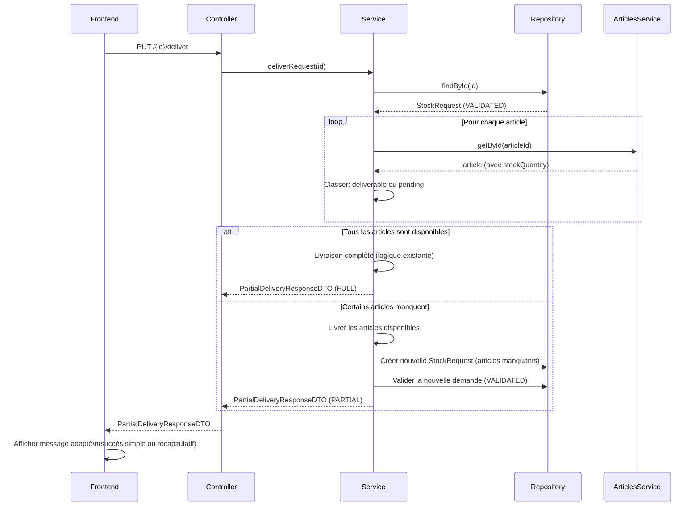

# Document de Design : Livraison Partielle de Stock (partial-stock-delivery)

## Vue d'ensemble

Actuellement, la livraison d'une demande de sortie stock échoue entièrement si un seul article manque de stock. Cette fonctionnalité modifie ce comportement pour livrer les articles disponibles immédiatement et créer automatiquement une nouvelle demande validée pour les articles en rupture, applicable aux deux modules : stock standard (`StockRequest`) et stock tontine (`StockTontineRequest`).

## Architecture

```mermaid
graph TD
    A[Frontend: Bouton Livrer] --> B[Controller: PUT /{id}/deliver]
    B --> C[Service: deliverRequest / deliver]
    C --> D{Vérification stock\npour chaque article}
    D -->|Tous disponibles| E[Livraison complète\ncomportement actuel]
    D -->|Certains manquants| F[Livraison partielle]
    F --> G[Livrer les articles disponibles\nmouvements + stock mensuel]
    F --> H[Créer nouvelle demande\navec articles manquants]
    H --> I[Auto-valider la nouvelle demande\nstatus = VALIDATED]
    G --> J[PartialDeliveryResponseDTO]
    I --> J
    E --> K[PartialDeliveryResponseDTO\ndeliveryType = FULL]
    J --> L[Frontend: Afficher récapitulatif]
```

## Diagramme de Séquence



## Composants et Interfaces

### Nouveau DTO : `PartialDeliveryResponseDTO`

```java
public class PartialDeliveryResponseDTO {
    // Type de livraison
    private DeliveryType deliveryType; // FULL | PARTIAL

    // Demande originale livrée (ou partiellement livrée)
    private Long deliveredRequestId;
    private String deliveredRequestReference;

    // Articles livrés avec succès
    private List<DeliveredItemDTO> deliveredItems;

    // Articles en attente (uniquement si PARTIAL)
    private List<PendingItemDTO> pendingItems;

    // Nouvelle demande créée pour les articles manquants (uniquement si PARTIAL)
    private Long pendingRequestId;
    private String pendingRequestReference;

    // Enum interne
    public enum DeliveryType { FULL, PARTIAL }
}

public class DeliveredItemDTO {
    private String itemName;
    private Integer quantity;
    private Double unitPrice;
}

public class PendingItemDTO {
    private String itemName;
    private Integer requestedQuantity;
    private Double availableQuantity; // stock dispo au moment de la livraison
    private Double unitPrice;
}
```

### Backend : `StockRequestService.deliverRequest()`

Nouvelle logique :
1. Charger la demande (doit être VALIDATED)
2. Pour chaque article, comparer `article.stockQuantity` vs `item.quantity`
3. Séparer en deux listes : `deliverableItems` et `pendingItems`
4. Si `pendingItems` est vide → livraison complète (comportement actuel, retourner `DeliveryType.FULL`)
5. Si `deliverableItems` est vide → aucun article livrable, lever une exception métier (pas de livraison vide)
6. Sinon → livraison partielle :
   - Livrer les `deliverableItems` (mouvements stock + stock mensuel commercial)
   - Marquer la demande originale comme DELIVERED (avec les items livrés seulement)
   - Créer une nouvelle `StockRequest` avec les `pendingItems`, même `collector`, status = VALIDATED
   - Retourner `PartialDeliveryResponseDTO` avec `DeliveryType.PARTIAL`

### Backend : `StockTontineRequestService.deliver()`

Même logique que ci-dessus, appliquée à `StockTontineRequest` / `StockTontineRequestItem`, avec appel à `tontineStockService.processStockDelivery()` pour les items livrés uniquement.

### Backend : Controllers

Les deux controllers changent leur signature de retour :

```java
// StockRequestController
@PutMapping("/{id}/deliver")
public ResponseEntity<PartialDeliveryResponseDTO> deliverRequest(@PathVariable Long id)

// StockTontineRequestController
@PutMapping("/{id}/deliver")
public ResponseEntity<PartialDeliveryResponseDTO> deliverRequest(@PathVariable Long id)
```

### Frontend : `stock-request-list.component.ts`

La méthode `deliver()` est mise à jour pour interpréter le `PartialDeliveryResponseDTO` :

```typescript
deliver(request: StockRequest) {
  // Confirmation → appel API
  // Si resp.deliveryType === 'FULL' → toastr.success simple
  // Si resp.deliveryType === 'PARTIAL' → alertService.showInfo avec récapitulatif
}
```

### Frontend : `stock-tontine-request-list.component.ts`

Même mise à jour que le composant stock standard.

## Modèles de Données

### `PartialDeliveryResponseDTO` (Java)

| Champ | Type | Description |
|---|---|---|
| `deliveryType` | `DeliveryType` | `FULL` ou `PARTIAL` |
| `deliveredRequestId` | `Long` | ID de la demande livrée |
| `deliveredRequestReference` | `String` | Référence de la demande livrée |
| `deliveredItems` | `List<DeliveredItemDTO>` | Articles livrés |
| `pendingItems` | `List<PendingItemDTO>` | Articles en attente (vide si FULL) |
| `pendingRequestId` | `Long` | ID de la nouvelle demande (null si FULL) |
| `pendingRequestReference` | `String` | Référence de la nouvelle demande (null si FULL) |

### Cas limites

| Situation | Comportement |
|---|---|
| Tous les articles disponibles | Livraison FULL, comportement inchangé |
| Aucun article disponible | Exception métier : "Aucun article disponible pour la livraison" |
| Certains articles disponibles | Livraison PARTIAL : livrer les disponibles, créer demande pour les manquants |
| Article avec quantité partielle disponible | Livrer la quantité disponible, mettre en attente le reste (quantité manquante) |

> **Note sur la quantité partielle** : Si un article a une quantité disponible inférieure à la quantité demandée (ex: demandé 10, dispo 6), on peut soit livrer les 6 et mettre 4 en attente, soit traiter l'article entier comme "manquant". Le comportement recommandé est de livrer la quantité disponible et mettre le reste en attente, pour maximiser la livraison.

## Gestion des Erreurs

| Scénario | Réponse |
|---|---|
| Demande non trouvée | 404 Not Found |
| Demande pas au statut VALIDATED | 400 + message métier |
| Aucun article livrable (tout en rupture) | 400 + "Aucun article disponible pour la livraison" |
| Erreur lors de la création de la demande pendante | Rollback transactionnel complet (Spring `@Transactional`) |

## Stratégie de Test

### Tests Unitaires (Backend)

- `deliverRequest()` avec tous les articles disponibles → retourne `DeliveryType.FULL`
- `deliverRequest()` avec certains articles manquants → retourne `DeliveryType.PARTIAL`, nouvelle demande créée et validée
- `deliverRequest()` avec aucun article disponible → lève `CustomValidationException`
- Vérifier que les mouvements de stock ne sont enregistrés que pour les articles livrés
- Vérifier que la nouvelle demande hérite du même `collector` et a le statut `VALIDATED`

### Tests d'Intégration

- Scénario complet : demande VALIDATED → livraison partielle → vérifier état DB (demande originale DELIVERED, nouvelle demande VALIDATED)
- Vérifier le rollback si la création de la demande pendante échoue

### Tests Frontend

- Affichage du toastr simple si `deliveryType === 'FULL'`
- Affichage du récapitulatif si `deliveryType === 'PARTIAL'`
- Rechargement de la liste dans les deux cas

## Considérations de Sécurité

- La création automatique de la nouvelle demande pendante utilise le même `collector` que la demande originale, sans intervention de l'utilisateur courant comme collector.
- La validation automatique de la nouvelle demande (bypass du flux normal CREATED → VALIDATED) est intentionnelle et documentée : la demande a déjà été validée par un manager, les articles manquants sont simplement reportés.
- L'ensemble de l'opération est dans une seule transaction `@Transactional` pour garantir la cohérence.

## Dépendances

- `StockRequestRepository` / `StockTontineRequestRepository` : pour persister la nouvelle demande pendante
- `StockMovementService` : inchangé, utilisé uniquement pour les articles livrés
- `CommercialStockMovementService` / `TontineStockService` : inchangés, utilisés uniquement pour les articles livrés
- `AlertService` (frontend) : pour afficher le récapitulatif de livraison partielle

## Correctness Properties

*A property is a characteristic or behavior that should hold true across all valid executions of a system — essentially, a formal statement about what the system should do. Properties serve as the bridge between human-readable specifications and machine-verifiable correctness guarantees.*

### Property 1 : Livraison complète si tout le stock est disponible

*For any* demande de stock VALIDATED dont tous les articles ont un stock suffisant, l'appel à `deliverRequest()` doit retourner un `PartialDeliveryResponseDTO` avec `deliveryType = FULL` et une liste `pendingItems` vide.

**Validates: Requirements 1.2, 6.2**

### Property 2 : Livraison partielle si certains articles manquent

*For any* demande de stock VALIDATED dont au moins un article a un stock insuffisant et au moins un article est disponible, l'appel à `deliverRequest()` doit retourner un `PartialDeliveryResponseDTO` avec `deliveryType = PARTIAL`, une liste `deliveredItems` non vide et une liste `pendingItems` non vide.

**Validates: Requirements 1.3, 6.3**

### Property 3 : Rejet si aucun article n'est disponible

*For any* demande de stock VALIDATED dont aucun article n'a de stock suffisant, l'appel à `deliverRequest()` doit lever une exception métier sans créer de mouvement de stock ni de nouvelle demande.

**Validates: Requirements 1.4**

### Property 4 : Quantité partielle — livrer le disponible, reporter le reste

*For any* article dont la quantité disponible est strictement inférieure à la quantité demandée, la livraison doit enregistrer un mouvement pour la quantité disponible et créer un article en attente pour la quantité restante (demandée − disponible).

**Validates: Requirements 1.5**

### Property 5 : La demande pendante hérite du collector et est VALIDATED

*For any* livraison partielle, la nouvelle demande créée pour les articles en attente doit avoir le même `collector` que la demande originale et le statut `VALIDATED`.

**Validates: Requirements 2.2, 2.3**

### Property 6 : Les mouvements de stock ne concernent que les articles livrés

*For any* livraison partielle, l'ensemble des mouvements de stock créés doit correspondre exactement aux articles livrés — aucun mouvement ne doit être créé pour les articles en attente.

**Validates: Requirements 3.1, 3.2**

### Property 7 : Cohérence du PartialDeliveryResponseDTO selon le type de livraison

*For any* résultat de livraison, si `deliveryType = FULL` alors `pendingItems` est vide et `pendingRequestId` est null ; si `deliveryType = PARTIAL` alors `pendingItems` est non vide et `pendingRequestId` est non null.

**Validates: Requirements 6.2, 6.3**

### Property 8 : Rechargement de la liste après toute livraison

*For any* résultat de livraison (FULL ou PARTIAL), le Frontend doit déclencher le rechargement de la liste des demandes.

**Validates: Requirements 5.3**
