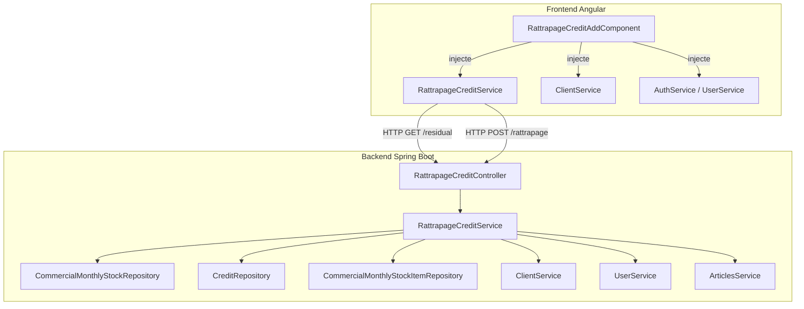
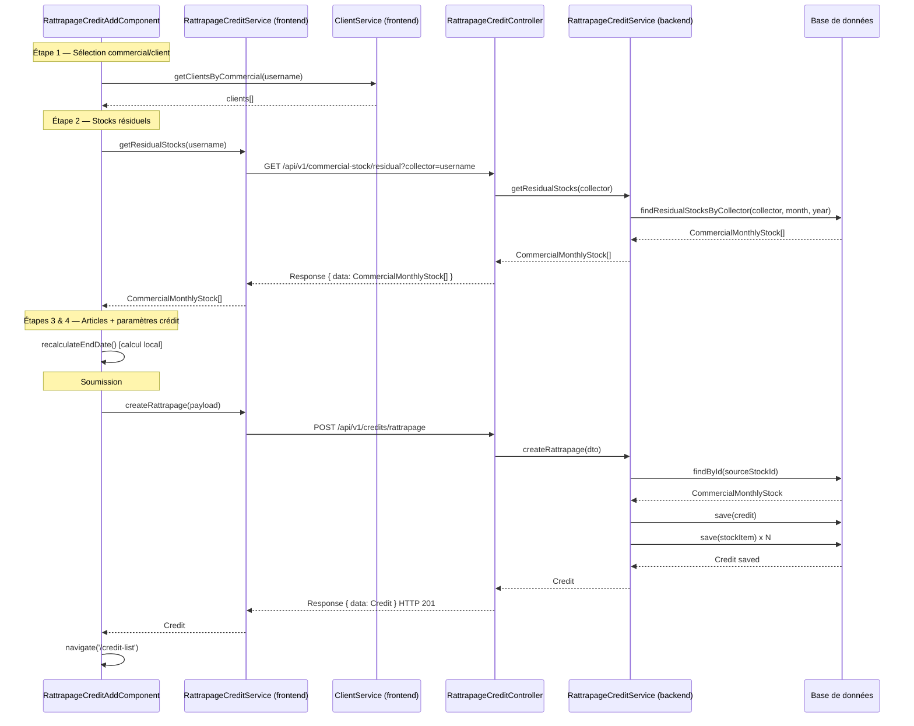
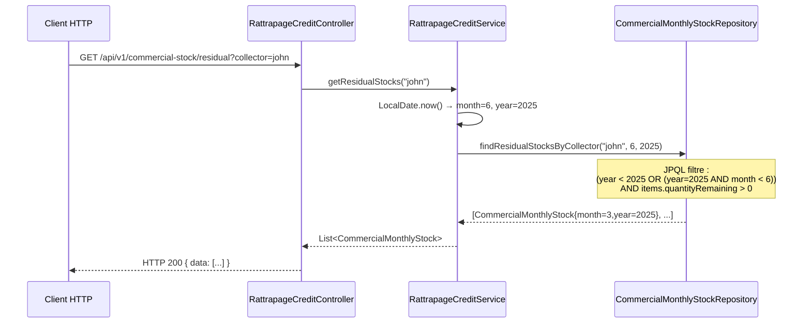
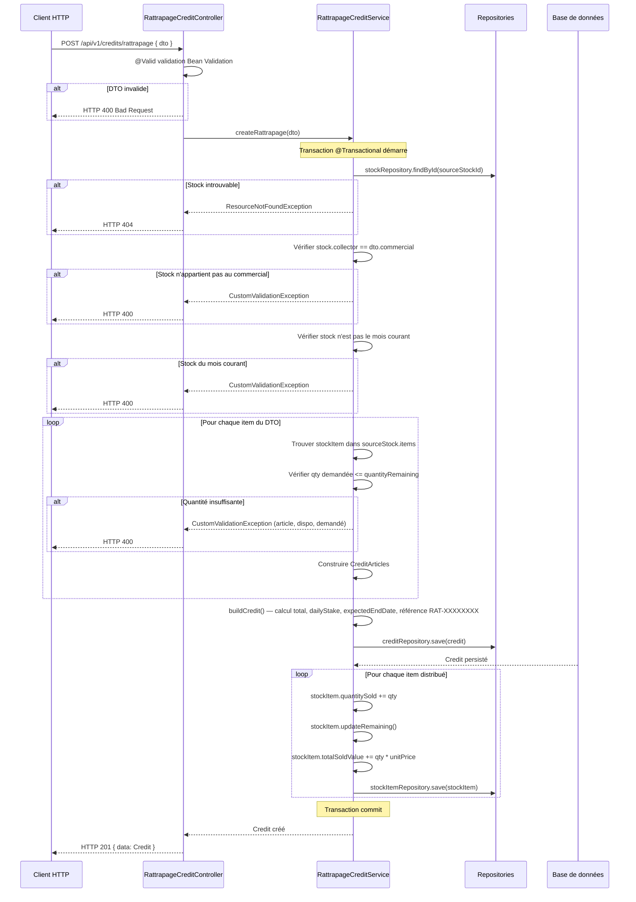

# Design — Rattrapage Crédit Vente

## Vue d'ensemble

La fonctionnalité de **rattrapage crédit vente** permet à un commercial (ou à un gestionnaire agissant en son nom) de distribuer des articles restants dans un stock d'un mois antérieur à un client, sous forme de crédit étalé dans le temps.

Elle s'appuie sur deux nouveaux endpoints REST et un composant Angular en 4 étapes :

| Endpoint | Méthode | Description |
|---|---|---|
| `/api/v1/commercial-stock/residual` | GET | Stocks résiduels d'un commercial |
| `/api/v1/credits/rattrapage` | POST | Création d'un rattrapage |

Le flux se distingue du `credit-add` existant par deux dimensions supplémentaires :
1. **Sélection d'un stock historique** — le commercial choisit un `CommercialMonthlyStock` d'un mois passé ayant encore des articles non distribués.
2. **Paramètres de crédit étalé** — la date de début peut être dans le passé, la mise journalière est saisie manuellement, et la date de fin est calculée automatiquement.

---

## Architecture

### Vue globale



### Décisions d'architecture

- **Nouveau controller dédié** (`RattrapageCreditController`) plutôt que d'étendre `CommercialStockController` ou `CreditController`, pour isoler la logique de rattrapage et faciliter les évolutions futures (retour en magasin).
- **Nouveau service dédié** (`RattrapageCreditService`) pour ne pas alourdir les services existants et garantir une transaction atomique propre.
- **Requête JPQL avec `JOIN FETCH`** sur `CommercialMonthlyStockRepository` pour éviter le problème N+1 lors du chargement des items résiduels.
- **Recalcul de `expectedEndDate` côté backend** indépendamment de la valeur fournie par le frontend, pour garantir l'intégrité des données.

---

## Composants et interfaces

### Backend

#### `RattrapageCreditController`

```
Package : com.optimize.elykia.core.controller.sale

Endpoints :
  POST  /api/v1/credits/rattrapage
    - @RequestBody @Valid RattrapageCreditDto dto
    - Retourne : ResponseEntity<Response> HTTP 201

  GET   /api/v1/commercial-stock/residual
    - @RequestParam String collector
    - Retourne : ResponseEntity<Response> HTTP 200
```

#### `RattrapageCreditService`

```
Package : com.optimize.elykia.core.service.sale
Annotation : @Service @Transactional

Méthodes publiques :
  Credit createRattrapage(RattrapageCreditDto dto)
  List<CommercialMonthlyStock> getResidualStocks(String collector)

Méthodes privées :
  CommercialMonthlyStock resolveSourceStock(RattrapageCreditDto dto)
  Client resolveClient(Long clientId)
  User resolveCommercial(String username)
  Set<CreditArticles> buildAndValidateArticles(RattrapageCreditDto dto, CommercialMonthlyStock sourceStock)
  Credit buildCredit(RattrapageCreditDto dto, Client client, User commercial, Set<CreditArticles> articles)
  void updateSourceStock(RattrapageCreditDto dto, CommercialMonthlyStock sourceStock)
```

#### `CommercialMonthlyStockRepository` — nouvelle méthode

```java
@Query("""
    SELECT DISTINCT s FROM CommercialMonthlyStock s
    JOIN FETCH s.items i
    WHERE s.collector = :collector
    AND (s.year < :currentYear
         OR (s.year = :currentYear AND s.month < :currentMonth))
    AND i.quantityRemaining > 0
    ORDER BY s.year DESC, s.month DESC
    """)
List<CommercialMonthlyStock> findResidualStocksByCollector(
    @Param("collector") String collector,
    @Param("currentMonth") int currentMonth,
    @Param("currentYear") int currentYear);
```

### Frontend Angular

#### `RattrapageCreditService` (frontend)

```typescript
// src/app/stock/services/rattrapage-credit.service.ts
@Injectable({ providedIn: 'root' })
export class RattrapageCreditService {
  getResidualStocks(collector: string): Observable<CommercialMonthlyStock[]>
  createRattrapage(dto: RattrapageCreditDto): Observable<any>
}
```

#### `RattrapageCreditAddComponent`

```typescript
// src/app/stock/rattrapage/rattrapage-credit-add.component.ts
@Component({ selector: 'app-rattrapage-credit-add' })
export class RattrapageCreditAddComponent implements OnInit, OnDestroy {
  // État
  currentStep: number          // 1 à 4
  isLoading: boolean
  loadingMonths: boolean
  isPromoter: boolean
  isManager: boolean

  // Données
  commercials: any[]
  clients: any[]
  residualStocks: CommercialMonthlyStock[]
  selectedItems: SelectedItem[]

  // Calculs
  totalAmount: number
  remainingAmount: number
  computedEndDate: Date | null
  computedDays: number | null

  // Méthodes clés
  onCommercialChange(): void
  loadResidualStocks(username: string): void
  onStockMonthSelect(stock: CommercialMonthlyStock): void
  toggleArticle(item: any, event: Event): void
  onQtyChange(item: any, event: Event): void
  recalculateTotals(): void
  recalculateEndDate(): void
  onSubmit(): void
}
```

#### Routing

```typescript
// À ajouter dans le module de routing concerné (stock-routing.module.ts)
{
  path: 'credit/rattrapage',
  component: RattrapageCreditAddComponent,
  canActivate: [AuthGuard],
  data: { title: 'Distribution de rattrapage' }
}
```

---

## Modèles de données

### `RattrapageCreditDto` (backend)

```java
public class RattrapageCreditDto {
    @NotBlank  String commercial;          // username du commercial
    @NotNull   Long clientId;
    @NotNull   Long sourceStockId;         // ID du CommercialMonthlyStock source
    @NotNull   LocalDate beginDate;
    @NotNull @Min(200) Double dailyStake;  // mise journalière en FCFA
    @PositiveOrZero Double advance = 0.0;
    LocalDate expectedEndDate;             // optionnel, recalculé en backend
    String note;
    @NotEmpty @Valid List<RattrapageItemDto> items;

    // Inner DTO
    public static class RattrapageItemDto {
        @NotNull Long stockItemId;   // ID du CommercialMonthlyStockItem
        @NotNull Long articleId;
        @NotNull @Positive Integer quantity;
        @NotNull @Positive Double unitPrice;
    }
}
```

### `RattrapageCreditDto` (frontend TypeScript)

```typescript
export interface RattrapageCreditDto {
  commercial: string;
  clientId: number;
  sourceStockId: number;
  beginDate: string;        // ISO date "YYYY-MM-DD"
  dailyStake: number;
  advance: number;
  note?: string;
  expectedEndDate?: string;
  items: RattrapageItemDto[];
}

export interface RattrapageItemDto {
  stockItemId: number;
  articleId: number;
  quantity: number;
  unitPrice: number;
}
```

### Entités existantes impliquées

```
CommercialMonthlyStock
  - id, collector, month, year
  - items: List<CommercialMonthlyStockItem>

CommercialMonthlyStockItem
  - id, article, quantityTaken, quantitySold, quantityReturned
  - quantityRemaining (calculé : quantityTaken - quantitySold - quantityReturned)
  - lastUnitPrice, weightedAverageUnitPrice, totalSoldValue
  - updateRemaining() : recalcule quantityRemaining

Credit
  - id, reference (RAT-XXXXXXXX), type (CREDIT), status (INPROGRESS)
  - collector, client, articles: Set<CreditArticles>
  - beginDate, expectedEndDate, dailyStake, advance
  - totalAmount, totalAmountPaid, totalAmountRemaining, remainingDaysCount
```

### Flux de données entre composants



---

## Diagrammes de séquence

### GET /api/v1/commercial-stock/residual



### POST /api/v1/credits/rattrapage



---

## Propriétés de correction

*Une propriété est une caractéristique ou un comportement qui doit être vrai pour toutes les exécutions valides d'un système — essentiellement, un énoncé formel de ce que le système doit faire. Les propriétés servent de pont entre les spécifications lisibles par l'humain et les garanties de correction vérifiables par machine.*

### Propriété 1 : Filtrage temporel des stocks résiduels

*Pour tout* commercial et tout ensemble de `CommercialMonthlyStock` en base, `getResidualStocks` ne doit retourner que les stocks dont `(year < currentYear) OR (year = currentYear AND month < currentMonth)`.

**Valide : Requirements 2.3, 2.5**

### Propriété 2 : Filtrage par quantité résiduelle

*Pour tout* stock retourné par `getResidualStocks`, ce stock doit avoir au moins un `CommercialMonthlyStockItem` avec `quantityRemaining > 0`.

**Valide : Requirements 2.4, 2.5**

### Propriété 3 : Calcul de la date de fin

*Pour toute* combinaison valide de `(beginDate, dailyStake, totalAmount, advance)` avec `dailyStake >= 200` et `advance < totalAmount`, la date de fin calculée doit être `beginDate + ceil((totalAmount - advance) / dailyStake)` jours, tant côté frontend que côté backend.

**Valide : Requirements 4.4, 5.5, 8.2**

### Propriété 4 : Cas avance >= totalAmount

*Pour tout* rattrapage où `advance >= totalAmount`, le crédit créé doit avoir `totalAmountRemaining = 0`, `remainingDaysCount = 0` et `expectedEndDate = beginDate`.

**Valide : Requirements 8.4**

### Propriété 5 : Invariant de stock après distribution

*Pour tout* `CommercialMonthlyStockItem` mis à jour lors d'un rattrapage, l'invariant suivant doit être préservé après la mise à jour : `quantitySold + quantityRemaining = quantityTaken - quantityReturned`.

**Valide : Requirements 5.7, 8.1**

### Propriété 6 : Rejet de sur-distribution

*Pour tout* article dont la quantité demandée dépasse `quantityRemaining`, `createRattrapage` doit lever une `CustomValidationException` contenant le nom de l'article, la quantité disponible et la quantité demandée, sans persister aucune modification.

**Valide : Requirements 5.4**

### Propriété 7 : Unicité et format de la référence

*Pour toute* création de rattrapage, la référence générée doit commencer par `"RAT-"` suivi de 8 caractères alphanumériques en majuscules. Pour toute paire de créations distinctes, les références doivent être différentes.

**Valide : Requirements 5.6**

### Propriété 8 : Atomicité transactionnelle

*Pour tout* scénario où une erreur survient après la persistance du `Credit` mais avant la mise à jour complète des `CommercialMonthlyStockItem`, aucune modification ne doit être visible en base (rollback complet).

**Valide : Requirements 5.9**

### Propriété 9 : Validation des quantités saisies

*Pour toute* quantité saisie dans le formulaire de sélection d'articles, la valeur doit être rejetée si elle est inférieure ou égale à 0 ou supérieure à `quantityRemaining` de l'article correspondant.

**Valide : Requirements 3.4, 3.5**

### Propriété 10 : Calcul du total en temps réel

*Pour toute* sélection d'articles `{(qty_i, price_i)}`, le total affiché doit être égal à `Σ(qty_i × price_i)` et le sous-total de chaque article doit être `qty_i × price_i`.

**Valide : Requirements 3.6**

---

## Gestion des erreurs

### Erreurs backend

| Situation | Exception | Code HTTP |
|---|---|---|
| Stock source introuvable | `ResourceNotFoundException` | 404 |
| Stock n'appartient pas au commercial | `CustomValidationException` | 400 |
| Stock du mois courant | `CustomValidationException` | 400 |
| Quantité insuffisante pour un article | `CustomValidationException` | 400 |
| `dailyStake < 200` | `CustomValidationException` (Bean Validation) | 400 |
| `advance < 0` | `CustomValidationException` (Bean Validation) | 400 |
| Commercial introuvable | `ResourceNotFoundException` | 404 |
| Client introuvable | `ResourceNotFoundException` | 404 |
| Erreur de transaction | `ApplicationException` | 500 |

Le message de `CustomValidationException` pour une quantité insuffisante doit inclure : nom de l'article, quantité disponible, quantité demandée.

### Erreurs frontend

| Situation | Comportement |
|---|---|
| Formulaire invalide à la soumission | Marquer tous les champs `touched`, `toastr.warning` |
| Erreur HTTP du backend | `toastr.error` avec `err.error?.message`, pas de navigation |
| Erreur de chargement des données initiales | `toastr.error`, composant reste utilisable |
| Erreur de chargement des stocks résiduels | `toastr.error`, liste vide affichée |
| Aucun stock résiduel trouvé | Message "Aucun stock résiduel trouvé pour ce commercial." |

---

## Stratégie de test

### Tests unitaires (backend — JUnit 5 + Mockito)

- `RattrapageCreditServiceTest` : tester chaque méthode privée via les méthodes publiques
  - Cas nominal : création réussie avec vérification des attributs du `Credit`
  - Cas d'erreur : stock introuvable, mauvais commercial, stock du mois courant, quantité insuffisante
  - Cas limite : `advance >= totalAmount` → `remainingDaysCount = 0`
  - Vérification de la mise à jour du stock source

- `CommercialMonthlyStockRepositoryTest` : tester la requête JPQL avec une base H2 en mémoire
  - Stocks du mois courant exclus
  - Stocks sans items résiduels exclus
  - Tri par année/mois décroissant

### Tests d'intégration (backend — Spring Boot Test)

- `RattrapageCreditControllerIT` : tester les endpoints avec MockMvc
  - `POST /api/v1/credits/rattrapage` → HTTP 201
  - `GET /api/v1/commercial-stock/residual` → HTTP 200
  - Validation Bean Validation → HTTP 400

### Tests de propriétés (backend — jqwik)

Utilisation de **jqwik** (bibliothèque PBT pour Java/JUnit 5), minimum 100 itérations par propriété.

```java
// Tag format : @Tag("Feature: rattrapage-credit-vente, Property N: <texte>")

@Property(tries = 100)
@Tag("Feature: rattrapage-credit-vente, Property 3: calcul date de fin")
void calculDateFin(@ForAll LocalDate beginDate,
                   @ForAll @DoubleRange(min = 200, max = 100000) double dailyStake,
                   @ForAll @DoubleRange(min = 0, max = 50000) double advance,
                   @ForAll @DoubleRange(min = 1, max = 100000) double totalAmount) {
    // Vérifie : expectedEndDate = beginDate + ceil((totalAmount - advance) / dailyStake)
}

@Property(tries = 100)
@Tag("Feature: rattrapage-credit-vente, Property 5: invariant stock après distribution")
void invariantStockApresDistribution(@ForAll CommercialMonthlyStockItem item,
                                      @ForAll @IntRange(min = 1) int qty) {
    // Vérifie : quantitySold + quantityRemaining = quantityTaken - quantityReturned
}

@Property(tries = 100)
@Tag("Feature: rattrapage-credit-vente, Property 7: unicité référence RAT-")
void unicitéRéférence(@ForAll("validDtos") List<RattrapageCreditDto> dtos) {
    // Vérifie : toutes les références commencent par "RAT-" et sont uniques
}
```

### Tests unitaires (frontend — Jest + Angular Testing Library)

- `RattrapageCreditAddComponent.spec.ts` : tester les comportements du composant
  - Affichage conditionnel selon le profil (PROMOTER vs GESTIONNAIRE)
  - Calcul de la date de fin en temps réel
  - Validation des quantités
  - Navigation après succès / affichage d'erreur

- `RattrapageCreditService.spec.ts` : tester les appels HTTP avec `HttpClientTestingModule`

### Tests de propriétés (frontend — fast-check)

Utilisation de **fast-check** (bibliothèque PBT pour TypeScript), minimum 100 itérations par propriété.

```typescript
// Tag format : // Feature: rattrapage-credit-vente, Property N: <texte>

// Property 3 : calcul date de fin
it('calcule correctement la date de fin pour toute combinaison valide', () => {
  fc.assert(fc.property(
    fc.date(), fc.float({ min: 200 }), fc.float({ min: 0 }), fc.float({ min: 1 }),
    (beginDate, dailyStake, advance, totalAmount) => {
      const remaining = Math.max(0, totalAmount - advance);
      const days = remaining > 0 ? Math.ceil(remaining / dailyStake) : 0;
      const expected = new Date(beginDate);
      expected.setDate(expected.getDate() + days);
      // Vérifier que recalculateEndDate() produit le même résultat
    }
  ), { numRuns: 100 });
});

// Property 10 : calcul du total en temps réel
it('calcule correctement le total pour toute sélection d\'articles', () => {
  fc.assert(fc.property(
    fc.array(fc.record({ qty: fc.integer({ min: 1 }), price: fc.float({ min: 0 }) })),
    (items) => {
      const total = items.reduce((acc, i) => acc + i.qty * i.price, 0);
      // Vérifier que recalculateTotals() produit le même résultat
    }
  ), { numRuns: 100 });
});
```
