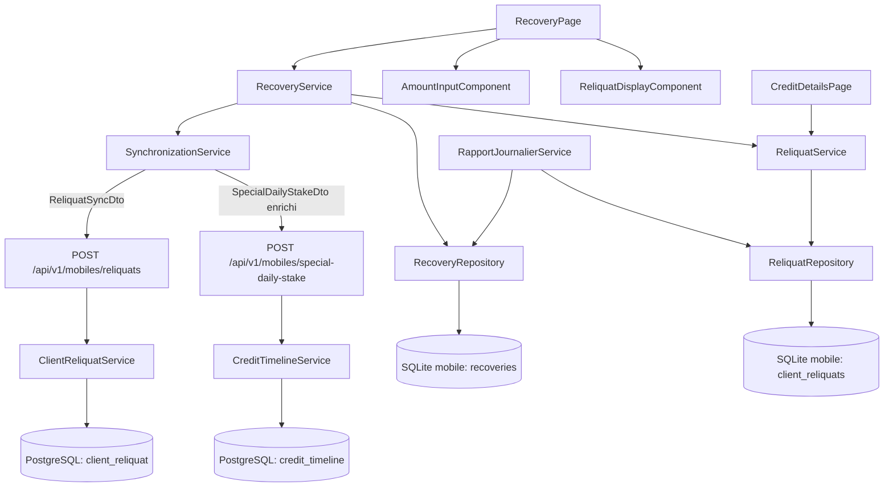
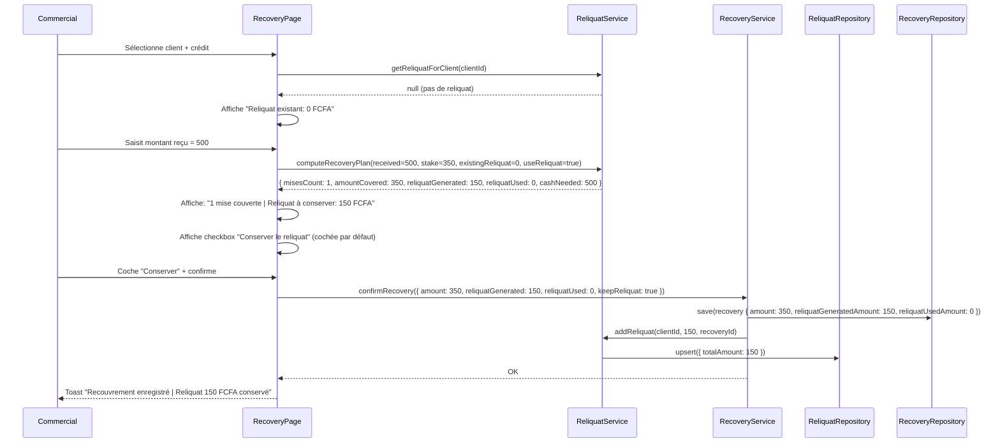
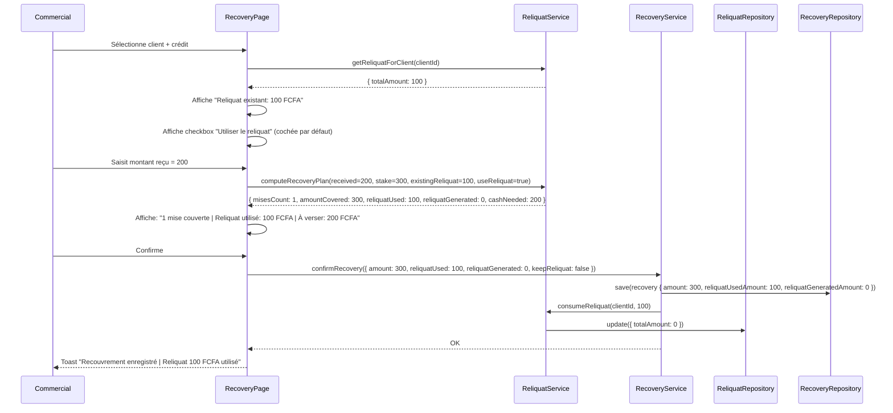
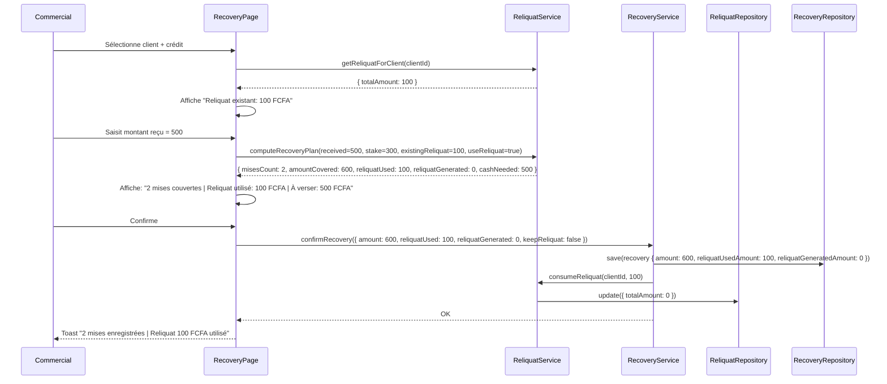
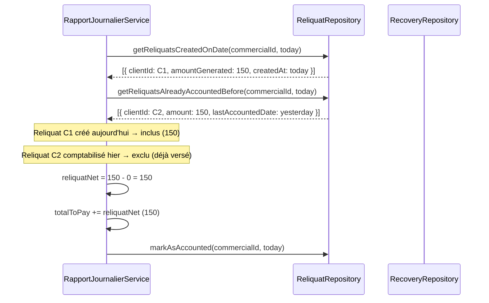

# Document de Design : Gestion des Reliquats de Recouvrement

## Vue d'ensemble

Lors d'un recouvrement, un client peut remettre un montant supérieur à une mise mais insuffisant pour en couvrir deux. Le commercial se retrouve à conserver un excédent (le **reliquat**) sans pouvoir l'enregistrer correctement, ce qui fausse la comptabilité journalière.

Cette fonctionnalité introduit un mécanisme de **gestion des reliquats** couvrant deux directions :

1. **Génération de reliquat** : le commercial reçoit plus que la mise → l'excédent est conservé pour le client
2. **Utilisation du reliquat** : le reliquat accumulé est combiné avec le nouveau paiement pour couvrir une ou plusieurs mises supplémentaires, réduisant ainsi le montant que le client doit verser en espèces

Le reliquat est inclus dans la comptabilité journalière avec une règle anti-double comptage, persisté localement en SQLite (mobile), et synchronisé vers le backend Spring Boot.

---

## Architecture



### Composants impliqués

| Composant | Couche | Rôle | Nouveau / Modifié |
|---|---|---|---|
| `RecoveryPage` | Mobile | Orchestration du flux de recouvrement | Modifié |
| `AmountInputComponent` | Mobile | Saisie du montant reçu | Modifié |
| `ReliquatDisplayComponent` | Mobile | Affichage reliquat courant + calculé + checkboxes | Nouveau |
| `ReliquatService` | Mobile | Logique métier reliquat (calcul, accumulation, combinaison) | Nouveau |
| `ReliquatRepository` | Mobile | Persistance SQLite `client_reliquats` | Nouveau |
| `RecoveryService` | Mobile | Création recouvrement + intégration reliquat | Modifié |
| `RapportJournalierService` | Mobile | Comptabilité journalière avec anti-double comptage | Modifié |
| `SynchronizationService` | Mobile | Envoi reliquat + recouvrements enrichis au backend | Modifié |
| `CreditDetailsPage` | Mobile | Affichage du reliquat dans la vue crédit | Modifié |
| `MobileController` | Backend | Nouveaux endpoints sync reliquat | Modifié |
| `CreditTimelineService` | Backend | Traitement des mises avec reliquat utilisé | Modifié |
| `ClientReliquatService` | Backend | Persistance et gestion du reliquat par client | Nouveau |
| `ClientReliquat` (entity) | Backend | Entité JPA reliquat client | Nouveau |
| `SpecialDailyStakeUnitDto` | Backend | Enrichi avec champs reliquat | Modifié |
| `DailyCommercialReport` | Backend | Ajout `totalReliquatAmount` pour comptabilité | Modifié |

---

## Diagrammes de séquence

### Flux 1 : Recouvrement avec génération de reliquat (sans reliquat existant)

> Exemple : mise = 350, client donne 500, pas de reliquat existant → reliquat généré = 150



### Flux 2 : Recouvrement avec utilisation du reliquat existant (complément)

> Exemple : mise = 300, client donne 200, reliquat existant = 100, "Utiliser reliquat" coché → 200 + 100 = 300 = 1 mise



### Flux 3 : Recouvrement combiné (reliquat existant + nouveau paiement → plusieurs mises)

> Exemple : mise = 300, client donne 500, reliquat existant = 100, "Utiliser reliquat" coché → 500 + 100 = 600 = 2 mises



### Flux 4 : Comptabilité journalière avec anti-double comptage



---

## Modèle de données

### Mobile — Migration SQLite v22

#### Nouvelle table `client_reliquats`

```sql
CREATE TABLE IF NOT EXISTS client_reliquats (
    id TEXT PRIMARY KEY,
    clientId TEXT NOT NULL,
    commercialId TEXT NOT NULL,
    totalAmount REAL NOT NULL DEFAULT 0,       -- Reliquat accumulé non encore utilisé
    lastRecoveryId TEXT,                        -- ID du dernier recouvrement source
    createdAt TEXT NOT NULL,
    updatedAt TEXT NOT NULL,
    lastAccountedDate TEXT,                     -- Dernière date de comptabilisation (anti-double comptage)
    isSync INTEGER DEFAULT 0,
    syncDate TEXT,
    FOREIGN KEY(clientId) REFERENCES clients(id)
);

CREATE INDEX IF NOT EXISTS idx_client_reliquats_clientId ON client_reliquats(clientId);
CREATE INDEX IF NOT EXISTS idx_client_reliquats_commercialId ON client_reliquats(commercialId);
```

**Règle** : 1 ligne max par client. `totalAmount` = cumul des reliquats non consommés.

#### Modification de la table `recoveries`

```sql
ALTER TABLE recoveries ADD COLUMN reliquatGeneratedAmount REAL DEFAULT 0;
-- Montant du reliquat généré par ce recouvrement (excédent conservé)

ALTER TABLE recoveries ADD COLUMN reliquatUsedAmount REAL DEFAULT 0;
-- Montant du reliquat existant utilisé pour compléter ce recouvrement
```

---

### Backend — Migration Flyway V36

```sql
-- Nouvelle table client_reliquat
CREATE TABLE client_reliquat (
    id BIGSERIAL PRIMARY KEY,
    client_id BIGINT NOT NULL,
    commercial_username VARCHAR(255) NOT NULL,
    total_amount DECIMAL(15,2) NOT NULL DEFAULT 0,
    last_recovery_reference VARCHAR(255),
    last_accounted_date DATE,
    created_date TIMESTAMP NOT NULL DEFAULT NOW(),
    last_modified_date TIMESTAMP NOT NULL DEFAULT NOW(),
    CONSTRAINT fk_client_reliquat_client FOREIGN KEY (client_id) REFERENCES client(id)
);

CREATE INDEX idx_client_reliquat_client_id ON client_reliquat(client_id);
CREATE INDEX idx_client_reliquat_commercial ON client_reliquat(commercial_username);

-- Enrichissement de credit_timeline
ALTER TABLE credit_timeline ADD COLUMN reliquat_generated_amount DECIMAL(15,2) DEFAULT 0;
ALTER TABLE credit_timeline ADD COLUMN reliquat_used_amount DECIMAL(15,2) DEFAULT 0;

-- Enrichissement de daily_commercial_report
ALTER TABLE daily_commercial_report ADD COLUMN total_reliquat_amount DECIMAL(15,2) DEFAULT 0;
-- Montant net des reliquats du jour (anti-double comptage appliqué)
```

---

## Interfaces TypeScript (Mobile)

### `ClientReliquat`

```typescript
export interface ClientReliquat {
  id: string;
  clientId: string;
  commercialId: string;
  totalAmount: number;           // Reliquat accumulé non consommé
  lastRecoveryId?: string;
  createdAt: string;
  updatedAt: string;
  lastAccountedDate?: string;    // Pour anti-double comptage
  isSync: boolean;
  syncDate?: string;
}
```

### `RecoveryPlan` (calcul intermédiaire, non persisté)

```typescript
export interface RecoveryPlan {
  misesCount: number;            // Nombre de mises couvertes
  amountCovered: number;         // Montant total couvert (mises × stake)
  reliquatUsed: number;          // Reliquat existant consommé
  reliquatGenerated: number;     // Nouveau reliquat généré
  cashNeeded: number;            // Montant en espèces que le client doit verser
}
```

### Extension de `Recovery`

```typescript
export interface Recovery {
  // ... champs existants ...
  reliquatGeneratedAmount: number;  // Reliquat généré par ce recouvrement
  reliquatUsedAmount: number;       // Reliquat existant utilisé
}
```

---

## DTOs Backend

### `SpecialDailyStakeUnitDto` (modifié)

```java
@Data
public class SpecialDailyStakeUnitDto {
    private Long clientId;
    @NotNull(message = "Le montant de la mise est obligatoire")
    private Double amount;
    @NotNull(message = "L'identifiant du credit ne peut être nulle")
    private Long creditId;
    @NotBlank(message = "La référence du recouvrement est obligatoire !")
    private String recoveryId;
    
    // Nouveaux champs reliquat
    private Double reliquatGeneratedAmount = 0.0;  // Reliquat généré par ce recouvrement
    private Double reliquatUsedAmount = 0.0;        // Reliquat existant utilisé
}
```

### `ReliquatSyncDto` (nouveau — endpoint dédié)

```java
@Data
public class ReliquatSyncDto {
    @NotBlank
    private String collector;
    @Valid
    private List<ReliquatSyncUnitDto> reliquats;

    @Data
    public static class ReliquatSyncUnitDto {
        @NotNull
        private Long clientId;
        @NotNull
        private Double totalAmount;
        private String lastRecoveryReference;
        private LocalDate lastAccountedDate;
    }
}
```

### `ClientReliquat` entity (nouveau)

```java
@Entity
@Getter @Setter
public class ClientReliquat extends BaseEntity<String> {
    @Id
    @GeneratedValue(strategy = GenerationType.IDENTITY)
    private Long id;
    
    @ManyToOne
    private Client client;
    
    private String commercialUsername;
    private Double totalAmount = 0.0;
    private String lastRecoveryReference;
    private LocalDate lastAccountedDate;
}
```

---

## Algorithme central : `computeRecoveryPlan()`

C'est la fonction clé du `ReliquatService` mobile. Elle calcule le plan de recouvrement optimal en tenant compte du reliquat existant.

```typescript
computeRecoveryPlan(
  received: number,       // Montant en espèces remis par le client
  stake: number,          // Montant d'une mise
  existingReliquat: number, // Reliquat accumulé du client
  useReliquat: boolean    // Checkbox "Utiliser le reliquat" (true par défaut)
): RecoveryPlan {

  const effectiveAmount = useReliquat
    ? received + existingReliquat
    : received;

  const misesCount = Math.floor(effectiveAmount / stake);
  const amountCovered = misesCount * stake;

  const reliquatUsed = useReliquat
    ? Math.min(existingReliquat, amountCovered - Math.floor(received / stake) * stake)
    : 0;

  const reliquatGenerated = effectiveAmount - amountCovered;

  return {
    misesCount,
    amountCovered,
    reliquatUsed,
    reliquatGenerated,
    cashNeeded: received
  };
}
```

**Exemples de validation :**

| received | stake | existingReliquat | useReliquat | misesCount | reliquatUsed | reliquatGenerated | cashNeeded |
|---|---|---|---|---|---|---|---|
| 500 | 350 | 0 | true | 1 | 0 | 150 | 500 |
| 200 | 300 | 100 | true | 1 | 100 | 0 | 200 |
| 500 | 300 | 100 | true | 2 | 100 | 0 | 500 |
| 500 | 300 | 100 | false | 1 | 0 | 200 | 500 |
| 350 | 350 | 150 | true | 1 | 0 | 0 | 350 |

---

## Interfaces de service (Mobile)

### `ReliquatService`

```typescript
interface ReliquatService {
  getReliquatForClient(clientId: string): Promise<ClientReliquat | null>;
  computeRecoveryPlan(received: number, stake: number, existingReliquat: number, useReliquat: boolean): RecoveryPlan;
  addReliquat(clientId: string, amount: number, recoveryId: string): Promise<void>;
  consumeReliquat(clientId: string, amount: number): Promise<void>;
  getReliquatsForAccounting(commercialId: string, date: string): Promise<ReliquatAccountingEntry[]>;
  getUnsynced(commercialId: string): Promise<ClientReliquat[]>;
  markAsSynced(id: string): Promise<void>;
}
```

### `ReliquatRepository`

```typescript
interface ReliquatRepository {
  findByClientId(clientId: string): Promise<ClientReliquat | null>;
  upsert(reliquat: ClientReliquat): Promise<void>;
  findByCommercialId(commercialId: string): Promise<ClientReliquat[]>;
  findUnsynced(commercialId: string): Promise<ClientReliquat[]>;
  markAsSynced(id: string): Promise<void>;
  findCreatedOnDate(commercialId: string, date: string): Promise<ClientReliquat[]>;
}
```

### `ReliquatDisplayComponent`

```typescript
// Inputs
@Input() clientReliquat: ClientReliquat | null;   // Reliquat existant du client
@Input() recoveryPlan: RecoveryPlan | null;        // Plan calculé en temps réel
@Input() stakeAmount: number;

// Outputs
@Output() useReliquatChanged = new EventEmitter<boolean>();   // Checkbox "Utiliser le reliquat"
@Output() keepReliquatChanged = new EventEmitter<boolean>();  // Checkbox "Conserver le reliquat"
```

---

## Endpoints Backend (nouveaux / modifiés)

### Existant modifié : `POST /api/v1/mobiles/special-daily-stake`

Le `SpecialDailyStakeUnitDto` est enrichi avec `reliquatGeneratedAmount` et `reliquatUsedAmount`. Le `CreditTimelineService.processDailyStake()` persiste ces valeurs dans `credit_timeline`.

### Nouveau : `POST /api/v1/mobiles/reliquats`

```
POST /api/v1/mobiles/reliquats
Body: ReliquatSyncDto
Response: { synced: number, failed: number }
```

Persiste ou met à jour les reliquats clients dans la table `client_reliquat`. Logique upsert : si un reliquat existe pour ce `clientId`, on met à jour `totalAmount` et `lastAccountedDate`.

### Nouveau : `GET /api/v1/mobiles/reliquats/{commercialId}`

Retourne les reliquats actifs (totalAmount > 0) pour un commercial, utilisé lors de l'initialisation mobile.

---

## Règles métier

### Checkbox "Utiliser le reliquat" (cochée par défaut)

- Visible uniquement si `clientReliquat.totalAmount > 0`
- Quand cochée : le reliquat existant est combiné avec le paiement courant dans `computeRecoveryPlan()`
- Quand décochée : le reliquat existant est ignoré pour ce recouvrement

### Checkbox "Conserver le reliquat" (cochée par défaut)

- Visible uniquement si `recoveryPlan.reliquatGenerated > 0`
- Cochée par défaut (comportement recommandé : conserver le reliquat)
- Quand cochée : le reliquat généré est sauvegardé pour le client
- Quand décochée : le reliquat généré est ignoré (le commercial rend la monnaie)

### Règle anti-double comptage (comptabilité journalière)

```
reliquatNetDuJour(J) = Σ(reliquats générés à J) - Σ(reliquats déjà comptabilisés avant J)
```

- `lastAccountedDate` est mis à jour lors de chaque génération du rapport journalier
- Un reliquat avec `lastAccountedDate = J-1` est exclu du calcul de J (déjà versé)
- Un reliquat avec `lastAccountedDate = null` ou `lastAccountedDate = J` est inclus

### Calcul `totalAmountToDeposit` (rapport journalier)

```
totalAmountToDeposit = collectionsAmount
                     + tontineCollectionsAmount
                     + advancesAmount
                     + reliquatNetDuJour   ← NOUVEAU
```

Côté backend, `DailyCommercialReport.totalReliquatAmount` stocke le reliquat net du jour pour traçabilité.

---

## Gestion des erreurs

| Scénario | Comportement |
|---|---|
| `received < stake` et `existingReliquat = 0` | `misesCount = 0`, recouvrement impossible, bouton confirmer désactivé |
| `received < stake` et `existingReliquat > 0` et `received + existingReliquat >= stake` | Plan valide via reliquat, bouton confirmer actif |
| Commercial décoche "Utiliser reliquat" | Plan recalculé sans reliquat |
| Commercial décoche "Conserver reliquat" | Reliquat généré ignoré, pas de sauvegarde |
| Échec sauvegarde reliquat SQLite | Toast erreur, recouvrement annulé (atomicité transactionnelle) |
| Sync backend échoue (reliquat) | `isSync = false`, retenté à la prochaine synchronisation |
| Backend reçoit reliquat pour client inconnu | Erreur 404, loggée, mobile marque comme `syncFailed` |

---

## Stratégie de test

### Tests unitaires

- `ReliquatService.computeRecoveryPlan()` : tous les cas du tableau d'exemples ci-dessus
- `ReliquatService.consumeReliquat()` : vérification que `totalAmount` ne devient pas négatif
- Règle anti-double comptage : reliquat comptabilisé hier vs non comptabilisé

### Tests de propriétés (fast-check)

```typescript
// Propriété 1 : cashNeeded = received (toujours)
fc.property(fc.integer({ min: 0 }), fc.integer({ min: 1 }), fc.integer({ min: 0 }), fc.boolean(),
  (received, stake, existingReliquat, useReliquat) => {
    const plan = service.computeRecoveryPlan(received, stake, existingReliquat, useReliquat);
    return plan.cashNeeded === received;
  }
)

// Propriété 2 : amountCovered = misesCount × stake
fc.property(..., (received, stake, existingReliquat, useReliquat) => {
  const plan = service.computeRecoveryPlan(received, stake, existingReliquat, useReliquat);
  return plan.amountCovered === plan.misesCount * stake;
})

// Propriété 3 : reliquatUsed <= existingReliquat (jamais consommé plus que disponible)
fc.property(..., (received, stake, existingReliquat, useReliquat) => {
  const plan = service.computeRecoveryPlan(received, stake, existingReliquat, useReliquat);
  return plan.reliquatUsed <= existingReliquat;
})

// Propriété 4 : anti-double comptage → reliquatNet <= reliquatBrut
```

### Tests d'intégration

- Flux complet : saisie → plan → confirmation → vérification SQLite
- Accumulation sur N recouvrements → vérification `totalAmount`
- Utilisation partielle du reliquat → vérification du solde résiduel
- Rapport journalier avec et sans reliquat → vérification `totalAmountToDeposit`
- Sync backend : vérification que `credit_timeline` reçoit les bons champs

---

## Considérations de performance

- Table `client_reliquats` : 1 ligne par client actif → lecture O(1) via index `clientId`
- `computeRecoveryPlan()` : calcul purement arithmétique, synchrone, pas d'I/O
- Sync reliquat : batch dans `ReliquatSyncDto`, pas de requête individuelle par client

## Considérations de sécurité

- `commercialId` toujours filtré dans les requêtes SQLite (isolation par commercial)
- `computeRecoveryPlan()` est en lecture seule, aucune mutation avant confirmation explicite
- Backend valide que `reliquatUsedAmount <= totalAmount` côté `ClientReliquatService`

---

## Dépendances

| Dépendance | Contexte |
|---|---|
| `@capacitor-community/sqlite` | Persistance locale mobile (déjà utilisé) |
| `@ngrx/store` | Gestion d'état mobile (déjà utilisé) |
| `fast-check` | Tests de propriétés (déjà utilisé) |
| **Migration SQLite v22** (Mobile) | Nouvelle table `client_reliquats` + colonnes `recoveries` (reliquatGeneratedAmount, reliquatUsedAmount) |
| **Migration Flyway V36** (Backend) | Nouvelle table `client_reliquat` + colonnes `credit_timeline` (reliquat_generated_amount, reliquat_used_amount) + colonne `daily_commercial_report` (total_reliquat_amount) |

---

## Correctness Properties

*Une propriété est une caractéristique ou un comportement qui doit être vrai pour toutes les exécutions valides du système — essentiellement, un énoncé formel de ce que le système doit faire. Les propriétés servent de pont entre les spécifications lisibles par l'humain et les garanties de correction vérifiables par machine.*

### Property 1 : cashNeeded est toujours égal à received

*Pour tout* triplet `(received, stake, existingReliquat)` avec `stake > 0` et tout booléen `useReliquat`, le plan de recouvrement calculé par `ReliquatService.computeRecoveryPlan()` doit toujours retourner `cashNeeded === received`.

**Validates: Requirements 1.5**

---

### Property 2 : amountCovered est un multiple exact de stake

*Pour tout* triplet `(received, stake, existingReliquat)` avec `stake > 0` et tout booléen `useReliquat`, le plan de recouvrement calculé doit satisfaire `amountCovered === misesCount * stake`.

**Validates: Requirements 1.3**

---

### Property 3 : reliquatUsed ne dépasse jamais existingReliquat

*Pour tout* triplet `(received, stake, existingReliquat)` avec `stake > 0` et tout booléen `useReliquat`, le plan de recouvrement calculé doit satisfaire `reliquatUsed <= existingReliquat`. Le système ne peut jamais consommer plus de reliquat que ce qui est disponible.

**Validates: Requirements 1.6**

---

### Property 4 : reliquatGenerated est toujours non négatif

*Pour tout* triplet `(received, stake, existingReliquat)` avec `stake > 0` et tout booléen `useReliquat`, le plan de recouvrement calculé doit satisfaire `reliquatGenerated >= 0`. Un recouvrement ne peut jamais générer un reliquat négatif.

**Validates: Requirements 1.4**

---

### Property 5 : Conservation de la valeur totale (useReliquat = true)

*Pour tout* triplet `(received, stake, existingReliquat)` avec `stake > 0` et `useReliquat = true`, le plan de recouvrement calculé doit satisfaire `received + reliquatUsed === amountCovered + reliquatGenerated`. La valeur totale est conservée : ce qui entre (espèces + reliquat utilisé) est exactement ce qui sort (mises couvertes + nouveau reliquat).

**Validates: Requirements 1.1, 1.3, 1.4, 1.6**

---

### Property 6 : useReliquat = false implique reliquatUsed = 0

*Pour tout* triplet `(received, stake, existingReliquat)` avec `stake > 0` et `useReliquat = false`, le plan de recouvrement calculé doit toujours retourner `reliquatUsed === 0`. Quand le commercial choisit de ne pas utiliser le reliquat, aucun reliquat existant n'est consommé.

**Validates: Requirements 1.2, 2.7**

---

### Property 7 : totalAmount dans client_reliquats ne devient jamais négatif

*Pour toute* séquence d'opérations `addReliquat` et `consumeReliquat` sur un client, le `totalAmount` stocké dans `client_reliquats` doit toujours rester `>= 0`. Le `ReliquatService` doit garantir cet invariant même en cas d'appels concurrents ou de consommations partielles.

**Validates: Requirements 3.5**

---

### Property 8 : Unicité de la ligne reliquat par client (upsert)

*Pour tout* client et toute séquence de N recouvrements générant ou consommant du reliquat, la table `client_reliquats` doit contenir exactement une ligne pour ce client. Les opérations successives accumulent ou déduisent du `totalAmount` sans créer de doublons.

**Validates: Requirements 3.4**

---

### Property 9 : reliquatNet du jour est inférieur ou égal au reliquat brut

*Pour toute* date J et tout commercial, le `reliquatNetDuJour` calculé par `RapportJournalierService` doit satisfaire `reliquatNetDuJour <= reliquatBrut` où `reliquatBrut = Σ(reliquats générés à J)`. L'anti-double comptage ne peut qu'exclure des reliquats, jamais en ajouter.

**Validates: Requirements 4.1, 4.6**
