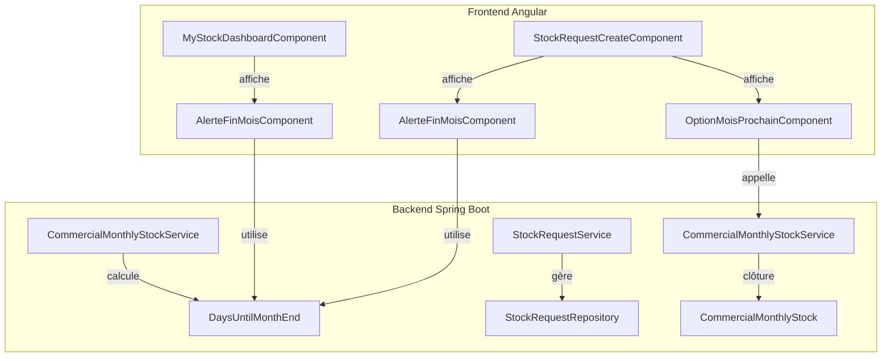
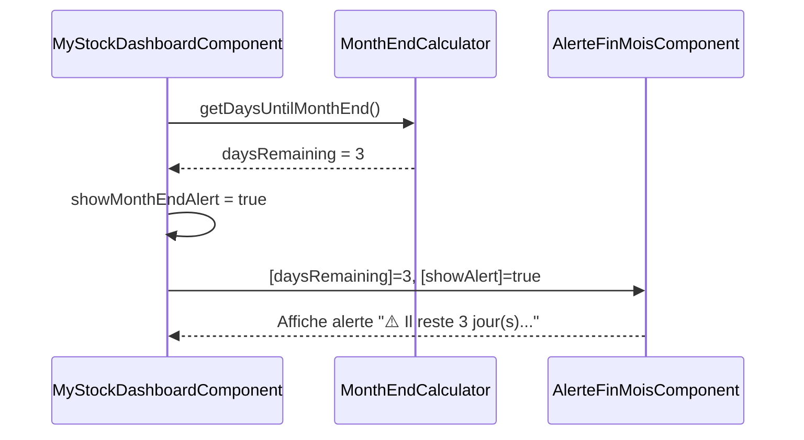
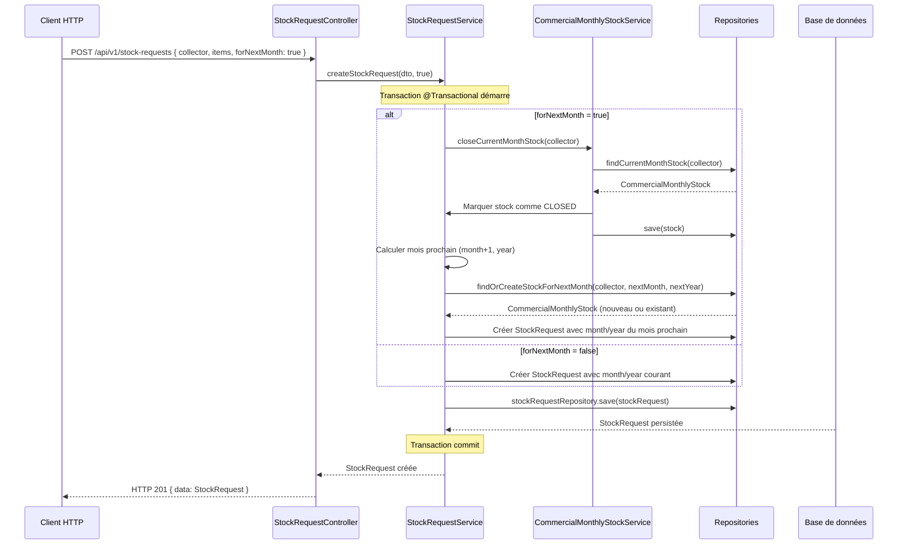

# Design — Alertes Fin de Mois et Clôture Automatique du Stock

## Vue d'ensemble

La fonctionnalité **alertes fin de mois et clôture automatique du stock** ajoute deux capacités au système :

1. **Alertes fin de mois** — afficher des messages d'avertissement dans le dashboard stock et la création de demande de sortie stock quand il reste ≤ 5 jours avant la fin du mois, rappelant que tous les articles non vendus doivent être retournés ou distribués avant la fin du mois.

2. **Option "Mois prochain"** — dans la création de demande de sortie stock, si on est dans les 5 derniers jours du mois, proposer une option pour créer la demande pour le mois prochain. Sélectionner cette option clôture automatiquement le stock du mois courant pour le commercial et crée la demande dans le mois suivant.

---

## Architecture

### Vue globale



### Décisions d'architecture

- **Composant réutilisable `AlerteFinMoisComponent`** — affiche l'alerte dans le dashboard et la création de demande, évite la duplication.
- **Utilitaire `MonthEndCalculator`** — calcule le nombre de jours restants jusqu'à la fin du mois, centralisé côté backend et frontend.
- **Pas de nouvel endpoint** — la clôture du stock du mois courant se fait via un endpoint existant ou un nouvel endpoint dédié `POST /api/v1/commercial-stock/close-current-month`.
- **Logique de clôture atomique** — clôturer le stock du mois courant et créer la demande pour le mois prochain dans une transaction unique.

---

## Composants et interfaces

### Backend

#### `CommercialMonthlyStockService` — nouvelle méthode

```
Package : com.optimize.elykia.core.service.stock

Méthodes publiques :
  int getDaysUntilMonthEnd()
  void closeCurrentMonthStock(String collector)
```

#### `StockRequestService` — modification

```
Méthode existante modifiée :
  StockRequest createStockRequest(StockRequestDto dto, boolean forNextMonth)
    - Si forNextMonth = true, crée la demande pour le mois prochain
    - Clôture automatiquement le stock du mois courant du commercial
```

#### Nouvel endpoint (optionnel)

```
POST /api/v1/commercial-stock/close-current-month
  - @RequestParam String collector
  - Retourne : ResponseEntity<Response> HTTP 200
  - Clôture le stock du mois courant pour le commercial
```

### Frontend Angular

#### `AlerteFinMoisComponent` (nouveau composant réutilisable)

```typescript
// src/app/stock/components/alerte-fin-mois/alerte-fin-mois.component.ts
@Component({ selector: 'app-alerte-fin-mois' })
export class AlerteFinMoisComponent implements OnInit {
  @Input() daysRemaining: number;
  @Input() showAlert: boolean;

  alerteMessage: string;
  alerteType: 'warning' | 'danger';

  ngOnInit() {
    if (this.daysRemaining <= 5 && this.daysRemaining > 0) {
      this.alerteType = 'warning';
      this.alerteMessage = `⚠️ Il reste ${this.daysRemaining} jour(s) avant la fin du mois. Tous les articles non vendus doivent être retournés en stock ou distribués avant la fin du mois.`;
    } else if (this.daysRemaining === 0) {
      this.alerteType = 'danger';
      this.alerteMessage = `🔴 C'est le dernier jour du mois. Tous les articles doivent être retournés ou distribués AUJOURD'HUI.`;
    }
  }
}
```

#### `OptionMoisProchainComponent` (nouveau composant)

```typescript
// src/app/stock/components/option-mois-prochain/option-mois-prochain.component.ts
@Component({ selector: 'app-option-mois-prochain' })
export class OptionMoisProchainComponent {
  @Input() daysRemaining: number;
  @Input() isVisible: boolean;
  @Output() selectNextMonth = new EventEmitter<boolean>();

  onSelectNextMonth() {
    this.selectNextMonth.emit(true);
  }

  onSelectCurrentMonth() {
    this.selectNextMonth.emit(false);
  }
}
```

#### `MyStockDashboardComponent` — modification

```typescript
// Ajouter :
daysUntilMonthEnd: number;
showMonthEndAlert: boolean;

ngOnInit() {
  this.calculateDaysUntilMonthEnd();
}

calculateDaysUntilMonthEnd() {
  const today = new Date();
  const lastDayOfMonth = new Date(today.getFullYear(), today.getMonth() + 1, 0);
  this.daysUntilMonthEnd = Math.floor((lastDayOfMonth.getTime() - today.getTime()) / (1000 * 60 * 60 * 24));
  this.showMonthEndAlert = this.daysUntilMonthEnd <= 5 && this.daysUntilMonthEnd >= 0;
}
```

#### `StockRequestCreateComponent` — modification

```typescript
// Ajouter :
daysUntilMonthEnd: number;
showMonthEndAlert: boolean;
showNextMonthOption: boolean;
forNextMonth: boolean = false;

ngOnInit() {
  this.calculateDaysUntilMonthEnd();
}

calculateDaysUntilMonthEnd() {
  const today = new Date();
  const lastDayOfMonth = new Date(today.getFullYear(), today.getMonth() + 1, 0);
  this.daysUntilMonthEnd = Math.floor((lastDayOfMonth.getTime() - today.getTime()) / (1000 * 60 * 60 * 24));
  this.showMonthEndAlert = this.daysUntilMonthEnd <= 5 && this.daysUntilMonthEnd >= 0;
  this.showNextMonthOption = this.daysUntilMonthEnd <= 5 && this.daysUntilMonthEnd >= 0;
}

onSelectNextMonth(forNext: boolean) {
  this.forNextMonth = forNext;
  // Mettre à jour le formulaire si nécessaire
}

onSubmit() {
  // Appeler le service avec le flag forNextMonth
  this.stockRequestService.createStockRequest(payload, this.forNextMonth).subscribe(...);
}
```

#### Utilitaire `MonthEndCalculator`

```typescript
// src/app/shared/utils/month-end-calculator.ts
export class MonthEndCalculator {
  static getDaysUntilMonthEnd(): number {
    const today = new Date();
    const lastDayOfMonth = new Date(today.getFullYear(), today.getMonth() + 1, 0);
    return Math.floor((lastDayOfMonth.getTime() - today.getTime()) / (1000 * 60 * 60 * 24));
  }

  static isInLastFiveDaysOfMonth(): boolean {
    return this.getDaysUntilMonthEnd() <= 5 && this.getDaysUntilMonthEnd() >= 0;
  }

  static getNextMonthDate(): { month: number; year: number } {
    const today = new Date();
    const nextMonth = new Date(today.getFullYear(), today.getMonth() + 1, 1);
    return {
      month: nextMonth.getMonth() + 1,
      year: nextMonth.getFullYear()
    };
  }
}
```

---

## Modèles de données

### `StockRequestDto` (frontend) — modification

```typescript
export interface StockRequestDto {
  collector: string;
  items: StockRequestItemDto[];
  forNextMonth?: boolean;  // Nouveau champ optionnel
}
```

### Entités existantes impliquées

```
CommercialMonthlyStock
  - id, collector, month, year
  - status: 'ACTIVE' | 'CLOSED'  // Nouveau champ pour tracer la clôture

StockRequest
  - id, collector, month, year, items, status, createdAt
```

---

## Flux de données

### Scénario 1 : Alerte fin de mois (dashboard)



### Scénario 2 : Création demande avec option mois prochain

```mermaid
sequenceDiagram
    participant UI as StockRequestCreateComponent
    participant CALC as MonthEndCalculator
    participant ALERTE as AlerteFinMoisComponent
    participant OPTION as OptionMoisProchainComponent
    participant SVC as StockRequestService
    participant BE as Backend

    UI->>CALC: getDaysUntilMonthEnd()
    CALC-->>UI: daysRemaining = 2
    UI->>ALERTE: Affiche alerte
    UI->>OPTION: Affiche option "Créer pour mois prochain ?"
    
    alt Utilisateur choisit "Mois prochain"
        OPTION->>UI: selectNextMonth.emit(true)
        UI->>UI: forNextMonth = true
        UI->>SVC: createStockRequest(payload, true)
        SVC->>BE: POST /api/v1/stock-requests { forNextMonth: true }
        BE->>BE: Clôture stock courant du commercial
        BE->>BE: Crée demande pour mois prochain
        BE-->>SVC: StockRequest créée
        SVC-->>UI: Succès, navigation
    else Utilisateur choisit "Mois courant"
        OPTION->>UI: selectNextMonth.emit(false)
        UI->>UI: forNextMonth = false
        UI->>SVC: createStockRequest(payload, false)
        SVC->>BE: POST /api/v1/stock-requests { forNextMonth: false }
        BE-->>SVC: StockRequest créée
        SVC-->>UI: Succès, navigation
    end
```

---

## Diagrammes de séquence

### POST /api/v1/stock-requests (avec option mois prochain)



---

## Propriétés de correction

### Propriété 1 : Calcul des jours restants

*Pour toute* date du jour, le calcul `getDaysUntilMonthEnd()` doit retourner le nombre exact de jours entre aujourd'hui (inclus) et le dernier jour du mois (inclus).

**Valide : Requirements 2.1, 2.2**

### Propriété 2 : Affichage de l'alerte

*Pour tout* jour où `daysUntilMonthEnd <= 5` et `daysUntilMonthEnd >= 0`, l'alerte doit être affichée dans le dashboard et la création de demande.

**Valide : Requirements 2.3, 3.2**

### Propriété 3 : Visibilité de l'option mois prochain

*Pour tout* jour où `daysUntilMonthEnd <= 5` et `daysUntilMonthEnd >= 0`, l'option "Créer pour mois prochain" doit être visible dans la création de demande.

**Valide : Requirements 3.3**

### Propriété 4 : Clôture atomique du stock

*Pour toute* création de demande avec `forNextMonth = true`, le stock du mois courant doit être marqué comme CLOSED et la demande doit être créée pour le mois prochain dans une transaction unique. Si une erreur survient, aucune modification ne doit être visible en base.

**Valide : Requirements 3.4, 3.5**

### Propriété 5 : Intégrité du mois prochain

*Pour toute* création de demande avec `forNextMonth = true`, le mois et l'année de la demande créée doivent correspondre au mois prochain (month+1, year ou year+1 si décembre).

**Valide : Requirements 3.6**

---

## Gestion des erreurs

### Erreurs backend

| Situation | Exception | Code HTTP |
|---|---|---|
| Stock courant introuvable | `ResourceNotFoundException` | 404 |
| Erreur lors de la clôture du stock | `ApplicationException` | 500 |
| Erreur de transaction | `ApplicationException` | 500 |

### Erreurs frontend

| Situation | Comportement |
|---|---|
| Erreur de calcul des jours | Afficher 0 jours, ne pas afficher l'alerte |
| Erreur lors de la création avec mois prochain | `toastr.error` avec message du backend |

---

## Stratégie de test

### Tests unitaires (backend — JUnit 5)

- `CommercialMonthlyStockServiceTest`
  - `getDaysUntilMonthEnd()` : vérifier le calcul pour différentes dates (début, milieu, fin de mois)
  - `closeCurrentMonthStock()` : vérifier que le stock est marqué CLOSED

- `StockRequestServiceTest`
  - Création avec `forNextMonth = false` : demande créée pour le mois courant
  - Création avec `forNextMonth = true` : stock courant clôturé, demande créée pour mois prochain
  - Vérification de l'atomicité (rollback sur erreur)

### Tests d'intégration (backend — Spring Boot Test)

- `StockRequestControllerIT`
  - `POST /api/v1/stock-requests` avec `forNextMonth: false` → HTTP 201, mois courant
  - `POST /api/v1/stock-requests` avec `forNextMonth: true` → HTTP 201, mois prochain, stock courant CLOSED

### Tests de propriétés (backend — jqwik)

```java
@Property(tries = 100)
@Tag("Feature: stock-month-end-alerts, Property 1: calcul jours restants")
void calculJoursRestants(@ForAll LocalDate date) {
    // Vérifie que getDaysUntilMonthEnd() retourne le bon nombre de jours
}

@Property(tries = 100)
@Tag("Feature: stock-month-end-alerts, Property 4: clôture atomique")
void cloturAtomique(@ForAll String collector) {
    // Crée une demande avec forNextMonth=true, vérifie atomicité
}
```

### Tests unitaires (frontend — Jest)

- `AlerteFinMoisComponent.spec.ts`
  - Affichage de l'alerte si `daysRemaining <= 5`
  - Message correct selon le nombre de jours
  - Pas d'affichage si `daysRemaining > 5`

- `OptionMoisProchainComponent.spec.ts`
  - Visibilité si `isVisible = true`
  - Émission d'événement `selectNextMonth` avec la bonne valeur

- `MyStockDashboardComponent.spec.ts`
  - Calcul correct de `daysUntilMonthEnd`
  - Affichage de l'alerte si `daysUntilMonthEnd <= 5`

- `StockRequestCreateComponent.spec.ts`
  - Affichage de l'alerte si `daysUntilMonthEnd <= 5`
  - Affichage de l'option mois prochain si `daysUntilMonthEnd <= 5`
  - Appel du service avec `forNextMonth = true/false` selon le choix

- `MonthEndCalculator.spec.ts`
  - `getDaysUntilMonthEnd()` pour différentes dates
  - `isInLastFiveDaysOfMonth()` pour différentes dates
  - `getNextMonthDate()` pour différentes dates

### Tests de propriétés (frontend — fast-check)

```typescript
// Property 1 : calcul des jours restants
it('calcule correctement les jours restants pour toute date', () => {
  fc.assert(fc.property(
    fc.date(),
    (date) => {
      const daysRemaining = MonthEndCalculator.getDaysUntilMonthEnd(date);
      // Vérifier que le calcul est correct
    }
  ), { numRuns: 100 });
});
```
