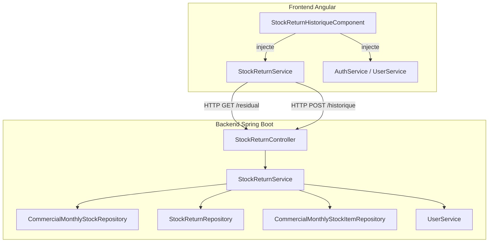
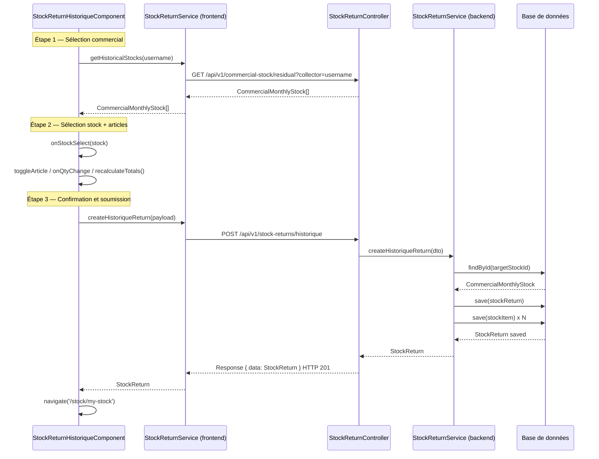
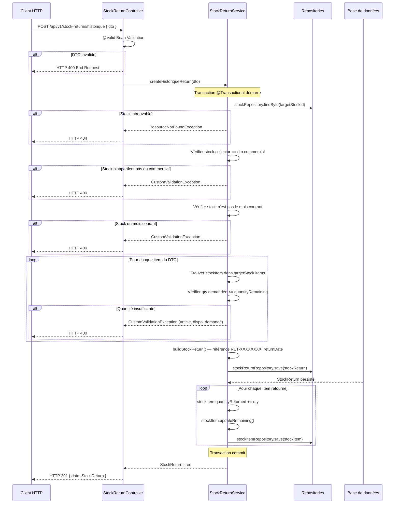

# Design — Retour en Stock Historique

## Vue d'ensemble

La fonctionnalité de **retour en stock historique** permet à un commercial (ou à un gestionnaire agissant en son nom) de retourner des articles vers un stock d'un mois antérieur. C'est l'opération symétrique du rattrapage crédit vente : au lieu de distribuer des articles d'un stock passé vers un client, on réintègre des articles dans ce stock passé.

Elle s'appuie sur un nouvel endpoint REST et un composant Angular en 3 étapes :

| Endpoint | Méthode | Description |
|---|---|---|
| `/api/v1/commercial-stock/residual` | GET | Stocks historiques d'un commercial (réutilisé) |
| `/api/v1/stock-returns/historique` | POST | Création d'un retour en stock historique |

---

## Architecture

### Vue globale



### Décisions d'architecture

- **Réutilisation de `GET /api/v1/commercial-stock/residual`** — l'endpoint existant (créé pour le rattrapage) retourne déjà les stocks historiques avec leurs items. Il est réutilisé tel quel pour lister les stocks cibles du retour.
- **Nouveau controller dédié** (`StockReturnController`) pour isoler la logique de retour et ne pas alourdir `RattrapageCreditController`.
- **Nouveau service dédié** (`StockReturnService`) avec transaction atomique propre.
- **Nouvelle entité `StockReturn`** pour tracer chaque opération de retour (audit trail), distincte de `Credit`.
- **Pas de client impliqué** — contrairement au rattrapage, le retour en stock ne concerne pas un client : c'est une réintégration pure dans le stock source.

---

## Composants et interfaces

### Backend

#### `StockReturnController`

```
Package : com.optimize.elykia.core.controller.stock

Endpoints :
  POST  /api/v1/stock-returns/historique
    - @RequestBody @Valid StockReturnDto dto
    - Retourne : ResponseEntity<Response> HTTP 201

  GET   /api/v1/commercial-stock/residual
    - Réutilisé depuis RattrapageCreditController (ou déplacé dans un controller commun)
    - @RequestParam String collector
    - Retourne : ResponseEntity<Response> HTTP 200
```

#### `StockReturnService`

```
Package : com.optimize.elykia.core.service.stock
Annotation : @Service @Transactional

Méthodes publiques :
  StockReturn createHistoriqueReturn(StockReturnDto dto)

Méthodes privées :
  CommercialMonthlyStock resolveTargetStock(Long targetStockId)
  User resolveCommercial(String username)
  void validateItems(StockReturnDto dto, CommercialMonthlyStock targetStock)
  StockReturn buildStockReturn(StockReturnDto dto, User commercial, CommercialMonthlyStock targetStock)
  void updateTargetStock(StockReturnDto dto, CommercialMonthlyStock targetStock)
  String generateReference()
```

#### `StockReturn` — nouvelle entité

```java
// Package : com.optimize.elykia.core.model.stock
@Entity
public class StockReturn {
    Long id;
    String reference;           // RET-XXXXXXXX
    String collector;           // username du commercial
    CommercialMonthlyStock targetStock;
    LocalDate returnDate;
    String note;
    List<StockReturnItem> items;
    LocalDateTime createdAt;
}

@Entity
public class StockReturnItem {
    Long id;
    StockReturn stockReturn;
    CommercialMonthlyStockItem stockItem;
    Article article;
    Integer quantity;
    Double unitPrice;
}
```

#### `CommercialMonthlyStockRepository` — méthode existante réutilisée

```java
// Déjà définie pour le rattrapage crédit vente
List<CommercialMonthlyStock> findResidualStocksByCollector(
    @Param("collector") String collector,
    @Param("currentMonth") int currentMonth,
    @Param("currentYear") int currentYear);
```

### Frontend Angular

#### `StockReturnService` (frontend)

```typescript
// src/app/stock/services/stock-return.service.ts
@Injectable({ providedIn: 'root' })
export class StockReturnService {
  getHistoricalStocks(collector: string): Observable<CommercialMonthlyStock[]>
  createHistoriqueReturn(dto: StockReturnDto): Observable<any>
}
```

#### `StockReturnHistoriqueComponent`

```typescript
// src/app/stock/stock-return/stock-return-historique.component.ts
@Component({ selector: 'app-stock-return-historique' })
export class StockReturnHistoriqueComponent implements OnInit, OnDestroy {
  // État
  currentStep: number          // 1 à 3
  isLoading: boolean
  loadingStocks: boolean
  isPromoter: boolean
  isManager: boolean

  // Données
  commercials: any[]
  historicalStocks: CommercialMonthlyStock[]
  selectedStock: CommercialMonthlyStock | null
  selectedItems: ReturnSelectedItem[]

  // Calculs
  totalReturnValue: number

  // Méthodes clés
  onCommercialChange(): void
  loadHistoricalStocks(username: string): void
  onStockSelect(stock: CommercialMonthlyStock): void
  toggleArticle(item: CommercialMonthlyStockItem, event: Event): void
  onQtyChange(item: CommercialMonthlyStockItem, event: Event): void
  recalculateTotals(): void
  onSubmit(): void
}

interface ReturnSelectedItem {
  stockItemId: number;
  articleId: number;
  articleName: string;
  quantity: number;
  unitPrice: number;
  maxQuantity: number;   // = quantityRemaining de l'item
}
```

#### Routing

```typescript
// À ajouter dans stock-routing.module.ts
{
  path: 'stock/return/historique',
  component: StockReturnHistoriqueComponent,
  canActivate: [AuthGuard],
  data: { title: 'Retour en stock historique' }
}
```

---

## Modèles de données

### `StockReturnDto` (backend)

```java
public class StockReturnDto {
    @NotBlank  String commercial;       // username du commercial
    @NotNull   Long targetStockId;      // ID du CommercialMonthlyStock cible
    @NotNull   LocalDate returnDate;
    String note;
    @NotEmpty @Valid List<StockReturnItemDto> items;

    public static class StockReturnItemDto {
        @NotNull Long stockItemId;      // ID du CommercialMonthlyStockItem
        @NotNull Long articleId;
        @NotNull @Positive Integer quantity;
        @NotNull @Positive Double unitPrice;
    }
}
```

### `StockReturnDto` (frontend TypeScript)

```typescript
export interface StockReturnDto {
  commercial: string;
  targetStockId: number;
  returnDate: string;       // ISO date "YYYY-MM-DD"
  note?: string;
  items: StockReturnItemDto[];
}

export interface StockReturnItemDto {
  stockItemId: number;
  articleId: number;
  quantity: number;
  unitPrice: number;
}
```

### Entités existantes impliquées

```
CommercialMonthlyStock
  - id, collector, month, year
  - items: List<CommercialMonthlyStockItem>

CommercialMonthlyStockItem
  - id, article, quantityTaken, quantitySold, quantityReturned
  - quantityRemaining (calculé : quantityTaken - quantitySold - quantityReturned)
  - lastUnitPrice, weightedAverageUnitPrice
  - updateRemaining() : recalcule quantityRemaining
```

### Impact sur `CommercialMonthlyStockItem` après retour

```
quantityReturned += qty
updateRemaining()   → quantityRemaining = quantityTaken - quantitySold - quantityReturned
```

---

## Flux de données entre composants



---

## Diagrammes de séquence

### POST /api/v1/stock-returns/historique



---

## Propriétés de correction

### Propriété 1 : Filtrage temporel des stocks historiques

*Pour tout* commercial, `getHistoricalStocks` ne doit retourner que les stocks dont `(year < currentYear) OR (year = currentYear AND month < currentMonth)`.

**Valide : Requirements 2.3**

### Propriété 2 : Filtrage par quantité résiduelle

*Pour tout* stock retourné par `getHistoricalStocks`, ce stock doit avoir au moins un `CommercialMonthlyStockItem` avec `quantityRemaining > 0`.

**Valide : Requirements 2.4**

### Propriété 3 : Invariant de stock après retour

*Pour tout* `CommercialMonthlyStockItem` mis à jour lors d'un retour, l'invariant suivant doit être préservé : `quantitySold + quantityRemaining + quantityReturned = quantityTaken`.

Autrement dit : `quantityRemaining = quantityTaken - quantitySold - quantityReturned`.

**Valide : Requirements 5.4, 6.1**

### Propriété 4 : Rejet de sur-retour

*Pour tout* article dont la quantité demandée dépasse `quantityRemaining`, `createHistoriqueReturn` doit lever une `CustomValidationException` sans persister aucune modification.

**Valide : Requirements 5.3**

### Propriété 5 : Unicité et format de la référence

*Pour toute* création de retour, la référence générée doit commencer par `"RET-"` suivi de 8 caractères alphanumériques en majuscules. Pour toute paire de créations distinctes, les références doivent être différentes.

**Valide : Requirements 5.5**

### Propriété 6 : Atomicité transactionnelle

*Pour tout* scénario où une erreur survient après la persistance du `StockReturn` mais avant la mise à jour complète des `CommercialMonthlyStockItem`, aucune modification ne doit être visible en base (rollback complet).

**Valide : Requirements 5.6**

### Propriété 7 : Validation des quantités saisies (frontend)

*Pour toute* quantité saisie dans le formulaire, la valeur doit être rejetée si elle est ≤ 0 ou > `quantityRemaining` de l'article correspondant.

**Valide : Requirements 3.4, 3.5**

### Propriété 8 : Calcul du total en temps réel

*Pour toute* sélection d'articles `{(qty_i, price_i)}`, le total affiché doit être égal à `Σ(qty_i × price_i)`.

**Valide : Requirements 3.6**

---

## Gestion des erreurs

### Erreurs backend

| Situation | Exception | Code HTTP |
|---|---|---|
| Stock cible introuvable | `ResourceNotFoundException` | 404 |
| Stock n'appartient pas au commercial | `CustomValidationException` | 400 |
| Stock du mois courant | `CustomValidationException` | 400 |
| Quantité demandée > quantityRemaining | `CustomValidationException` | 400 |
| Commercial introuvable | `ResourceNotFoundException` | 404 |
| Erreur de transaction | `ApplicationException` | 500 |

### Erreurs frontend

| Situation | Comportement |
|---|---|
| Formulaire invalide à la soumission | Marquer tous les champs `touched`, `toastr.warning` |
| Erreur HTTP du backend | `toastr.error` avec `err.error?.message`, pas de navigation |
| Erreur de chargement des stocks | `toastr.error`, liste vide affichée |
| Aucun stock historique trouvé | Message "Aucun stock historique trouvé pour ce commercial." |

---

## Stratégie de test

### Tests unitaires (backend — JUnit 5 + Mockito)

- `StockReturnServiceTest`
  - Cas nominal : retour réussi, vérification de `quantityReturned` et `quantityRemaining`
  - Cas d'erreur : stock introuvable, mauvais commercial, stock du mois courant, quantité insuffisante
  - Vérification de la référence `RET-XXXXXXXX`
  - Vérification de l'atomicité (rollback sur erreur)

### Tests d'intégration (backend — Spring Boot Test)

- `StockReturnControllerIT`
  - `POST /api/v1/stock-returns/historique` → HTTP 201
  - Validation Bean Validation → HTTP 400
  - Stock du mois courant → HTTP 400

### Tests de propriétés (backend — jqwik)

```java
// Tag format : @Tag("Feature: stock-return-historique, Property N: <texte>")

@Property(tries = 100)
@Tag("Feature: stock-return-historique, Property 3: invariant stock après retour")
void invariantStockApresRetour(
    @ForAll @IntRange(min = 0) int quantityTaken,
    @ForAll @IntRange(min = 0) int quantitySold,
    @ForAll @IntRange(min = 0) int quantityReturned,
    @ForAll @IntRange(min = 1) int qtyToReturn) {
    // Précondition : quantitySold + quantityReturned <= quantityTaken
    // et qtyToReturn <= quantityRemaining = quantityTaken - quantitySold - quantityReturned
    // Vérifie après retour : quantityRemaining = quantityTaken - quantitySold - (quantityReturned + qtyToReturn)
}

@Property(tries = 100)
@Tag("Feature: stock-return-historique, Property 5: unicité référence RET-")
void unicitéRéférence(@ForAll @IntRange(min = 2, max = 50) int n) {
    // Génère n références, vérifie qu'elles commencent toutes par "RET-" et sont toutes distinctes
}
```

### Tests unitaires (frontend — Jest)

- `StockReturnHistoriqueComponent.spec.ts`
  - Affichage conditionnel selon le profil (PROMOTER vs GESTIONNAIRE)
  - Validation des quantités (rejet si > quantityRemaining)
  - Calcul du total en temps réel
  - Navigation après succès / affichage d'erreur

- `StockReturnService.spec.ts` : appels HTTP avec `HttpClientTestingModule`

### Tests de propriétés (frontend — fast-check)

```typescript
// Tag format : // Feature: stock-return-historique, Property N: <texte>

// Property 8 : calcul du total en temps réel
it('calcule correctement le total pour toute sélection d\'articles', () => {
  fc.assert(fc.property(
    fc.array(fc.record({ qty: fc.integer({ min: 1 }), price: fc.float({ min: 0 }) })),
    (items) => {
      const total = items.reduce((acc, i) => acc + i.qty * i.price, 0);
      // Vérifier que recalculateTotals() produit le même résultat
    }
  ), { numRuns: 100 });
});
```
