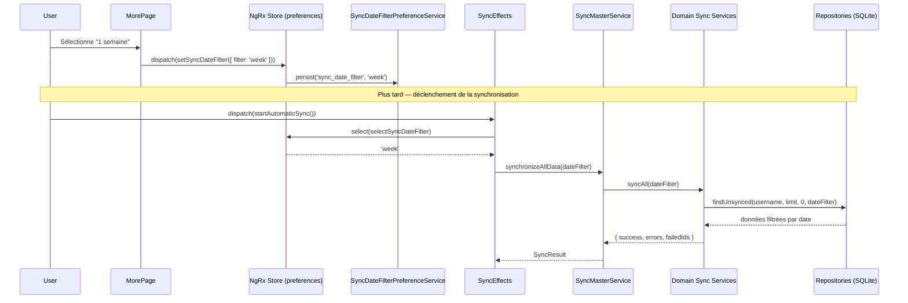

# Document de Design : sync-date-filter-preference

## Vue d'ensemble

Cette fonctionnalité permet à l'utilisateur de configurer une préférence de plage de dates pour la synchronisation automatique. Actuellement, `SyncMasterService` récupère toutes les données non synchronisées sans filtre temporel. La nouvelle fonctionnalité introduit un `SyncDateFilterPreferenceService` qui persiste la préférence localement, expose un sélecteur NgRx dédié, et permet à `SyncMasterService` de passer un `DateFilter` aux services de domaine lors de chaque synchronisation.

## Architecture

```mermaid
graph TD
    A[more.page.html\nParamètres] -->|ionChange| B[MorePage\nComponent]
    B -->|dispatch setSyncDateFilter| C[preferences Store\nNgRx]
    C -->|persist| D[SyncDateFilterPreferenceService\nIonic Storage]
    D -->|load on init| C

    E[sync-automatic.page.ts] -->|dispatch startAutomaticSync| F[SyncEffects]
    F -->|select syncDateFilter| C
    F -->|synchronizeAllData(dateFilter)| G[SyncMasterService]
    G -->|syncAll(dateFilter)| H[Domain Sync Services\nClient, Distribution, Recovery,\nTontine*, etc.]
    H -->|findUnsynced(username, limit, offset, dateFilter)| I[Repositories\nSQLite]
```

## Flux de données principal



## Composants et Interfaces

### Modèle de données : SyncDateFilterOption

```typescript
export type SyncDateFilterOption =
  | 'today'      // Aujourd'hui (défaut)
  | '2days'      // 2 derniers jours
  | '3days'      // 3 derniers jours
  | 'week'       // 7 derniers jours
  | '2weeks'     // 15 derniers jours
  | 'month';     // 30 derniers jours

export interface DateFilter {
  startDate: string;  // ISO date string 'YYYY-MM-DD'
  endDate: string;    // ISO date string 'YYYY-MM-DD'
}

export const SYNC_DATE_FILTER_LABELS: Record<SyncDateFilterOption, string> = {
  today:  "Aujourd'hui",
  '2days': '2 derniers jours',
  '3days': '3 derniers jours',
  week:   '1 semaine',
  '2weeks': '2 semaines',
  month:  '1 mois',
};
```

### Service : SyncDateFilterPreferenceService

**Responsabilité** : Persister et charger la préférence de filtre de date via Ionic Storage.

```typescript
@Injectable({ providedIn: 'root' })
export class SyncDateFilterPreferenceService {
  private readonly STORAGE_KEY = 'sync_date_filter';

  async saveFilter(filter: SyncDateFilterOption): Promise<void>
  async loadFilter(): Promise<SyncDateFilterOption>  // retourne 'today' si absent
  resolveDateFilter(option: SyncDateFilterOption): DateFilter
}
```

`resolveDateFilter` calcule `startDate` / `endDate` à partir de l'option choisie et de la date courante.

### NgRx : preferences Store

Nouveau slice NgRx dédié aux préférences utilisateur (extensible pour d'autres préférences futures).

**State**
```typescript
export interface PreferencesState {
  syncDateFilter: SyncDateFilterOption;
  loaded: boolean;
}
```

**Actions**
```typescript
loadSyncDateFilterPreference()
loadSyncDateFilterPreferenceSuccess({ filter: SyncDateFilterOption })
setSyncDateFilter({ filter: SyncDateFilterOption })
setSyncDateFilterSuccess({ filter: SyncDateFilterOption })
```

**Sélecteur**
```typescript
selectSyncDateFilter: MemoizedSelector<AppState, SyncDateFilterOption>
```

**Effect**
- `loadSyncDateFilterPreference$` → appelle `SyncDateFilterPreferenceService.loadFilter()` au démarrage de l'app
- `setSyncDateFilter$` → appelle `SyncDateFilterPreferenceService.saveFilter()` à chaque changement

### Modification : SyncMasterService

`synchronizeAllData()` accepte un `DateFilter` optionnel et le propage à chaque service de domaine via `syncAll(dateFilter?)`.

```typescript
async synchronizeAllData(dateFilter?: DateFilter): Promise<SyncResult>
```

Chaque appel `xxxSyncService.syncAll()` devient `xxxSyncService.syncAll(batchSize, dateFilter)`.

### Modification : BaseSyncService

`syncAll()` et `fetchUnsynced()` acceptent un `DateFilter` optionnel.

```typescript
async syncAll(batchSize?: number, dateFilter?: DateFilter): Promise<...>
protected async fetchUnsynced(limit: number, dateFilter?: DateFilter): Promise<T[]>
```

`fetchUnsynced` appelle `repository.findUnsynced(username, limit, offset, dateFilter)`.

### Modification : BaseRepository / findUnsynced

```typescript
findUnsynced(username: string, limit: number, offset: number, dateFilter?: DateFilter): Promise<T[]>
```

La clause SQL WHERE est étendue avec une condition sur la colonne `created_at` (ou `date`) si `dateFilter` est fourni :

```sql
AND created_at >= :startDate AND created_at <= :endDate
```

### Modification : SyncEffects

L'effect `startAutomaticSync$` lit le filtre depuis le store avant de lancer la synchronisation :

```typescript
startAutomaticSync$ = createEffect(() =>
  this.actions$.pipe(
    ofType(SyncActions.startAutomaticSync),
    withLatestFrom(this.store.select(selectSyncDateFilter)),
    switchMap(([_, filterOption]) => {
      const dateFilter = this.prefService.resolveDateFilter(filterOption);
      return from(this.syncMasterService.synchronizeAllData(dateFilter)).pipe(...)
    })
  )
);
```

### Modification : more.page.html / MorePage

Ajout d'un `ion-item` avec `ion-select` dans la section "Synchronisation" :

```html
<ion-item>
  <ion-icon name="calendar-outline" slot="start"></ion-icon>
  <ion-label>
    <h3>Filtre de date de synchronisation</h3>
    <p>Données à synchroniser</p>
  </ion-label>
  <ion-select [(ngModel)]="syncDateFilter" (ionChange)="onSyncDateFilterChange()">
    <ion-select-option value="today">Aujourd'hui</ion-select-option>
    <ion-select-option value="2days">2 derniers jours</ion-select-option>
    <ion-select-option value="3days">3 derniers jours</ion-select-option>
    <ion-select-option value="week">1 semaine</ion-select-option>
    <ion-select-option value="2weeks">2 semaines</ion-select-option>
    <ion-select-option value="month">1 mois</ion-select-option>
  </ion-select>
</ion-item>
```

`MorePage` dispatche `setSyncDateFilter({ filter: this.syncDateFilter })` dans `onSyncDateFilterChange()`.

## Modèles de données

### DateFilter (nouveau modèle partagé)

```typescript
// mobile/src/app/models/sync-date-filter.model.ts
export type SyncDateFilterOption = 'today' | '2days' | '3days' | 'week' | '2weeks' | 'month';

export interface DateFilter {
  startDate: string;
  endDate: string;
}
```

### Règles de validation

- `startDate` ≤ `endDate`
- Les deux dates au format `YYYY-MM-DD`
- `endDate` = date du jour (calculé dynamiquement à chaque synchronisation)
- Valeur par défaut : `'today'` si aucune préférence persistée

## Gestion des erreurs

**Préférence non trouvée en storage** : `loadFilter()` retourne `'today'` (valeur par défaut), la synchronisation se comporte comme avant.

**Erreur de lecture storage** : loggée en console, fallback sur `'today'`.

**Colonne `created_at` absente dans une table** : les services de domaine qui ne supportent pas le filtre de date (ex: `LocalitySyncService`) ignorent le `dateFilter` — leur `fetchUnsynced` n'est pas modifié.

## Stratégie de test

### Tests unitaires

- `SyncDateFilterPreferenceService` : `saveFilter`, `loadFilter` (mock Ionic Storage), `resolveDateFilter` pour chaque option
- `preferences reducer` : actions `setSyncDateFilter`, `loadSyncDateFilterPreferenceSuccess`
- `preferences selectors` : `selectSyncDateFilter`
- `SyncMasterService.synchronizeAllData(dateFilter)` : vérifie que le `dateFilter` est bien passé à chaque service de domaine (mock des services)
- `BaseSyncService.fetchUnsynced` : vérifie que le repository reçoit le `dateFilter`

### Tests de propriétés (property-based)

- `resolveDateFilter(option)` : pour tout `option` valide, `startDate ≤ endDate` et les deux dates sont des chaînes ISO valides
- Pour tout `option` valide, `endDate` = date du jour

### Tests d'intégration

- `MorePage` → dispatch → store → `SyncDateFilterPreferenceService` : vérifier la persistance end-to-end
- `SyncEffects.startAutomaticSync$` avec `withLatestFrom` : vérifier que le `dateFilter` résolu est passé à `SyncMasterService`

## Considérations de performance

- `resolveDateFilter` est un calcul pur (pas d'I/O), exécuté une seule fois par synchronisation.
- La requête SQL filtrée réduit le volume de données chargées en mémoire depuis SQLite, ce qui améliore les performances sur les appareils avec peu de RAM.
- L'index sur `created_at` dans les tables SQLite est recommandé si ce n'est pas déjà le cas.

## Considérations de sécurité

- La préférence est une donnée non sensible (plage de dates), stockée en clair dans Ionic Storage.
- Aucune donnée personnelle n'est exposée par cette préférence.

## Dépendances

- `@ionic/storage-angular` — déjà utilisé dans le projet
- `@ngrx/store`, `@ngrx/effects` — déjà utilisés
- Ionic `ion-select`, `ion-select-option` — composants Ionic existants

## Correctness Properties

*Une propriété est une caractéristique ou un comportement qui doit être vrai pour toutes les exécutions valides du système — essentiellement, un énoncé formel sur ce que le système doit faire. Les propriétés servent de pont entre les spécifications lisibles par l'humain et les garanties de correction vérifiables automatiquement.*

### Property 1 : DateFilter toujours valide (invariant de structure)

*Pour toute* SyncDateFilterOption valide passée à `resolveDateFilter`, le DateFilter retourné doit avoir `startDate` et `endDate` au format `YYYY-MM-DD`, et `startDate` doit être inférieur ou égal à `endDate`.

**Validates: Requirements 1.2, 2.1, 2.8**

---

### Property 2 : Calcul correct de startDate selon l'option

*Pour toute* SyncDateFilterOption valide, `resolveDateFilter` doit retourner un DateFilter dont `startDate` correspond exactement au nombre de jours en arrière défini par l'option (0 pour `'today'`, 1 pour `'2days'`, 2 pour `'3days'`, 6 pour `'week'`, 14 pour `'2weeks'`, 29 pour `'month'`) et dont `endDate` est la date du jour.

**Validates: Requirements 2.1, 2.2, 2.3, 2.4, 2.5, 2.6, 2.7**

---

### Property 3 : Round-trip persistance du filtre

*Pour toute* SyncDateFilterOption valide, appeler `saveFilter(option)` puis `loadFilter()` doit retourner la même option.

**Validates: Requirements 3.1, 3.2**

---

### Property 4 : Reducer PreferencesStore — mise à jour correcte de l'état

*Pour toute* SyncDateFilterOption valide, dispatcher `loadSyncDateFilterPreferenceSuccess({ filter })` ou `setSyncDateFilterSuccess({ filter })` sur le reducer doit produire un état dont `syncDateFilter` est égal à la valeur dispatchée.

**Validates: Requirements 4.2, 4.3**

---

### Property 5 : Propagation du DateFilter à travers la chaîne de synchronisation

*Pour tout* DateFilter résolu depuis une SyncDateFilterOption, `SyncMasterService.synchronizeAllData(dateFilter)` doit propager ce même DateFilter à chaque service de domaine via `syncAll`, qui le transmet à `fetchUnsynced`, qui le transmet à `findUnsynced` du repository.

**Validates: Requirements 7.3, 7.4, 7.5**

---

### Property 6 : Filtrage SQL respecte la plage de dates

*Pour tout* DateFilter valide passé à `findUnsynced`, tous les enregistrements retournés doivent avoir une valeur `created_at` comprise entre `startDate` et `endDate` inclus.

**Validates: Requirements 8.1**

---

### Property 7 : Effect setSyncDateFilter — persistance pour toute option

*Pour toute* SyncDateFilterOption valide dispatchée via `setSyncDateFilter`, l'effect doit appeler `SyncDateFilterPreferenceService.saveFilter()` avec cette option et dispatcher `setSyncDateFilterSuccess` avec la même valeur.

**Validates: Requirements 6.4**
