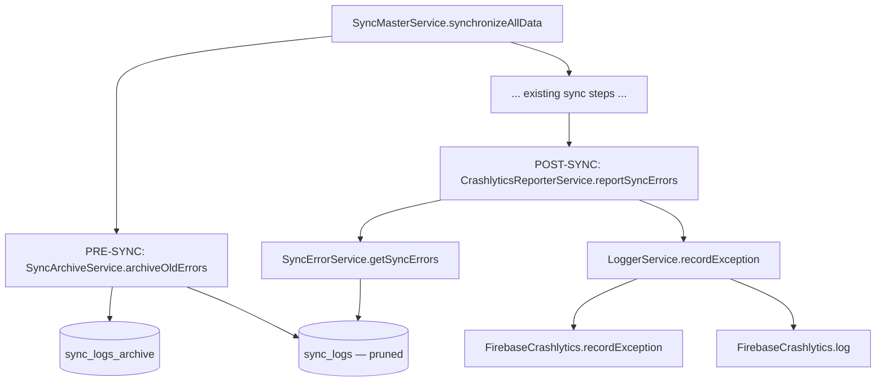
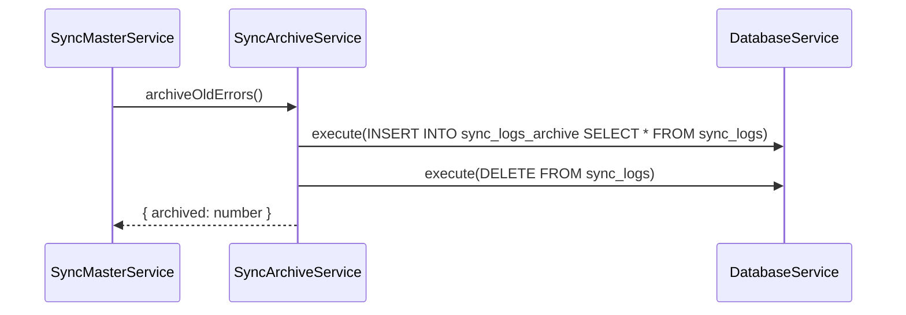
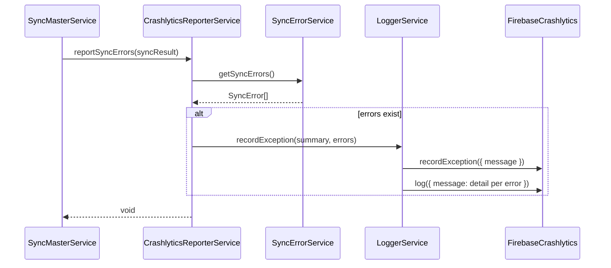

# Design Document: Sync Error Archiving & Crashlytics Reporting

## Overview

This feature adds two complementary capabilities to the sync pipeline: (1) archiving all rows from `sync_logs` into a `sync_logs_archive` table before each new sync job to prevent unbounded table growth, and (2) reporting all sync session errors to Firebase Crashlytics at the end of each sync so they surface in the Crashlytics console as non-fatal exceptions.

The feature integrates directly into `SyncMasterService.synchronizeAllData()` — archiving runs as a pre-sync step and Crashlytics reporting runs as a post-sync step — with a new `SyncArchiveService` handling the archiving logic and `LoggerService` extended to support `recordException`.

## Architecture



## Sequence Diagrams

### Pre-Sync: Error Archiving



### Post-Sync: Crashlytics Reporting



## Components and Interfaces

### Component 1: SyncArchiveService

**Purpose**: Moves all rows from `sync_logs` into `sync_logs_archive` before each sync run, keeping the active table lean.

**Interface**:
```typescript
interface SyncArchiveService {
  /** Archives all rows from sync_logs and returns the count archived. */
  archiveOldErrors(): Promise<{ archived: number }>;
}
```

**Responsibilities**:
- Create `sync_logs_archive` table if it does not exist (idempotent DDL)
- Copy all rows from `sync_logs` into `sync_logs_archive` (no filter on status)
- Delete all copied rows from `sync_logs`
- Log the operation result via `LoggerService`

### Component 2: CrashlyticsReporterService

**Purpose**: Reads current sync errors and pushes them to Firebase Crashlytics as a non-fatal exception at the end of a sync session.

**Interface**:
```typescript
interface CrashlyticsReporterService {
  /** Reports all current sync errors to Crashlytics. No-op if no errors. */
  reportSyncErrors(syncResult: SyncResult): Promise<void>;
}
```

**Responsibilities**:
- Retrieve errors via `SyncErrorService.getSyncErrors()`
- If errors exist, call `LoggerService.recordException()` with a summary message
- Log each individual error detail via `FirebaseCrashlytics.log()`
- Swallow/log any Crashlytics SDK failures so they never break the sync flow

### Component 3: LoggerService (extension)

**Purpose**: Adds a `recordException` method that wraps `FirebaseCrashlytics.recordException`.

**Interface extension**:
```typescript
// Added to existing LoggerService
async recordException(message: string): Promise<void>;
```

**Responsibilities**:
- Call `FirebaseCrashlytics.recordException({ message })` to create a non-fatal crash entry
- Fall back gracefully (log to console) if the SDK call fails

## Data Models

### sync_logs_archive table

Same schema as `sync_logs`, with one additional column:

```sql
CREATE TABLE IF NOT EXISTS sync_logs_archive (
    id TEXT PRIMARY KEY,
    entityType TEXT,
    entityId TEXT,
    operation TEXT,
    status TEXT,
    errorCode TEXT,
    requestData TEXT,
    responseData TEXT,
    entityDisplayName TEXT,
    entityDetails TEXT,
    errorMessage TEXT,
    syncDate DATETIME,
    retryCount INTEGER DEFAULT 0,
    archivedAt DATETIME DEFAULT CURRENT_TIMESTAMP  -- new column
);
```

**Notes**:
- `archivedAt` records when the row was moved from `sync_logs`
- No foreign keys; mirrors the loose-coupling pattern of `sync_logs`
- Table creation is handled by `SyncArchiveService` at runtime (not in `DatabaseService.createTables`) to keep the migration surface minimal

### SyncArchiveResult

```typescript
interface SyncArchiveResult {
  archived: number;   // rows moved to archive
}
```

## Error Handling

### Archiving failure

**Condition**: SQLite error during INSERT/DELETE in `archiveOldErrors()`  
**Response**: Catch the error, log it via `LoggerService.error()`, and return `{ archived: 0 }`  
**Recovery**: Sync proceeds normally — archiving is best-effort and must never block the sync job

### Crashlytics SDK failure

**Condition**: `FirebaseCrashlytics.recordException()` or `.log()` throws (e.g. SDK not initialized on web)  
**Response**: Catch and log to console; do not rethrow  
**Recovery**: Sync result is already computed; Crashlytics reporting is fire-and-forget

### No errors to report

**Condition**: `getSyncErrors()` returns an empty array  
**Response**: `CrashlyticsReporterService.reportSyncErrors()` exits early — no Crashlytics calls made  
**Recovery**: N/A

## Testing Strategy

### Unit Testing Approach

- `SyncArchiveService`: mock `DatabaseService`; verify correct SQL is executed and row counts are returned
- `CrashlyticsReporterService`: mock `SyncErrorService` and `LoggerService`; verify `recordException` is called only when errors exist, and that SDK failures are swallowed
- `LoggerService.recordException`: mock `FirebaseCrashlytics`; verify the call is made and errors are caught

### Property-Based Testing Approach

**Property Test Library**: jasmine / karma (existing test setup)

- For any non-empty list of `SyncError` objects, `reportSyncErrors` must call `recordException` exactly once
- For an empty list, `recordException` must never be called
- `archiveOldErrors` must always leave `sync_logs` completely empty (zero rows of any status) after a successful run

### Integration Testing Approach

- Verify that `synchronizeAllData()` calls `archiveOldErrors()` before any sync step and `reportSyncErrors()` after the final step
- Verify that `sync_logs_archive` row count increases by the number of rows that were in `sync_logs` before the run, and that `sync_logs` is empty afterwards

## Performance Considerations

- Archiving uses a single `INSERT INTO ... SELECT ...` + `DELETE` pair — O(n) on total row count, negligible for typical volumes
- Crashlytics reporting is async and non-blocking; it runs after `synchronizeAllData` returns its result
- `sync_logs_archive` is append-only and unbounded by design (historical record); a future cleanup job can prune it by date if needed

## Security Considerations

- `requestData` and `responseData` stored in `sync_logs_archive` may contain sensitive business data; they are already stored in `sync_logs` today, so no new exposure is introduced
- Crashlytics messages should contain only `entityType`, `entityId`, `errorCode`, and `errorMessage` — no raw `requestData`/`responseData` payloads to avoid leaking PII to the Crashlytics console

## Dependencies

- `@capacitor-firebase/crashlytics` — already used in `LoggerService`
- `@capacitor-community/sqlite` — already used via `DatabaseService`
- `SyncErrorService` — existing service, no changes needed
- `LoggerService` — minor extension (`recordException` method)
- `SyncMasterService` — two new injection points (pre/post sync hooks)


## Correctness Properties

*A property is a characteristic or behavior that should hold true across all valid executions of a system — essentially, a formal statement about what the system should do. Properties serve as the bridge between human-readable specifications and machine-verifiable correctness guarantees.*

### Property 1: Archiving copies all rows regardless of status

*For any* set of rows in `sync_logs` with any combination of `status` values, after `archiveOldErrors()` completes successfully, every row that was in `sync_logs` SHALL appear in `sync_logs_archive`.

**Validates: Requirements 1.2**

### Property 2: Archiving leaves sync_logs empty

*For any* non-empty initial state of `sync_logs`, after `archiveOldErrors()` completes successfully, the row count of `sync_logs` SHALL be zero.

**Validates: Requirements 1.3**

### Property 3: Archived row count matches source row count

*For any* N rows in `sync_logs` before archiving, `archiveOldErrors()` SHALL return `{ archived: N }`.

**Validates: Requirements 1.4**

### Property 4: Crashlytics recordException called exactly once for any non-empty error list

*For any* non-empty list of `SyncError` objects, `reportSyncErrors()` SHALL call `LoggerService.recordException` exactly once.

**Validates: Requirements 2.3**

### Property 5: Crashlytics log called once per error

*For any* list of N `SyncError` objects, `reportSyncErrors()` SHALL call `FirebaseCrashlytics.log` exactly N times.

**Validates: Requirements 2.4**

### Property 6: Crashlytics messages contain no sensitive payload data

*For any* `SyncError` object, the message string passed to `FirebaseCrashlytics.recordException` and `FirebaseCrashlytics.log` SHALL NOT contain the `requestData` or `responseData` fields of that error.

**Validates: Requirements 2.7**
