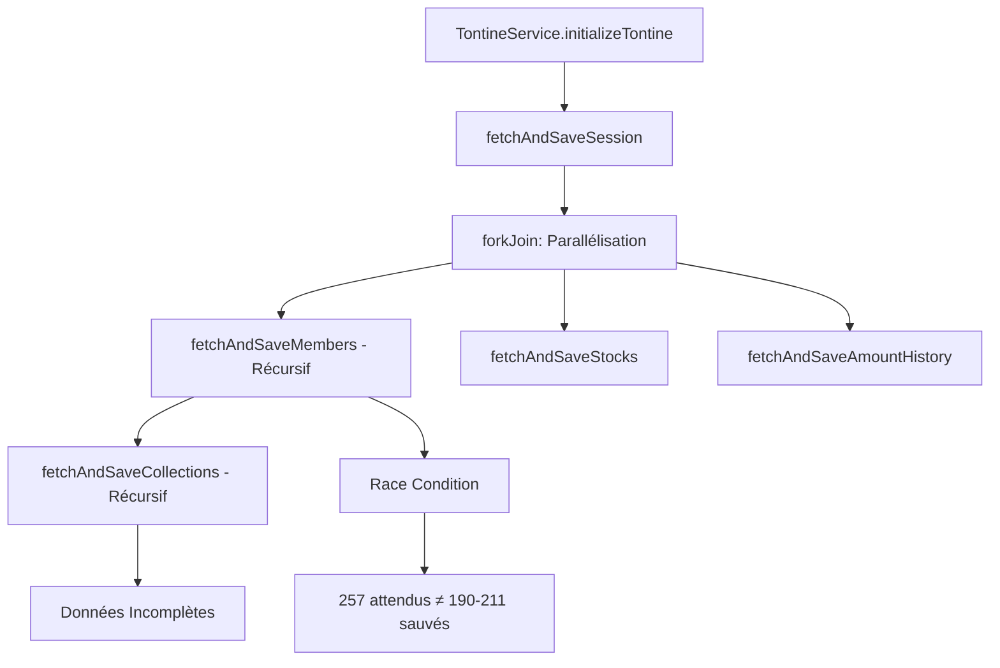
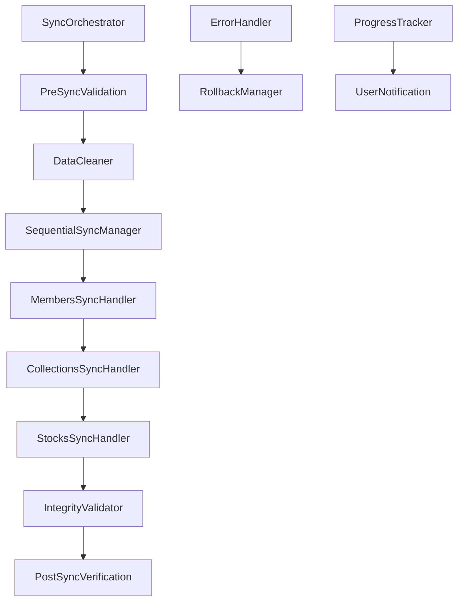

# Document de Conception

## Vue d'ensemble

Cette conception propose une solution robuste pour résoudre les problèmes de synchronisation des données tontine dans l'application mobile Ionic/Angular. Le système actuel présente des race conditions, une gestion d'erreur défaillante et des incohérences dans la récupération des données paginées.

La solution proposée implémente un système de synchronisation séquentielle avec nettoyage préalable, vérification d'intégrité et gestion d'erreur robuste pour garantir la cohérence des données.

## Architecture

### Architecture Actuelle (Problématique)



### Architecture Proposée (Solution)



## Composants et Interfaces

### 1. SyncOrchestrator (Orchestrateur Principal)

**Responsabilité :** Coordonner l'ensemble du processus de synchronisation

```typescript
interface ISyncOrchestrator {
  startSync(options: SyncOptions): Observable<SyncResult>;
  cancelSync(): void;
  getSyncStatus(): Observable<SyncStatus>;
}

interface SyncOptions {
  forceCleanup: boolean;
  sessionId?: string;
  commercialUsername: string;
  batchSize: number;
}

interface SyncResult {
  success: boolean;
  totalMembers: number;
  totalCollections: number;
  totalStocks: number;
  errors: SyncError[];
  duration: number;
}
```

### 2. SequentialSyncManager (Gestionnaire Séquentiel)

**Responsabilité :** Gérer la synchronisation séquentielle des données paginées

```typescript
interface ISequentialSyncManager {
  syncMembers(sessionId: string, options: SyncOptions): Observable<MembersSyncResult>;
  syncCollections(options: SyncOptions): Observable<CollectionsSyncResult>;
  syncStocks(sessionId: string, options: SyncOptions): Observable<StocksSyncResult>;
}

interface PaginatedSyncResult {
  totalPages: number;
  processedPages: number;
  totalItems: number;
  savedItems: number;
  errors: SyncError[];
}
```

### 3. DataCleaner (Nettoyeur de Données)

**Responsabilité :** Nettoyer les données existantes avant synchronisation

```typescript
interface IDataCleaner {
  cleanTontineData(commercialUsername: string): Promise<CleanupResult>;
  cleanMembers(sessionId: string, commercialUsername: string): Promise<void>;
  cleanCollections(commercialUsername: string): Promise<void>;
  cleanStocks(commercialUsername: string): Promise<void>;
}

interface CleanupResult {
  membersDeleted: number;
  collectionsDeleted: number;
  stocksDeleted: number;
  success: boolean;
}
```

### 4. IntegrityValidator (Validateur d'Intégrité)

**Responsabilité :** Vérifier l'intégrité des données synchronisées

```typescript
interface IIntegrityValidator {
  validateSyncResult(expected: ExpectedData, actual: ActualData): ValidationResult;
  validateDataStructure(data: any[]): StructureValidationResult;
  calculateChecksum(data: any[]): string;
}

interface ValidationResult {
  isValid: boolean;
  expectedCount: number;
  actualCount: number;
  missingItems: string[];
  corruptedItems: string[];
  checksumMatch: boolean;
}
```

### 5. ErrorHandler (Gestionnaire d'Erreur)

**Responsabilité :** Gérer les erreurs et déclencher les rollbacks si nécessaire

```typescript
interface IErrorHandler {
  handleSyncError(error: SyncError, context: SyncContext): ErrorHandlingResult;
  shouldRetry(error: SyncError): boolean;
  shouldRollback(error: SyncError): boolean;
}

interface SyncError {
  type: 'NETWORK' | 'DATABASE' | 'VALIDATION' | 'TIMEOUT';
  message: string;
  context: SyncContext;
  timestamp: Date;
  retryable: boolean;
}
```

## Modèles de Données

### SyncSession (Session de Synchronisation)

```typescript
interface SyncSession {
  id: string;
  commercialUsername: string;
  sessionId: string;
  startTime: Date;
  endTime?: Date;
  status: 'PENDING' | 'IN_PROGRESS' | 'COMPLETED' | 'FAILED' | 'CANCELLED';
  progress: SyncProgress;
  result?: SyncResult;
}

interface SyncProgress {
  currentStep: string;
  totalSteps: number;
  completedSteps: number;
  currentPageProgress: PageProgress;
}

interface PageProgress {
  currentPage: number;
  totalPages: number;
  itemsProcessed: number;
  totalItems: number;
}
```

### SyncMetadata (Métadonnées de Synchronisation)

```typescript
interface SyncMetadata {
  lastSyncDate: Date;
  lastSuccessfulSync: Date;
  syncVersion: string;
  dataChecksum: string;
  totalItemsSynced: number;
  syncDuration: number;
}
```

## Gestion d'Erreur

### Stratégie de Gestion d'Erreur

1. **Erreurs Réseau :** Retry avec backoff exponentiel (max 3 tentatives)
2. **Erreurs de Base de Données :** Rollback immédiat et notification utilisateur
3. **Erreurs de Validation :** Arrêt du processus et diagnostic détaillé
4. **Timeout :** Annulation propre avec sauvegarde de l'état

### Mécanisme de Rollback

```typescript
interface IRollbackManager {
  createRestorePoint(): Promise<RestorePoint>;
  rollbackToRestorePoint(restorePoint: RestorePoint): Promise<void>;
  cleanupRestorePoints(): Promise<void>;
}

interface RestorePoint {
  id: string;
  timestamp: Date;
  dataSnapshot: DataSnapshot;
  metadata: SyncMetadata;
}
```

## Stratégie de Test

### Tests Unitaires

**Composants à tester :**
- SyncOrchestrator : Coordination des étapes de synchronisation
- SequentialSyncManager : Gestion séquentielle des pages
- DataCleaner : Nettoyage correct des données
- IntegrityValidator : Validation des données et checksums
- ErrorHandler : Gestion appropriée des différents types d'erreur

**Cas de test spécifiques :**
- Synchronisation avec 0 membre
- Synchronisation avec exactement 257 membres (3 pages)
- Interruption réseau pendant la synchronisation
- Corruption de données pendant la sauvegarde
- Annulation utilisateur pendant le processus

### Tests d'Intégration

**Scénarios à tester :**
- Synchronisation complète end-to-end avec données réelles
- Récupération après échec de synchronisation
- Performance avec gros volumes de données (>1000 membres)
- Synchronisation simultanée (prévention des race conditions)

## Propriétés de Correction

*Une propriété est une caractéristique ou un comportement qui doit être vrai pour toutes les exécutions valides d'un système - essentiellement, une déclaration formelle sur ce que le système doit faire. Les propriétés servent de pont entre les spécifications lisibles par l'homme et les garanties de correction vérifiables par machine.*

### Propriété 1: Cohérence de synchronisation complète
*Pour toute* session de synchronisation avec des données backend, le nombre total d'éléments sauvegardés localement doit être exactement égal au nombre total d'éléments disponibles sur le backend
**Valide : Exigences 1.1, 1.2, 1.3**

### Propriété 2: Nettoyage préalable des données
*Pour toute* synchronisation déclenchée avec des données existantes dans la base locale, toutes les anciennes données doivent être supprimées avant l'insertion des nouvelles données
**Valide : Exigences 1.4**

### Propriété 3: Traitement séquentiel des pages
*Pour toute* synchronisation paginée, chaque page doit être traitée complètement avant que la page suivante ne commence son traitement, et le processus doit s'arrêter à la dernière page
**Valide : Exigences 2.1, 2.2, 2.3**

### Propriété 4: Exclusion mutuelle des synchronisations
*Pour toute* tentative de démarrage d'une nouvelle synchronisation pendant qu'une synchronisation est en cours, la nouvelle tentative doit être rejetée
**Valide : Exigences 2.4**

### Propriété 5: Gestion d'erreur avec arrêt sécurisé
*Pour toute* erreur survenant pendant la synchronisation, le processus doit s'arrêter immédiatement, préserver les données précédentes, et fournir des informations de diagnostic complètes
**Valide : Exigences 3.1, 3.2, 3.3, 3.4, 3.5**

### Propriété 6: Validation d'intégrité post-synchronisation
*Pour toute* synchronisation terminée, les checksums des données doivent être calculés et comparés, et la structure de chaque enregistrement doit être validée
**Valide : Exigences 4.1, 4.2**

### Propriété 7: Re-synchronisation automatique en cas d'échec d'intégrité
*Pour toute* vérification d'intégrité qui échoue, une nouvelle synchronisation doit être déclenchée automatiquement
**Valide : Exigences 4.3**

### Propriété 8: Marquage des données corrompues
*Pour toute* donnée détectée comme corrompue, elle doit être marquée comme invalide et son utilisation doit être empêchée
**Valide : Exigences 4.4**

### Propriété 9: Journalisation complète des opérations
*Pour toute* opération de synchronisation, une entrée de journal doit être créée avec horodatage, statut et détails de l'opération
**Valide : Exigences 4.5**

### Propriété 10: Traitement par batch pour gros volumes
*Pour toute* synchronisation de données volumineuses, le traitement doit être effectué par batches pour optimiser les performances
**Valide : Exigences 5.3**

### Propriété 11: Mise à jour du progrès de synchronisation
*Pour toute* synchronisation en cours, l'indicateur de progression doit être mis à jour de manière monotone croissante jusqu'à 100%
**Valide : Exigences 5.5**

### Configuration des Tests Property-Based

- **Bibliothèque :** fast-check pour TypeScript
- **Itérations minimales :** 100 par propriété
- **Tag format :** **Feature: tontine-data-sync-reliability, Property {number}: {property_text}**

**Approche de Test Dual :**
- **Tests unitaires :** Cas spécifiques, conditions limites, gestion d'erreur
- **Tests property-based :** Propriétés universelles sur tous les inputs possibles
- **Complémentarité :** Les tests unitaires capturent les bugs concrets, les tests property-based vérifient la correction générale