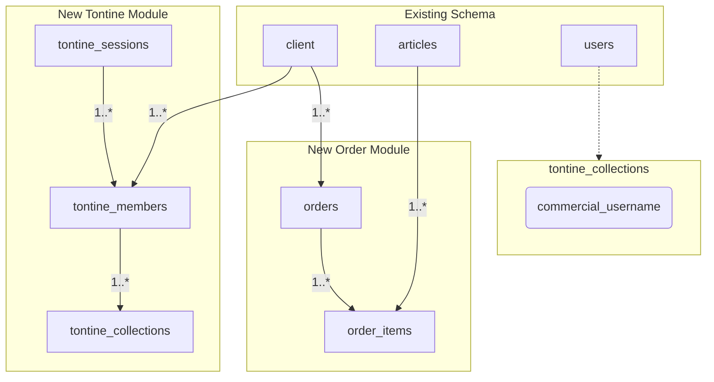
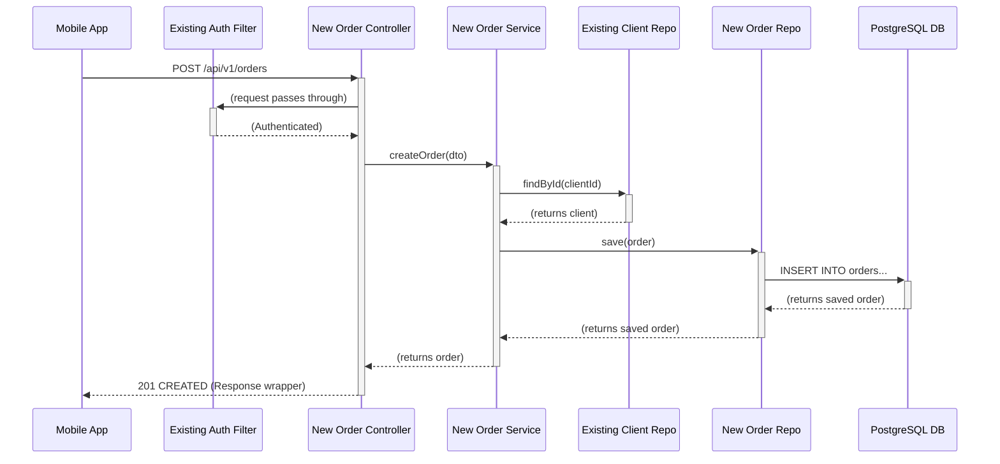

# Elykia Mobile Brownfield Enhancement Architecture

### **Section 1: Introduction**

#### **1.1 Existing Project Analysis**

  * **Current Project State**:
      * **Purpose**: The existing system consists of a monolithic Java/Spring Boot backend service and an Ionic/Angular mobile application. The mobile app empowers field sales reps with offline capabilities for distributions and collections, which are later synchronized with the backend.
      * **Database**: The backend uses a PostgreSQL database. The schema includes core tables such as `client`, `credit`, `articles`, `account`, `users`, and `promoter`, which are interconnected to manage the credit lifecycle.
      * **API**: The system exposes a versioned REST API under the `/api/v1/` path. Key resources include `/clients`, `/credits`, `/articles`, and `/accounts`. The API uses a standardized `Response` wrapper for JSON payloads and is secured with JWT Bearer token authentication.
      * **Architecture Style**: The system is a classic client-server architecture. The mobile client is designed for an offline-first approach, synchronizing with the backend via the documented API endpoints.
  * **Available Documentation**: My analysis is based on the definitive `elykia-openapi2.json` specification and the `erd.pgerd` entity-relationship diagram, in addition to the previously supplied documents.
  * **Identified Constraints**:
      * **Authentication**: New backend services must integrate with the existing JWT-based authentication system.
      * **Offline-First**: New mobile features *must* be fully functional offline and integrate with the existing synchronization manager.
      * **Non-breaking Changes**: New features must not introduce breaking changes to existing APIs or the local database schema.
      * **UI/UX Consistency**: New screens must adhere to the established visual design system to ensure a seamless user experience.

#### **1.2 Change Log**

| Date | Version | Description | Author |
| :--- | :--- | :--- | :--- |
| 2025-09-29 | 1.0 | Initial architecture draft; established baseline from existing system artifacts. | Architect (Winston) |

-----

### **Section 2: Enhancement Scope and Integration Strategy**

#### **2.1 Enhancement Overview**

  * **Enhancement Type**: New Feature Addition.
  * **Scope**: The enhancement consists of two new, distinct modules:
    1.  **Order Management**: A system for sales reps to create, modify, and delete client orders offline, independent of stock levels, for later synchronization.
    2.  **Tontine Management**: A system to manage a new annual savings product, including client registration, contribution collection, receipt printing, end-of-year delivery, and reporting.
  * **Integration Impact**: **High**. This enhancement requires significant additions to the backend database schema, the creation of new API endpoints, and the development of new feature modules in the mobile application.

#### **2.2 Integration Approach**

  * **Code Integration Strategy**:
      * **Backend**: New Java packages (`...domain.order`, `...domain.tontine`, etc.) will be created within the existing Spring Boot application for the new entities, repositories, services, and controllers. Existing core services (e.g., for authentication and user management) will be utilized.
      * **Frontend**: New Angular modules (`/orders`, `/tontine`) will be created within the Ionic mobile application. These modules will reuse existing shared components (e.g., client selectors, UI controls) and core services (e.g., API client, local database service).
  * **Database Integration**:
      * New tables (`orders`, `order_items`, `tontine_sessions`, `tontine_members`, `tontine_collections`) will be added to the existing PostgreSQL database.
      * These new tables will have **foreign key relationships** to existing tables, such as `client` and `users`, to ensure data integrity.
      * All database schema changes will be managed through a migration tool such as **Liquibase** or **Flyway** to ensure safe, version-controlled updates.
  * **API Integration**:
      * New REST controllers will be created to expose endpoints under `/api/v1/orders` and `/api/v1/tontines`.
      * These new endpoints will be secured by the same JWT authentication middleware as the rest of the API.
      * Request and Response objects (DTOs) will follow the existing application's structure, including the standardized `Response` wrapper.
  * **UI Integration**: New screens will be integrated into the mobile app's existing navigation (e.g., side menu or tab bar). The offline-first capability will be maintained by extending the existing local SQLite database and synchronization services to handle the new data entities.

#### **2.3 Compatibility Requirements**

  * **Existing API Compatibility**: No existing API endpoints will be modified. The enhancement is purely additive.
  * **Database Schema Compatibility**: All database changes must be backward-compatible and handled via migration scripts. No existing data will be destroyed.
  * **UI/UX Consistency**: All new screens must conform to the established design system documented in the visual specifications.
  * **Performance Impact**: The new features must not negatively impact the performance of existing application functionalities.

-----

### **Section 3: Tech Stack Alignment**

#### **3.1 Existing Technology Stack**

The new features will be built using the project's established technology stack to ensure seamless integration and consistency. All new code must adhere to the versions and patterns of the existing components.

| Category | Current Technology | Version | Usage in Enhancement | Notes |
| :--- | :--- | :--- | :--- | :--- |
| Backend Language | Java | \~17+ | Core language for all new services. | Inferred from Spring Boot 3+ compatibility. |
| Backend Framework | Spring Boot | \~3.x | Foundation for all new API controllers, services, and repositories. | Inferred from modern Java standards. |
| Database | PostgreSQL | \~13+ | All new tables (`orders`, `tontines`, etc.) will be created here. | Based on the provided ERD. |
| Frontend Framework| Ionic / Angular | \~7 / \~16+ | Foundation for all new mobile screens and components. | Based on `besoin.txt` and specifications. |
| State Management | NgRx | \~16+ | New mobile features will use the existing store for state. | Based on `SYNC_IMPLEMENTATION_STATUS.md`. |
| Local Database | SQLite | (Capacitor Plugin) | New local tables will be added for offline capabilities. | Based on `classDiagram.md`. |

#### **3.2 New Technology Additions**

To ensure database changes are managed safely and reliably, I recommend introducing a dedicated database migration tool. This is a critical best practice that appears to be missing from the current workflow.

| Technology | Version | Purpose | Rationale | Integration Method |
| :--- | :--- | :--- | :--- | :--- |
| **Liquibase** (Recommended) | \~4.2x | Database Schema Migration | Provides a version-controlled, automated way to manage all database changes (new tables, columns, constraints). This is crucial for preventing errors in development and ensuring smooth deployments in a brownfield project. | Integrated into the Spring Boot application startup process. Migration scripts will be stored in the project repository. |

-----

### **Section 4: Data Models and Schema Changes (Revised)**

To support the new features, we will extend the existing PostgreSQL database schema by adding five new tables. These tables are designed to integrate seamlessly with your current `client` and `articles` tables, ensuring data integrity.

#### **4.1 New Data Models**

Here are the proposed schemas for the new tables.

##### **Orders** (`orders`)

  * **Purpose**: Stores the header information for a client's order.
    | Column | Type | Constraints | Description |
    | :--- | :--- | :--- | :--- |
    | `id` | `BIGINT` | Primary Key, Generated | Unique identifier for the order. |
    | `client_id` | `BIGINT` | Foreign Key to `client(id)` | Links the order to an existing client. |
    | `order_date` | `TIMESTAMP` | Not Null | The date and time the order was created. |
    | `total_amount`| `DOUBLE PRECISION`| Not Null | The calculated total value of the order. |
    | `status` | `VARCHAR(50)` | Not Null | The status of the order (e.g., 'LOCAL', 'SYNCED', 'PROCESSED'). |
    | *... (audit columns)*| | | Standard columns like `date_reg`, `reg_user_id`. |

##### **Order Items** (`order_items`)

  * **Purpose**: Stores the individual line items for each order.
    | Column | Type | Constraints | Description |
    | :--- | :--- | :--- | :--- |
    | `id` | `BIGINT` | Primary Key, Generated | Unique identifier for the order item. |
    | `order_id` | `BIGINT` | Foreign Key to `orders(id)` | Links the item to its parent order. |
    | `article_id` | `BIGINT` | Foreign Key to `articles(id)`| Links to the product being ordered. |
    | `quantity` | `INTEGER` | Not Null | The quantity of the article ordered. |
    | `unit_price` | `DOUBLE PRECISION`| Not Null | The price of the article at the time of order. |

##### **Tontine Sessions** (`tontine_sessions`)

  * **Purpose**: Defines an annual tontine period.
    | Column | Type | Constraints | Description |
    | :--- | :--- | :--- | :--- |
    | `id` | `BIGINT` | Primary Key, Generated | Unique identifier for the session. |
    | `year` | `INTEGER` | Not Null, Unique | The year the tontine session is active for (e.g., 2025). |
    | `start_date` | `DATE` | Not Null | The official start date of the session (e.g., 2025-01-01). |
    | `end_date` | `DATE` | Not Null | The end date for contributions (e.g., 2025-11-30). |
    | `status` | `VARCHAR(50)` | Not Null | Status of the session ('ACTIVE', 'CLOSED'). |

##### **Tontine Members** (`tontine_members`)

  * **Purpose**: Links a client to a specific tontine session.
    | Column | Type | Constraints | Description |
    | :--- | :--- | :--- | :--- |
    | `id` | `BIGINT` | Primary Key, Generated | Unique identifier for the membership. |
    | `tontine_session_id`| `BIGINT` | Foreign Key to `tontine_sessions(id)`| The session the member is part of. |
    | `client_id` | `BIGINT` | Foreign Key to `client(id)` | The client who is a member. |
    | `total_contribution`| `DOUBLE PRECISION`| Default 0 | The running total of contributions for the session. |
    | `delivery_status`| `VARCHAR(50)` | Default 'PENDING' | 'PENDING' or 'DELIVERED'. |
    | `registration_date`| `TIMESTAMP` | Not Null | When the client was registered for the session. |

##### **Tontine Collections** (`tontine_collections`)

  * **Purpose**: Records an individual contribution payment from a member.
    | Column | Type | Constraints | Description |
    | :--- | :--- | :--- | :--- |
    | `id` | `BIGINT` | Primary Key, Generated | Unique identifier for the collection. |
    | `tontine_member_id`| `BIGINT` | Foreign Key to `tontine_members(id)`| The member making the contribution. |
    | `amount` | `DOUBLE PRECISION`| Not Null | The amount collected. |
    | `collection_date`| `TIMESTAMP` | Not Null | The date and time of the collection. |
    | **`commercial_username`** | **`VARCHAR(255)`** | **Not Null** | **The username of the sales rep who collected the payment.** |

#### **4.2 Schema Integration Strategy**

These new tables will be added to your existing database using **Liquibase migration scripts**. The scripts will create the tables and establish the foreign key relationships to your existing `client`, `articles`, and `users` tables where appropriate, ensuring full relational integrity.

Here is a simplified diagram showing how the new entities will connect to your existing schema:



-----

### **Section 5: Component Architecture**

#### **5.1 New Components**

We will create two new, self-contained modules within your backend application, following your established layered architecture pattern.

##### **Order Management Module**

  * **`OrderController`**
      * **Responsibility**: To expose RESTful endpoints under `/api/v1/orders` for creating, updating, and deleting orders received from the mobile application.
      * **Integration Points**: This controller will be protected by the existing Spring Security filter chain, ensuring only authenticated users can access it.
      * **Dependencies**: `OrderService`.
  * **`OrderService`**
      * **Responsibility**: To handle all business logic related to orders, such as validating data, calculating totals, and creating/updating order records.
      * **Integration Points**: It will interact with the existing `ClientRepository` to verify that an order is associated with a valid client.
      * **Dependencies**: `OrderRepository`, `OrderItemRepository`, `ClientRepository`.
  * **`OrderRepository` & `OrderItemRepository`**
      * **Responsibility**: To manage all database operations for the `orders` and `order_items` tables using Spring Data JPA.
      * **Integration Points**: These repositories will map directly to the new PostgreSQL tables we defined.
      * **Dependencies**: `Order` and `OrderItem` JPA entity classes.

##### **Tontine Management Module**

  * **`TontineController`**
      * **Responsibility**: To expose RESTful endpoints under `/api/v1/tontines` for managing tontine sessions, member registrations, and collections.
      * **Integration Points**: Also protected by the existing Spring Security configuration.
      * **Dependencies**: `TontineService`.
  * **`TontineService`**
      * **Responsibility**: To contain the core business logic for the tontine feature, such as starting a new session, adding members, and recording payments.
      * **Integration Points**: It will call the existing `ClientRepository` to link tontine memberships to clients.
      * **Dependencies**: `TontineSessionRepository`, `TontineMemberRepository`, `TontineCollectionRepository`.
  * **`Tontine... Repositories` (x3)**
      * **Responsibility**: To manage all database operations for the three new tontine-related tables using Spring Data JPA.
      * **Integration Points**: These repositories will map to the new PostgreSQL tables.
      * **Dependencies**: Tontine-related JPA entity classes.

#### **5.2 Component Interaction Diagram**

This diagram illustrates the typical flow for creating a new order, showing how the new components will interact with each other and the existing system.



-----

### **Section 6: API Design and Integration (Revised)**

#### **6.1 API Integration Strategy**

The new endpoints will be integrated seamlessly into the existing backend API.

  * **Path**: All new endpoints will reside under the existing `/api/v1/` path.
  * **Authentication**: All endpoints will be secured using the existing `bearerAuth` (JWT Bearer Token) security scheme, ensuring only authenticated users can access them.
  * **Versioning**: No new API version will be introduced; this is an extension of v1.
  * **Responses**: All responses will use the standard `Response` wrapper object found in your OpenAPI specification to ensure a consistent and predictable client experience.

#### **6.2 New API Endpoints**

##### **Order Management Endpoints**

| Method | URL | Description | Request Body |
| :--- | :--- | :--- | :--- |
| `POST` | `/api/v1/orders` | Creates a new order. | `OrderDto` |
| **`GET`** | **`/api/v1/orders/by-commercial/{username}`** | **Retrieves a paginated list of active orders for a specific commercial.** | **N/A** |
| **`GET`** | **`/api/v1/orders/by-client/{clientId}`** | **Retrieves a paginated list of active orders for a specific client.** | **N/A** |
| `GET` | `/api/v1/orders/{id}`| Retrieves a single order by its ID. | N/A |
| `PUT` | `/api/v1/orders/{id}`| Updates an existing order. | `OrderDto` |
| **`PATCH`** | **`/api/v1/orders/{id}/process`** | **Marks an order as processed. It will no longer appear in active lists.** | **N/A** |
| `DELETE`| `/api/v1/orders/{id}`| Deletes an order (for administrative purposes). | N/A |

##### **Tontine Management Endpoints**

| Method | URL | Description | Request Body |
| :--- | :--- | :--- | :--- |
| `POST` | `/api/v1/tontines/members` | Registers a client for the current year's tontine session. | `TontineMemberDto` |
| `GET` | `/api/v1/tontines/members` | Retrieves members for the logged-in commercial. | N/A |
| `POST` | `/api/v1/tontines/collections` | Records a new tontine contribution from a member. | `TontineCollectionDto`|
| `GET` | `/api/v1/tontines/members/{id}/collections`| Retrieves the collection history for a specific member. | N/A |
| `PATCH`| `/api/v1/tontines/members/{id}/deliver` | Marks a member's end-of-year articles as delivered. | N/A |

-----

### **Section 7: External API Integration**

Based on the requirements for **Order Management** and **Tontine Management**, there are **no new external or third-party API integrations required**.

All new API endpoints will be developed internally as part of your existing backend service. The mobile application will only communicate with your own backend, maintaining the current architectural pattern.

-----

### **Section 8: Source Tree Integration**

#### **8.1 Existing Project Structure**

**Backend (`elykia-backend/`)**

```plaintext
└── src/main/java/com/elykia/
    ├── controller/  // API Endpoints
    ├── service/     // Business Logic
    ├── repository/  // Data Access
    ├── domain/      // JPA Entities
    └── config/      // Security, etc.
```

**Frontend (`elykia-mobile/`)**

```plaintext
└── src/app/
    ├── core/        // Core services (Auth, DB)
    ├── features/    // Feature modules (e.g., dashboard, clients)
    ├── shared/      // Reusable components
    └── models/      // TypeScript interfaces
```

#### **8.2 New File Organization**

New files for the enhancement will be created within new, dedicated packages and modules as follows:

**Backend Additions**

```plaintext
└── src/main/java/com/elykia/
    ├── controller/
    │   ├── OrderController.java      // New
    │   └── TontineController.java    // New
    ├── service/
    │   ├── OrderService.java         // New
    │   └── TontineService.java       // New
    ├── repository/
    │   ├── OrderRepository.java      // New
    │   └── TontineRepository.java    // New (and others)
    └── domain/
        ├── Order.java              // New
        └── Tontine.java            // New (and others)
```

**Frontend Additions**

```plaintext
└── src/app/
    ├── features/
    │   ├── orders/                 // New Module
    │   └── tontines/               // New Module
    └── models/
        ├── order.model.ts          // New
        └── tontine.model.ts        // New
```

#### **8.3 Integration Guidelines**

  * **File Naming**: All new files must follow the existing naming conventions (e.g., `PascalCase` for classes in Java, `kebab-case.page.ts` for Angular pages).
  * **Folder Organization**: Each new feature must be fully encapsulated within its own package (backend) or module folder (frontend) as shown above.
  * **Shared Code**: Any code that could be reused between the new modules and existing features should be placed in the `shared/` directory of the mobile app.

-----

### **Section 9: Infrastructure and Deployment Integration**

#### **9.1 Existing Infrastructure**

  * **Current Deployment**: The mobile application is built using a **GitHub Actions CI/CD pipeline** which produces a debug APK. The backend is a continuously running Spring Boot application deployed as a single service ("OPTIMIZE-SERVICE").
  * **Infrastructure Tools**: GitHub Actions is the established CI tool for the mobile client.
  * **Environments**: The system includes at least a production environment for the backend and a build process for the mobile app.

#### **9.2 Enhancement Deployment Strategy**

  * **Deployment Approach**:
      * **Backend**: The new Order and Tontine features will be bundled into the existing Spring Boot application. Deployments will consist of updating the running service with the new version of the application artifact (JAR/WAR).
      * **Frontend**: The mobile application will be updated to a new version that includes the screens and logic for the new features. A new APK will be generated via the existing GitHub Actions pipeline.
  * **Infrastructure Changes**: **No new infrastructure is required**. The enhancement will extend the existing application server and utilize the current PostgreSQL database.
  * **Pipeline Integration**: The mobile app's GitHub Actions pipeline will be used to build new versions. The backend's deployment process will be updated to handle the new application version.

#### **9.3 Rollback Strategy (Recommendation)**

  * **Rollback Method**: For the backend, a rollback can be performed by re-deploying the previous stable version of the application artifact.
  * **Risk Mitigation (Strong Recommendation)**: I strongly recommend implementing **feature flags** for the new Order and Tontine modules. This would allow us to remotely enable or disable the features via a backend configuration without requiring a new mobile app release. This provides a powerful safety net to instantly mitigate any critical bugs discovered after launch.
  * **Monitoring**: After deployment, existing monitoring tools must be configured to watch the new API endpoints (`/api/v1/orders/*`, `/api/v1/tontines/*`) for error spikes or performance degradation.

-----

### **Section 10: Coding Standards and Conventions**

#### **10.1 Existing Standards Compliance**

  * **Code Style**:
      * **Backend**: All new Java code will adhere to the widely accepted Google Java Style Guide.
      * **Frontend**: All new TypeScript/Angular code will follow the official Angular Style Guide.
  * **Linting Rules**: Code quality will be enforced using Checkstyle for the backend and ESLint for the frontend, configured to match existing project rules.
  * **Testing Patterns**: New tests will follow the established Arrange-Act-Assert (AAA) pattern. JUnit 5 and Mockito will be used for the backend, while Jasmine and Karma will be used for the frontend.
  * **Documentation Style**: Javadoc comments are required for all new public methods and classes on the backend. TSDoc is required for all new public methods and components on the frontend.

#### **10.2 Enhancement-Specific Standards**

No new or enhancement-specific standards will be introduced. The primary directive is **consistency**. Developers must identify and replicate the patterns, styles, and architectural approaches present in the existing codebase.

#### **10.3 Critical Integration Rules**

These are mandatory rules for any developer (human or AI) working on the new features:

  * **API Compatibility**: **NEVER** modify the signature or behavior of any existing API endpoint. All new functionality must be exposed via new, additive endpoints.
  * **Database Integration**: All database schema changes **MUST** be performed through a Liquibase migration script. No manual changes to the database schema are permitted.
  * **Error Handling**: All new API endpoints **MUST** use the existing global exception handler and return the standard `Response` error object for all error conditions.
  * **Logging Consistency**: All new services **MUST** use the existing logging framework (e.g., SLF4J) and follow established logging levels and message formats.

-----

### **Section 11: Testing Strategy**

#### **11.1 Integration with Existing Tests**

  * **Existing Test Frameworks**: All new tests will use the established project frameworks: **JUnit 5 & Mockito** for the backend, and **Jasmine & Karma** for the Ionic/Angular frontend.
  * **Test Organization**: New test files will be placed alongside the new code, following the existing project structure (`src/test/java` for backend, `*.spec.ts` files for frontend) to maintain consistency.
  * **Coverage Requirements**: We will aim to meet or exceed the existing code coverage levels for all new components.

#### **11.2 New Testing Requirements**

  * **Unit Tests**:
      * **Backend**: Every new business logic method in the `OrderService` and `TontineService` must be covered by unit tests, with repository layers mocked.
      * **Frontend**: Every new Angular component will have unit tests to verify its rendering, inputs, outputs, and user interactions.
  * **Integration Tests**:
      * **Backend**: API integration tests will be written for all new controller endpoints (e.g., `POST /api/v1/orders`). These tests will validate the full flow from the API request down to the database and will run against a test-specific database (e.g., H2 or a Testcontainer).

#### **11.3 Regression Testing**

This is the most critical aspect of the testing strategy for this enhancement.

  * **Existing Feature Verification**: Before any release, a full manual or automated regression test of all **existing core features** (Authentication, Distributions, Collections, Client Management, Synchronization) must be performed.
  * **Goal**: The primary goal of regression testing is to formally certify that the addition of the Order and Tontine modules has introduced **zero regressions** into the existing, stable functionality of the application.

-----

### **Section 12: Security Integration**

#### **12.1 Existing Security Measures**

  * **Authentication**: The existing backend uses a robust JWT Bearer Token system for authenticating API requests, which is managed by Spring Security.
  * **Authorization**: The system employs role-based access control (RBAC) to manage permissions.
  * **Data Protection**: All communication between the client and server is assumed to be over HTTPS to ensure encryption in transit.

#### **12.2 Enhancement Security Requirements**

  * **New Security Measures**: All new API endpoints for the **Order Management** and **Tontine Management** features **must be protected** by the existing security configuration. Access will be restricted to users with the appropriate roles (e.g., `ROLE_COMMERCIAL` or equivalent).
  * **Integration Points**: The new `OrderController` and `TontineController` in the Spring Boot application will be annotated to integrate them into the existing role-based authorization model, ensuring no unauthorized access.
  * **Compliance Requirements**: All new features must handle client data with care, following general data protection best practices.

#### **12.3 Security Testing**

  * **Authorization Tests**: We must include specific integration tests to verify that unauthenticated users receive a `401 Unauthorized` error when trying to access the new endpoints.
  * **Permission Tests**: Tests must also verify that a logged-in user cannot access or modify data that does not belong to them (e.g., another commercial's orders or tontine members).

-----

### **Section 13: Next Steps**

#### **13.1 Story Manager Handoff**

The next step is to detail the user stories for implementation. The Story Manager (SM) agent should be given the following prompt:

> "The architecture for the Order Management and Tontine Management epics is complete and can be found in `docs/architecture.md`. Using this document and the `prd.md`, create the detailed, implementation-ready user stories. Pay close attention to the integration points, API endpoint designs, and database schema changes defined in the architecture. Ensure each story's 'Dev Notes' section contains all necessary technical context so the developer can begin work without needing to reference the full architecture document."

#### **13.2 Developer Handoff**

When the developer agent begins work on a story, they should be reminded of these critical architectural rules:

> "You are implementing a story for an existing brownfield project. You **must** adhere to the patterns and constraints defined in the project's architecture. Key rules include:
>
>   * All database changes must be managed via Liquibase migration scripts.
>   * New code must follow the existing project's file structure and coding standards.
>   * All new API endpoints must be protected by the existing Spring Security configuration.
>   * A full regression test of existing features must pass before the story can be considered complete."