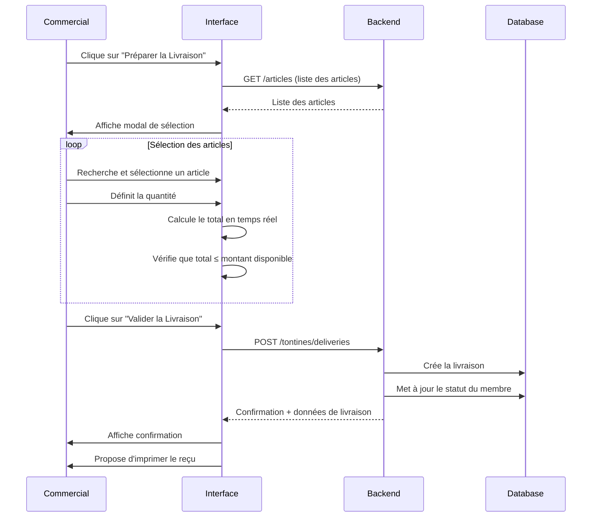

# Spécification : Gestion des Articles de Livraison de Fin d'Année - Tontine

## 1. Vue d'ensemble

### 1.1 Objectif
Permettre aux commerciaux de gérer la livraison des articles aux membres de la tontine en fin d'année (décembre), en sélectionnant des articles dont la valeur totale correspond au montant épargné par le client.

### 1.2 Contexte métier
- En décembre, les membres de la tontine reçoivent des articles équivalents au montant total qu'ils ont épargné durant l'année
- Le commercial doit pouvoir sélectionner les articles à livrer
- Le système doit empêcher de dépasser le montant disponible
- Une fois la livraison effectuée, le statut du membre passe à "DELIVERED"

---

## 2. Exigences fonctionnelles

### FR1 : Sélection des articles de livraison
**En tant que** commercial  
**Je veux** sélectionner les articles à livrer à un membre  
**Afin de** préparer la livraison de fin d'année

**Critères d'acceptation :**
- Le commercial peut accéder à l'interface de sélection depuis les détails du membre
- L'interface affiche le montant total disponible du membre
- Le commercial peut rechercher et sélectionner des articles
- Pour chaque article, le commercial peut spécifier une quantité
- Le système calcule en temps réel le total des articles sélectionnés
- Le système affiche le solde restant (montant disponible - total sélectionné)
- Le système empêche de valider si le total dépasse le montant disponible

### FR2 : Validation de la livraison
**En tant que** commercial  
**Je veux** valider la livraison des articles sélectionnés  
**Afin de** finaliser la transaction de fin d'année

**Critères d'acceptation :**
- Le commercial peut valider la livraison uniquement si le total ne dépasse pas le montant disponible
- Lors de la validation, le système crée un enregistrement de livraison
- Le statut du membre passe automatiquement à "DELIVERED"
- Le système génère un reçu de livraison imprimable
- La livraison est enregistrée avec la date, l'heure et le commercial

### FR3 : Consultation de l'historique de livraison
**En tant que** commercial ou gestionnaire  
**Je veux** consulter les détails d'une livraison effectuée  
**Afin de** vérifier les articles livrés

**Critères d'acceptation :**
- L'historique de livraison est visible dans les détails du membre
- Les informations affichées incluent : date, articles livrés (nom, quantité, prix unitaire), total, commercial
- Un badge "DELIVERED" est affiché sur le membre dans la liste

### FR4 : Modification avant validation
**En tant que** commercial  
**Je veux** pouvoir modifier ma sélection d'articles avant validation  
**Afin de** corriger des erreurs

**Critères d'acceptation :**
- Le commercial peut ajouter/retirer des articles
- Le commercial peut modifier les quantités
- Les calculs se mettent à jour en temps réel
- Aucune modification n'est possible après validation

### FR5 : Gestion du solde restant
**En tant que** système  
**Je dois** gérer le cas où le montant des articles ne correspond pas exactement au montant épargné  
**Afin de** permettre une flexibilité dans la sélection

**Critères d'acceptation :**
- Le système accepte une livraison même si le total est inférieur au montant disponible
- Le système affiche clairement le solde non utilisé
- Le système empêche de dépasser le montant disponible
- Le solde non utilisé est enregistré pour référence

---

## 3. Modèles de données

### 3.1 TontineDelivery (Nouvelle entité)

```typescript
interface TontineDelivery {
  readonly id: number;
  readonly tontineMember: TontineMember;
  readonly deliveryDate: string;
  readonly totalAmount: number;
  readonly remainingBalance: number;
  readonly commercialUsername: string;
  readonly items: readonly TontineDeliveryItem[];
  readonly createdBy?: string;
  readonly createdDate?: string;
}
```

### 3.2 TontineDeliveryItem (Nouvelle entité)

```typescript
interface TontineDeliveryItem {
  readonly id: number;
  readonly deliveryId: number;
  readonly articleId: number;
  readonly articleName: string;
  readonly articleCode?: string;
  readonly quantity: number;
  readonly unitPrice: number;
  readonly totalPrice: number;
}
```

### 3.3 Modification de TontineMember

```typescript
interface TontineMember {
  // ... champs existants
  readonly delivery?: TontineDelivery; // Ajout de la relation
}
```

---

## 4. API Backend (Nouveaux endpoints)

### 4.1 Créer une livraison

**Endpoint :** `POST /api/v1/tontines/deliveries`

**Request Body :**
```json
{
  "memberId": 1,
  "items": [
    {
      "articleId": 10,
      "quantity": 2
    },
    {
      "articleId": 15,
      "quantity": 1
    }
  ]
}
```

**Response (201 CREATED) :**
```json
{
  "status": "success",
  "statusCode": 201,
  "message": "Livraison créée avec succès",
  "service": "optimize-elykia-core",
  "data": {
    "id": 1,
    "tontineMember": { /* ... */ },
    "deliveryDate": "2025-12-15T10:30:00",
    "totalAmount": 150000,
    "remainingBalance": 10000,
    "commercialUsername": "commercial1",
    "items": [
      {
        "id": 1,
        "articleId": 10,
        "articleName": "Réfrigérateur",
        "quantity": 2,
        "unitPrice": 50000,
        "totalPrice": 100000
      },
      {
        "id": 2,
        "articleId": 15,
        "articleName": "Télévision",
        "quantity": 1,
        "unitPrice": 50000,
        "totalPrice": 50000
      }
    ]
  }
}
```

**Validations :**
- Le membre doit exister
- Le membre ne doit pas déjà avoir une livraison (statut PENDING uniquement)
- Le total des articles ne doit pas dépasser le montant total du membre
- Tous les articles doivent exister et être actifs

### 4.2 Consulter une livraison

**Endpoint :** `GET /api/v1/tontines/deliveries/{memberId}`

**Response (200 OK) :**
```json
{
  "status": "success",
  "statusCode": 200,
  "message": "Opération réussie",
  "service": "optimize-elykia-core",
  "data": {
    "id": 1,
    "deliveryDate": "2025-12-15T10:30:00",
    "totalAmount": 150000,
    "remainingBalance": 10000,
    "items": [ /* ... */ ]
  }
}
```

---

## 5. Interface utilisateur

### 5.1 Modal de sélection des articles

**Composant :** `DeliveryArticleSelectionModalComponent`

**Emplacement :** Accessible depuis les détails du membre (bouton "Préparer la Livraison")

**Sections :**

1. **En-tête**
   - Nom du client
   - Montant total disponible (en grand, en vert)
   - Solde restant (mis à jour en temps réel)

2. **Recherche d'articles**
   - Champ de recherche avec autocomplete
   - Affichage : Code, Nom, Prix unitaire

3. **Articles sélectionnés**
   - Tableau avec colonnes : Article, Prix unitaire, Quantité, Total, Actions
   - Contrôles de quantité (+/-)
   - Bouton de suppression
   - Total général en bas

4. **Actions**
   - Bouton "Annuler"
   - Bouton "Valider la Livraison" (désactivé si total > disponible)

**Wireframe :**
```
+----------------------------------------------------------+
| Préparer la Livraison - Jean Dupont                      |
+----------------------------------------------------------+
| Montant disponible: 160,000 XOF                          |
| Solde restant: 10,000 XOF                                |
+----------------------------------------------------------+
| Rechercher un article                                     |
| [_____________________________] [🔍]                      |
+----------------------------------------------------------+
| Articles sélectionnés                                     |
|----------------------------------------------------------|
| Article          | Prix U.  | Qté | Total    | Actions  |
|----------------------------------------------------------|
| Réfrigérateur    | 50,000   | [2] | 100,000  | [🗑️]    |
| Télévision       | 50,000   | [1] | 50,000   | [🗑️]    |
|----------------------------------------------------------|
|                              TOTAL: 150,000 XOF          |
+----------------------------------------------------------+
|                    [Annuler] [Valider la Livraison]      |
+----------------------------------------------------------+
```

### 5.2 Affichage de la livraison

**Emplacement :** Dans les détails du membre, section "Livraison de fin d'année"

**Contenu :**
- Date de livraison
- Commercial ayant effectué la livraison
- Liste des articles livrés
- Total livré
- Solde non utilisé (si applicable)
- Badge "LIVRÉ" en vert

---

## 6. Règles métier

### 6.1 Période de livraison
- Les livraisons ne peuvent être effectuées qu'en décembre
- Le système affiche un avertissement si on tente de livrer hors période

### 6.2 Contraintes de montant
- `Total articles ≤ Montant total du membre`
- Le solde restant est calculé : `Solde = Montant total - Total articles`
- Le solde restant est enregistré mais non récupérable

### 6.3 Statut du membre
- Avant livraison : `PENDING`
- Après livraison : `DELIVERED`
- Le changement de statut est automatique et irréversible

### 6.4 Articles disponibles
- Seuls les articles actifs peuvent être sélectionnés
- Les prix utilisés sont les prix de vente au moment de la sélection
- Les quantités doivent être des entiers positifs

---

## 7. Flux utilisateur

### 7.1 Flux principal : Préparer et valider une livraison



### 7.2 Flux alternatif : Montant dépassé

```
1. Commercial sélectionne des articles
2. Total > Montant disponible
3. Système affiche un message d'erreur en rouge
4. Bouton "Valider" est désactivé
5. Commercial doit retirer/modifier des articles
```

---

## 8. Validation et tests

### 8.1 Cas de test

| ID | Scénario | Données d'entrée | Résultat attendu |
|----|----------|------------------|------------------|
| T1 | Livraison normale | Articles pour 150k, disponible 160k | Succès, solde 10k |
| T2 | Livraison exacte | Articles pour 160k, disponible 160k | Succès, solde 0 |
| T3 | Dépassement | Articles pour 170k, disponible 160k | Erreur, validation bloquée |
| T4 | Membre déjà livré | Statut DELIVERED | Erreur, livraison impossible |
| T5 | Article inactif | Article désactivé | Erreur, article non sélectionnable |
| T6 | Quantité invalide | Quantité = 0 ou négative | Erreur, validation bloquée |

### 8.2 Validations frontend

```typescript
// Validation du total
validateTotal(selectedItems: DeliveryItem[], availableAmount: number): boolean {
  const total = selectedItems.reduce((sum, item) => sum + item.totalPrice, 0);
  return total <= availableAmount;
}

// Validation des quantités
validateQuantity(quantity: number): boolean {
  return quantity > 0 && Number.isInteger(quantity);
}

// Validation de la période
isDeliveryPeriod(): boolean {
  const currentMonth = new Date().getMonth();
  return currentMonth === 11; // Décembre (0-indexed)
}
```

---

## 9. Sécurité et permissions

### 9.1 Permissions requises
- `ROLE_EDIT_TONTINE` : Nécessaire pour créer une livraison
- `ROLE_TONTINE` : Suffisant pour consulter les livraisons

### 9.2 Règles de sécurité
- Un commercial ne peut créer une livraison que pour ses propres clients
- Les livraisons ne peuvent pas être modifiées après création
- Les livraisons ne peuvent pas être supprimées (audit trail)

---

## 10. Implémentation technique

### 10.1 Nouveaux fichiers à créer

```
tontine/
├── components/
│   └── modals/
│       └── delivery-article-selection-modal/
│           ├── delivery-article-selection-modal.component.ts
│           ├── delivery-article-selection-modal.component.html
│           └── delivery-article-selection-modal.component.scss
├── services/
│   └── tontine-delivery.service.ts (nouveau)
└── types/
    └── tontine.types.ts (mise à jour)
```

### 10.2 Modifications des fichiers existants

**member-details.component.ts**
- Ajouter un bouton "Préparer la Livraison" (visible si statut PENDING)
- Ajouter une section pour afficher la livraison (visible si statut DELIVERED)

**tontine.service.ts**
- Ajouter les méthodes pour gérer les livraisons

**tontine.types.ts**
- Ajouter les interfaces TontineDelivery et TontineDeliveryItem

### 10.3 Service de livraison

```typescript
@Injectable({
  providedIn: 'root'
})
export class TontineDeliveryService {
  private readonly apiUrl = `${environment.apiUrl}/api/v1/tontines/deliveries`;

  createDelivery(deliveryData: CreateDeliveryDto): Observable<ApiResponse<TontineDelivery>> {
    // Implémentation
  }

  getDeliveryByMemberId(memberId: number): Observable<ApiResponse<TontineDelivery>> {
    // Implémentation
  }

  validateDeliveryAmount(items: DeliveryItem[], availableAmount: number): boolean {
    // Implémentation
  }
}
```

---

## 11. Améliorations futures

1. **Impression de reçu** : Générer un PDF avec les détails de la livraison
2. **Signature électronique** : Permettre au client de signer sur tablette
3. **Photos de livraison** : Capturer des photos des articles livrés
4. **Livraison partielle** : Permettre plusieurs livraisons pour un même membre
5. **Gestion des retours** : Gérer les articles retournés/échangés
6. **Statistiques** : Analyser les articles les plus demandés

---

## 12. Dépendances

### 12.1 Backend
- Création des entités `TontineDelivery` et `TontineDeliveryItem`
- Création des endpoints API
- Mise à jour de la logique de changement de statut

### 12.2 Frontend
- Réutilisation du service de recherche d'articles existant
- Intégration avec le système d'impression (si disponible)

---

## 13. Planning estimé

| Phase | Durée estimée | Description |
|-------|---------------|-------------|
| Backend | 3-4 jours | Entités, repositories, services, controllers |
| Frontend | 4-5 jours | Composants, services, intégration |
| Tests | 2-3 jours | Tests unitaires et d'intégration |
| Documentation | 1 jour | Documentation technique et utilisateur |
| **TOTAL** | **10-13 jours** | |

---

## 14. Critères de succès

✅ Un commercial peut sélectionner des articles pour un membre  
✅ Le système empêche de dépasser le montant disponible  
✅ La livraison est enregistrée avec tous les détails  
✅ Le statut du membre est mis à jour automatiquement  
✅ L'historique de livraison est consultable  
✅ Aucune erreur de calcul de montant  
✅ L'interface est intuitive et responsive  
