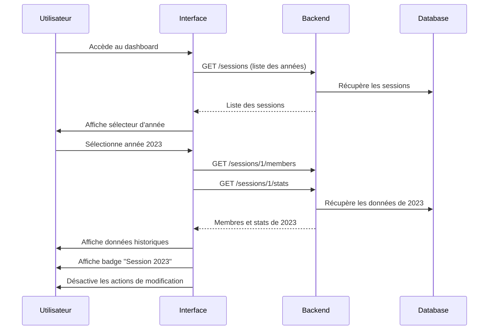

# Spécification : Consultation des Sessions Tontine Précédentes

## 1. Vue d'ensemble

### 1.1 Objectif
Permettre aux gestionnaires et commerciaux de consulter les données des sessions de tontine des années précédentes pour analyse, reporting et référence historique.

### 1.2 Contexte métier
- Chaque année, une nouvelle session de tontine est créée (janvier à novembre)
- Les données des années précédentes doivent être conservées et consultables
- Les utilisateurs doivent pouvoir comparer les performances entre années
- Les données historiques sont en lecture seule (aucune modification possible)

---

## 2. Exigences fonctionnelles

### FR1 : Sélection de la session
**En tant que** gestionnaire ou commercial  
**Je veux** sélectionner une année de session à consulter  
**Afin de** voir les données historiques de cette période

**Critères d'acceptation :**
- Un sélecteur d'année est disponible dans le dashboard
- La liste affiche toutes les années ayant eu une session
- L'année en cours est sélectionnée par défaut
- Le changement d'année recharge les données du dashboard

### FR2 : Consultation des membres historiques
**En tant que** utilisateur  
**Je veux** voir la liste des membres d'une session passée  
**Afin de** consulter leur historique de participation

**Critères d'acceptation :**
- La liste des membres s'adapte à l'année sélectionnée
- Les informations affichées incluent : client, total contribué, statut de livraison
- Les filtres et la recherche fonctionnent sur les données historiques
- Un badge "Session {année}" est visible pour indiquer qu'on consulte l'historique

### FR3 : Détails d'un membre historique
**En tant que** utilisateur  
**Je veux** consulter les détails complets d'un membre d'une session passée  
**Afin de** voir son historique de collectes et de livraison

**Critères d'acceptation :**
- Toutes les informations du membre sont visibles
- L'historique complet des collectes est affiché
- Les détails de la livraison (si effectuée) sont visibles
- Aucune action de modification n'est disponible (lecture seule)

### FR4 : KPIs par session
**En tant que** gestionnaire  
**Je veux** voir les KPIs d'une session spécifique  
**Afin de** analyser les performances de cette année

**Critères d'acceptation :**
- Les KPIs s'adaptent à la session sélectionnée
- Les métriques incluent : membres actifs, montant total collecté, taux de livraison, contribution moyenne
- Les KPIs sont calculés uniquement sur les données de la session sélectionnée

### FR5 : Comparaison entre sessions
**En tant que** gestionnaire  
**Je veux** comparer les performances entre différentes années  
**Afin de** identifier les tendances et améliorer le service

**Critères d'acceptation :**
- Une vue de comparaison est disponible
- L'utilisateur peut sélectionner 2 à 5 années à comparer
- Les métriques comparées incluent : nombre de membres, montant collecté, taux de livraison
- Les données sont présentées sous forme de tableau et graphiques

### FR6 : Export des données historiques
**En tant que** gestionnaire  
**Je veux** exporter les données d'une session  
**Afin de** créer des rapports ou archiver les informations

**Critères d'acceptation :**
- Un bouton "Exporter" est disponible
- Les formats disponibles : Excel (.xlsx), PDF
- L'export inclut : liste des membres, collectes, livraisons, statistiques
- Le nom du fichier inclut l'année de la session

---

## 3. Modèles de données

### 3.1 Pas de modification nécessaire
Les modèles existants supportent déjà les sessions multiples via la relation `TontineMember.tontineSession`.

### 3.2 Ajout d'un filtre de session

```typescript
interface TontineFilters {
  year?: number;              // Nouveau : filtre par année
  sessionId?: number;         // Nouveau : filtre par ID de session
  commercial?: string;
  deliveryStatus?: DeliveryStatus;
  searchTerm?: string;
}
```

### 3.3 Statistiques comparatives

```typescript
interface SessionComparison {
  readonly sessions: readonly SessionStats[];
  readonly comparisonMetrics: ComparisonMetrics;
}

interface SessionStats {
  readonly year: number;
  readonly totalMembers: number;
  readonly totalCollected: number;
  readonly averageContribution: number;
  readonly deliveryRate: number;
  readonly topCommercial: string;
}

interface ComparisonMetrics {
  readonly memberGrowth: number;        // % de croissance
  readonly collectionGrowth: number;    // % de croissance
  readonly bestYear: number;            // Année avec le meilleur résultat
  readonly worstYear: number;           // Année avec le moins bon résultat
}
```

---

## 4. API Backend (Nouveaux endpoints)

### 4.1 Lister toutes les sessions

**Endpoint :** `GET /api/v1/tontines/sessions`

**Response (200 OK) :**
```json
{
  "status": "success",
  "statusCode": 200,
  "message": "Opération réussie",
  "service": "optimize-elykia-core",
  "data": [
    {
      "id": 1,
      "year": 2023,
      "startDate": "2023-01-15",
      "endDate": "2023-11-30",
      "status": "CLOSED",
      "memberCount": 150,
      "totalCollected": 25000000
    },
    {
      "id": 2,
      "year": 2024,
      "startDate": "2024-01-15",
      "endDate": "2024-11-30",
      "status": "CLOSED",
      "memberCount": 180,
      "totalCollected": 32000000
    },
    {
      "id": 3,
      "year": 2025,
      "startDate": "2025-01-15",
      "endDate": "2025-11-30",
      "status": "ACTIVE",
      "memberCount": 200,
      "totalCollected": 15000000
    }
  ]
}
```

### 4.2 Obtenir les membres d'une session spécifique

**Endpoint :** `GET /api/v1/tontines/sessions/{sessionId}/members`

**Query Parameters :**
- `page` : Numéro de page (défaut: 0)
- `size` : Taille de page (défaut: 20)
- `sort` : Champ de tri (défaut: id,desc)

**Response (200 OK) :**
```json
{
  "status": "success",
  "statusCode": 200,
  "message": "Opération réussie",
  "service": "optimize-elykia-core",
  "data": {
    "content": [ /* Liste des membres */ ],
    "totalElements": 150,
    "totalPages": 8,
    "size": 20,
    "number": 0
  }
}
```

### 4.3 Obtenir les statistiques d'une session

**Endpoint :** `GET /api/v1/tontines/sessions/{sessionId}/stats`

**Response (200 OK) :**
```json
{
  "status": "success",
  "statusCode": 200,
  "message": "Opération réussie",
  "service": "optimize-elykia-core",
  "data": {
    "sessionId": 1,
    "year": 2023,
    "totalMembers": 150,
    "totalCollected": 25000000,
    "averageContribution": 166667,
    "deliveredCount": 145,
    "pendingCount": 5,
    "deliveryRate": 96.67,
    "topCommercials": [
      {
        "username": "commercial1",
        "memberCount": 45,
        "totalCollected": 8000000
      }
    ]
  }
}
```

### 4.4 Comparer plusieurs sessions

**Endpoint :** `POST /api/v1/tontines/sessions/compare`

**Request Body :**
```json
{
  "years": [2023, 2024, 2025]
}
```

**Response (200 OK) :**
```json
{
  "status": "success",
  "statusCode": 200,
  "message": "Opération réussie",
  "service": "optimize-elykia-core",
  "data": {
    "sessions": [
      {
        "year": 2023,
        "totalMembers": 150,
        "totalCollected": 25000000,
        "averageContribution": 166667,
        "deliveryRate": 96.67
      },
      {
        "year": 2024,
        "totalMembers": 180,
        "totalCollected": 32000000,
        "averageContribution": 177778,
        "deliveryRate": 98.33
      },
      {
        "year": 2025,
        "totalMembers": 200,
        "totalCollected": 15000000,
        "averageContribution": 75000,
        "deliveryRate": 0
      }
    ],
    "comparisonMetrics": {
      "memberGrowth": 33.33,
      "collectionGrowth": 28.0,
      "bestYear": 2024,
      "worstYear": 2023
    }
  }
}
```

### 4.5 Exporter les données d'une session

**Endpoint :** `GET /api/v1/tontines/sessions/{sessionId}/export`

**Query Parameters :**
- `format` : Format d'export (excel, pdf)

**Response (200 OK) :**
- Content-Type: `application/vnd.openxmlformats-officedocument.spreadsheetml.sheet` (Excel)
- Content-Type: `application/pdf` (PDF)
- Content-Disposition: `attachment; filename="tontine_2023.xlsx"`

---

## 5. Interface utilisateur

### 5.1 Sélecteur de session dans le dashboard

**Emplacement :** En haut du dashboard, à côté du titre

**Design :**
```
+----------------------------------------------------------+
| [📅 Année: 2025 ▼]  Gestion des Tontines                |
|                                                           |
| [Badge: Session en cours] ou [Badge: Session 2023]       |
+----------------------------------------------------------+
```

**Comportement :**
- Dropdown avec liste des années disponibles
- Badge coloré indiquant si c'est la session en cours (vert) ou historique (gris)
- Changement d'année recharge automatiquement les données

### 5.2 Indicateur de mode consultation

**Emplacement :** Barre d'information en haut du dashboard

**Design :**
```
+----------------------------------------------------------+
| ℹ️ Vous consultez la session 2023 (lecture seule)       |
|    [Retourner à la session en cours]                     |
+----------------------------------------------------------+
```

**Comportement :**
- Visible uniquement en mode consultation historique
- Lien pour revenir rapidement à la session en cours
- Couleur de fond différente pour distinguer visuellement

### 5.3 Actions désactivées en mode historique

**Modifications :**
- Bouton "Ajouter un Membre" : Désactivé avec tooltip "Non disponible pour les sessions passées"
- Bouton "Enregistrer une Collecte" : Masqué
- Bouton "Marquer comme Livré" : Masqué
- Bouton "Paramètres de Session" : Désactivé

### 5.4 Page de comparaison de sessions

**Route :** `/tontine/compare`

**Composant :** `SessionComparisonComponent`

**Sections :**

1. **Sélection des années**
   - Checkboxes pour sélectionner 2 à 5 années
   - Bouton "Comparer"

2. **Tableau comparatif**
   - Colonnes : Métrique, Année 1, Année 2, Année 3, ...
   - Lignes : Membres, Montant collecté, Contribution moyenne, Taux de livraison
   - Indicateurs visuels (flèches ↑↓) pour les variations

3. **Graphiques**
   - Graphique en barres : Évolution du nombre de membres
   - Graphique en courbes : Évolution du montant collecté
   - Graphique circulaire : Répartition par commercial (année sélectionnée)

**Wireframe :**
```
+----------------------------------------------------------+
| Comparaison des Sessions Tontine                          |
+----------------------------------------------------------+
| Sélectionner les années à comparer:                       |
| [✓] 2023  [✓] 2024  [✓] 2025  [ ] 2022                  |
|                                          [Comparer]       |
+----------------------------------------------------------+
| Tableau Comparatif                                        |
|----------------------------------------------------------|
| Métrique              | 2023    | 2024    | 2025        |
|----------------------------------------------------------|
| Membres actifs        | 150     | 180 ↑   | 200 ↑       |
| Montant collecté      | 25M     | 32M ↑   | 15M ↓       |
| Contribution moyenne  | 167K    | 178K ↑  | 75K ↓       |
| Taux de livraison     | 96.7%   | 98.3% ↑ | 0% ↓        |
+----------------------------------------------------------+
| [Graphique: Évolution des membres]                        |
| [Graphique: Évolution du montant collecté]                |
+----------------------------------------------------------+
```

### 5.5 Export de données

**Emplacement :** Bouton dans le dashboard (visible en mode historique)

**Design :**
```
[📥 Exporter] ▼
  ├─ Excel (.xlsx)
  └─ PDF
```

**Contenu de l'export :**

**Excel :**
- Feuille 1 : Statistiques générales
- Feuille 2 : Liste des membres
- Feuille 3 : Détail des collectes
- Feuille 4 : Détail des livraisons

**PDF :**
- Page 1 : Rapport de synthèse avec KPIs
- Pages suivantes : Liste détaillée des membres

---

## 6. Règles métier

### 6.1 Accès aux données historiques
- Tous les utilisateurs avec `ROLE_TONTINE` peuvent consulter l'historique
- Les commerciaux ne voient que leurs propres clients (même en historique)
- Les gestionnaires voient tous les clients

### 6.2 Modification des données historiques
- **Aucune modification n'est autorisée** sur les sessions passées
- Les sessions avec statut `CLOSED` sont en lecture seule
- Seule la session avec statut `ACTIVE` peut être modifiée

### 6.3 Clôture de session
- Une session est automatiquement clôturée le 31 décembre
- Une fois clôturée, le statut passe de `ACTIVE` à `CLOSED`
- La nouvelle session de l'année suivante est créée automatiquement le 1er janvier

### 6.4 Conservation des données
- Les données sont conservées indéfiniment (pas de suppression automatique)
- Un archivage peut être effectué après 5 ans (hors scope de cette spec)

---

## 7. Flux utilisateur

### 7.1 Flux principal : Consulter une session passée



### 7.2 Flux : Comparer plusieurs sessions

```
1. Utilisateur clique sur "Comparer les sessions"
2. Système affiche la page de comparaison
3. Utilisateur sélectionne 2-5 années
4. Utilisateur clique sur "Comparer"
5. Système charge les données de toutes les années
6. Système calcule les métriques comparatives
7. Système affiche le tableau et les graphiques
8. Utilisateur peut exporter la comparaison
```

---

## 8. Implémentation technique

### 8.1 Nouveaux fichiers à créer

```
tontine/
├── components/
│   ├── session-selector/
│   │   ├── session-selector.component.ts
│   │   ├── session-selector.component.html
│   │   └── session-selector.component.scss
│   └── session-comparison-chart/
│       ├── session-comparison-chart.component.ts
│       ├── session-comparison-chart.component.html
│       └── session-comparison-chart.component.scss
├── pages/
│   └── session-comparison/
│       ├── session-comparison.component.ts
│       ├── session-comparison.component.html
│       └── session-comparison.component.scss
└── services/
    └── tontine-session.service.ts (nouveau)
```

### 8.2 Modifications des fichiers existants

**tontine-dashboard.component.ts**
- Ajouter le sélecteur de session
- Gérer le changement de session
- Désactiver les actions en mode historique
- Afficher le badge de session

**tontine.service.ts**
- Ajouter un paramètre `sessionId` aux méthodes existantes
- Gérer le filtrage par session

**tontine.types.ts**
- Ajouter les interfaces pour la comparaison
- Ajouter les types pour les statistiques de session

### 8.3 Service de session

```typescript
@Injectable({
  providedIn: 'root'
})
export class TontineSessionService {
  private readonly apiUrl = `${environment.apiUrl}/api/v1/tontines/sessions`;
  
  private currentSessionSubject = new BehaviorSubject<TontineSession | null>(null);
  public currentSession$ = this.currentSessionSubject.asObservable();

  getAllSessions(): Observable<ApiResponse<TontineSession[]>> {
    // Récupère toutes les sessions
  }

  getSessionById(sessionId: number): Observable<ApiResponse<TontineSession>> {
    // Récupère une session spécifique
  }

  getSessionStats(sessionId: number): Observable<ApiResponse<SessionStats>> {
    // Récupère les statistiques d'une session
  }

  compareSessions(years: number[]): Observable<ApiResponse<SessionComparison>> {
    // Compare plusieurs sessions
  }

  exportSession(sessionId: number, format: 'excel' | 'pdf'): Observable<Blob> {
    // Exporte les données d'une session
  }

  setCurrentSession(session: TontineSession): void {
    this.currentSessionSubject.next(session);
  }

  isCurrentSession(session: TontineSession): boolean {
    return session.status === 'ACTIVE';
  }
}
```

### 8.4 Composant sélecteur de session

```typescript
@Component({
  selector: 'app-session-selector',
  templateUrl: './session-selector.component.html',
  styleUrls: ['./session-selector.component.scss']
})
export class SessionSelectorComponent implements OnInit {
  @Output() sessionChange = new EventEmitter<TontineSession>();
  
  sessions: TontineSession[] = [];
  selectedSession: TontineSession | null = null;

  ngOnInit(): void {
    this.loadSessions();
  }

  private loadSessions(): void {
    this.sessionService.getAllSessions().subscribe({
      next: (response) => {
        if (response.data) {
          this.sessions = response.data;
          // Sélectionner la session active par défaut
          this.selectedSession = this.sessions.find(s => s.status === 'ACTIVE') || null;
          if (this.selectedSession) {
            this.sessionChange.emit(this.selectedSession);
          }
        }
      }
    });
  }

  onSessionChange(session: TontineSession): void {
    this.selectedSession = session;
    this.sessionChange.emit(session);
  }

  isCurrentSession(): boolean {
    return this.selectedSession?.status === 'ACTIVE';
  }
}
```

---

## 9. Validation et tests

### 9.1 Cas de test

| ID | Scénario | Données d'entrée | Résultat attendu |
|----|----------|------------------|------------------|
| T1 | Charger sessions | - | Liste de toutes les sessions |
| T2 | Sélectionner session passée | Année 2023 | Données de 2023 affichées |
| T3 | Actions désactivées | Session 2023 | Boutons de modification désactivés |
| T4 | Retour session courante | Clic sur lien | Session 2025 affichée |
| T5 | Comparer 3 sessions | 2023, 2024, 2025 | Tableau et graphiques affichés |
| T6 | Export Excel | Session 2023, format Excel | Fichier téléchargé |
| T7 | Filtres en historique | Recherche "Dupont" | Résultats filtrés de 2023 |

### 9.2 Tests de performance

- Chargement des sessions : < 500ms
- Changement de session : < 1s
- Comparaison de 5 sessions : < 2s
- Export Excel : < 3s

---

## 10. Sécurité et permissions

### 10.1 Permissions
- `ROLE_TONTINE` : Consultation de toutes les sessions
- `ROLE_EDIT_TONTINE` : Aucun privilège supplémentaire pour l'historique
- `ROLE_REPORT` : Accès à la comparaison et l'export

### 10.2 Règles de visibilité
- Commercial : Voit uniquement ses clients (toutes années)
- Gestionnaire : Voit tous les clients (toutes années)

---

## 11. Dépendances

### 11.1 Backend
- Ajout d'un champ `status` sur `TontineSession` (si pas déjà présent)
- Création des endpoints de statistiques et comparaison
- Implémentation de la logique d'export

### 11.2 Frontend
- Bibliothèque de graphiques : ng-apexcharts (déjà utilisée)
- Bibliothèque d'export Excel : xlsx ou exceljs
- Bibliothèque d'export PDF : jspdf ou pdfmake

---

## 12. Planning estimé

| Phase | Durée estimée | Description |
|-------|---------------|-------------|
| Backend | 4-5 jours | Endpoints, statistiques, export |
| Frontend - Base | 3-4 jours | Sélecteur, mode lecture seule |
| Frontend - Comparaison | 3-4 jours | Page de comparaison, graphiques |
| Frontend - Export | 2 jours | Implémentation de l'export |
| Tests | 2-3 jours | Tests unitaires et d'intégration |
| Documentation | 1 jour | Documentation technique |
| **TOTAL** | **15-19 jours** | |

---

## 13. Critères de succès

✅ L'utilisateur peut sélectionner n'importe quelle année de session  
✅ Les données historiques sont affichées correctement  
✅ Aucune modification n'est possible sur les sessions passées  
✅ Les KPIs sont calculés correctement pour chaque session  
✅ La comparaison entre sessions fonctionne  
✅ L'export génère des fichiers corrects  
✅ Les performances sont acceptables  
✅ L'interface est intuitive et claire  

---

## 14. Améliorations futures

1. **Archivage automatique** : Archiver les sessions de plus de 5 ans
2. **Graphiques avancés** : Tendances sur plusieurs années
3. **Prédictions** : Prédire les performances de l'année suivante
4. **Notifications** : Alerter avant la clôture de session
5. **Audit trail** : Tracer toutes les consultations de données historiques
6. **Export personnalisé** : Permettre de choisir les colonnes à exporter
