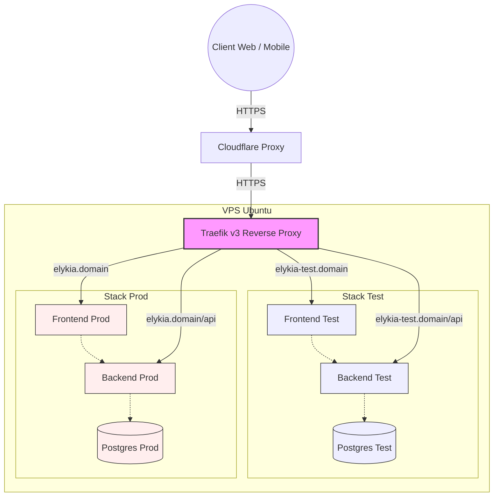

README déploiement — ELYKIA
=================================

Ce dossier contient les scripts et les fichiers docker-compose pour déployer l'infrastructure ELYKIA (frontend, backend, base de données) sur un serveur Ubuntu, en utilisant **Traefik** comme reverse proxy.

## Architecture de Déploiement

L'architecture repose sur un reverse proxy Traefik unique qui gère le routage et les certificats SSL Let's Encrypt pour deux environnements totalement isolés (`test` et `prod`).



## Structure du dossier
- `docker-compose.traefik.yml` - Compose pour le reverse proxy Traefik (à lancer une seule fois).
- `docker-compose.test.yml` - Compose pour l'environnement de test.
- `docker-compose.prod.yml` - Compose pour l'environnement de production.
- `setup-server.sh` - Script de configuration initiale du serveur (création des dossiers, réseau Docker, templates `.env`).
- `deploy.sh` - Script pour déployer une paire d'images (frontend/backend) et enregistrer la release.
- `rollback.sh` - Script pour revenir à une release précédente.
- `import-db.sh` - Script pour importer un dump SQL dans le container Postgres.
- `INSTRUCTION_SETUP.md` - Guide détaillé pour l'installation initiale du serveur.
- `INSTRUCTION_BOOTSTRAP.md` - Guide pour la création de l'utilisateur de déploiement et configuration CI/CD.

## Processus de déploiement

### 1. Installation Initiale (Une seule fois)
Avant le premier déploiement, vous devez préparer le serveur. Consultez le fichier **`INSTRUCTION_SETUP.md`** pour les étapes détaillées (mise à jour Docker, exécution de `setup-server.sh`, configuration des mots de passe).

### 2. Déploiement d'une version
Une fois le serveur configuré, le déploiement se fait via le script `deploy.sh` :

```bash
# Déployer l'environnement de test
./deploy.sh test ghcr.io/OWNER/ELYKIA-frontend:TAG ghcr.io/OWNER/ELYKIA-backend:TAG

# Déployer l'environnement de production
./deploy.sh prod ghcr.io/OWNER/ELYKIA-frontend:TAG ghcr.io/OWNER/ELYKIA-backend:TAG
```

### 3. Rollback (en cas de problème)
```bash
# revenir au dernier déploiement précédent
./rollback.sh prod --last

# revenir à une release spécifique
./rollback.sh prod /opt/elykia/prod/releases/prod_20260427T120000Z.txt
```

## Importer un dump de la base de données
1) Copier le dump depuis votre machine locale vers le serveur :
```bash
scp /local/path/dump.sql.gz user@server:/tmp/dump.sql.gz
```

2) Se connecter au serveur et lancer l'import :
```bash
ssh user@server
./deploy/import-db.sh prod /tmp/dump.sql.gz
```
*Note : Le script `import-db.sh` effectue automatiquement une sauvegarde de la base existante avant l'importation.*

## Backups automatiques de la base
Un script `db_backup.sh` est fourni pour effectuer des sauvegardes de la base Postgres. Il est recommandé de planifier son exécution via `cron` sur le serveur hôte :

```cron
0 8,19 * * 1-6 cd /opt/elykia/deploy && /opt/elykia/deploy/db_backup.sh prod >> /var/log/elykia_db_backup.log 2>&1
```

## CI / GitHub Actions — secrets nécessaires
Pour l'intégration continue, configurez ces secrets dans GitHub :

**Secrets globaux :**
- `SSH_PRIVATE_KEY` : clé privée SSH pour se connecter au serveur.
- `SSH_KNOWN_HOSTS` : contenu de `ssh-keyscan your.server.com`.
- `GHCR_USERNAME` et `GHCR_TOKEN` : pour l'accès au registre d'images.

**Secrets d'environnement (Environments : `test` et `prod`) :**
- `SERVER_USER` : utilisateur SSH (ex: root ou deploy).
- `SERVER_HOST` : IP ou domaine du serveur.
- `DEPLOY_PATH` : chemin racine de déploiement (ex: `/opt/elykia`).
