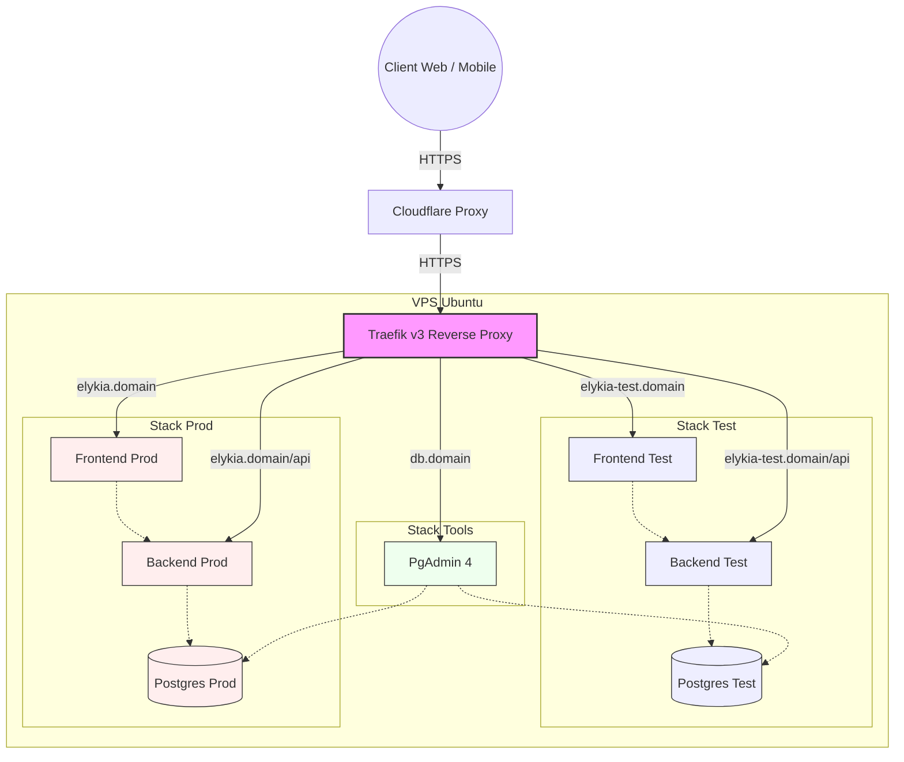

README déploiement — ELYKIA
=================================

Ce dossier contient les scripts et les fichiers docker-compose pour déployer l'infrastructure ELYKIA (frontend, backend, base de données) sur un serveur Ubuntu, en utilisant **Traefik** comme reverse proxy.

## Architecture de Déploiement

L'architecture repose sur un reverse proxy Traefik unique qui gère le routage et les certificats SSL Let's Encrypt pour deux environnements totalement isolés (`test` et `prod`).


```mermaid
graph TD
    Client((Client Web / Mobile)) -->|HTTPS| CF[Cloudflare Proxy]
    CF -->|HTTPS| Traefik[Traefik v3 Reverse Proxy]
    
    subgraph VPS Ubuntu
        Traefik
        
        subgraph Stack Test
            FE_Test[Frontend Test]
            BE_Test[Backend Test]
            DB_Test[(Postgres Test)]
            FE_Test -.-> BE_Test
            BE_Test -.-> DB_Test
        end
        
        subgraph Stack Prod
            FE_Prod[Frontend Prod]
            BE_Prod[Backend Prod]
            DB_Prod[(Postgres Prod)]
            FE_Prod -.-> BE_Prod
            BE_Prod -.-> DB_Prod
        end

        subgraph Stack Tools
            PgAdmin[PgAdmin 4]
        end
    end
    
    Traefik -->|elykia-test.domain| FE_Test
    Traefik -->|elykia-test.domain/api| BE_Test
    
    Traefik -->|elykia.domain| FE_Prod
    Traefik -->|elykia.domain/api| BE_Prod

    Traefik -->|db.domain| PgAdmin
    PgAdmin -.-> DB_Test
    PgAdmin -.-> DB_Prod
    
    classDef proxy fill:#f9f,stroke:#333,stroke-width:2px;
    classDef test fill:#eef,stroke:#333,stroke-width:1px;
    classDef prod fill:#fee,stroke:#333,stroke-width:1px;
    classDef tools fill:#efe,stroke:#333,stroke-width:1px;
    
    class Traefik proxy;
    class FE_Test,BE_Test,DB_Test test;
    class FE_Prod,BE_Prod,DB_Prod prod;
    class PgAdmin tools;
```

## Structure du dossier
- `docker-compose.traefik.yml` - Compose pour le reverse proxy Traefik (à lancer une seule fois).
- `docker-compose.test.yml` - Compose pour l'environnement de test.
- `docker-compose.prod.yml` - Compose pour l'environnement de production.
- `docker-compose.tools.yml` - Compose pour les outils (PgAdmin 4).
- `setup-server.sh` - Script de configuration initiale du serveur (création des dossiers, réseau Docker, templates `.env`).
- `deploy.sh` - Script pour déployer une paire d'images (frontend/backend) et enregistrer la release.
- `rollback.sh` - Script pour revenir à une release précédente.
- `import-db.sh` - Script pour importer un dump SQL dans le container Postgres.
- `INSTRUCTION_SETUP.md` - Guide détaillé pour l'installation initiale du serveur.
- `INSTRUCTION_BOOTSTRAP.md` - Guide pour la création de l'utilisateur de déploiement et configuration CI/CD.

## Processus de déploiement

### 1. Installation Initiale (Une seule fois)
Avant le premier déploiement, vous devez préparer le serveur. Consultez le fichier **`INSTRUCTION_SETUP.md`** pour les étapes détaillées (mise à jour Docker, exécution de `setup-server.sh`, configuration des mots de passe).

### 2. Déploiement d'une version
Une fois le serveur configuré, le déploiement se fait via le script `deploy.sh` :

```bash
# Déployer l'environnement de test
./deploy.sh test ghcr.io/OWNER/ELYKIA-frontend:TAG ghcr.io/OWNER/ELYKIA-backend:TAG

# Déployer l'environnement de production
./deploy.sh prod ghcr.io/OWNER/ELYKIA-frontend:TAG ghcr.io/OWNER/ELYKIA-backend:TAG
```

### 3. Rollback (en cas de problème)
```bash
# revenir au dernier déploiement précédent
./rollback.sh prod --last

# revenir à une release spécifique
./rollback.sh prod /opt/elykia/prod/releases/prod_20260427T120000Z.txt
```

## Importer un dump de la base de données
1) Copier le dump depuis votre machine locale vers le serveur :
```bash
scp /local/path/dump.sql.gz user@server:/tmp/dump.sql.gz
```

2) Se connecter au serveur et lancer l'import :
```bash
ssh user@server
# Usage: ./deploy/import-db.sh <env> <dump-path-on-server> [target-container]
# Examples:
# - restore using compose detection (preferred):
./deploy/import-db.sh test /tmp/dump.sql.gz
# - force a specific container (useful when multiple stacks exist):
./deploy/import-db.sh test /tmp/dump.sql.gz deploy-db-1
```

Le script `import-db.sh` :
- tente d'abord d'identifier le container cible via `docker compose -f docker-compose.<env>.yml` (service `db`)
- si aucune détection n'est possible, une logique heuristique essaie de choisir un container PostgreSQL approprié
- avant d'exécuter la restauration, le script crée automatiquement une sauvegarde de la base actuelle (via `db_backup.sh`)
- par défaut le script vous demandera une confirmation interactive avant de lancer la sauvegarde et la restauration ;
  pour lancer en mode non interactif (p.ex. dans un job automatisé), utilisez `NONINTERACTIVE=1`.

## Backups automatiques de la base
Un script `db_backup.sh` est fourni pour effectuer des sauvegardes de la base Postgres. Il est recommandé de planifier son exécution via `cron` sur le serveur hôte :

```cron
0 8,19 * * 1-6 cd /opt/elykia/deploy && /opt/elykia/deploy/db_backup.sh prod >> /var/log/elykia_db_backup.log 2>&1
```

## Monitoring et Alerting

Un stack de monitoring complet (Prometheus + Grafana + Loki + Node Exporter) est disponible dans `monitoring/`.

### Composition
| Service | Description | Accès |
|---|---|---|
| **Prometheus** | Collecte des métriques Spring Boot via `/actuator/prometheus` + métriques système | `prometheus.amenouveve-yaveh.com` (auth basique) |
| **Loki** | Base de données de logs centralisés (requêtable via Grafana) | Réseau interne uniquement |
| **Promtail** | Agent de collecte des logs Docker envoyant vers Loki | Réseau interne uniquement |
| **Grafana** | Dashboards métier, exploration des logs Loki + alerting | `grafana.amenouveve-yaveh.com` |
| **Node Exporter** | Métriques système (CPU, RAM, disque) | Réseau interne uniquement |

### Démarrage
```bash
# Démarrer le stack monitoring
docker compose -f docker-compose.monitoring.yml --project-name elykia-monitoring up -d

# Arrêter
docker compose -f docker-compose.monitoring.yml --project-name elykia-monitoring down
```

### Alertes configurées (Grafana-managed)
Les règles d'alerting sont provisionnées automatiquement dans `monitoring/grafana/alerting/alertrules.yml`.

**Critiques (P1) :**
- Échec création de crédit (`elykia_credit_creation_failed_total`)
- Stock insuffisant pour démarrer/distribuer un crédit
- Livraison de stock impossible (aucun article disponible)
- Conflit de prix bloquant une demande de stock
- Retour de stock excédentaire

**Warning (P2) :**
- Changements de commercial fréquents (>5/h)
- Erreurs d'agrégation BI
- Livraisons partielles de stock
- Stock insuffisant pour rattrapage
- Livraison tontine > contribution disponible

**Info (P3) :**
- Articles en rupture / stock faible
- Inventaire bloqué (écarts non réconciliés)
- Demandes de stock auto-annulées

### Backend : métriques custom
Les métriques sont exposées via `io.micrometer:micrometer-registry-prometheus` :
- Package : `com.optimize.elykia.core.monitoring.BusinessMetricsPublisher`
- Endpoint : `GET /actuator/prometheus` (interne, réseau Docker `elykia-prod-internal`)

### Variables d'environnement requises
| Variable | Description |
|---|---|
| `GRAFANA_ADMIN_USER` | Admin Grafana (défaut: `admin`) |
| `GRAFANA_ADMIN_PASSWORD` | Mot de passe admin Grafana (défaut: `admin`) |
| `ALERT_EMAIL_TO` | Destinataire alertes email |
| `SLACK_WEBHOOK_URL` | Webhook Slack pour notifications |
| `ALERT_WEBHOOK_URL` | Webhook HTTP personnalisé |

## Outils — PgAdmin 4

Un stack d'outils (`docker-compose.tools.yml`) met à disposition **PgAdmin 4** pour administrer les bases PostgreSQL via une interface web.

### Accès
| Service | URL | Identifiants |
|---|---|---|
| **PgAdmin 4** | `https://db.amenouveve-yaveh.com` | Définis dans `/opt/elykia/tools/.env` (`PGADMIN_DEFAULT_EMAIL` / `PGADMIN_DEFAULT_PASSWORD`) |

### Démarrage
```bash
# Démarrer la stack tools
docker compose -f docker-compose.tools.yml --project-name elykia-tools --env-file /opt/elykia/tools/.env up -d

# Arrêter
docker compose -f docker-compose.tools.yml --project-name elykia-tools --env-file /opt/elykia/tools/.env down
```

### Connexion aux bases de données
Une fois connecté à PgAdmin via le navigateur, ajoutez les serveurs avec ces paramètres :

| Environnement | Hôte | Port | Base | Utilisateur |
|---|---|---|---|---|
| **Test** | `elykia-test-db-1` | `5432` | `elykia_test_db` | `elykia_test` |
| **Prod** | `elykia-prod-db-1` | `5432` | `elykia_prod_db` | `elykia_prod` |

> Les mots de passe sont ceux définis dans `/opt/elykia/test/.env` et `/opt/elykia/prod/.env`.

### Configuration DNS requise
Ajoutez un enregistrement **A** dans Cloudflare :
- `db` → IP du serveur (Proxy activé - nuage orange)

---

## CI / GitHub Actions — secrets nécessaires
Pour l'intégration continue, configurez ces secrets dans GitHub :

**Secrets globaux :**
- `SSH_PRIVATE_KEY` : clé privée SSH pour se connecter au serveur.
- `SSH_KNOWN_HOSTS` : contenu de `ssh-keyscan your.server.com`.
- `GHCR_USERNAME` et `GHCR_TOKEN` : pour l'accès au registre d'images.

**Secrets d'environnement (Environments : `test` et `prod`) :**
- `SERVER_USER` : utilisateur SSH (ex: root ou deploy).
- `SERVER_HOST` : IP ou domaine du serveur.
- `DEPLOY_PATH` : chemin racine de déploiement (ex: `/opt/elykia`).