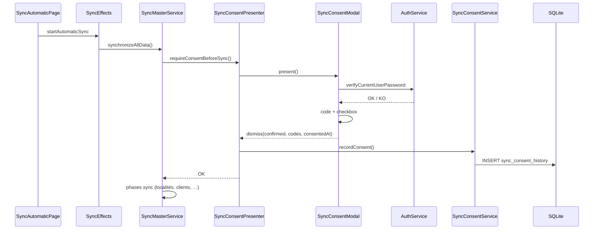

# Consentement explicite avant synchronisation (application mobile)

Documentation fonctionnelle et technique du flux de confirmation obligatoire avant chaque **session de synchronisation complète** : vérification du mot de passe, recopie d’un code, case de responsabilité, historique local.

**Dernière mise à jour :** mai 2026  
**Périmètre :** `mobile/` (Ionic / Angular / SQLite / NgRx)

---

## 1. Contexte métier

Les commerciaux peuvent lancer une synchronisation depuis l’application mobile, puis supposer que **l’application a déjà synchronisé à leur place** sans action volontaire de leur part.

Pour clarifier la responsabilité et tracer chaque démarrage de session complète, l’application impose désormais un **consentement explicite** avant d’exécuter `SyncMasterService.synchronizeAllData()` :

| Exigence | Implémentation |
|----------|----------------|
| Prouver l’identité | Saisie du **mot de passe** de connexion (vérifié contre le hash local) |
| Prouver l’attention | Recopie d’un **code aléatoire** affiché à l’écran |
| Assumer la responsabilité | **Message de consentement** + case à cocher obligatoire |
| Traçabilité | Enregistrement en SQLite avec date/heure, codes et version du message |

**Hors périmètre actuel :** la synchronisation **manuelle** par entité (`startManualSync`, `syncSingleEntity`) ne passe pas par ce flux — seule la synchronisation **automatique complète** orchestrée par `SyncMasterService` est concernée.

---

## 2. Parcours utilisateur

### 2.1 Déclenchement

1. L’utilisateur ouvre l’écran **Synchronisation automatique** (`sync-automatic.page.ts`).
2. Il appuie sur **Synchroniser** → dispatch NgRx `startAutomaticSync`.
3. L’effet `SyncEffects.performAutomaticSync()` appelle `syncMasterService.synchronizeAllData()`.
4. **Avant toute phase de sync**, le service affiche la modale de consentement.

L’ancienne alerte Ionic « Voulez-vous démarrer la synchronisation ? » a été retirée : la modale de consentement la remplace.

### 2.2 Modale — étape 1 : mot de passe

- Titre : **Confirmation de synchronisation**
- Champ mot de passe (masqué / visible)
- Boutons : **Annuler** | **Continuer**
- Vérification : `AuthService.verifyCurrentUserPassword()` (comparaison avec `passwordHash` stocké localement, même algorithme qu’à la connexion)

En cas d’échec : toast « Mot de passe incorrect », l’utilisateur reste sur l’étape 1.

### 2.3 Modale — étape 2 : code + consentement

- Un **code à 6 caractères** est généré et affiché (alphabet sans caractères ambigus : pas de `0`/`O`, `1`/`I`).
- L’utilisateur doit **recopier** ce code (comparaison insensible à la casse, espaces ignorés).
- Il doit cocher la case de consentement.
- Boutons : **Annuler** | **Lancer la synchronisation**

En cas d’annulation, de code incorrect ou de case non cochée : la synchronisation **ne démarre pas**.

### 2.4 Message affiché (version `v1`)

**Texte principal :**

> Je confirme lancer volontairement une session de synchronisation complète. Je comprends que mes données locales (clients, distributions, recouvrements, commandes, tontine, etc.) seront transmises au serveur et que cette opération engage ma responsabilité. Je reconnais que la synchronisation ne se fait pas automatiquement à ma place : c'est moi qui déclenche et valide cette action.

**Libellé de la case à cocher :**

> J'ai lu ce message et j'assume la responsabilité de lancer cette synchronisation.

La constante `SYNC_CONSENT_MESSAGE_VERSION = 'v1'` est persistée en base pour faire évoluer le texte ultérieurement sans perdre le contexte des anciens enregistrements.

---

## 3. Architecture technique

### 3.1 Chaîne d’appel

```
SyncAutomaticPage.startSync()
  └── dispatch(startAutomaticSync)
        └── SyncEffects.startAutomaticSync$ → performAutomaticSync()
              └── SyncMasterService.synchronizeAllData()
                    └── SyncConsentPresenterService.requireConsentBeforeSync()
                          ├── SyncConsentModalComponent (UI)
                          └── SyncConsentService.recordConsent() → SQLite
                    └── … phases de synchronisation (localités, clients, …)
```

### 3.2 Rôles des composants

| Composant | Rôle |
|-----------|------|
| `SyncConsentPresenterService` | Crée la modale, enregistre le consentement, lève `SyncConsentCancelledError` si refus |
| `SyncConsentModalComponent` | UI deux étapes (standalone) |
| `SyncConsentService` | Génération / normalisation du code, persistance historique |
| `SyncConsentHistoryRepository` | `INSERT` SQLite |
| `AuthService.verifyCurrentUserPassword()` | Vérification mot de passe hors ligne |
| `SyncMasterService` | Point d’entrée unique avant `synchronizeAllData` |
| `SyncEffects` | Intercepte `SyncConsentCancelledError` → `automaticSyncFailure` avec `cancelledByUser: true` |

### 3.3 Gestion des annulations

Si l’utilisateur ferme la modale ou refuse :

- `SyncConsentCancelledError` est propagée depuis `requireConsentBeforeSync()`.
- `performAutomaticSync()` retourne `automaticSyncFailure` avec `{ message, cancelledByUser: true }`.
- Aucune phase de synchronisation n’est exécutée.

---

## 4. Historique des consentements (SQLite)

**Table :** `sync_consent_history` (migration DB **v24**)

| Colonne | Description |
|---------|-------------|
| `id` | Identifiant unique de l’enregistrement |
| `commercialUsername` | Login du commercial |
| `actionDate` | Date calendaire du consentement (`YYYY-MM-DD`, dérivée de `consentedAt`) |
| `consentedAt` | Horodatage ISO de la validation |
| `challengeCode` | Code affiché à l’utilisateur |
| `challengeEntered` | Code saisi (normalisé en majuscules) |
| `consentMessageVersion` | Version du texte légal affiché (ex. `v1`) |

**Index :**

- `idx_sync_consent_commercial_date` — `(commercialUsername, actionDate)`
- `idx_sync_consent_consented_at` — `(consentedAt)`

**Non enregistré aujourd’hui :**

- Tentatives de mot de passe incorrectes
- Fermetures de modale sans validation (pas de ligne d’historique « refus »)

---

## 5. Arborescence des fichiers

```
mobile/src/app/
├── core/sync-consent/
│   ├── models/
│   │   └── sync-consent-history.model.ts    # SYNC_CONSENT_MESSAGE_VERSION, interfaces
│   ├── repositories/
│   │   └── sync-consent-history.repository.ts
│   ├── sync-consent.service.ts
│   └── sync-consent.errors.ts               # SyncConsentCancelledError
├── features/sync-consent/
│   ├── sync-consent-presenter.service.ts
│   └── modals/sync-consent-modal/
│       ├── sync-consent-modal.component.ts
│       ├── sync-consent-modal.component.html
│       └── sync-consent-modal.component.scss
├── core/services/
│   ├── sync-master.service.ts               # requireConsentBeforeSync() en tête de synchronizeAllData
│   ├── auth.service.ts                      # verifyCurrentUserPassword()
│   ├── database.service.ts                  # CREATE TABLE sync_consent_history (v24)
│   └── migration.service.ts                 # migrateToV24()
├── features/sync/sync-automatic/
│   └── sync-automatic.page.ts               # startSync() → startAutomaticSync (sans alerte intermédiaire)
└── store/sync/
    └── sync.effects.ts                      # gestion SyncConsentCancelledError
```

**Base de données :**

- `database.service.ts` — `CREATE TABLE sync_consent_history` dans `createTables()`, `targetVersion = 24`
- `migration.service.ts` — `migrateToV24()` (Android)

---

## 6. Flux résumé (séquence)



---

## 7. Tests manuels recommandés

| Scénario | Résultat attendu |
|----------|------------------|
| Mot de passe incorrect | Toast erreur, pas de passage à l’étape 2 |
| Code mal recopié | Toast avertissement, sync non lancée |
| Case non cochée | Toast avertissement, sync non lancée |
| Annuler à l’étape 1 ou 2 | Échec sync, `cancelledByUser: true`, aucune donnée envoyée |
| Validation complète | Ligne dans `sync_consent_history`, sync démarre |
| Relancer une 2ᵉ sync le même jour | Nouvelle ligne d’historique (un consentement par session) |

**Vérification SQLite (debug) :**

```sql
SELECT * FROM sync_consent_history
WHERE commercialUsername = '<username>'
ORDER BY consentedAt DESC;
```

---

## 8. Évolutions possibles

| Évolution | Description |
|-----------|-------------|
| Synchronisation manuelle | Appliquer le même flux avant `startManualSync` / `syncSingleEntity` |
| Écran d’historique | Liste des consentements par jour pour le commercial ou l’audit |
| Refus tracé | Enregistrer les annulations (sans mot de passe en clair) |
| Message `v2` | Incrémenter `SYNC_CONSENT_MESSAGE_VERSION` et adapter le texte dans la modale |
| Renforcement sécurité | Remplacer `btoa` par un hash robuste pour `passwordHash` (hors scope actuel) |

---

## 9. Références croisées

- Orchestration sync : `mobile/src/app/core/services/sync-master.service.ts`
- NgRx sync : `mobile/src/app/store/sync/sync.effects.ts`
- Nettoyage données locales (autre mécanisme de responsabilité terrain) : [NETTOYAGE_DONNEES_LOCALES_MOBILE.md](./NETTOYAGE_DONNEES_LOCALES_MOBILE.md)
