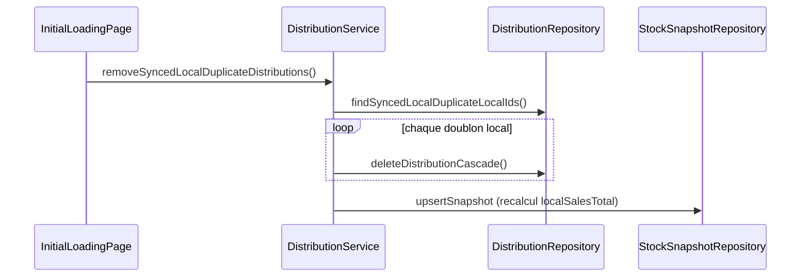
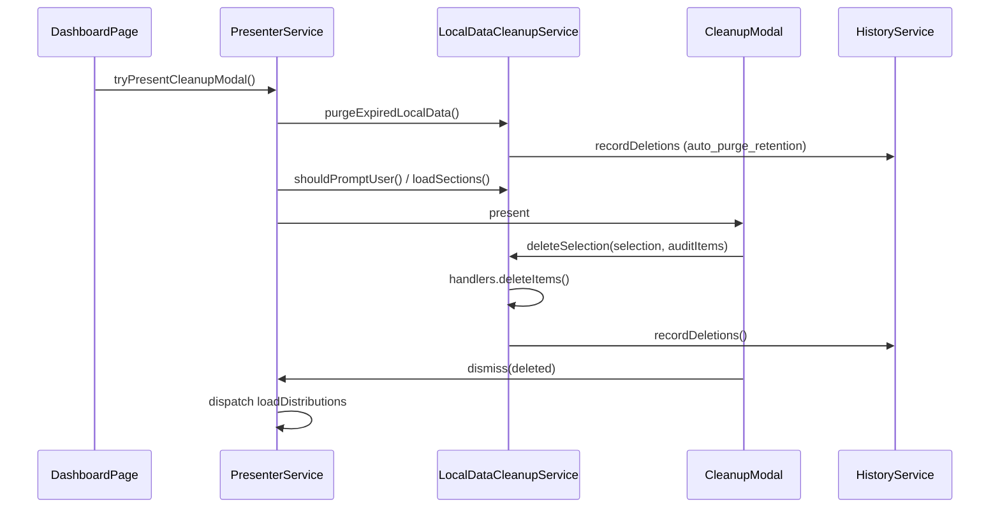

# Nettoyage des données locales (application mobile)

Documentation fonctionnelle et technique du nettoyage des données locales obsolètes : doublons à l’initialisation, modal journalier sur le dashboard, historique des suppressions, et extension prévue (recouvrements, tontine).

**Dernière mise à jour :** mai 2026  
**Périmètre :** `mobile/` (Ionic / Angular / SQLite)

---

## 1. Contexte métier

Sur le terrain, un commercial peut créer des **distributions locales** (`isLocal = 1`) qui ne sont pas encore synchronisées avec le serveur. Après une synchronisation ou une nouvelle journée, il peut subsister :

- des **doublons** (une ligne synchronisée + une ligne locale pour le même client / montant / statut) ;
- des **données locales datées d’un jour précédent**, sans utilité opérationnelle immédiate.

Deux mécanismes complémentaires ont été mis en place :

| Mécanisme | Moment | Objectif |
|-----------|--------|----------|
| **Nettoyage automatique des doublons** | Initialisation (après chargement des recouvrements) | Supprimer les distributions locales en doublon d’une distribution synchronisée |
| **Purge automatique (> 7 jours)** | Initialisation + ouverture dashboard | Supprimer sans interaction les données locales dont `createdAt` date de plus de **7 jours** ; recalcul du snapshot stock |
| **Modal de nettoyage journalier** | Première visite du **dashboard** du jour (après init du jour) | Laisser l’utilisateur supprimer ou conserver les données locales des **7 derniers jours** (hors jour courant) |

Le stock commercial affiché provient du **serveur** lors de `initializeCommercialStock()` ; le snapshot `commercial_stock_snapshot` recalcule `localSalesTotal` à partir des distributions `isLocal` restantes. **Aucune restauration manuelle de stock** n’est faite lors de ces suppressions (cohérent avec le flux d’initialisation).

---

## 2. Ce qui a été implémenté

### 2.1 Nettoyage des doublons à l’initialisation

**Fichier d’entrée :** `mobile/src/app/features/initial-loading/initial-loading.page.ts`

**Étape ajoutée :** `Nettoyage des doublons de distributions...` (après recouvrements, avant tontine / calcul des stocks).

**Critères de détection** (même client, même commercial) :

- Distribution A : `isSync = 1`
- Distribution B : `isLocal = 1`
- Même `totalAmount`
- Statut `INPROGRESS`
- `id` différents

**Action :** suppression de la distribution **locale** en cascade :

1. `recoveries` liés  
2. `distribution_items`  
3. `distributions`  

Puis recalcul du snapshot stock (`localSalesTotal`).

**Code principal :**

- `DistributionRepository.findSyncedLocalDuplicateLocalIds()`
- `DistributionRepository.deleteDistributionCascade()`
- `DistributionService.removeSyncedLocalDuplicateDistributions()`

En cas d’erreur, l’initialisation **continue** (non bloquant).

---

### 2.2 Purge automatique (rétention 7 jours)

**Constante :** `LOCAL_DATA_CLEANUP_RETENTION_DAYS = 7` (`local-data-cleanup.model.ts`)

**Moments d’exécution :**

1. **Initialisation** — étape `Purge des données locales anciennes...` (après doublons, avant tontine).
2. **Dashboard** — `LocalDataCleanupPresenterService` appelle `purgeExpiredLocalData()` **avant** d’afficher le modal.

**Règles SQL** (sur `createdAt`, distributions `isLocal = 1`) :

| Plage | Condition | Action |
|-------|-----------|--------|
| **> 7 jours** | `date(createdAt) < date(today - 7j)` | Suppression automatique en cascade + recalcul snapshot |
| **Fenêtre modal** | `date(createdAt) >= date(today - 7j)` **et** `date(createdAt) < date(today)` | Affichées dans le modal (choix utilisateur) |
| **Aujourd’hui** | `date(createdAt) >= date(today)` | Jamais listées ni purgées par ce mécanisme |

**Code principal :**

- `LocalDataCleanupService.purgeExpiredLocalData()`
- `LocalDataCleanupHandler.purgeExpiredItems()` (par type d’entité)
- `DistributionRepository.findLocalDistributionsForCleanup(commercial, beforeDate, fromDateInclusive?)`

**Historique :** chaque entité purgée est enregistrée avec `triggerAction = auto_purge_retention`.

---

### 2.3 Modal de nettoyage journalier (dashboard)

**Déclenchement :** `DashboardPage.ionViewWillEnter()` → `LocalDataCleanupPresenterService.tryPresentCleanupModal()`

**Conditions d’affichage :**

1. Initialisation marquée complète **pour la journée courante** (`InitializationValidationService.isInitializationCompleteForToday()`).
2. L’utilisateur n’a pas encore traité le prompt aujourd’hui (clé Ionic Storage `local_data_cleanup_handled_{username}`).
3. Au moins une donnée locale obsolète existe (handlers enregistrés).

**Périmètre des données listées** (après purge automatique) :

- `isLocal = 1`
- `date(createdAt) >= date(aujourd’hui - 7 jours)` **et** `date(createdAt) < date(aujourd’hui)`
- Le jour courant est **exclu**

**Actions utilisateur :**

| Bouton | Comportement |
|--------|----------------|
| **Supprimer (n)** | Supprime la sélection (cascade + snapshot) |
| **Supprimer tout** | Sélectionne tout puis supprime |
| **Conserver** | Ferme sans supprimer ; ne repropose pas le modal aujourd’hui |

Après suppression : rechargement NgRx `loadDistributions`, toast de confirmation.

---

### 2.4 Historique des suppressions journalières

Chaque entité supprimée via le modal est enregistrée dans SQLite.

**Table :** `local_data_cleanup_history` (migration DB **v23**)

| Colonne | Description |
|---------|-------------|
| `id` | UUID de la ligne d’historique |
| `batchId` | Regroupe une opération (un clic « Supprimer ») |
| `commercialUsername` | Commercial concerné |
| `actionDate` | Date du nettoyage (YYYY-MM-DD) |
| `performedAt` | Horodatage ISO de l’opération |
| `entityType` | ex. `distribution` |
| `entityId` | ID supprimé |
| `entityLabel` / `entitySubtitle` | Libellés affichés dans le modal |
| `amount` | Montant si applicable |
| `entityCreatedAt` | Date de création de l’entité supprimée |
| `triggerAction` | `delete_selected`, `delete_all` ou `auto_purge_retention` |

**Services :**

- `LocalDataCleanupHistoryRepository` — persistance / lecture par jour  
- `LocalDataCleanupHistoryService.recordDeletions()` — appelé après `deleteSelection()` et après `purgeExpiredLocalData()`

**Non historisé aujourd’hui :**

- Choix **Conserver**
- Suppressions automatiques des **doublons à l’initialisation** (sans doublon de logique avec la purge 7 jours)

---

### 2.5 Architecture extensible (Strategy + Registry)

Objectif : ajouter recouvrements, membres tontine, collectes, livraisons **sans dupliquer** la logique du modal ni du dashboard.

```
Dashboard
  └── LocalDataCleanupPresenterService
        └── LocalDataCleanupService (orchestrateur)
              ├── LocalDataCleanupRegistryService
              │     └── LocalDataCleanupHandler[]  (multi-provider)
              ├── LocalDataCleanupHistoryService
              └── Ionic Storage (prompt traité / jour)
```

**Contrat handler :** `LocalDataCleanupHandler`

- `entityType`, `sectionTitle`
- `findStaleItems(commercialUsername, todayDate)`
- `deleteItems(ids, commercialUsername)`

**Handler actif :** `DistributionLocalCleanupHandler`  
**Enregistrement :** `LOCAL_DATA_CLEANUP_PROVIDERS` dans `app.module.ts`

**Types d’entités prévus dans le modèle** (`LocalDataCleanupEntityType`) :

- `distribution` ✅ implémenté  
- `recovery` ⏳ à faire  
- `tontine-member` ⏳ à faire  
- `tontine-collection` ⏳ à faire  
- `tontine-delivery` ⏳ à faire  

---

## 3. Arborescence des fichiers

```
mobile/src/app/
├── core/local-data-cleanup/
│   ├── handlers/
│   │   ├── local-data-cleanup-handler.interface.ts
│   │   └── distribution-local-cleanup.handler.ts
│   ├── models/
│   │   ├── local-data-cleanup.model.ts
│   │   └── local-data-cleanup-history.model.ts
│   ├── repositories/
│   │   └── local-data-cleanup-history.repository.ts
│   ├── local-data-cleanup.service.ts
│   ├── local-data-cleanup-history.service.ts
│   ├── local-data-cleanup-registry.service.ts
│   ├── local-data-cleanup.tokens.ts
│   └── local-data-cleanup.providers.ts
├── features/local-data-cleanup/
│   ├── local-data-cleanup-presenter.service.ts
│   └── modals/local-data-cleanup-modal/
│       ├── local-data-cleanup-modal.component.ts
│       ├── local-data-cleanup-modal.component.html
│       └── local-data-cleanup-modal.component.scss
├── tabs/dashboard/dashboard.page.ts          # déclenchement du modal
├── features/initial-loading/initial-loading.page.ts  # doublons à l'init
└── core/repositories/distribution.repository.ts      # requêtes SQL + cascade
```

**Base de données :**

- `database.service.ts` — `CREATE TABLE local_data_cleanup_history` dans `createTables()`
- `migration.service.ts` — `migrateToV23()`
- Version cible Android : **23**

---

## 4. Flux résumés

### Initialisation (doublons)



### Dashboard (purge + modal + historique)



---

## 5. API développeur (consultation historique)

```typescript
// Historique du jour pour un commercial
const records = await localDataCleanupHistoryService.getHistoryForDay(
  commercialUsername,
  '2026-05-26'
);

// Comptage (repository)
const count = await localDataCleanupHistoryRepository.countByCommercialAndActionDate(
  commercialUsername,
  '2026-05-26'
);
```

---

## 6. Ce qui reste à faire

### 6.1 Handlers métier (priorité haute)

Pour chaque type, créer un handler implémentant `LocalDataCleanupHandler` :

| Handler | Critères `findStaleItems` suggérés | Suppression |
|---------|-----------------------------------|-------------|
| **Recouvrements** | `isLocal = 1`, date &lt; aujourd’hui, `commercialId` | Cascade si lié à distribution ; sinon DELETE recovery |
| **Membre tontine** | `isLocal = 1`, date inscription &lt; aujourd’hui | Enfants : collectes, livraisons, historique montants |
| **Collecte tontine** | `isLocal = 1`, `collectionDate` &lt; aujourd’hui | DELETE + mise à jour totaux membre si nécessaire |
| **Livraison tontine** | `isLocal = 1`, date &lt; aujourd’hui | DELETE items + livraison |

Enregistrer chaque handler dans `local-data-cleanup.providers.ts` :

```typescript
{
  provide: LOCAL_DATA_CLEANUP_HANDLERS,
  useExisting: RecoveryLocalCleanupHandler,
  multi: true
},
```

Le modal affichera **automatiquement** une section par handler sans modification UI structurelle.

### 6.2 Interface utilisateur

- [ ] Écran ou entrée menu **« Historique des nettoyages »** (liste par jour, détail par `batchId`)
- [ ] Export CSV / partage des historiques (optionnel, aligné sur `sync-logs-export`)
- [ ] Mention dans le guide utilisateur mobile (`mobile/docs/GUIDE_UTILISATEUR.txt`)

### 6.3 Historisation complémentaire

- [x] Historiser la purge automatique **> 7 jours** (`auto_purge_retention`)
- [ ] Historiser les suppressions **automatiques de doublons** à l’initialisation (`init_duplicate_cleanup`)
- [ ] Décider si le choix **Conserver** doit être tracé (`dismissed_keep`) pour audit

### 6.4 Tests

- [ ] Tests unitaires : `LocalDataCleanupService`, `DistributionLocalCleanupHandler`, requêtes SQL dates
- [ ] Test d’intégration SQLite : cascade distribution + recouvrements
- [ ] Scénario manuel : première connexion dashboard, sélection partielle, supprimer tout, conserver

### 6.5 Backend / synchronisation

- [ ] Vérifier qu’aucune entité supprimée localement n’est resynchronisée depuis le serveur de manière incohérente
- [ ] Endpoint serveur d’audit des nettoyages (optionnel, si traçabilité centralisée requise)

### 6.6 Plateformes

- [ ] Confirmer migration v23 sur **iOS** si les migrations manuelles ne sont aujourd’hui exécutées que sur Android (`database.service.ts`)

---

## 7. Guide rapide : ajouter un nouveau type de donnée

1. Ajouter la valeur dans `LocalDataCleanupEntityType` si absente.  
2. Créer `XxxLocalCleanupHandler` dans `core/local-data-cleanup/handlers/`.  
3. Implémenter `findStaleItems` (fenêtre 7 jours : `>= retentionStartDate` et `&lt; todayDate`).  
4. Implémenter `purgeExpiredItems` (SQL : `&lt; retentionStartDate`).  
5. Implémenter `deleteItems` (réutiliser services / repositories existants, cascade enfants).  
6. Enregistrer le handler dans `LOCAL_DATA_CLEANUP_PROVIDERS`.  
7. Tester purge auto + modal dashboard ; l’historique utilisera le même `entityType` sans changement de schéma.

---

## 8. Références croisées

- Initialisation complète du jour : `InitializationValidationService` (`last_complete_initialization_date`)
- Snapshot stock : `StockSnapshotRepository`, `CommercialStockService.syncCommercialStock()`
- Suppression manuelle distribution (hors nettoyage) : `DistributionService.deleteDistributionLocally()` (restaure le stock — comportement distinct)
