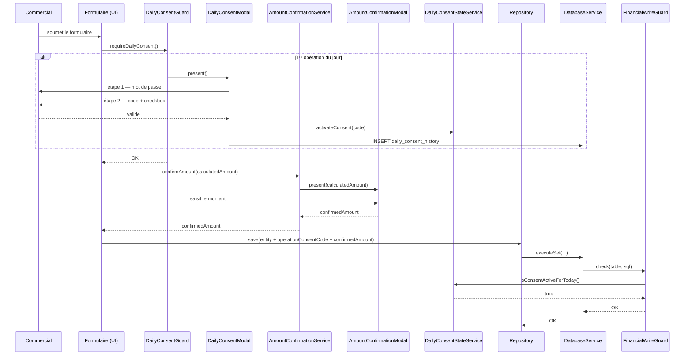

# Plan — Consentement opérationnel journalier & confirmation de montant (mobile)

**Statut :** Plan architecture — **validé** (décisions §10 verrouillées, prêt pour implémentation)  
**Auteur :** Architecture assistant  
**Date :** mai 2026  
**Périmètre :** `mobile/` (Ionic / Angular / SQLite / NgRx)

---

## 1. Résumé du besoin

Trois couches de traçabilité / responsabilité sont requises pour les opérations financières terrain :

| Couche | Fréquence | Objectif |
|--------|-----------|----------|
| **Consentement journalier** | 1 fois par jour, à la 1ʳᵉ opération | Prouver que le commercial a consciemment démarré ses enregistrements du jour |
| **Confirmation de montant** | À chaque opération | Prouver que chaque opération est intentionnelle et que le montant est connu |
| **Traçabilité des champs** | Persistée sur chaque ligne + payload serveur | Relier chaque opération à son consentement journalier et à la session de synchronisation |

---

## 2. Périmètre des opérations concernées

Seules les **opérations financières locales** créées par le commercial sont concernées :

| Table | Service | Opération |
|-------|---------|-----------|
| `distributions` | `DistributionService` | Nouvelle distribution |
| `recoveries` | `RecoveryService` | Nouveau recouvrement |
| `orders` | `OrderService` | Nouvelle commande |
| `tontine_members` | `TontineMemberService` | Inscription tontine |
| `tontine_collections` | `TontineCollectionRepository` | Collecte tontine |
| `tontine_deliveries` | `TontineDeliveryRepository` | Livraison tontine |

> **Exclusions :** `clients`, `localities`, `commercials`, tables de référentiel, tables de sync interne (`sync_logs`, `id_mappings`, etc.), tables du consentement lui-même.

---

## 3. Architecture proposée

### 3.1 Vue d'ensemble

```
Utilisateur
  └── Formulaire (distribution / recouvrement / commande / tontine)
        │
        ├─[1ʳᵉ opération du jour]──► DailyConsentGuard
        │                               └── DailyConsentPresenterService
        │                                     ├── Modale consentement journalier (mot de passe + code + checkbox)
        │                                     └── DailyConsentStateService  ← mémoire + Preferences (consentCode actif)
        │
        ├─[chaque opération]──────────► AmountConfirmationService
        │                               └── Modale saisie montant total (comparé au montant calculé)
        │
        └── Repository.save()
              └── DatabaseService.executeSet() / execute()
                    └── FinancialWriteGuard  ← intercepteur central
                          ├── Vérifie consentement journalier actif (DailyConsentStateService)
                          └── Lève ConsentRequiredError si absent
```

### 3.2 DailyConsentStateService

Service singleton : **cache mémoire** + **persistance Capacitor `Preferences`** pour survivre au redémarrage de l'app (avec ou sans logout). L'historique détaillé reste en SQLite (`daily_consent_history`).

```
DailyConsentStateService
  ├── consentCode: string | null         ← code validé pour aujourd'hui
  ├── consentDate: string | null         ← YYYY-MM-DD
  ├── commercialUsername: string | null
  ├── isConsentActiveForToday(username): boolean
  ├── activateConsent(username, code: string)   ← mémoire + Preferences
  ├── restoreFromPreferences(username)          ← au démarrage / après login
  ├── clearConsent(username)                    ← logout (clé par commercial)
  └── getActiveConsentCode(): string | null
```

**Clé Preferences :** `daily_operation_consent_{commercialUsername}`

**Valeur JSON stockée :**

```json
{
  "consentCode": "K7M3P2",
  "actionDate": "2026-05-26",
  "consentedAt": "2026-05-26T08:15:00.000Z"
}
```

**Règles :**

| Situation | Comportement |
|-----------|--------------|
| Redémarrage app (même jour, même commercial) | `restoreFromPreferences()` recharge le consentement → **pas de nouvelle modale** |
| Changement de jour (`actionDate` ≠ aujourd'hui) | Consentement invalide → modale à la 1ʳᵉ opération |
| Logout | `clearConsent(username)` supprime la clé Preferences + mémoire |
| Connexion d'un autre commercial | Clé distincte par `username` |

Un seul consentement journalier par commercial et par jour calendaire, même si l'app est tuée et relancée plusieurs fois.

### 3.3 DailyConsentGuard

Point d'appel : **avant** chaque méthode de création d'opération financière dans les services métier.

```typescript
// Exemple dans DistributionService.createDistribution()
await this.dailyConsentGuard.requireDailyConsent();
// → si pas de consentement actif pour aujourd'hui : affiche la modale
// → si consentement actif : passe immédiatement
```

Ce guard n'est **pas** un intercepteur `DatabaseService` pour les créations — voir section 3.4 pour le blocage bas niveau.

### 3.4 FinancialWriteGuard (intercepteur DatabaseService)

Couche de sécurité bas niveau dans `DatabaseService.executeSet()` et `DatabaseService.execute()`.

**Logique :**

1. Analyser le SQL de chaque statement de l'ensemble.
2. Si la requête est un `INSERT` ou `UPDATE` (pas `DELETE`, pas `SELECT`) ET que la table cible fait partie de la liste blanche financière → vérifier `DailyConsentStateService.isConsentActiveForToday()`.
3. Si absent → lever `ConsentRequiredError` (non silencieux).

**Détection de la table :** extraction par regex sur le SQL :
- `INSERT (OR REPLACE)? INTO (\w+)` → groupe 2 = table
- `UPDATE (\w+) SET` → groupe 1 = table

**Tables bloquées :**
```
distributions, recoveries, orders, order_items,
tontine_members, tontine_collections, tontine_deliveries
```

**Opérations toujours libres (non soumises au garde) :**

- Tout `DELETE` (décision validée)
- Tout `UPDATE` dont le SQL ne concerne que le statut de sync (`isSync`, `syncDate`, `syncHash`, `id` après mapping serveur, etc.) — typiquement les retours de synchronisation

**Tables non bloquées (toujours libres) :**
```
clients, localities, commercials, articles, accounts,
sync_logs, id_mappings, daily_reports, parameters,
local_data_cleanup_history, sync_consent_history,
daily_consent_history,           ← la table du consentement lui-même
commercial_stock_*, tontine_sessions, tontine_stocks,
stock_outputs, stock_output_items, client_reliquats,
tontine_member_amount_history, commercial_stock_snapshot
```

> Ce garde bas-niveau est une **filet de sécurité** — il ne remplace pas l'appel explicite au `DailyConsentGuard` dans les services métier. Les deux coexistent.

### 3.5 Modale de consentement journalier

Même structure que la modale de synchronisation :

**Étape 1 — mot de passe**
- Titre : « Démarrage des opérations du JJ/MM/YYYY »
- Message : voir section 4.1
- Champ mot de passe

**Étape 2 — code + checkbox**
- Code à 6 caractères à recopier
- Case à cocher : voir section 4.2
- Bouton : « Démarrer mes opérations »

À la validation : `DailyConsentStateService.activateConsent(code)` + `INSERT` dans `daily_consent_history`.

### 3.6 Modale de confirmation de montant

Affichée à chaque formulaire d'opération, **après** validation des données, **avant** `save()`.

```
┌─────────────────────────────────────────────────────┐
│  Confirmation du montant                            │
│                                                     │
│  Montant calculé de l'opération :                   │
│  ┌─────────────────────────────────────────────┐    │
│  │               125 000 FCFA                  │    │
│  └─────────────────────────────────────────────┘    │
│                                                     │
│  Saisissez ce montant pour confirmer :              │
│  [                                              ]   │
│                                                     │
│  [Annuler]                   [Confirmer]            │
└─────────────────────────────────────────────────────┘
```

- Le montant saisi est comparé au montant calculé (**égalité stricte**, décision validée — pas de marge ±1 FCFA).
- Le montant saisi est stocké dans la table de l'opération : champ `confirmedAmount`.
- Si refus ou montant incorrect → l'opération est annulée.

### 3.7 Champ `operationConsentCode` sur chaque entité

Chaque entité financière créée localement reçoit le `consentCode` actif au moment de la création :

```sql
ALTER TABLE distributions ADD COLUMN operationConsentCode TEXT;
ALTER TABLE recoveries     ADD COLUMN operationConsentCode TEXT;
ALTER TABLE orders         ADD COLUMN operationConsentCode TEXT;
ALTER TABLE tontine_members     ADD COLUMN operationConsentCode TEXT;
ALTER TABLE tontine_collections ADD COLUMN operationConsentCode TEXT;
ALTER TABLE tontine_deliveries  ADD COLUMN operationConsentCode TEXT;
```

Et le champ confirmedAmount pour les opérations avec un montant :

```sql
ALTER TABLE distributions ADD COLUMN confirmedAmount REAL;
ALTER TABLE recoveries     ADD COLUMN confirmedAmount REAL;
ALTER TABLE orders         ADD COLUMN confirmedAmount REAL;
ALTER TABLE tontine_collections ADD COLUMN confirmedAmount REAL;
```

### 3.8 Payload de synchronisation (backend)

Chaque objet envoyé au backend lors de la sync porte deux codes supplémentaires :

```json
{
  "id": "...",
  "totalAmount": 125000,
  "confirmedAmount": 125000,
  "operationConsentCode": "K7M3P2",
  "syncConsentCode": "X9B4NR",
  ...
}
```

- `operationConsentCode` : code journalier au moment de la création de l'opération (lu depuis la table)
- `syncConsentCode` : code validé juste avant la synchronisation (fourni par `SyncConsentPresenterService` et transmis à `SyncMasterService` puis aux sync services)

Le backend peut ignorer ces champs s'il ne les supporte pas encore (champs optionnels dans le payload). Aucun changement côté backend n'est requis pour la phase 1.

---

## 4. Textes proposés

### 4.1 Message de consentement journalier

> Je confirme démarrer volontairement l'enregistrement de mes opérations commerciales pour la journée du **[DATE]**. Je comprends que toutes les distributions, recouvrements, commandes et opérations de tontine que j'enregistrerai ce jour seront tracées sous mon nom et ne pourront pas être attribuées à un autre utilisateur ou à un processus automatique. Chaque opération engage ma responsabilité commerciale et financière.

### 4.2 Case à cocher consentement journalier

> J'ai lu ce message, je confirme être présent sur le terrain ce jour et j'assume la responsabilité de l'ensemble des opérations que j'enregistrerai.

### 4.3 Titre modale confirmation montant

> Confirmation du montant de l'opération

### 4.4 Instruction modale confirmation montant

> Pour valider cette opération, saisissez le montant total ci-dessous. Cela confirme que vous êtes bien l'auteur de cette opération et que vous en connaissez le montant exact.

---

## 5. Schéma de la base de données

### 5.1 Nouvelle table `daily_consent_history` (migration v25)

```sql
CREATE TABLE IF NOT EXISTS daily_consent_history (
    id TEXT PRIMARY KEY,
    commercialUsername TEXT NOT NULL,
    actionDate TEXT NOT NULL,           -- YYYY-MM-DD
    consentedAt TEXT NOT NULL,          -- ISO
    challengeCode TEXT NOT NULL,
    challengeEntered TEXT NOT NULL,
    consentMessageVersion TEXT NOT NULL -- ex. 'v1'
);
CREATE INDEX IF NOT EXISTS idx_daily_consent_commercial_date
    ON daily_consent_history(commercialUsername, actionDate);
```

### 5.2 Colonnes ajoutées aux tables financières (migration v25)

```sql
-- distributions
ALTER TABLE distributions ADD COLUMN operationConsentCode TEXT;
ALTER TABLE distributions ADD COLUMN confirmedAmount REAL;

-- recoveries
ALTER TABLE recoveries ADD COLUMN operationConsentCode TEXT;
ALTER TABLE recoveries ADD COLUMN confirmedAmount REAL;

-- orders
ALTER TABLE orders ADD COLUMN operationConsentCode TEXT;
ALTER TABLE orders ADD COLUMN confirmedAmount REAL;

-- tontine_members
ALTER TABLE tontine_members ADD COLUMN operationConsentCode TEXT;

-- tontine_collections
ALTER TABLE tontine_collections ADD COLUMN operationConsentCode TEXT;
ALTER TABLE tontine_collections ADD COLUMN confirmedAmount REAL;

-- tontine_deliveries
ALTER TABLE tontine_deliveries ADD COLUMN operationConsentCode TEXT;
```

> `tontine_deliveries` n'a pas de `confirmedAmount` car le montant est dérivé de la session, pas saisi directement. Idem `tontine_members` (l'inscription n'a pas de montant unitaire immédiat).

---

## 6. Arborescence des nouveaux fichiers

```
mobile/src/app/
├── core/daily-consent/
│   ├── models/
│   │   └── daily-consent-history.model.ts      # interface + DAILY_CONSENT_MESSAGE_VERSION
│   ├── repositories/
│   │   └── daily-consent-history.repository.ts
│   ├── daily-consent-state.service.ts          # état mémoire du consentement actif
│   ├── daily-consent.service.ts                # persistance, vérification
│   ├── daily-consent.errors.ts                 # ConsentRequiredError, DailyConsentCancelledError
│   └── financial-write-guard.service.ts        # intercepteur bas niveau DatabaseService
├── features/daily-consent/
│   ├── daily-consent-guard.service.ts          # point d'appel pour les services métier
│   └── modals/daily-consent-modal/
│       ├── daily-consent-modal.component.ts
│       ├── daily-consent-modal.component.html
│       └── daily-consent-modal.component.scss
├── features/amount-confirmation/
│   ├── amount-confirmation.service.ts          # affiche la modale, retourne le montant validé
│   └── modals/amount-confirmation-modal/
│       ├── amount-confirmation-modal.component.ts
│       ├── amount-confirmation-modal.component.html
│       └── amount-confirmation-modal.component.scss
├── core/services/
│   ├── database.service.ts                     # modifié : executeSet/execute appellent FinancialWriteGuard
│   ├── migration.service.ts                    # modifié : migrateToV25()
│   └── sync-master.service.ts                  # modifié : passe syncConsentCode aux sync services
├── core/services/sync/
│   ├── distribution-sync.service.ts            # modifié : injecte syncConsentCode dans le payload
│   ├── recovery-sync.service.ts                # modifié
│   ├── order-sync.service.ts                   # modifié
│   ├── tontine-member-sync.service.ts          # modifié
│   ├── tontine-collection-sync.service.ts      # modifié
│   └── tontine-delivery-sync.service.ts        # modifié
└── core/repositories/
    ├── distribution.repository.ts              # modifié : lit/écrit operationConsentCode, confirmedAmount
    ├── recovery.repository.ts                  # modifié
    ├── order.repository.ts                     # modifié
    ├── tontine-member.repository.ts            # modifié
    ├── tontine-collection.repository.ts        # modifié
    └── tontine-delivery.repository.ts          # modifié
```

---

## 7. Points de contact dans les services métier

Les services qui créent des opérations locales devront appeler **dans cet ordre** :

```
1. dailyConsentGuard.requireDailyConsent()        ← déclenche modale si 1ʳᵉ opération du jour
2. amountConfirmationService.confirmAmount(amount) ← saisie montant à chaque opération
3. entity.operationConsentCode = dailyConsentState.getActiveConsentCode()
4. entity.confirmedAmount = montant saisi à l'étape 2
5. repository.save(entity)
```

**Services à modifier :**
- `DistributionService` (création distribution locale)
- `RecoveryService` (création recouvrement local)
- `OrderService` (création commande locale)
- Service tontine membre (inscription locale)
- `TontineCollectionRepository.save()` (collecte locale)
- `TontineDeliveryRepository.save()` (livraison locale)

---

## 8. Flux complet (séquence)



---

## 9. Intégration avec la synchronisation

La session de synchronisation connaît déjà son propre `syncConsentCode` (code validé dans la modale de synchronisation). Ce code est transmis en cascade :

```
SyncConsentPresenterService
  └── dismiss({ syncConsentCode })
        └── SyncMasterService.synchronizeAllData(dateFilter, syncConsentCode)
              ├── distributionSyncService.syncAll(..., syncConsentCode)
              ├── recoverySyncService.syncAll(..., syncConsentCode)
              └── …
```

Chaque sync service ajoute au payload final :

```typescript
{
  ...entityPayload,
  operationConsentCode: entity.operationConsentCode,  // depuis la DB
  syncConsentCode: syncConsentCode                    // paramètre de la session
}
```

**Modification à `SyncMasterService.synchronizeAllData()`** :
- Nouvelle signature : `synchronizeAllData(dateFilter?, syncConsentCode?)`
- `syncConsentCode` est fourni par `SyncConsentPresenterService` qui le récupère depuis la modale puis le passe au service.

---

## 10. Décisions validées

| Question | Décision retenue |
|----------|------------------|
| Survie du consentement journalier au redémarrage de l'app (avec ou sans logout) | **Option B** — persistance `Preferences` Capacitor ; une seule modale par commercial et par jour calendaire |
| Tolérance sur la confirmation du montant | **Option A** — égalité stricte entre montant calculé et montant saisi |
| Périmètre du consentement journalier | **Par commercial** (`commercialUsername`) — clé Preferences et historique SQLite indexés par login |
| `FinancialWriteGuard` sur `DELETE` | **Libre** — jamais bloqué |
| `FinancialWriteGuard` sur `UPDATE` de statut de sync (`isSync`, `syncDate`, etc.) | **Libre** — jamais bloqué ; seuls les `INSERT` / `UPDATE` métier sur tables financières locales sont contrôlés |

**Implémentation du garde (rappel) :**

- Bloquer : `INSERT` / `UPDATE` sur tables financières lorsque le consentement du jour n'est pas actif pour le commercial courant.
- Ne pas bloquer : `DELETE`, `SELECT`, écritures sur tables hors liste blanche, mises à jour purement techniques de sync.
- Court-circuit performance : si `isConsentActiveForToday()` est vrai, ne pas analyser le SQL en détail.

**Restauration au démarrage :** après `loginSuccess` ou chargement utilisateur depuis Preferences, appeler `DailyConsentStateService.restoreFromPreferences(username)`.

---

## 11. Risques et mitigations

| Risque | Mitigation |
|--------|------------|
| `FinancialWriteGuard` bloque des écritures légitimes (init, migration, sync download) | Liste blanche de tables + filtre sur `isLocal = 1` dans le SQL analysé |
| La modale de confirmation montant est contournée si `save()` est appelé directement | Le `FinancialWriteGuard` dans `DatabaseService` est le filet de sécurité bas niveau |
| Code journalier identique à une session précédente | Non critique : la colonne `actionDate` + `consentedAt` garantit l'unicité temporelle |
| Performance : regex sur chaque `executeSet` | Optimiser : vérifier uniquement si le consentement est inactif (court-circuit si actif) |

---

## 12. Ordre d'implémentation recommandé

1. **Migration DB v25** — nouvelles colonnes + table `daily_consent_history`
2. **`DailyConsentStateService`** — mémoire + persistance Preferences (restore au login)
3. **`DailyConsentHistoryRepository`** + `DailyConsentService` — persistance
4. **Modale `DailyConsentModal`** — UI 2 étapes
5. **`DailyConsentGuard`** — point d'appel services
6. **Modale `AmountConfirmationModal`** + `AmountConfirmationService`
7. **`FinancialWriteGuard`** dans `DatabaseService`
8. **Repositories** — colonnes `operationConsentCode` + `confirmedAmount` dans `saveAll`
9. **Services métier** — intégration des étapes 1→5
10. **Sync services** — propagation `syncConsentCode` dans les payloads
11. **`SyncMasterService`** — signature étendue + passage du `syncConsentCode`
12. **Tests manuels** selon les scénarios définis

---

## 13. Références croisées

- Consentement avant synchronisation : [CONSENTEMENT_SYNCHRONISATION_MOBILE.md](./CONSENTEMENT_SYNCHRONISATION_MOBILE.md)
- Nettoyage des données locales : [NETTOYAGE_DONNEES_LOCALES_MOBILE.md](./NETTOYAGE_DONNEES_LOCALES_MOBILE.md)
- `SyncMasterService` : `mobile/src/app/core/services/sync-master.service.ts`
- `DatabaseService` : `mobile/src/app/core/services/database.service.ts`
- `BaseRepository` : `mobile/src/app/core/repositories/base.repository.ts`
