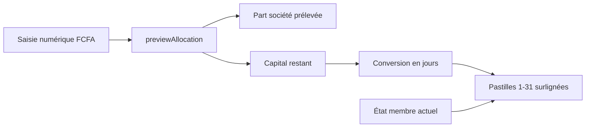
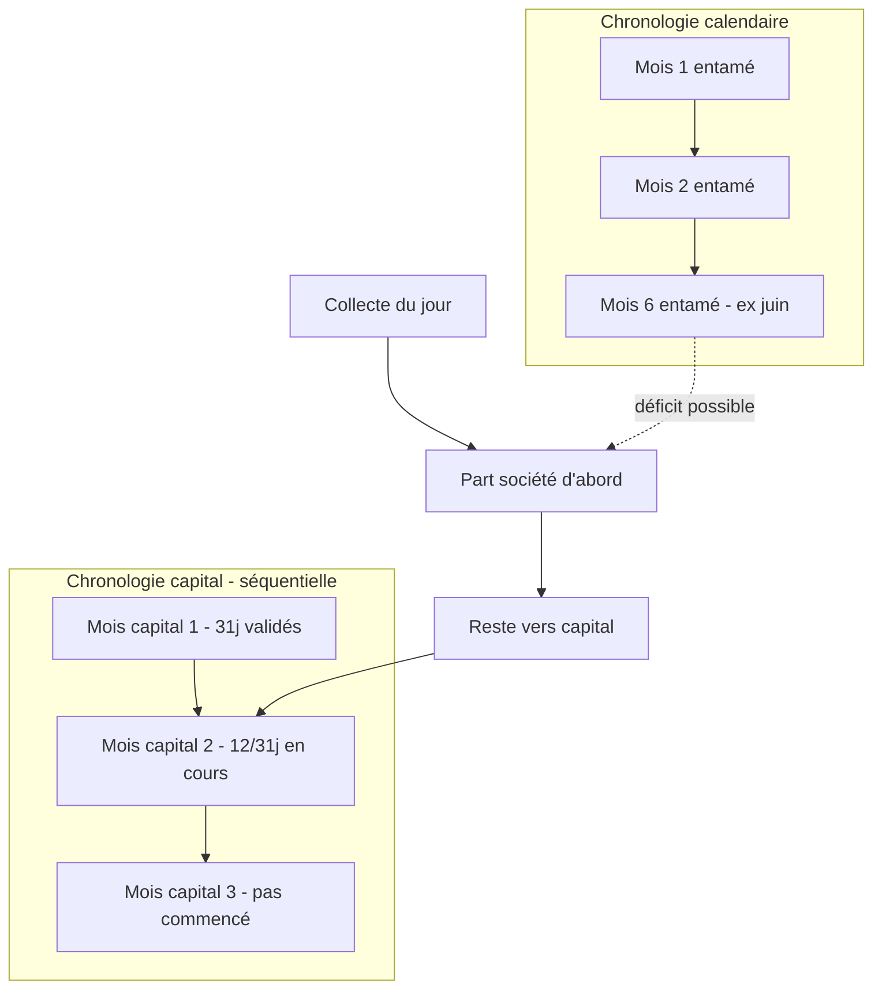
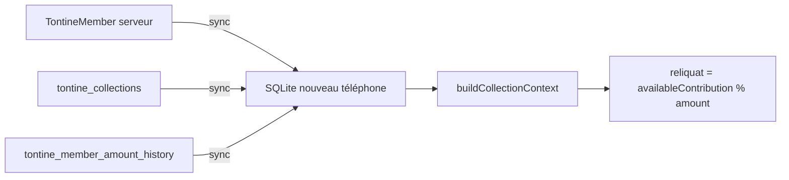
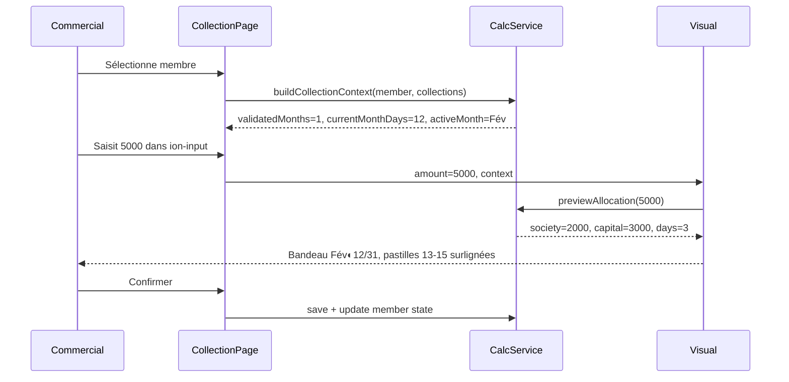

# Pastilles journalières pour la collecte tontine (Mobile)

## Contexte

Ce document décrit le plan d'implémentation des pastilles de visualisation sur la page mobile d'enregistrement de cotisation tontine (`collection-recording`).

Documents liés :
- [TONTINE_SOCIETY_SHARE_LOGIC_UPDATE.md](TONTINE_SOCIETY_SHARE_LOGIC_UPDATE.md)
- [TONTINE_MEMBER_AMOUNT_HISTORY_LOGIC.md](TONTINE_MEMBER_AMOUNT_HISTORY_LOGIC.md)

---

## Principe UX retenu : saisie numérique + visualisation automatique

**La saisie numérique reste l'entrée principale** (comportement actuel conservé). Les pastilles sont une **représentation visuelle en lecture seule**, remplies automatiquement quand le commercial tape un montant.



Le commercial :

1. Saisit un montant dans l'`ion-input` (comme aujourd'hui)
2. Voit instantanément quelles pastilles correspondent à ce montant **après déduction de la part société**
3. Comprend visuellement sur quel mois capital il cotise (ex. Février 12/31 → 15/31 si 3 jours)

Les pastilles **ne sont pas cliquables** — elles ne modifient pas le montant.

---

## Contrainte métier centrale (souvent source d'ambiguïté)

La tontine gère **deux chronologies parallèles** documentées dans [TONTINE_SOCIETY_SHARE_LOGIC_UPDATE.md](TONTINE_SOCIETY_SHARE_LOGIC_UPDATE.md) et implémentées dans `TontineService.java` :



- **Part société** : basée sur les **mois calendaires entamés** depuis le début de session (ou inscription), indépendamment de l'avancement capital. En juin, 6 parts peuvent être dues même si le membre n'a validé que 1 mois capital.
- **Capital / mois validés** : séquentiel, **31 jours × montant journalier = 1 mois capital**. On ne peut remplir le mois capital 4 tant que le mois capital 2 n'est pas bouclé.
- **Historique montants** ([TONTINE_MEMBER_AMOUNT_HISTORY_LOGIC.md](TONTINE_MEMBER_AMOUNT_HISTORY_LOGIC.md)) : le montant journalier applicable peut varier **par mois calendaire/session**, pas seulement le montant actuel affiché.

**Conséquence UX** : en juin, le commercial peut encore collecter des **jours du mois capital Février (ex. 12/31)**. Les pastilles ne doivent donc **pas** être liées au mois calendaire courant.

---

## Ce qu'une pastille représente (règle sans ambiguïté)

| Élément | Sémantique unique |
|---------|-------------------|
| **1 pastille journalière** | 1 jour de cotisation **complet** du mois capital actif — jamais de demi-pastille |
| **Reliquat capital** | Fraction < 1 jour conservée entre deux collectes (ex. 100 FCFA si mise = 200 et paiement = 500 → 2 jours + 100 reliquat) |
| **Bandeau des 10 mois** | Vue d'ensemble de la session : chaque mois affiche son état capital (0–31j) et son statut calendaire (entamé ou non) |
| **Mois actif affiché** | Le **premier mois capital incomplet** (`validatedMonths`) — seul mois sur lequel les pastilles journalières sont dessinées |
| **Mois entamés calendaires en avance** | Affichés en avertissement (part société due) sur le bandeau mensuel |

Cette règle évite l'ambiguïté "je paie juin ou février ?" : **la visualisation montre toujours le premier mois capital ouvert**, quel que soit le mois calendaire.

---

## États visuels du bandeau mensuel (10 mois)

Chaque mois `i` (0–9) dérivé de `session.startDate + i mois` :

- **Validé** (`i < validatedMonths`) : 31/31, icône check
- **Actif** (`i === validatedMonths` et `validatedMonths < 10`) : `currentMonthDays/31` — **mois focalisé, pastilles affichées ici**
- **Entamé calendaire mais capital non ouvert** (`i > validatedMonths` et `i < monthsEntamed`) : badge orange "Part société due"
- **Futur** (`i >= monthsEntamed`) : grisé

Le bandeau est **informatif** (pas de sélection par clic en v1).

Badges en-tête (comme recouvrement) :

- **Jours payés** : `currentMonthDays` sur le mois actif
- **Retard** : si `monthsEntamed > validatedMonths + 1`, tous les jours restants du mois actif sont en rouge (le membre est en retard sur le capital alors que le calendrier avance)

---

## Pastilles journalières (grille 1–31) — visualisation pilotée par le montant

Réutiliser les **styles** de `mobile/src/app/features/recovery/components/amount-input/amount-input.component.scss`, mais en mode **read-only** :

- Pastilles numérotées **1 à 31** pour le mois capital actif uniquement
- Pastilles **1..currentMonthDays** : déjà payées (gris foncé, état `paid`)
- Pastilles **currentMonthDays+1..currentMonthDays+projectedDays** : surlignées (vert) selon le montant saisi
- Pastilles restantes non couvertes : neutres ou rouges (`.late`) si membre en retard calendaire
- Pastilles **non cliquables** (`pointer-events: none`)

### Reliquat capital — règle et persistance

Une mise partielle **ne peut pas** être représentée par une pastille. Elle est conservée comme **reliquat capital** et réutilisée à la collecte suivante pour compléter un jour entier.

**Exemple** : mise = 200 FCFA, paiement = 500 FCFA (sans part société) :
- 2 jours complets → pastilles 1 et 2 surlignées
- 100 FCFA → reliquat (affiché en badge, pas en pastille)

**Collecte suivante** : reliquat existant 100 + paiement 150 = 250 → 1 jour + reliquat 50.

Le backend gère déjà ce mécanisme implicitement via `availableContribution` et la division entière dans `calculateMemberStatus` :

```
reliquatExistant = availableContribution % dailyAmount
```

Pas de nouvelle table dédiée en v1 : le reliquat est **dérivé** du capital disponible après replay des collectes. Il est recalculé à chaque ouverture de la page et après chaque enregistrement.

### Portabilité — changement de téléphone

**Oui, l'activité peut se poursuivre sans table `reliquat` dédiée au backend**, car le reliquat tontine n'est pas une entité séparée : c'est la fraction résiduelle du capital déjà persisté côté serveur sur `TontineMember` :

| Champ backend (déjà persisté) | Rôle |
|-------------------------------|------|
| `totalContribution` | Somme de toutes les collectes |
| `societyShare` | Part société prélevée (prioritaire) |
| `availableContribution` | Capital net = `totalContribution - societyShare` |
| `validatedMonths` / `currentMonthDays` | Progression capital dérivée |
| **Reliquat dérivé** | `availableContribution % amount` |

**Exemple** : mise 200, collecte 500, part société 0 → `availableContribution = 500` → 2 jours + reliquat 100. Ces valeurs sont recalculées et stockées par le backend à chaque `recordCollection`. Sur un nouveau téléphone, après sync, le reliquat est **reconstruit à l'identique**.



**Deux stratégies équivalentes sur le nouveau téléphone** (la plus fiable en priorité) :

1. **Sync directe des champs calculés** — télécharger `societyShare`, `availableContribution`, `validatedMonths`, `currentMonthDays` depuis `TontineMemberRespDto` (déjà exposés par l'API)
2. **Replay local** — recharger toutes les `tontine_collections` + historique montants et rejouer `processCollectionAllocation` (filet de sécurité si les champs calculés manquent)

**Écart actuel à combler** (bloquant aujourd'hui, pas le plan reliquat) :

Le mobile ne synchronise pour l'instant que `totalContribution` dans `saveTontineMembers()` — pas `societyShare` ni `availableContribution`. Sans correction, un changement de téléphone reconstruirait un reliquat **incorrect** si on se base uniquement sur `totalContribution`.

**Actions requises dans le plan** :
- Étendre la sync descendante (`tontine.service.ts` + `database.service.ts`) pour persister `societyShare`, `availableContribution`, `validatedMonths`, `currentMonthDays`
- Conserver le replay local comme validation croisée (détection de divergence sync)
- Rappeler au commercial : synchroniser avant changement de téléphone (collectes locales non sync restent sur l'ancien appareil — comportement offline-first standard)

**Différence avec le reliquat recouvrement** : le module crédit utilise une table explicite `client_reliquats` synchronisée via `/api/v1/mobiles/reliquats`. Pour la tontine, ce n'est **pas nécessaire** : le reliquat est une vue calculée du capital membre, déjà porté par le backend.

### Algorithme `amountToVisualDays(amount, context)`

```
1. preview = previewAllocation(amount)           // part société d'abord
2. capitalPart = preview.capitalAmount             // capital issu de CE paiement
3. dailyAmount = context.applicableDailyAmount
4. existingReliquat = context.availableContribution % dailyAmount

5. // Pool capital après cette collecte
   newAvailable = context.availableContribution + capitalPart
   newTotalDays = Math.floor(newAvailable / dailyAmount)
   oldTotalDays = Math.floor(context.availableContribution / dailyAmount)
   daysAdded = newTotalDays - oldTotalDays

6. newReliquat = newAvailable % dailyAmount        // reliquat conservé

7. projectedDays = min(daysAdded, 31 - currentMonthDays)
8. Surligner pastilles [currentMonthDays+1 .. currentMonthDays+projectedDays]
   // Uniquement les jours ENTIERS — jamais de pastille partielle

9. Affichages complémentaires :
   - Si existingReliquat > 0 : badge "Reliquat actuel : X FCFA"
   - Si preview.societyAmount > 0 : bannière "Y FCFA → part société"
   - Si newReliquat > 0 : badge "Reliquat après collecte : Z FCFA (conservé)"
   - Si daysAdded = 0 et newReliquat > 0 : "Aucun jour complet — reliquat accumulé"
```

**Exemple A** : mise 200, paiement 500, reliquat existant 0, pas de part société :
- 2 pastilles surlignées, reliquat après collecte : 100 FCFA

**Exemple B** : mise 200, reliquat existant 100, paiement 150 :
- Pool = 250 → 1 jour, reliquat après : 50 FCFA → 1 pastille surlignée

**Exemple C** : membre à 12/31 sur Février, paiement 5 000, déficit part société 2 000, mise 1 000 :
- Part société : 2 000 / Capital : 3 000 → 3 pastilles (13–15), reliquat 0

**Cas montant 100% part société** : aucune pastille, reliquat inchangé, message explicite.

---

## Prévisualisation allocation (transparence part société)

Sous la grille, afficher un récap calculé localement (miroir `processCollectionAllocation`) :

```
Montant collecté : 500 FCFA
→ Part société : 0 FCFA
→ Capital : 500 FCFA
→ Jours complets : 2 (pastilles surlignées)
→ Reliquat conservé : 100 FCFA (non représenté en pastille)
```

Cela répond aux deux ambiguïtés fréquentes :
- "Pourquoi 5 000 FCFA ne donnent pas 5 jours ?" → part société prélevée d'abord
- "Pourquoi 500 FCFA ne donnent pas 2,5 jours ?" → seuls les jours entiers sont des pastilles, le reste est reliquat

---

## Couche de calcul mobile (prérequis indispensable)

Le mobile actuel est insuffisant :

- `collection-recording.page.ts` : saisie libre, pas de pastilles
- `TontineCalculationService` : calcule `targetSocietyShare` mais **pas** `validatedMonths` / `currentMonthDays`, et utilise `Math.min(totalCollected, target)` au lieu de rejouer l'allocation réelle
- SQLite `tontine_members` : stocke `totalContribution` mais **pas** `societyShare`, `validatedMonths`, `currentMonthDays` (pourtant renvoyés par l'API backend via `TontineMemberRespDto`)

### Extension de `TontineCalculationService`

Nouvelle méthode centrale `buildCollectionContext(member, session, collections, referenceDate)` retournant :

```typescript
interface TontineCollectionContext {
  monthsEntamed: number;           // mois calendaires entamés (max 10)
  validatedMonths: number;         // mois capital complets
  currentMonthDays: number;        // jours payés dans mois actif
  activeMonthIndex: number;        // = validatedMonths
  societyShare: number;
  targetSocietyShare: number;
  societyShareDeficit: number;
  availableContribution: number;   // capital net (total - part société)
  capitalReliquat: number;         // availableContribution % dailyAmount
  monthStatuses: MonthStatus[];    // pour le bandeau 10 mois
  applicableDailyAmount: number;   // montant du mois actif (historique)
}
```

Algorithme (aligné backend) :

1. Rejouer chronologiquement `processCollectionAllocation` sur chaque collecte locale + sync pour obtenir `societyShare` et `totalContribution` exacts
2. Appeler `calculateMemberStatus` (miroir lignes 473–506 de `TontineService`) pour `validatedMonths` / `currentMonthDays`
3. Calculer `monthsEntamed` via boucle mensuelle + historique montants
4. Construire `monthStatuses` pour le bandeau

### Persistance mobile (recommandée)

Ajouter à `tontine_members` via migration SQLite :

- `societyShare REAL`
- `validatedMonths INTEGER`
- `currentMonthDays INTEGER`

Mettre à jour après chaque collecte locale et à la sync descendante — évite de rejouer toutes les collectes à chaque rendu UI.

---

## Nouveau composant UI (visualisation)

Créer `TontineCollectionVisualComponent` dans `mobile/src/app/features/tontine/components/collection-visual/` :

- **Inputs** : `context: TontineCollectionContext`, `amount: number` (montant saisi)
- **Pas d'Output** — composant purement visuel
- **Sections** :
  1. Bandeau 10 mois (états capital + calendaire)
  2. Bannière part société (si le montant saisi la couvre)
  3. Badge reliquat existant (si > 0) — style proche de `reliquat-display` (recouvrement)
  4. Grille 31 pastilles journalières (read-only, jours entiers uniquement)
  5. Récap : "X jours sur [Mois Y]" + reliquat généré/conservé
  6. Légende couleurs (payé / projeté / retard / reliquat)

Styles : réutiliser `amount-input.component.scss` avec une variante `.projected` pour les pastilles surlignées par la saisie (distinct de `.selected` du recouvrement).

---

## Intégration dans `collection-recording.page`

- **Conserver** l'`ion-input` numérique existant (source de vérité)
- **Ajouter** `<app-tontine-collection-visual>` sous l'input, visible quand `amount > 0`
- Au `selectMember()` : charger collections + appeler `buildCollectionContext`
- Sur `(ionInput)` / `valueChanges` du montant : passer `amount` au composant visual → recalcul pastilles en temps réel
- `onSubmit()` : inchangé côté persistance (`TontineCollectionRepository.save`), mais appeler la mise à jour locale de `societyShare` / `validatedMonths` après save

Layout proposé :

```
[ion-input montant FCFA]          ← saisie
[app-tontine-collection-visual] ← apparaît si montant > 0
  bandeau 10 mois
  bannière part société
  grille pastilles 1-31
  récap jours projetés
[notes]
[bouton enregistrer]
```

---

## Cas limites à gérer explicitement

| Cas | Comportement UI |
|-----|-----------------|
| Membre à 10/10 mois validés | Message "Tontine capital complète", pas de pastilles |
| Montant journalier = 0 ou null | Bloquer pastilles, message d'erreur |
| Changement de montant en cours de session | Pastilles du mois actif utilisent le montant historique applicable à ce mois |
| `monthsEntamed` >> `validatedMonths` | Bandeau orange + pastilles rouges + bannière explicative |
| Montant = 0 ou vide | Masquer pastilles projetées ; afficher reliquat existant seul si > 0 |
| Paiement sans jour complet (ex. 150, mise 200) | 0 pastille surlignée, reliquat accumulé affiché |
| Reliquat existant + paiement complètent un jour | 1+ pastille(s) surlignée(s), nouveau reliquat recalculé |
| Montant > jours restants × journalier + reliquat | Surligner jusqu'à 31/31, excédent vers reliquat ou mois suivant |
| Offline | Calcul 100% local via historique SQLite (`tontine_member_amount_history` déjà présent) |

---

## Fichiers principaux à modifier

- `mobile/src/app/core/services/tontine-calculation.service.ts` — logique complète
- `mobile/src/app/models/tontine.model.ts` — champs `societyShare`, `validatedMonths`, `currentMonthDays`
- `mobile/src/app/core/services/database.service.ts` + migration — colonnes SQLite
- `mobile/src/app/core/repositories/tontine-collection.repository.ts` — mise à jour état membre post-collecte
- `mobile/src/app/features/tontine/pages/collection-recording/` — intégration page
- **Nouveau** : `mobile/src/app/features/tontine/components/collection-visual/`

Référence backend à miroir : `processCollectionAllocation`, `calculateMemberStatus`, `getApplicableAmountForDate` dans `TontineService.java`.

Référence UX existante : `member-details.component.html` (bandeau 10 mois web) + `amount-input.component` (pastilles recouvrement).

---

## Diagramme flux utilisateur



---

## Tâches d'implémentation

- [ ] Étendre `TontineCalculationService` : replay allocation, `calculateMemberStatus`, `buildCollectionContext`, `previewAllocation`, `amountToVisualDays`
- [ ] Migration SQLite + modèle : `societyShare`, `availableContribution`, `validatedMonths`, `currentMonthDays` sur `tontine_members`
- [ ] Étendre sync descendante (`tontine.service.ts` / `saveTontineMembers`) pour récupérer les champs calculés du serveur — **prérequis changement de téléphone**
- [ ] Créer `TontineCollectionVisualComponent` (bandeau 10 mois + grille 31 pastilles read-only, pilotée par le montant saisi)
- [ ] Garder `ion-input` numérique, brancher la visualisation en temps réel sur `collection-recording.page`
- [ ] Gérer cas limites : reliquat partiel (pas de demi-pastille), cumul reliquat entre collectes, 100% part société, 10/10 mois

---

## Hors périmètre v1 (à traiter séparément)

- **Rattrapage avec date passée** (déjà sur le web via `RecordCatchupCollectionModalComponent`, backend `validateCatchupCollectionDate`) — les pastilles v1 ciblent la collecte du jour
- **Sélection de jours sur un mois capital autre que le premier incomplet** — impossible côté backend (remplissage séquentiel) ; l'UI l'interdit aussi pour rester cohérente
