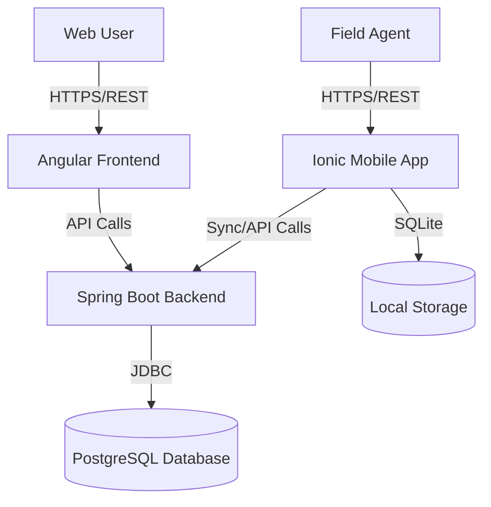

# Integration Architecture

## Overview
The ELYKIA system is a distributed architecture consisting of a central Backend API, a Web Frontend for administration, and a Mobile App for field operations.

## Integration Points

### 1. Frontend <-> Backend
*   **Type:** REST API (JSON)
*   **Protocol:** HTTPS
*   **Authentication:** JWT (Bearer Token)
*   **Key Interactions:**
    *   User Authentication & Authorization
    *   Dashboard Data Visualization (BI)
    *   Tontine Management (Members, Sessions, Cycles)
    *   Stock Management
    *   Order Processing

### 2. Mobile <-> Backend
*   **Type:** REST API (JSON) with Offline Sync
*   **Protocol:** HTTPS
*   **Authentication:** JWT (Bearer Token)
*   **Key Interactions:**
    *   Field Data Collection (Offline-first)
    *   Synchronization of Tontine Collections
    *   Order Taking
    *   Client Registration
*   **Sync Mechanism:**
    *   Mobile app stores data locally in SQLite.
    *   Sync service pushes local changes to Backend when online.
    *   Backend pushes updates to Mobile (delta sync).

### 3. Backend <-> Database
*   **Type:** JDBC / JPA
*   **Database:** PostgreSQL
*   **Interaction:**
    *   Spring Data JPA repositories handle all data access.
    *   Flyway manages schema migrations.

## Data Flow Diagram

