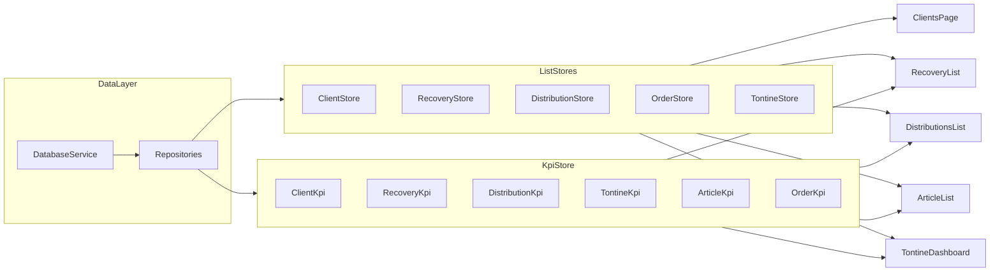

### Objectif général

Mettre en place une **pagination réelle côté base locale** (SQLite/`DatabaseService`) avec un **page size de 20** sur les listes volumineuses de l’app mobile (`mobile/`), tout en **adaptant l’infinite/virtual scroll** pour charger progressivement les données, et en **découplant les KPI** de la longueur des listes en mémoire via des requêtes SQL dédiées et un store KPI.

**Note importante :** Étant donné que le `DatabaseService` s'alourdit, on choisit d'utiliser `mobile\src\app\core\repositories` qui est plus modulable. Pour les futurs changements, on doit prioriser leur utilisation et leur mise à jour pour alléger le service de database progressivement.

---

### 1. Base technique pour la pagination

- **Introduire une constante de pagination**
  - Ajouter une constante partagée `DEFAULT_PAGE_SIZE = 20` (par ex. dans un fichier commun type `[mobile/src/app/core/constants/pagination.ts](mobile/src/app/core/constants/pagination.ts)`) pour éviter les valeurs magiques.
- **Mettre à jour les Repositories pour la pagination (Prioritaire)**
  - Dans les repositories (`ClientRepository`, `DistributionRepository`, `RecoveryRepository`, `OrderRepository`, `TontineMemberRepository`, `ArticleRepository`), ajouter des méthodes paginées qui utilisent `DatabaseService` (ou directement le driver SQL si possible à terme) :
    - `findAllPaginated(page: number, size: number, filters?: any)`
    - `findByCommercialPaginated(commercialUsername: string, page: number, size: number)`
    - `count(filters?: any)`
  - Ces méthodes doivent utiliser `LIMIT/OFFSET` dans les requêtes SQL.
- **Étendre `DatabaseService` (uniquement si nécessaire pour supporter les repositories)**
  - Si les repositories dépendent de méthodes génériques dans `DatabaseService`, ajouter les versions paginées :
    - `getClientsPaginated(...)`, `getDistributionsPaginated(...)`, etc.
  - **Mais l'objectif est de déplacer la logique spécifique vers les repositories.**

---

### 2. Modèle de pagination côté Store (NgRx / NgxStore)

- **Définir un modèle d’état de pagination générique**
  - Créer un type partagé dans un fichier commun (ex. `[mobile/src/app/core/models/pagination.model.ts](mobile/src/app/core/models/pagination.model.ts)`) :
    - `currentPage`, `pageSize`, `items: T[]`, `totalItems`, `hasMore`, `loading`, éventuellement `filters`.
  - Ce modèle sera réutilisé dans les stores clients, recouvrements, distributions, orders, tontine members, etc.
- **Étendre les stores existants pour gérer la pagination**
  - Pour chaque feature qui utilise déjà un store (clients, recoveries, distributions, articles, tontine) :
    - Ajouter des **actions** explicites :
      - `loadFirstPage`, `loadNextPage`, `reloadCurrentPage`, éventuellement `resetPagination`.
    - Adapter les **effects** pour appeler les nouvelles méthodes paginées des **repositories** et :
      - Remplacer `items` à la première page.
      - Concaténer les nouveaux éléments pour `loadNextPage`.
      - Mettre à jour `hasMore` selon `items.length` et `totalItems`.
    - Adapter les **selectors** pour exposer : `items$`, `loading$`, `hasMore$`, `stats$` (si certains KPI restent liés à ce domaine).
- **Cas des écrans sans store**
  - Pour les écrans qui passent encore par un service direct (ex. `OrderService.getOrders()`), prévoir :
    - Soit l’introduction d’un petit store de pagination dédié à l’entité (recommandé pour homogénéité).
    - Soit une pagination gérée localement dans le composant en s’appuyant sur `OrderRepository.findAllPaginated(...)`.

---

### 3. Store KPI dédié et requêtes directes

- **Créer un store KPI/Stats séparé des listes**
  - Ajouter un nouveau module de store (par ex. `KpiStore`) qui ne contient **que** des valeurs agrégées (counts, sums, montants) et **aucune liste complète**.
  - État possible : `clientKpi`, `distributionKpi`, `recoveryKpi`, `tontineKpi`, `articleKpi`, `orderKpi`, chacun avec ses champs (ex. `total`, `today`, `totalAmount`, etc.).
- **Brancher le store KPI sur les Repositories**
  - Créer des actions génériques du type `loadClientKpi`, `loadDistributionKpi`, `loadRecoveryKpi`, `loadTontineKpi`, etc.
  - Dans les effects KPI :
    - Appeler les méthodes `count*` ou d'agrégation exposées par les **repositories**.
    - Si nécessaire, ajouter des méthodes SQL dédiées pour les montants (`SUM`) ou des filtres (ex. `today`, `PENDING`, etc.) dans les repositories.
  - Exposer des selectors `selectClientKpi`, `selectDistributionKpi`, etc. pour être consommés par les composants d’UI.
- **Remplacer les KPI basés sur `list.length**`
  - Cibler les composants/services identifiés comme dépendant de la taille des listes :
    - `recovery-list.component.ts` (stats : `total`, `today`, `totalAmount`).
    - `distributions-list.page.ts` (stats : `total`, `active`, `totalAmount`).
    - `tontine-dashboard.page.ts` (KPI membres, pending deliveries, total collected).
    - `distribution.service.ts` (`getDistributionStats()`).
    - `article-list.page.ts` (`articleCount$`).
    - `dashboard.page.ts` (montant recovery sur période).
    - `rapport-journalier.service.ts` (plusieurs `items.length`, `today*`).
  - Pour chacun :
    - Remplacer l’usage direct des listes (`array.length`, `filter().length`, `reduce()` sur toute la liste) par des **observables de KPI** exposées par `KpiStore`.

---

### 4. Adaptation des écrans de liste à la pagination

Pour chaque écran mentionné, appliquer le même pattern : **ne plus supposer que la liste complète est en mémoire**, mais consommer des pages et déclencher `loadNextPage` via le scroll.

- **Clients – `[mobile/src/app/tabs/clients/clients.page.ts](mobile/src/app/tabs/clients/clients.page.ts)**`
  - Actuellement : sélection de tous les clients via store (`selectClientViewsByCommercialUsername`) et `cdk-virtual-scroll-viewport`.
  - Cible :
    - Le store clients expose `clients$` paginés + `hasMore$`.
    - Ajouter un handler `onScrollEnd`/`onIonInfinite` qui dispatch `loadNextPage` tant que `hasMore` est vrai.
    - `cdk-virtual-scroll-viewport` affiche seulement les éléments déjà chargés (plusieurs pages cumulées), sans jamais charger toute la base.
- **Recovery List – `[mobile/src/app/features/recovery/components/recovery-list/recovery-list.component.ts](mobile/src/app/features/recovery/components/recovery-list/recovery-list.component.ts)**`
  - Actuellement : toutes les recoveries en mémoire, virtual scroll, KPI dérivés de `recoveries.length`.
  - Cible :
    - Store recovery avec pagination (pattern générique) + `recoveries$` paginés.
    - Scroll (virtual ou infinite) déclenche `loadNextPage`.
    - Les stats (total, today, totalAmount) viennent du `KpiStore` et non plus de la liste.
- **Distributions List – `[mobile/src/app/tabs/distributions/distributions-list.page.ts](mobile/src/app/tabs/distributions/distributions-list.page.ts)**`
  - Actuellement : `ion-infinite-scroll` sur un tableau complet (slice sur `distributions`).
  - Cible :
    - Le store distributions gère la pagination et fournit `distributions$` (pages accumulées).
    - `ion-infinite-scroll` appelle `loadNextPage` jusqu’à `hasMore === false` et désactive le composant.
    - Les statistiques (total, active, totalAmount) sont connectées au `KpiStore`.
- **Article List – `[mobile/src/app/features/articles/pages/article-list/article-list.page.ts](mobile/src/app/features/articles/pages/article-list/article-list.page.ts)**`
  - Actuellement : toutes les données chargées, infinite scroll local, `articleCount$ = articles.length`.
  - Cible :
    - Pagination articles via repository + store ou via un service paginé.
    - Adapter `ion-infinite-scroll` pour charger les pages depuis la base.
    - `articleCount$` vient d’un selector `selectArticleKpi.total` basé sur `ArticleRepository.count()`.
- **Localities – `[mobile/src/app/features/localities/pages/locality-list/locality-list.page.ts](mobile/src/app/features/localities/pages/locality-list/locality-list.page.ts)**`
  - Actuellement : liste simple sans scroll.
  - Cible :
    - Évaluer le volume réel : si faible, laisser en l’état ; si potentiellement élevé, aligner sur le pattern pagination (même si pas d’infinite scroll, au moins une `loadMore` explicite ou une pagination simple).
- **Tontine Dashboard – `[mobile/src/app/features/tontine/dashboard/tontine-dashboard.page.ts](mobile/src/app/features/tontine/dashboard/tontine-dashboard.page.ts)**`
  - Actuellement : tous les membres en mémoire, `ion-infinite-scroll`, KPI sur `members.length`.
  - Cible :
    - Pagination des membres de tontine via `TontineMemberRepository`.
    - `ion-infinite-scroll` basé sur `loadNextPage` + `hasMore`.
    - KPI `totalMembers`, `pendingDeliveries`, `totalCollected` via requêtes SQL dédiées et `KpiStore`.
- **Tontine Member Detail – `[mobile/src/app/features/tontine/pages/member-detail/member-detail.page.ts](mobile/src/app/features/tontine/pages/member-detail/member-detail.page.ts)**`
  - Actuellement : `TontineMemberRepository.findAll()` puis filtrage.
  - Cible :
    - Introduire une méthode ciblée (ex. `findByIdWithCollections(memberId)` ou équivalent) pour ne charger que le membre et ses collections.
    - Si des KPI y sont affichés (total collected), les basculer vers une requête SQL dédiée (ou réutiliser une agrégation existante dans `DatabaseService`).
- **Tontine Delivery Creation – `[mobile/src/app/features/tontine/pages/delivery-creation/delivery-creation.page.ts](mobile/src/app/features/tontine/pages/delivery-creation/delivery-creation.page.ts)**`
  - Actuellement : chargement complet des stocks via `TontineStockRepository.getAvailableStocks()`.
  - Cible :
    - Ajouter une méthode paginée si le volume de stocks est important.
    - Adapter la sélection (dropdown / liste) pour charger progressivement ou filtrer côté base lorsque c’est pertinent.
- **New Distribution – `[mobile/src/app/features/distributions/pages/new-distribution/new-distribution.page.ts](mobile/src/app/features/distributions/pages/new-distribution/new-distribution.page.ts)**`
  - Actuellement : virtual scroll sur la liste complète des articles disponibles.
  - Cible :
    - Utiliser les nouvelles APIs paginées d’articles (ou un store) pour ne récupérer que 20 articles à la fois.
    - Conserver le virtual scroll ou passer à un simple infinite scroll, mais sans jamais charger tous les articles.
- **Order List – `[mobile/src/app/features/orders/pages/order-list/order-list.page.ts](mobile/src/app/features/orders/pages/order-list/order-list.page.ts)**`
  - Actuellement : `OrderService.getOrders()` → `DatabaseService.getOrders()` (liste complète) + virtual scroll.
  - Cible :
    - Introduire `findAllPaginated(...)` dans `OrderRepository`.
    - Gérer une pagination simple dans le composant ou via un petit store dédié.
    - Si des KPI sont ajoutés plus tard (nombre de commandes, montants), les brancher sur `countOrders()` et des agrégations SQL.
- **Recovery Client List – `[mobile/src/app/features/recovery-client-list/recovery-client-list.page.ts](mobile/src/app/features/recovery-client-list/recovery-client-list.page.ts)**`
  - Actuellement : tous les clients pour recovery en mémoire, groupés par quartier, pas de scroll.
  - Cible :
    - En fonction du volume réel, soit garder en l’état, soit appliquer une pagination par quartier (ex. charger quartier par quartier, ou une liste paginée de quartiers puis de clients).

---

### 5. Impacts transverses et migration progressive

- **Compatibilité ascendante temporaire**
  - Garder les anciennes méthodes non paginées dans `DatabaseService`/repositories pendant la migration, mais marquées comme deprecated.
  - Migrer **écran par écran** et supprimer les anciennes méthodes uniquement quand plus aucun appelant ne les utilise.
- **Gestion des filtres et recherches**
  - S’assurer que les filtres existants (par date, status, quartier, etc.) soient appliqués **côté SQL** dans les nouvelles méthodes paginées.
  - Prévoir que les filtres fassent repartir la pagination à la page 0 (`resetPagination`).
- **Performance et UX**
  - Vérifier que chaque `ion-infinite-scroll` ou `cdk-virtual-scroll` signale correctement la fin de chargement (`event.target.complete()`, désactivation quand `hasMore` est faux).
  - Gérer les cas offline : comme les données sont locales, la pagination reste fonctionnelle ; les KPI continuent à s’appuyer sur la base locale synchronisée.

---

### 6. Vue d’ensemble des flux (Mermaid)

---

### 7. Todos de haut niveau

- **pagination-core**: Ajouter les méthodes paginées dans les repositories (mobile/src/app/core/repositories) et DatabaseService, plus la constante DEFAULT_PAGE_SIZE. Prioriser l'usage des repositories pour alléger DatabaseService.
- **stores-pagination**: Étendre les stores existants (clients, recoveries, distributions, articles, tontine, orders) avec un état et des actions de pagination.
- **kpi-store**: Créer un store KPI dédié branché sur les repositories (ou DatabaseService.count* si nécessaire) et les agrégations SQL nécessaires.
- **migrate-kpi-usage**: Remplacer tous les KPI basés sur list.length et filter().length par des sélecteurs du KpiStore.
- **screens-pagination-migration**: Adapter progressivement chaque écran de liste mentionné pour consommer les pages depuis les stores/ services paginés et déclencher loadNextPage via l’infinite/virtual scroll.
- **cleanup-deprecated**: Supprimer les anciennes méthodes non paginées une fois toutes les références migrées et vérifier les performances / UX sur un appareil avec beaucoup de données.
