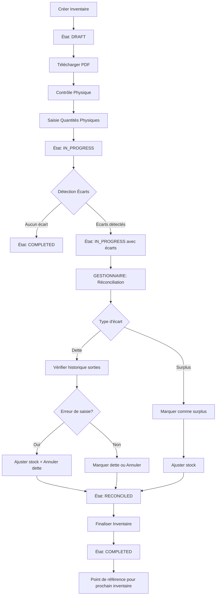

# Plan d'implémentation : Système de gestion d'inventaire complet

## Architecture générale

Le système sera basé sur un workflow d'inventaire mensuel avec les étapes suivantes :

1. **Création d'inventaire** : Génération d'un point d'inventaire avec état initial
2. **Téléchargement PDF** : Export pour contrôle physique
3. **Saisie des quantités physiques** : Enregistrement des résultats du contrôle
4. **Détection des écarts** : Calcul automatique des différences
5. **Réconciliation** : Gestion des écarts par le GESTIONNAIRE
6. **Finalisation** : Clôture de l'inventaire et mise à jour des stocks

## Entités backend à créer/modifier

### 1. Nouvelle entité : `Inventory` (Point d'inventaire)

**Fichier**: `backend/src/main/java/com/optimize/elykia/core/entity/Inventory.java`

Représente un point d'inventaire mensuel avec :

- `id`, `inventoryDate` (date de création), `status` (DRAFT, IN_PROGRESS, COMPLETED, RECONCILED)
- `createdBy` (utilisateur qui a créé l'inventaire)
- `completedAt` (date de finalisation)
- Relation OneToMany avec `InventoryItem`

### 2. Nouvelle entité : `InventoryItem` (Article dans l'inventaire)

**Fichier**: `backend/src/main/java/com/optimize/elykia/core/entity/InventoryItem.java`

Représente un article dans un inventaire avec :

- `id`, `inventory` (ManyToOne), `article` (ManyToOne vers Articles)
- `systemQuantity` (quantité système au moment de l'inventaire)
- `physicalQuantity` (quantité physique saisie, nullable initialement)
- `difference` (calculé : physicalQuantity - systemQuantity)
- `status` (PENDING, VALIDATED, DEBT, SURPLUS, RECONCILED)
- `reconciliationComment` (commentaire de réconciliation)
- `reconciledBy` (utilisateur qui a réconcilié)
- `reconciledAt` (date de réconciliation)
- `markAsDebt` (boolean : si la dette est marquée pour le magasinier)
- `debtCancelled` (boolean : si la dette est annulée)

### 3. Nouvelle entité : `InventoryReconciliation` (Historique de réconciliation)

**Fichier**: `backend/src/main/java/com/optimize/elykia/core/entity/InventoryReconciliation.java`

Historique des actions de réconciliation :

- `id`, `inventoryItem` (ManyToOne)
- `reconciliationType` (DEBT_RESOLUTION, SURPLUS_RESOLUTION, ERROR_CORRECTION)
- `action` (ADJUST_TO_PHYSICAL, MARK_AS_DEBT, CANCEL_DEBT, MARK_AS_SURPLUS)
- `comment` (commentaire de l'action)
- `performedBy` (utilisateur)
- `performedAt` (date)
- `stockBefore`, `stockAfter` (pour traçabilité)

### 4. Nouveau enum : `InventoryStatus`

**Fichier**: `backend/src/main/java/com/optimize/elykia/core/enumaration/InventoryStatus.java`

- `DRAFT`, `IN_PROGRESS`, `COMPLETED`, `RECONCILED`

### 5. Nouveau enum : `InventoryItemStatus`

**Fichier**: `backend/src/main/java/com/optimize/elykia/core/enumaration/InventoryItemStatus.java`

- `PENDING`, `VALIDATED`, `DEBT`, `SURPLUS`, `RECONCILED`

### 6. Nouveau enum : `ReconciliationType`

**Fichier**: `backend/src/main/java/com/optimize/elykia/core/enumaration/ReconciliationType.java`

- `DEBT_RESOLUTION`, `SURPLUS_RESOLUTION`, `ERROR_CORRECTION`

### 7. Nouveau enum : `ReconciliationAction`

**Fichier**: `backend/src/main/java/com/optimize/elykia/core/enumaration/ReconciliationAction.java`

- `ADJUST_TO_PHYSICAL`, `MARK_AS_DEBT`, `CANCEL_DEBT`, `MARK_AS_SURPLUS`

### 8. Modification : `MovementType` (ajout de types)

**Fichier**: `backend/src/main/java/com/optimize/elykia/core/enumaration/MovementType.java`

Ajouter : `INVENTORY_ADJUSTMENT` (ajustement suite à inventaire)

### 9. Modification : `StockOperationType` (ajout de types)

**Fichier**: `backend/src/main/java/com/optimize/elykia/core/enumaration/StockOperationType.java`

Ajouter : `INVENTORY_ADJUSTMENT`

## Services backend

### 1. `InventoryService`

**Fichier**: `backend/src/main/java/com/optimize/elykia/core/service/InventoryService.java`

Méthodes principales :

- `createInventory()` : Créer un nouvel inventaire avec tous les articles
- `getCurrentInventory()` : Obtenir l'inventaire en cours (DRAFT ou IN_PROGRESS)
- `submitPhysicalQuantities(Long inventoryId, Map<Long, Integer> physicalQuantities)` : Soumettre les quantités physiques
- `getInventoryById(Long id)` : Obtenir un inventaire par ID
- `getInventoryItemsWithDiscrepancies(Long inventoryId)` : Obtenir les articles avec écarts
- `canCreateNewInventory()` : Vérifier si un nouvel inventaire peut être créé (pas d'inventaire en cours)
- `finalizeInventory(Long inventoryId)` : Finaliser l'inventaire après réconciliation

### 2. `InventoryReconciliationService`

**Fichier**: `backend/src/main/java/com/optimize/elykia/core/service/InventoryReconciliationService.java`

Méthodes principales :

- `reconcileDebt(Long inventoryItemId, String comment, boolean markAsDebt, boolean cancelDebt)` : Réconcilier une dette
- `reconcileSurplus(Long inventoryItemId, String comment)` : Réconcilier un surplus
- `adjustStockToPhysical(Long inventoryItemId, String comment)` : Ajuster le stock système au niveau physique
- `getReconciliationHistory(Long inventoryItemId)` : Obtenir l'historique de réconciliation
- `checkForInputErrors(Long inventoryItemId, LocalDate startDate, LocalDate endDate)` : Vérifier l'historique des sorties pour erreurs

### 3. Modification : `PdfService`

**Fichier**: `backend/src/main/java/com/optimize/elykia/core/service/PdfService.java`

Ajouter :

- `generateInventoryControlPdf(Long inventoryId)` : Générer le PDF de contrôle d'inventaire avec colonne pour quantités physiques

## DTOs backend

### 1. `InventoryDto`

**Fichier**: `backend/src/main/java/com/optimize/elykia/core/dto/InventoryDto.java`

- Champs de base de l'inventaire

### 2. `InventoryItemDto`

**Fichier**: `backend/src/main/java/com/optimize/elykia/core/dto/InventoryItemDto.java`

- Informations d'un article dans l'inventaire

### 3. `PhysicalQuantitySubmissionDto`

**Fichier**: `backend/src/main/java/com/optimize/elykia/core/dto/PhysicalQuantitySubmissionDto.java`

- `inventoryId`, `items` (Map<articleId, physicalQuantity>)

### 4. `ReconciliationDto`

**Fichier**: `backend/src/main/java/com/optimize/elykia/core/dto/ReconciliationDto.java`

- `inventoryItemId`, `comment`, `markAsDebt`, `cancelDebt`, `action`

### 5. `InventoryControlPdfDto`

**Fichier**: `backend/src/main/java/com/optimize/elykia/core/dto/InventoryControlPdfDto.java`

- Données pour le template PDF

## Contrôleurs backend

### 1. `InventoryController`

**Fichier**: `backend/src/main/java/com/optimize/elykia/core/controller/InventoryController.java`

Endpoints :

- `POST /api/v1/inventories` : Créer un nouvel inventaire (GESTIONNAIRE, MAGASINIER)
- `GET /api/v1/inventories/current` : Obtenir l'inventaire en cours
- `GET /api/v1/inventories/{id}` : Obtenir un inventaire par ID
- `GET /api/v1/inventories` : Lister les inventaires (paginé)
- `POST /api/v1/inventories/{id}/submit-physical-quantities` : Soumettre les quantités physiques (GESTIONNAIRE, MAGASINIER)
- `GET /api/v1/inventories/{id}/items` : Obtenir les articles de l'inventaire
- `GET /api/v1/inventories/{id}/discrepancies` : Obtenir les articles avec écarts (GESTIONNAIRE uniquement)
- `POST /api/v1/inventories/{id}/finalize` : Finaliser l'inventaire (GESTIONNAIRE uniquement)
- `GET /api/v1/inventories/{id}/pdf` : Télécharger le PDF de contrôle (GESTIONNAIRE, MAGASINIER)

### 2. `InventoryReconciliationController`

**Fichier**: `backend/src/main/java/com/optimize/elykia/core/controller/InventoryReconciliationController.java`

Endpoints :

- `POST /api/v1/inventory-reconciliation/reconcile` : Réconcilier un écart (GESTIONNAIRE uniquement)
- `GET /api/v1/inventory-reconciliation/history/{inventoryItemId}` : Historique de réconciliation
- `GET /api/v1/inventory-reconciliation/check-errors/{inventoryItemId}` : Vérifier les erreurs de saisie

## Repositories backend

### 1. `InventoryRepository`

**Fichier**: `backend/src/main/java/com/optimize/elykia/core/repository/InventoryRepository.java`

- `findByStatusIn(List<InventoryStatus> statuses)`
- `findCurrentInventory()` : Inventaire DRAFT ou IN_PROGRESS
- `findByInventoryDateBetween(LocalDate start, LocalDate end)`

### 2. `InventoryItemRepository`

**Fichier**: `backend/src/main/java/com/optimize/elykia/core/repository/InventoryItemRepository.java`

- `findByInventoryId(Long inventoryId)`
- `findByInventoryIdAndStatus(Long inventoryId, InventoryItemStatus status)`
- `findByInventoryIdAndDifferenceNotZero(Long inventoryId)`

### 3. `InventoryReconciliationRepository`

**Fichier**: `backend/src/main/java/com/optimize/elykia/core/repository/InventoryReconciliationRepository.java`

- `findByInventoryItemIdOrderByPerformedAtDesc(Long inventoryItemId)`

## Frontend - Services

### 1. Modification : `InventoryService`

**Fichier**: `frontend/src/app/inventory/service/inventory.service.ts`

Ajouter :

- `createInventory()` : Créer un nouvel inventaire
- `getCurrentInventory()` : Obtenir l'inventaire en cours
- `submitPhysicalQuantities(inventoryId, quantities)` : Soumettre les quantités physiques
- `getInventoryItems(inventoryId)` : Obtenir les articles de l'inventaire
- `getDiscrepancies(inventoryId)` : Obtenir les écarts
- `downloadInventoryPdf(inventoryId)` : Télécharger le PDF
- `reconcileItem(itemId, reconciliationData)` : Réconcilier un écart
- `finalizeInventory(inventoryId)` : Finaliser l'inventaire

## Frontend - Composants

### 1. Modification : `InventoryComponent`

**Fichier**: `frontend/src/app/inventory/inventory/inventory.component.ts` et `.html`

Ajouter :

- Bouton "Créer inventaire" (si pas d'inventaire en cours)
- Affichage de l'inventaire en cours avec statut
- Bouton "Télécharger PDF" pour l'inventaire en cours
- Section pour saisir les quantités physiques (si inventaire IN_PROGRESS)
- Tableau des écarts avec actions de réconciliation (si GESTIONNAIRE)

### 2. Nouveau composant : `InventoryReconciliationComponent`

**Fichier**: `frontend/src/app/inventory/inventory-reconciliation/inventory-reconciliation.component.ts` et `.html`

Composant dédié pour :

- Afficher les articles avec écarts
- Formulaire de réconciliation avec :
  - Commentaire
  - Option "Marquer comme dette"
  - Option "Annuler la dette"
  - Bouton "Ajuster au stock physique"
- Affichage de l'historique de réconciliation
- Vérification des erreurs de saisie (historique des sorties)

### 3. Nouveau composant : `PhysicalQuantityInputComponent`

**Fichier**: `frontend/src/app/inventory/physical-quantity-input/physical-quantity-input.component.ts` et `.html`

Composant pour :

- Saisie des quantités physiques par article
- Validation (quantité >= 0)
- Soumission groupée

## Templates Thymeleaf

### 1. Template PDF : `inventory-control-sheet.html`

**Fichier**: `backend/src/main/resources/templates/inventory-control-sheet.html`

Template pour le PDF avec :

- En-tête : Date, numéro d'inventaire, créé par
- Tableau : #, Nom, Marque, Modèle, Type, Quantité système, Quantité physique (colonne vide), Écart, Statut
- Pied de page : Instructions pour le contrôle

## Permissions et rôles

### Ajout de nouvelles permissions

**Fichier**: `backend/src/main/java/com/optimize/elykia/core/util/UserPermissionConstant.java`

Ajouter :

- `ROLE_CREATE_INVENTORY`
- `ROLE_RECONCILE_INVENTORY`
- `ROLE_FINALIZE_INVENTORY`

**Fichier**: `backend/src/main/resources/application.yml`

Mettre à jour les profils :

- `GESTIONNAIRE` : Ajouter `ROLE_CREATE_INVENTORY`, `ROLE_RECONCILE_INVENTORY`, `ROLE_FINALIZE_INVENTORY`
- `STOREKEEPER` : Ajouter `ROLE_CREATE_INVENTORY`

## Migration de base de données

### Fichier de migration Flyway

**Fichier**: `backend/src/main/resources/db/migration/VX__create_inventory_tables.sql`

Créer les tables :

- `inventory`
- `inventory_item`
- `inventory_reconciliation`

Avec les contraintes et index appropriés.

## Workflow d'inventaire

## Points importants

1. **Validation mensuelle** : Un seul inventaire peut être en cours à la fois (DRAFT ou IN_PROGRESS)
2. **Traçabilité complète** : Tous les ajustements sont enregistrés dans `InventoryReconciliation` et `StockMovement`
3. **Sécurité** : Seul le GESTIONNAIRE peut réconcilier et finaliser
4. **Historique** : L'historique des sorties est consultable pour vérifier les erreurs
5. **Point de référence** : Chaque inventaire finalisé sert de point de départ pour le suivant

## Tests à prévoir

1. Test de création d'inventaire
2. Test de soumission de quantités physiques
3. Test de détection d'écarts
4. Test de réconciliation (dette et surplus)
5. Test de finalisation
6. Test de génération PDF
7. Test de validation mensuelle (un seul inventaire en cours)
8. Test des permissions (GESTIONNAIRE vs MAGASINIER)