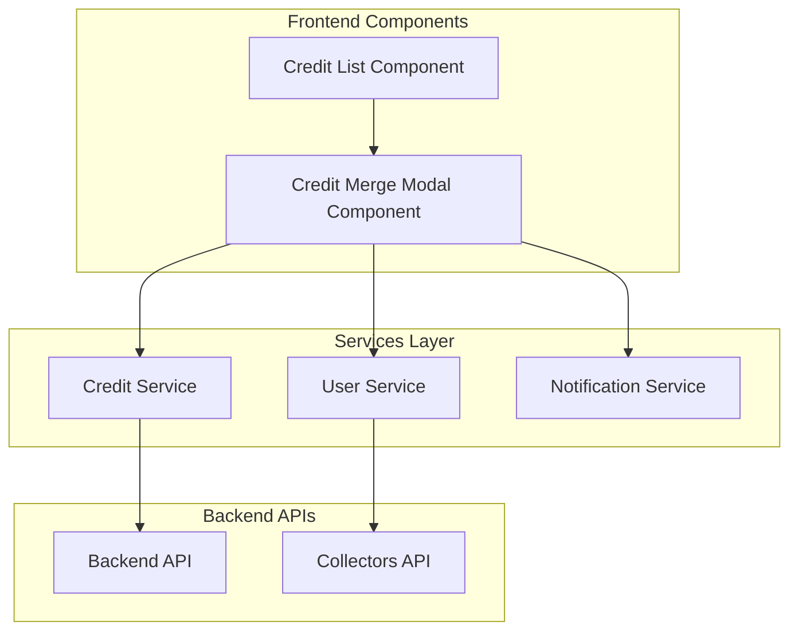
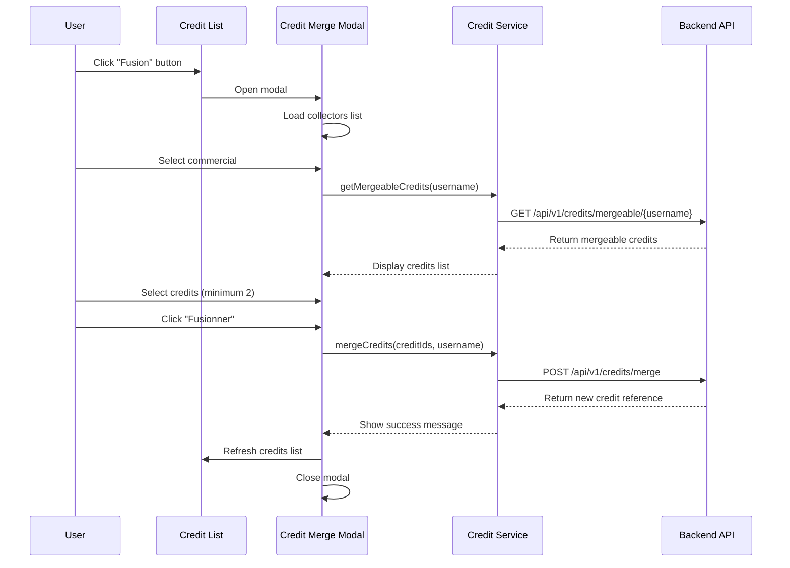

# Design Document

## Overview

La fonctionnalité de fusion des crédits s'intègre dans le module de crédit existant de l'application Angular. Elle permet aux utilisateurs de sélectionner plusieurs crédits d'un même commercial et de les fusionner en un seul crédit consolidé via une interface modale intuitive.

L'architecture suit les patterns existants de l'application avec une séparation claire entre les services (API calls), les composants (UI logic), et les interfaces (type safety).

## Architecture

### Architecture Générale



### Flux de Données



## Components and Interfaces

### 1. Credit Merge Modal Component

**Fichier:** `src/app/credit/credit-merge-modal/credit-merge-modal.component.ts`

**Responsabilités:**
- Gestion de l'interface utilisateur du modal de fusion
- Validation des sélections utilisateur
- Communication avec les services pour les opérations API
- Gestion des états de chargement et d'erreur

**Propriétés principales:**
```typescript
export class CreditMergeModalComponent implements OnInit {
  @Input() collectors: Collector[] = [];
  @Output() onMergeSuccess = new EventEmitter<string>();
  @Output() onClose = new EventEmitter<void>();

  selectedCommercial: string = '';
  mergeableCredits: CreditSummaryDto[] = [];
  selectedCreditIds: number[] = [];
  loading: boolean = false;
  merging: boolean = false;
}
```

### 2. Credit List Component (Modification)

**Fichier:** `src/app/credit/credit-list/credit-list.component.ts`

**Modifications:**
- Ajout du bouton "Fusion"
- Gestion de l'ouverture/fermeture du modal
- Actualisation de la liste après fusion réussie

**Nouvelles propriétés:**
```typescript
showMergeModal: boolean = false;
collectors: Collector[] = [];
```

### 3. Credit Service (Extension)

**Fichier:** `src/app/credit/service/credit.service.ts`

**Nouvelles méthodes:**
```typescript
getMergeableCredits(commercialUsername: string): Observable<ApiResponse<CreditSummaryDto[]>>
mergeCredits(mergeData: MergeCreditDto): Observable<ApiResponse<string>>
```

## Data Models

### Interfaces TypeScript

```typescript
// Interface pour les crédits fusionnables
export interface CreditSummaryDto {
  id: number;
  reference: string;
  beginDate: string; // Format ISO: "2024-01-15"
  totalAmount: number;
}

// Interface pour la requête de fusion
export interface MergeCreditDto {
  creditIds: number[];
  commercialUsername: string;
}

// Interface pour la réponse API générique
export interface ApiResponse<T> {
  status: string;
  statusCode: number;
  message: string;
  data: T | null;
}

// Interface pour les collectors (réutilisation existante)
export interface Collector {
  username: string;
  firstname: string;
  lastname: string;
}
```

### Structure des Données API

**GET /api/v1/credits/mergeable/{commercialUsername}**
```json
{
  "status": "OK",
  "statusCode": 200,
  "message": "Opération réussie",
  "data": [
    {
      "id": 1,
      "reference": "P24123456",
      "beginDate": "2024-01-15",
      "totalAmount": 150000.0
    }
  ]
}
```

**POST /api/v1/credits/merge**
```json
// Request
{
  "creditIds": [1, 2, 3],
  "commercialUsername": "commercial123"
}

// Response
{
  "status": "OK",
  "statusCode": 200,
  "message": "Opération réussie",
  "data": "FP24345678901234"
}
```

## Error Handling

### Stratégie de Gestion d'Erreurs

1. **Erreurs de Validation Frontend:**
   - Validation des champs requis (commercial sélectionné)
   - Validation du nombre minimum de crédits (≥ 2)
   - Messages d'erreur contextuels

2. **Erreurs API:**
   - Gestion des codes d'erreur HTTP (400, 401, 403, 500)
   - Affichage des messages d'erreur retournés par l'API
   - Fallback vers des messages génériques si nécessaire

3. **Erreurs de Réseau:**
   - Gestion des timeouts
   - Gestion des erreurs de connectivité
   - Retry automatique pour certaines opérations

### Implémentation

```typescript
private handleApiError(error: HttpErrorResponse): string {
  if (error.error && error.error.message) {
    return error.error.message;
  }
  
  switch (error.status) {
    case 400:
      return 'Données invalides. Veuillez vérifier votre sélection.';
    case 401:
      return 'Session expirée. Veuillez vous reconnecter.';
    case 403:
      return 'Vous n\'avez pas les permissions nécessaires.';
    case 500:
      return 'Erreur serveur. Veuillez réessayer plus tard.';
    default:
      return 'Une erreur inattendue s\'est produite.';
  }
}
```

## Testing Strategy

### Tests Unitaires

1. **Credit Merge Modal Component:**
   - Test de l'initialisation du composant
   - Test de la sélection/désélection des crédits
   - Test de la validation du formulaire
   - Test des émissions d'événements

2. **Credit Service:**
   - Test des appels API avec les bons paramètres
   - Test de la gestion des erreurs
   - Test de la transformation des données

3. **Credit List Component:**
   - Test de l'ouverture/fermeture du modal
   - Test de l'actualisation après fusion

### Tests d'Intégration

1. **Flux Complet:**
   - Test du flux de sélection commercial → chargement crédits → sélection → fusion
   - Test de la gestion d'erreurs dans le flux complet
   - Test de l'actualisation de la liste après fusion

### Tests E2E

1. **Scénarios Utilisateur:**
   - Fusion réussie avec 2 crédits
   - Fusion réussie avec plus de 2 crédits
   - Gestion des erreurs (commercial sans crédits, erreurs API)
   - Validation des champs requis

## UI/UX Design Considerations

### Cohérence avec l'Existant

1. **Styles et Couleurs:**
   - Réutilisation des classes Bootstrap existantes
   - Cohérence avec le bouton "Ajouter" existant
   - Respect de la charte graphique de l'application

2. **Interactions:**
   - Feedback visuel immédiat sur les actions
   - États de chargement clairs
   - Messages de confirmation/erreur appropriés

### Responsive Design

1. **Adaptabilité:**
   - Modal responsive pour mobile/tablette
   - Liste de crédits scrollable sur petits écrans
   - Boutons adaptés aux interfaces tactiles

### Accessibilité

1. **Standards WCAG:**
   - Labels appropriés pour les éléments de formulaire
   - Navigation au clavier
   - Contraste suffisant pour les textes
   - Messages d'erreur associés aux champs

## Performance Considerations

### Optimisations

1. **Chargement des Données:**
   - Chargement lazy des crédits (seulement après sélection commercial)
   - Pagination si nécessaire pour de grandes listes
   - Cache des collectors pour éviter les rechargements

2. **Gestion Mémoire:**
   - Nettoyage des subscriptions dans ngOnDestroy
   - Réinitialisation des données à la fermeture du modal

3. **Expérience Utilisateur:**
   - Indicateurs de chargement appropriés
   - Debounce sur les actions utilisateur si nécessaire
   - Optimistic UI updates quand possible

## Security Considerations

### Authentification et Autorisation

1. **Token JWT:**
   - Utilisation du TokenStorageService existant
   - Gestion de l'expiration du token
   - Headers d'authentification sur toutes les requêtes

2. **Validation:**
   - Validation côté frontend ET backend
   - Sanitisation des données utilisateur
   - Vérification des permissions utilisateur

### Protection des Données

1. **Données Sensibles:**
   - Pas de stockage local des données sensibles
   - Chiffrement des communications (HTTPS)
   - Logs sécurisés (pas de données sensibles)

## Integration Points

### Services Existants

1. **Credit Service:**
   - Extension avec les nouvelles méthodes API
   - Réutilisation des patterns existants (headers, error handling)
   - Cohérence avec les autres méthodes du service

2. **User Service:**
   - Réutilisation pour le chargement des collectors
   - Cohérence avec les patterns d'authentification

3. **Notification Service:**
   - Utilisation pour les messages de succès/erreur
   - Cohérence avec les autres notifications de l'app

### Composants Existants

1. **Credit List:**
   - Intégration minimale et non-intrusive
   - Réutilisation des styles existants
   - Cohérence avec les autres actions de la liste

## Deployment Considerations

### Configuration

1. **Environment Variables:**
   - URL de base de l'API configurable par environnement
   - Timeouts configurables
   - Feature flags si nécessaire

2. **Build Process:**
   - Pas de modification du processus de build existant
   - Optimisation des bundles (lazy loading si applicable)
   - Tests automatisés dans la CI/CD

### Monitoring

1. **Logging:**
   - Logs des actions utilisateur importantes
   - Logs des erreurs API
   - Métriques de performance

2. **Analytics:**
   - Tracking de l'utilisation de la fonctionnalité
   - Métriques de succès/échec des fusions
   - Temps de réponse des opérations