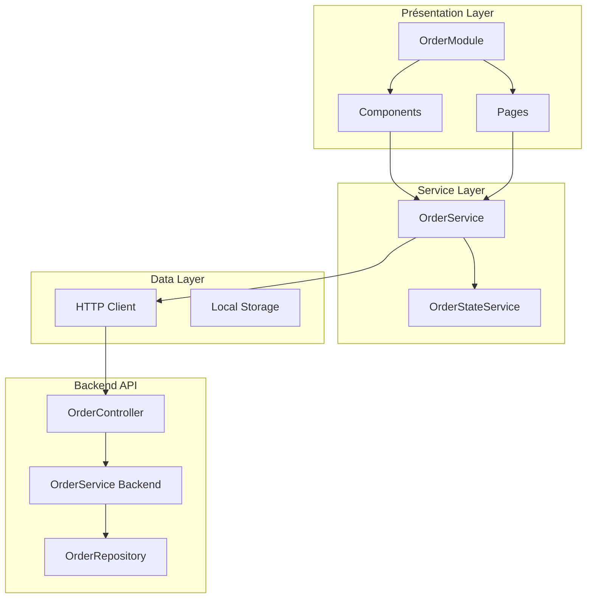

# Document de Conception - Gestion des Commandes

## Vue d'ensemble

Ce document décrit la conception technique du module de gestion des commandes pour l'application web Angular. La conception s'appuie sur l'architecture existante du projet, en particulier les patterns établis par le module tontine, et intègre les spécifications UX définies dans `order_ux_spec.md` et les exigences backend de `order_implementation.md`.

Le module permettra aux gestionnaires de superviser le flux de commandes avec un tableau de bord organisé par statuts, des actions groupées, et une intégration fluide avec le système de crédit existant pour la transformation des commandes en ventes.

## Architecture

### Architecture Générale

Le module Order Management suivra l'architecture en couches établie dans le projet :



### Intégration avec l'Existant

Le module s'intégrera avec l'architecture existante en :

1. **Réutilisant les services communs** : TokenStorageService, HttpClient configuré
2. **Suivant les patterns du TontineModule** : Structure de service avec état réactif, gestion d'erreurs standardisée
3. **Utilisant Angular Material** : Composants UI cohérents avec l'existant
4. **Respectant l'API Response wrapper** : Format de réponse standardisé `ApiResponse<T>`

## Composants et Interfaces

### Structure du Module

```typescript
// order.module.ts
@NgModule({
  declarations: [
    // Pages principales
    OrderDashboardComponent,
    OrderListComponent,
    OrderDetailsComponent,
    OrderFormComponent,
    
    // Composants réutilisables
    OrderKpiCardComponent,
    OrderStatusTabsComponent,
    OrderTableComponent,
    OrderActionBarComponent,
    
    // Modales
    OrderConfirmationModalComponent,
    OrderSellModalComponent
  ],
  imports: [
    CommonModule,
    FormsModule,
    ReactiveFormsModule,
    RouterModule,
    // Angular Material modules (même liste que TontineModule)
    MatIconModule,
    MatButtonModule,
    MatInputModule,
    MatSelectModule,
    MatFormFieldModule,
    MatTableModule,
    MatPaginatorModule,
    MatSortModule,
    MatCheckboxModule,
    MatProgressBarModule,
    MatCardModule,
    MatDialogModule,
    MatDatepickerModule,
    MatNativeDateModule,
    MatTooltipModule,
    MatChipsModule,
    MatMenuModule,
    MatAutocompleteModule,
    MatProgressSpinnerModule,
    MatTabsModule
  ],
  providers: [
    OrderService,
    OrderStateService
  ]
})
export class OrderModule { }
```

### Composants Principaux

#### 1. OrderDashboardComponent
- **Responsabilité** : Page principale avec KPIs et onglets par statut
- **Template** : Cartes KPI + Navigation par onglets + Tableau filtré
- **Logique** : Gestion des filtres par statut, actions groupées

#### 2. OrderTableComponent
- **Responsabilité** : Tableau réutilisable avec sélection multiple
- **Features** : Cases à cocher, tri, pagination, actions contextuelles
- **Inputs** : `orders: Order[]`, `selectable: boolean`, `actions: OrderAction[]`
- **Outputs** : `selectionChange`, `actionClick`, `rowClick`

#### 3. OrderKpiCardComponent
- **Responsabilité** : Affichage des indicateurs clés
- **Inputs** : `title: string`, `value: number`, `icon: string`, `color: string`
- **Réutilisable** : Similaire au KpiCardComponent du module tontine

#### 4. OrderActionBarComponent
- **Responsabilité** : Barre d'actions pour sélections multiples
- **Visibility** : Apparaît uniquement quand des éléments sont sélectionnés
- **Actions** : Accepter, Refuser, Supprimer (selon contexte)

### Services

#### OrderService
Basé sur le pattern du TontineService avec état réactif :

```typescript
@Injectable({
  providedIn: 'root'
})
export class OrderService {
  private readonly apiUrl = `${environment.apiUrl}/api/v1/orders`;
  
  // État réactif
  private stateSubject = new BehaviorSubject<OrderState>({
    orders: [],
    filteredOrders: [],
    filters: {},
    pagination: { page: 0, size: 10, totalElements: 0, totalPages: 0 },
    sort: { field: 'orderDate', direction: 'desc' },
    loading: false,
    error: null,
    kpis: null,
    selectedOrders: []
  });
  
  public state$ = this.stateSubject.asObservable();
  
  // Méthodes principales
  getOrders(filters?: OrderFilters): Observable<ApiResponse<PaginatedResponse<Order>>>
  createOrder(orderData: CreateOrderDto): Observable<ApiResponse<Order>>
  updateOrder(id: number, orderData: UpdateOrderDto): Observable<ApiResponse<Order>>
  deleteOrder(id: number): Observable<ApiResponse<void>>
  updateOrdersStatus(orderIds: number[], status: OrderStatus): Observable<ApiResponse<Order[]>>
  sellOrder(id: number): Observable<ApiResponse<Credit>>
  getKPIs(): Observable<ApiResponse<OrderKPI>>
  
  // Gestion d'état
  private updateState(partialState: Partial<OrderState>): void
  private handleApiError(error: HttpErrorResponse): Observable<never>
}
```

## Modèles de Données

### Interfaces TypeScript

```typescript
// order.types.ts
export interface Order {
  readonly id: number;
  readonly clientId: number;
  readonly clientName: string;
  readonly commercial: string;
  readonly orderDate: string;
  readonly totalAmount: number;
  readonly status: OrderStatus;
  readonly items: readonly OrderItem[];
  readonly createdAt: string;
  readonly updatedAt?: string;
}

export interface OrderItem {
  readonly id: number;
  readonly orderId: number;
  readonly articleId: number;
  readonly articleName: string;
  readonly quantity: number;
  readonly unitPrice: number;
  readonly totalPrice: number;
}

export enum OrderStatus {
  PENDING = 'PENDING',
  ACCEPTED = 'ACCEPTED',
  DENIED = 'DENIED',
  CANCEL = 'CANCEL',
  SOLD = 'SOLD'
}

export interface OrderKPI {
  readonly pendingOrders: number;
  readonly potentialValue: number;
  readonly acceptanceRate: number;
  readonly acceptedPipelineValue: number;
}

export interface CreateOrderDto {
  readonly clientId: number;
  readonly items: readonly CreateOrderItemDto[];
}

export interface CreateOrderItemDto {
  readonly articleId: number;
  readonly quantity: number;
}

export interface UpdateOrderStatusDto {
  readonly orderIds: readonly number[];
  readonly newStatus: OrderStatus;
}

export interface OrderFilters {
  status?: OrderStatus;
  clientName?: string;
  commercial?: string;
  dateFrom?: string;
  dateTo?: string;
  minAmount?: number;
  maxAmount?: number;
}

export interface OrderState {
  readonly orders: readonly Order[];
  readonly filteredOrders: readonly Order[];
  readonly filters: OrderFilters;
  readonly pagination: PaginationConfig;
  readonly sort: SortConfig;
  readonly loading: boolean;
  readonly error: string | null;
  readonly kpis: OrderKPI | null;
  readonly selectedOrders: readonly number[];
}
```

### Constantes et Configuration

```typescript
export const ORDER_CONSTANTS = {
  DEFAULT_PAGE_SIZE: 10,
  MAX_PAGE_SIZE: 100,
  CURRENCY_CODE: 'XOF',
  DATE_FORMAT: 'dd/MM/yyyy',
  DATETIME_FORMAT: 'dd/MM/yyyy HH:mm'
} as const;

export const ORDER_STATUS_LABELS = {
  [OrderStatus.PENDING]: 'En Attente',
  [OrderStatus.ACCEPTED]: 'Acceptée',
  [OrderStatus.DENIED]: 'Refusée',
  [OrderStatus.CANCEL]: 'Annulée',
  [OrderStatus.SOLD]: 'Vendue'
} as const;

export const ORDER_STATUS_COLORS = {
  [OrderStatus.PENDING]: 'warning',
  [OrderStatus.ACCEPTED]: 'primary',
  [OrderStatus.DENIED]: 'danger',
  [OrderStatus.CANCEL]: 'secondary',
  [OrderStatus.SOLD]: 'success'
} as const;
```

## Gestion des Erreurs

### Stratégie de Gestion d'Erreurs

Le module utilisera la même approche que TontineService :

```typescript
private handleApiError = (error: HttpErrorResponse): Observable<never> => {
  let errorMessage = 'Une erreur inattendue s\'est produite.';
  
  // Messages d'erreur contextuels selon le code HTTP
  switch (error.status) {
    case 400:
      errorMessage = 'Données de commande invalides. Veuillez vérifier votre saisie.';
      break;
    case 401:
      errorMessage = 'Session expirée. Veuillez vous reconnecter.';
      break;
    case 403:
      errorMessage = 'Permissions insuffisantes pour gérer les commandes.';
      break;
    case 404:
      errorMessage = 'Commande non trouvée.';
      break;
    case 409:
      errorMessage = 'Conflit : cette commande ne peut pas être modifiée dans son état actuel.';
      break;
    // ... autres codes d'erreur
  }
  
  // Logging pour débogage
  console.error('Order API Error:', {
    status: error.status,
    statusText: error.statusText,
    url: error.url,
    message: errorMessage,
    timestamp: new Date().toISOString()
  });
  
  this.setError(errorMessage);
  return throwError(() => new Error(errorMessage));
};
```

### Messages de Validation

```typescript
export const ORDER_VALIDATION_MESSAGES = {
  CLIENT_REQUIRED: 'Veuillez sélectionner un client',
  ITEMS_REQUIRED: 'Veuillez ajouter au moins un article',
  QUANTITY_MIN: 'La quantité doit être supérieure à 0',
  QUANTITY_MAX: 'Quantité maximale dépassée',
  AMOUNT_INVALID: 'Montant invalide',
  STATUS_TRANSITION_INVALID: 'Changement de statut non autorisé',
  SELECTION_REQUIRED: 'Veuillez sélectionner au moins une commande'
} as const;
```

## Stratégie de Test

### Tests Unitaires

1. **Services** :
   - OrderService : Méthodes CRUD, gestion d'état, gestion d'erreurs
   - Mocking des appels HTTP avec HttpClientTestingModule
   - Tests des transformations d'état et des filtres

2. **Composants** :
   - OrderDashboardComponent : Affichage des KPIs, navigation par onglets
   - OrderTableComponent : Sélection multiple, tri, pagination
   - OrderFormComponent : Validation, soumission, gestion d'erreurs

### Tests d'Intégration

1. **API Integration** :
   - Tests des endpoints avec des données réelles
   - Validation des formats de réponse ApiResponse<T>
   - Tests des codes d'erreur HTTP

2. **Component Integration** :
   - Tests de bout en bout des flux utilisateur
   - Navigation entre les pages
   - Actions groupées et modales de confirmation

### Outils de Test

- **Framework** : Jasmine & Karma (existant)
- **Mocking** : HttpClientTestingModule, jasmine.createSpy
- **Coverage** : Maintenir le niveau de couverture existant
- **E2E** : Cypress ou Protractor pour les tests de bout en bout

## Considérations de Performance

### Optimisations

1. **Lazy Loading** : Le module sera chargé de manière paresseuse
2. **OnPush Strategy** : Utilisation de ChangeDetectionStrategy.OnPush pour les composants
3. **TrackBy Functions** : Pour les listes d'optimisation du rendu
4. **Pagination** : Chargement par pages pour les grandes listes
5. **Debouncing** : Pour les recherches et filtres en temps réel

### Gestion de la Mémoire

1. **Unsubscribe** : Gestion appropriée des souscriptions avec takeUntil
2. **State Management** : État centralisé pour éviter les duplications
3. **Caching** : Cache des données fréquemment utilisées (clients, articles)

## Sécurité

### Authentification et Autorisation

1. **JWT Tokens** : Utilisation du TokenStorageService existant
2. **Route Guards** : Protection des routes avec AuthGuard
3. **API Security** : Headers Authorization Bearer sur tous les appels
4. **Role-based Access** : Vérification des permissions utilisateur

### Validation des Données

1. **Frontend Validation** : Validation des formulaires avec Angular Reactive Forms
2. **Backend Validation** : Validation côté serveur pour la sécurité
3. **Sanitization** : Nettoyage des entrées utilisateur
4. **CSRF Protection** : Protection contre les attaques CSRF

## Déploiement et Migration

### Stratégie de Déploiement

1. **Feature Flags** : Activation progressive du module
2. **Backward Compatibility** : Aucun impact sur les fonctionnalités existantes
3. **Database Migration** : Scripts Liquibase pour les nouvelles tables
4. **API Versioning** : Nouveaux endpoints sous /api/v1/orders

### Plan de Migration

1. **Phase 1** : Déploiement backend avec endpoints inactifs
2. **Phase 2** : Déploiement frontend avec feature flag désactivé
3. **Phase 3** : Tests en environnement de staging
4. **Phase 4** : Activation progressive en production
5. **Phase 5** : Monitoring et ajustements post-déploiement