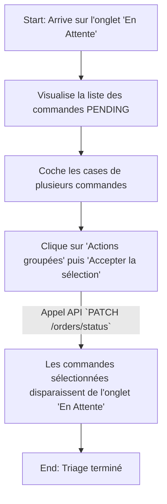
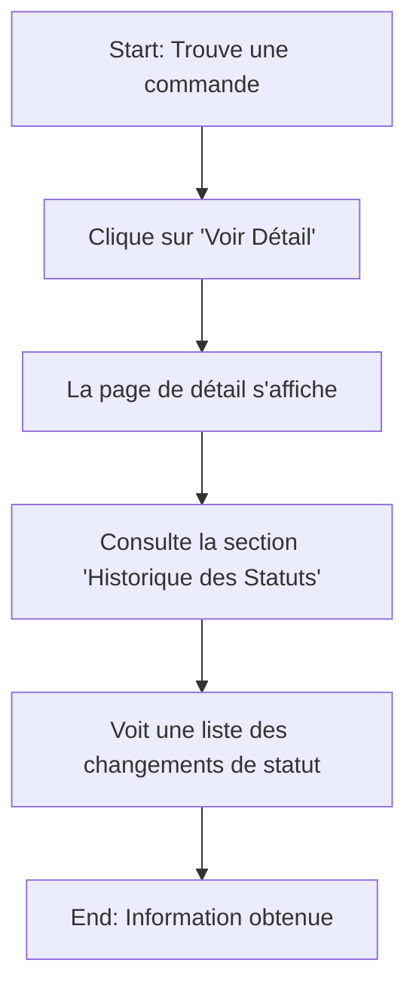

-----

# Spécification UI/UX : Module Web de Gestion des Commandes

## Section 1: Introduction et Objectifs UX

### 1.1 Objectifs et Principes Fondamentaux de l'Expérience Utilisateur (UX)

* **Persona Cible :**

  * **Le Gestionnaire / Administrateur :** Son rôle est de superviser le flux de commandes entrantes, de valider leur pertinence, de les transformer en ventes effectives (`Credit`) et de surveiller les besoins en stock. Il a besoin d'un outil de pilotage.

* **Objectifs de l'Expérience Utilisateur :**

  * **Prise de Décision Rapide :** Le gestionnaire doit pouvoir identifier en un instant les commandes en attente (`PENDING`) et agir dessus de manière individuelle ou groupée.
  * **Fluidité du Processus :** Transformer une commande acceptée (`ACCEPTED`) en une vente (`Credit`) doit être une action simple et directe, reflétant l'API `POST /api/v1/orders/{id}/sell`.
  * **Visibilité Complète :** Offrir une traçabilité totale sur le cycle de vie de chaque commande, y compris l'historique des changements de statut.

* **Principes de Conception :**

  1.  **"Le Statut est Roi" :** L'interface sera organisée autour des statuts des commandes (`PENDING`, `ACCEPTED`, `SOLD`, etc.). Le statut dicte les actions possibles.
  2.  **"Optimiser les Actions en Masse" :** Le gestionnaire doit pouvoir traiter plusieurs commandes simultanément (ex: accepter 10 commandes), comme le permet l'API `PATCH /api/v1/orders/status`.
  3.  **"De la Commande à la Vente Sans Couture" :** Le passage d'une commande à un crédit doit être une étape naturelle et intégrée du flux de travail.

### 1.2 Journal des Modifications (Change Log)

| Date | Version | Description | Auteur |
| :--- | :--- | :--- | :--- |
| 08/10/2025 | 1.0 | Création de la spécification UI/UX pour la gestion des commandes. | UX Expert (Sally) |

-----

## Section 2: Architecture de l'Information (AI)

### 2.1 Plan du Site / Inventaire des Écrans

```mermaid
graph TD
    subgraph Module Commandes (Web)
        A[Tableau de Bord des Commandes] --> B[Liste des Commandes Filtrées par Statut];
        A --> C{Indicateurs Clés (KPIs)};
        A --> D{Actions Globales};

        D --> E[Créer une Commande (Page)];
        D --> F[Voir les Rapports];

        B -- Clic sur une commande --> G[Vue Détail de la Commande];
        B -- Sélection multiple --> H[Actions groupées];

        G --> I[Modifier la Commande (si PENDING)];
        G --> J[Transformer en Vente (si ACCEPTED)];
    end
```

### 2.2 Structure de Navigation

* **Navigation Principale :** Un lien "Commandes" dans le menu principal mènera au tableau de bord.
* **Navigation Secondaire (Proactive) :** Le tableau de bord utilisera une **navigation par onglets basés sur le statut** pour segmenter clairement les tâches :
  * **Onglet "En Attente" (`PENDING`) :** L'écran par défaut, la "boîte de réception" du gestionnaire.
  * **Onglet "Acceptées" (`ACCEPTED`) :** Les commandes prêtes à être transformées en vente.
  * **Onglet "Vendues" (`SOLD`) :** L'historique des commandes finalisées.
  * **Onglet "Autres" :** Pour les commandes refusées (`DENIED`) ou annulées (`CANCEL`).

### 2.3 Indicateurs Clés de Performance (KPIs) Suggérés

Pour un pilotage stratégique, le tableau de bord affichera :

* **KPI 1 : Commandes en Attente :** Le nombre total de commandes avec le statut `PENDING`.
* **KPI 2 : Valeur Potentielle :** La somme des `totalAmount` de toutes les commandes `PENDING`.
* **KPI 3 : Taux d'Acceptation :** Pourcentage de commandes passant de `PENDING` à `ACCEPTED`.
* **KPI 4 : Valeur du Pipeline Accepté :** La somme des `totalAmount` de toutes les commandes `ACCEPTED`.

-----

## Section 3: Flux Utilisateurs (User Flows)

### 3.1 Flux 1 : Traiter les Nouvelles Commandes (Triage en Masse)

* **Objectif :** Examiner et accepter/refuser les nouvelles commandes `PENDING` en groupe.

<!-- end list -->



### 3.2 Flux 2 : Finaliser une Vente (Transformer une Commande en Crédit)

* **Objectif :** Convertir une commande `ACCEPTED` en un `Credit` validé.

<!-- end list -->

```mermaid
graph TD
    A[Start: Navigue vers l'onglet 'Acceptées'] --> B[Clique sur 'Voir Détail' d'une commande];
    B --> C[Sur la page de détail, clique sur 'Transformer en Vente'];
    C --> D{Une modale de confirmation apparaît};
    D -- 'Confirmer' --> E[Appel API `POST /orders/{id}/sell`];
    E --> F[La commande passe au statut 'SOLD' et est déplacée vers l'onglet 'Vendues'];
    F --> G[End: Vente finalisée];
```

### 3.3 Flux 3 : Consulter l'Historique d'une Commande

* **Objectif :** Comprendre le cycle de vie d'une commande, y compris les changements de statut.

<!-- end list -->



-----

## Section 4: Wireframes & Maquettes Conceptuelles

### 4.1 Écran Principal : Tableau de Bord des Commandes

```
+---------------------------------------------------------------------------------+
| Titre: Gestion des Commandes                                                    |
+---------------------------------------------------------------------------------+
| [KPI: 5 En Attente] [KPI: 1.2M XOF Potentiel] [KPI: 85% Taux d'Acceptation]      |
+---------------------------------------------------------------------------------+
| [Bouton: Créer une Commande] [Bouton: Voir les Rapports ▼]                       |
+---------------------------------------------------------------------------------+
| Onglets: [ En Attente (5) ] [ Acceptées (12) ] [ Vendues ] [ Autres ]            |
|---------------------------------------------------------------------------------|
| (BARRE D'ACTIONS GROUPÉES - apparaît si des cases sont cochées)                 |
| [Accepter la sélection] [Refuser la sélection]                                  |
|---------------------------------------------------------------------------------|
|                  ▼ TABLEAU DES COMMANDES (Onglet: En Attente) ▼                 |
|---------------------------------------------------------------------------------|
| [✓] | Client      | Commercial | Date Commande | Montant Total | Actions         |
|-----|-------------|------------|---------------|---------------|-----------------|
| [ ] | Client A    | commercial_A | 08/10/2025    | 250,000 XOF   | [Voir Détail]   |
+---------------------------------------------------------------------------------+
```

### 4.2 Écran Secondaire : Vue Détail de la Commande

```
+---------------------------------------------------------------------------------+
| ← Retour | Commande #123 - Client A                                            |
|---------------------------------------------------------------------------------|
| Statut: [ ACCEPTÉE ] | Montant: 250,000 XOF | Date: 08/10/2025                  |
+---------------------------------------------------------------------------------+
| (Actions contextuelles) -> [Bouton: Transformer en Vente] [Bouton: Annuler...]  |
+---------------------------------------------------------------------------------+
| Articles Commandés                                                              |
|---------------------------------------------------------------------------------|
| - Article X (Quantité: 2, Prix U.: 75,000)                                      |
| - Article Y (Quantité: 1, Prix U.: 100,000)                                     |
+---------------------------------------------------------------------------------+
| Historique des Statuts                                                           |
|---------------------------------------------------------------------------------|
| - Statut changé à ACCEPTED par adminUser le 08/10/2025 à 14:30                  |
| - Statut changé à PENDING par user le 08/10/2025 à 13:00                        |
+---------------------------------------------------------------------------------+
```

### 4.3 Page : Créer ou Modifier une Commande

```
+---------------------------------------------------------------------------------+
| Titre: Créer une nouvelle commande (ou Modifier la commande #123)               |
|---------------------------------------------------------------------------------+
| Client* : [ Rechercher et sélectionner un client... ▼ ]                         |
|---------------------------------------------------------------------------------+
| Articles                                                                        |
| +-----------------------------------------------------------------------------+ |
| | [ Rechercher un article... ▼ ] [ Ajouter ]                                  | |
| |-----------------------------------------------------------------------------| |
| | Article X     | Quantité: [ 2 ] | Prix U.: 75,000 | Total: 150,000 | [Suppr.] | |
| | Article Y     | Quantité: [ 1 ] | Prix U.: 100,000| Total: 100,000 | [Suppr.] | |
| +-----------------------------------------------------------------------------+ |
|                                                         Total Commande: 250,000 |
|---------------------------------------------------------------------------------|
| [ Annuler ]                                             [ Enregistrer Commande ]|
+---------------------------------------------------------------------------------+
```

*La modification n'est possible que si le statut est `PENDING`.*

### 4.4 Modale : Confirmation d'Action

```
+---------------------------------------------+
| (x)    Confirmation Requise                 |
|---------------------------------------------|
|                                             |
|  Êtes-vous sûr de vouloir ACCEPTER           |
|  les 3 commandes sélectionnées ?             |
|                                             |
|---------------------------------------------|
|         [ Annuler ] [ Confirmer ]           |
+---------------------------------------------+
```

-----

## Section 5: Bibliothèque de Composants / Design System

### 5.1 Approche du Design System

L'interface web doit être visuellement cohérente avec l'application mobile existante.

### 5.2 Composants Réutilisables Clés

* **`Carte d'Indicateur Clé (KPI Card)` :** Pour les métriques du tableau de bord.
* **`Navigation par Onglets (Tab Navigation)` :** Pour organiser le tableau de bord par statut.
* **`Tableau de Données Amélioré (Enhanced Data Table)` :** Avec cases à cocher, tri et pagination.
* **`Barre d'Actions Contextuelle (Contextual Action Bar)` :** Pour les actions groupées.
* **`Badge de Statut (Status Badge)` :** Pour visualiser le statut d'une commande avec des couleurs.
* **`Sélecteur d'Article (Article Selector)` :** Pour ajouter des articles à une commande.
* **`Modale de Confirmation (Confirmation Modal)` :** Pour valider les actions importantes.

-----

## Section 6: Prochaines Étapes

1.  **Validation Finale :** Ce document devient la référence pour le développement frontend.
2.  **Maquettes Haute-Fidélité (Optionnel) :** Un designer peut créer des maquettes visuelles détaillées.
3.  **Handoff à l'Architecte Frontend :** L'architecte peut définir l'architecture technique frontend.
