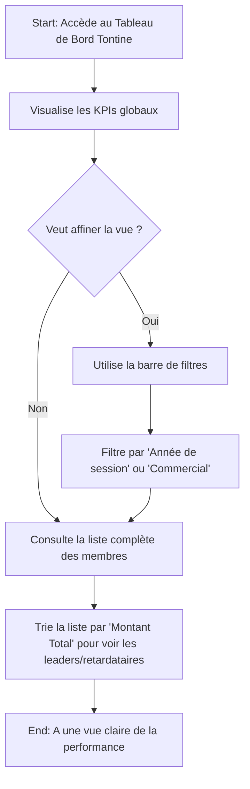
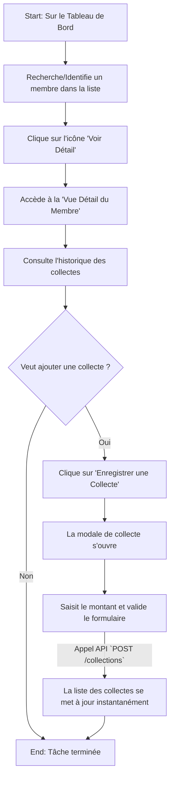
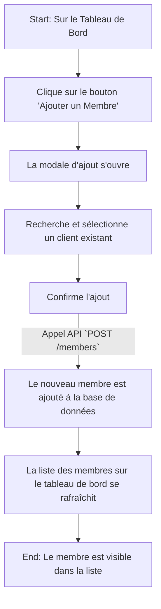

-----

# Spécification UI/UX : Module Web de Gestion des Tontines

## Section 1: Introduction et Objectifs UX

### 1.1 Objectifs et Principes Fondamentaux de l'Expérience Utilisateur (UX)

Cette section définit la vision de l'expérience que nous voulons créer pour le gestionnaire.

* **Personas Cibles :**

  * **Le Gestionnaire de Boutique/Administrateur :** Un utilisateur qui a besoin d'une vue d'ensemble pour superviser l'activité, analyser les performances des commerciaux, et effectuer des tâches administratives (gestion des sessions, corrections, etc.). Il n'est pas sur le terrain mais a besoin de données fiables et en temps réel pour prendre des décisions.

* **Objectifs de l'Expérience Utilisateur :**

  * **Efficacité :** Permettre au gestionnaire de trouver une information ou d'accomplir une tâche en un minimum de clics.
  * **Clarté :** Présenter les données de manière visuelle et compréhensible pour qu'il puisse évaluer la performance en un coup d'œil.
  * **Contrôle :** Donner au gestionnaire les outils nécessaires pour gérer les sessions, les membres et les collectes avec confiance et précision.

* **Principes de Conception :**

  1.  **"La Donnée d'Abord" :** L'interface doit mettre en avant les indicateurs clés de performance (KPIs). Le gestionnaire doit immédiatement voir la santé de l'activité tontine.
  2.  **"Zéro Friction Administrative" :** Les tâches de gestion comme l'ajout d'un membre ou la modification d'une session doivent être simples et guidées.
  3.  **"De la Vue d'Ensemble au Détail" :** L'utilisateur doit pouvoir passer facilement d'une vue globale (tous les commerciaux) à une vue très spécifique (l'historique d'un seul client) de manière intuitive.

### 1.2 Journal des Modifications (Change Log)

| Date | Version | Description | Auteur |
| :--- | :--- | :--- | :--- |
| 08/10/2025 | 1.0 | Création initiale et finalisation de la spécification UI/UX. | UX Expert (Sally) |

-----

## Section 2: Architecture de l'Information (AI)

### 2.1 Plan du Site / Inventaire des Écrans

Le module Tontine sera conçu comme un tableau de bord puissant et centralisé.

```mermaid
graph TD
    subgraph Module Tontine (Web)
        A[Tableau de Bord Tontine] --> B{Actions Principales};
        A --> C[Liste des Membres];

        B --> D[Ouvrir les Paramètres de la Session (Modal)];
        B --> E[Ajouter un Nouveau Membre (Modal)];

        C -- Clic sur un membre --> F[Vue Détail du Membre];
        F --> G[Enregistrer une Collecte (Modal)];
        F --> H[Marquer comme "Livré"];
    end
```

### 2.2 Structure de Navigation

* **Navigation Principale :** L'accès au module "Tontine" se fera via le menu de navigation principal de l'application web.
* **Navigation Secondaire :** La navigation à l'intérieur du module sera principalement gérée par des **filtres** et des **actions directes** sur le tableau de bord, éliminant le besoin de sous-menus complexes.

-----

## Section 3: Flux Utilisateurs (User Flows)

### 3.1 Flux 1 : Superviser la performance des tontines

* **Objectif de l'utilisateur :** Avoir une vue d'ensemble de la session en cours et pouvoir analyser les performances par commercial.

<!-- end list -->



### 3.2 Flux 2 : Gérer un membre spécifique

* **Objectif de l'utilisateur :** Consulter l'historique détaillé d'un client et enregistrer une nouvelle collecte manuellement.

<!-- end list -->



### 3.3 Flux 3 : Inscrire un nouveau membre

* **Objectif de l'utilisateur :** Ajouter un client existant à la session de tontine de l'année en cours.

<!-- end list -->



-----

## Section 4: Wireframes & Maquettes Conceptuelles

### 4.1 Écran Principal : Tableau de Bord Tontine

```
+----------------------------------------------------------------------+
| Titre: Gestion des Tontines                                          |
+----------------------------------------------------------------------+
| KPI 1: Montant Total Collecté | KPI 2: Membres Actifs | KPI 3: ...    |
+----------------------------------------------------------------------+
| [Bouton: Ajouter un Membre] [Bouton: Paramètres de la Session]         |
+----------------------------------------------------------------------+
| Filtres : [Année: 2025 ▼] [Commercial: Tous ▼] [Statut: Tous ▼] [Rechercher...] |
+----------------------------------------------------------------------+
|                                                                      |
|                  ▼ TABLEAU DES MEMBRES (paginé) ▼                    |
|----------------------------------------------------------------------|
| Client (triable) | Commercial (triable) | Total Contribué (triable) | Statut Livraison | Actions |
|------------------|----------------------|---------------------------|------------------|---------|
| Jean Dupont      | commercial_A           | 150,000 XOF (75%)         | En attente       | [Voir]  |
| Awa Gueye        | commercial_B           | 200,000 XOF (100%)        | Livré            | [Voir]  |
+----------------------------------------------------------------------+
| << Page 1 sur 10 >>                                                  |
+----------------------------------------------------------------------+
```

### 4.2 Écran Secondaire : Vue Détail du Membre

```
+----------------------------------------------------------------------+
| Retour | Nom du Client: Jean Dupont                                   |
+----------------------------------------------------------------------+
| Session: 2025 | Commercial: commercial_A                             |
+----------------------------------------------------------------------+
| Résumé: [Total Contribué: 150,000 XOF] [Statut: En attente de livraison] |
+----------------------------------------------------------------------+
| [Bouton: Enregistrer une Collecte] [Bouton: Marquer comme Livré]      |
+----------------------------------------------------------------------+
|                                                                      |
|                  ▼ HISTORIQUE DES COLLECTES ▼                        |
|----------------------------------------------------------------------|
| Date de Collecte (triable) | Montant Collecté | Perçu par             |
|----------------------------|------------------|-----------------------|
| 08/10/2025                 | 5,000 XOF        | commercial_A          |
| ...                        | ...              | ...                   |
+----------------------------------------------------------------------+
```

### 4.3 Modal : Ajouter un Nouveau Membre

```
+----------------------------------------------------------+
| (x)    Ajouter un Membre à la Session 2025                 |
|----------------------------------------------------------|
|                                                          |
|  Sélectionner un Client* |
|  +----------------------------------------------------+  |
|  | Rechercher un client par nom ou par code...      [🔍] |  |
|  +----------------------------------------------------+  |
|                                                          |
|----------------------------------------------------------|
|                      [ Annuler ] [ Confirmer l'Ajout ]   |
+----------------------------------------------------------+
```

*Le formulaire n'attend que l'ID du client, conformément au DTO `TontineMemberDto`.*

### 4.4 Modal : Enregistrer une Collecte

```
+----------------------------------------------------------+
| (x)    Enregistrer une Collecte                          |
|----------------------------------------------------------|
|                                                          |
|  Membre : Jean Dupont                                    |
|                                                          |
|  Montant de la Collecte* |
|  +----------------------------------------------------+  |
|  | Saisir le montant...                      (XOF)    |  |
|  +----------------------------------------------------+  |
|                                                          |
|----------------------------------------------------------|
|                      [ Annuler ] [ Enregistrer ]         |
+----------------------------------------------------------+
```

*Le formulaire requiert le montant, qui doit être positif, et le `memberId` (implicite).*

### 4.5 Modal : Paramètres de la Session

```
+----------------------------------------------------------+
| (x)    Modifier la Session en Cours (2025)               |
|----------------------------------------------------------|
|                                                          |
|  Date de Début* |
|  +----------------------------------------------------+  |
|  | JJ/MM/AAAA                                     [📅] |  |
|  +----------------------------------------------------+  |
|                                                          |
|  Date de Fin* |
|  +----------------------------------------------------+  |
|  | JJ/MM/AAAA                                     [📅] |  |
|  +----------------------------------------------------+  |
|                                                          |
|----------------------------------------------------------|
|           [ Annuler ] [ Enregistrer les Modifications ]  |
+----------------------------------------------------------+
```

*Ce formulaire permet de mettre à jour la session via l'endpoint `PUT /sessions/current` et attend une date de début et de fin.*

-----

## Section 5: Bibliothèque de Composants / Design System

### 5.1 Approche du Design System

L'application web doit être visuellement cohérente avec l'application mobile. La stratégie est de **réutiliser et d'adapter le design system existant**.

### 5.2 Composants Réutilisables Clés

* **`Carte d'Indicateur Clé (KPI Card)` :** Pour afficher les métriques principales sur le tableau de bord.
* **`Barre de Filtres (Filter Bar)` :** Pour fournir des contrôles de recherche et de filtrage.
* **`Tableau de Données (Data Table)` :** Pour afficher des listes de données avec tri, pagination et actions.
* **`Fenêtre Modale (Modal)` :** Pour afficher les formulaires et les confirmations.
* **`Sélecteur de Client (Client Selector)` :** Champ de recherche avancé pour trouver et sélectionner des clients.

-----

## Section 6: Prochaines Étapes

1.  **Validation Finale :** Ce document sert de référence pour le développement frontend.
2.  **Maquettes Haute-Fidélité (Optionnel) :** Un designer graphique peut créer des maquettes visuelles détaillées à partir de ce document.
3.  **Handoff à l'Architecte Frontend :** L'architecte peut maintenant définir l'architecture technique frontend.


