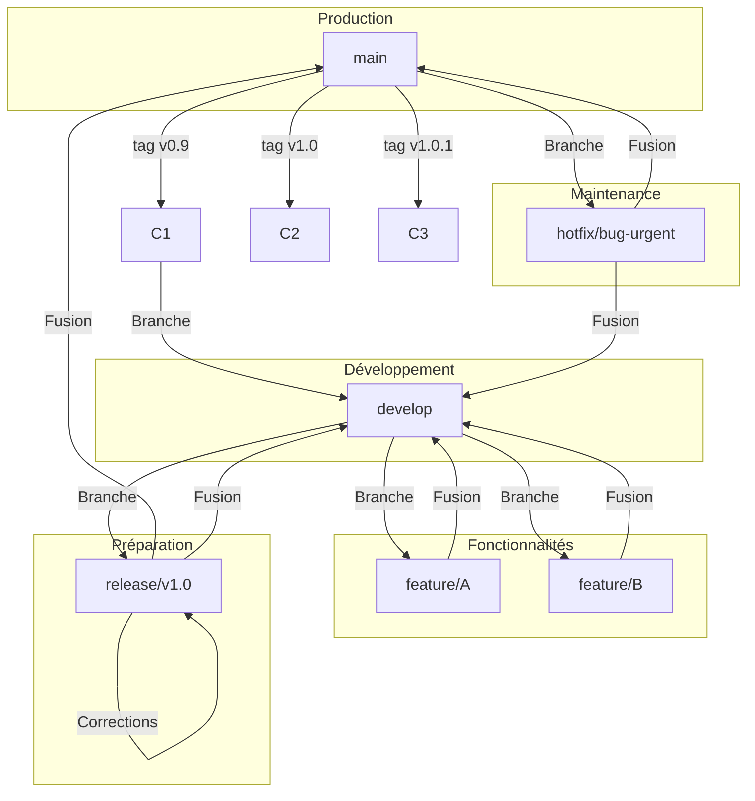

# Méthodologie Gitflow pour le Projet Elykia Mobile

Ce document décrit la méthodologie de gestion des branches Git (Gitflow) que nous utilisons pour le projet Elykia Mobile. Il est essentiel de suivre cette approche pour maintenir un historique de code propre, compréhensible et facile à gérer, surtout pour les nouveaux développeurs qui rejoignent l'équipe.

## Pourquoi Gitflow ?

Gitflow est un modèle de branching qui aide à organiser le développement de nouvelles fonctionnalités, la préparation des versions (releases) et la maintenance (corrections de bugs urgents). Il évite le chaos en définissant des rôles clairs pour différentes branches.

## Les Branches Principales

Il existe deux branches principales qui ont une durée de vie infinie :

1.  `main` (ou `master`)
    *   **Objectif :** Cette branche contient la version la plus récente du code qui est en production. Le code sur `main` doit toujours être stable et testé.
    *   **Règle d'or :** On ne commite **jamais** directement sur la branche `main`. Les seules modifications proviennent des branches de `release` ou de `hotfix`.

2.  `develop`
    *   **Objectif :** C'est la branche principale de développement. Elle intègre toutes les fonctionnalités terminées et représente l'état le plus à jour du code pour la **prochaine version**.
    *   **Règle d'or :** C'est la branche de base pour tout nouveau développement.

## Les Branches de Support

Ce sont des branches temporaires qui nous aident à organiser le travail au quotidien.

### 1. Branches de Fonctionnalité (`feature/*`)

*   **Objectif :** Développer une nouvelle fonctionnalité (par exemple, une User Story).
*   **Branche parente :** `develop`
*   **Fusionne vers :** `develop`
*   **Convention de nommage :** `feature/USXXX-description-courte` (ex: `feature/US009-creation-client`)

#### Comment l'utiliser ?

1.  **Démarrer une nouvelle fonctionnalité :**
    Avant de commencer, assurez-vous que votre branche `develop` est à jour, puis créez votre branche de fonctionnalité.
    ```bash
    # 1. Se placer sur la branche develop
    git checkout develop

    # 2. Récupérer les dernières modifications
    git pull origin develop

    # 3. Créer et se placer sur la nouvelle branche
    git checkout -b feature/US009-creation-client
    ```

2.  **Travailler sur la fonctionnalité :**
    Faites vos commits sur cette branche.
    ```bash
    git add .
    git commit -m "feat: ajout du formulaire de création client"
    # ... travail ...
    ```

3.  **Terminer la fonctionnalité :**
    Une fois la fonctionnalité terminée et testée, fusionnez-la dans `develop`.
    ```bash
    # 1. Revenir sur develop
    git checkout develop

    # 2. S'assurer qu'elle est à jour
    git pull origin develop

    # 3. Fusionner la branche de fonctionnalité
    git merge --no-ff feature/US009-creation-client

    # 4. Pousser les changements sur le serveur
    git push origin develop

    # 5. (Optionnel mais recommandé) Supprimer la branche locale
    git branch -d feature/US009-creation-client
    ```
    L'option `--no-ff` (no fast-forward) est importante car elle crée un commit de fusion, ce qui permet de garder une trace claire de l'intégration de la fonctionnalité dans l'historique.

### 2. Branches de Release (`release/*`)

*   **Objectif :** Préparer une nouvelle version pour la production. Cette branche est utilisée pour les derniers tests, les corrections de bugs mineurs et la préparation de la documentation de la release.
*   **Branche parente :** `develop`
*   **Fusionne vers :** `main` ET `develop`
*   **Convention de nommage :** `release/vX.Y.Z` (ex: `release/v1.0.0`)

#### Comment l'utiliser ?

1.  **Créer la branche de release :**
    Quand la branche `develop` contient toutes les fonctionnalités prévues pour la prochaine version.
    ```bash
    git checkout -b release/v1.0.0 develop
    ```

2.  **Finaliser la release :**
    Sur cette branche, on ne fait que des corrections de bugs. Aucune nouvelle fonctionnalité n'est ajoutée.

3.  **Terminer la release :**
    *   Fusionner dans `main` et créer un tag pour marquer la version.
        ```bash
        git checkout main
        git merge --no-ff release/v1.0.0
        git tag -a v1.0.0 -m "Version 1.0.0"
        git push origin main --tags
        ```
    *   Fusionner également dans `develop` pour que les corrections de bugs faites sur la branche de release soient aussi présentes dans le code de développement.
        ```bash
        git checkout develop
        git merge --no-ff release/v1.0.0
        git push origin develop
        ```
    *   Supprimer la branche de release.

### 3. Branches de Hotfix (`hotfix/*`)

*   **Objectif :** Corriger un bug critique découvert en production.
*   **Branche parente :** `main`
*   **Fusionne vers :** `main` ET `develop`
*   **Convention de nommage :** `hotfix/description-du-bug` (ex: `hotfix/probleme-connexion-urgent`)

#### Comment l'utiliser ?

1.  **Créer la branche de hotfix :**
    ```bash
    git checkout -b hotfix/probleme-connexion-urgent main
    ```

2.  **Corriger le bug :**
    Faites le commit avec la correction.

3.  **Terminer le hotfix :**
    *   Fusionner dans `main` et créer un nouveau tag (on incrémente la version de patch).
        ```bash
        git checkout main
        git merge --no-ff hotfix/probleme-connexion-urgent
        git tag -a v1.0.1 -m "Correction bug de connexion urgent"
        git push origin main --tags
        ```
    *   Fusionner dans `develop` pour que la correction soit aussi appliquée pour les prochaines versions.
        ```bash
        git checkout develop
        git merge --no-ff hotfix/probleme-connexion-urgent
        git push origin develop
        ```
    *   Supprimer la branche de hotfix.

## Schéma Visuel


