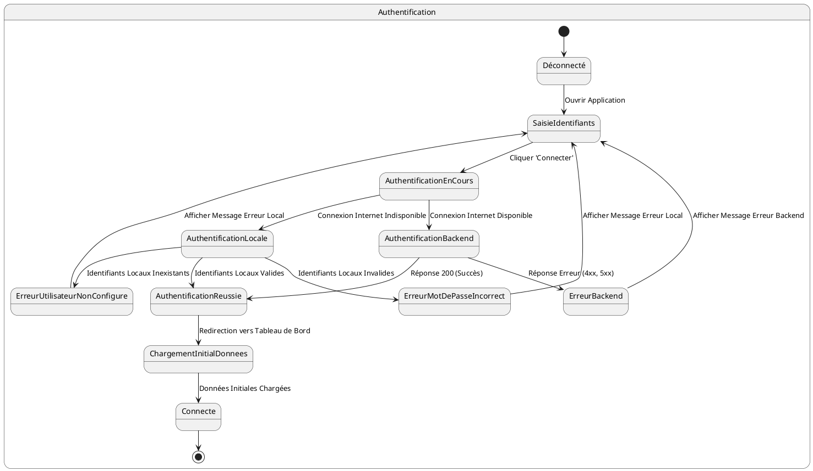
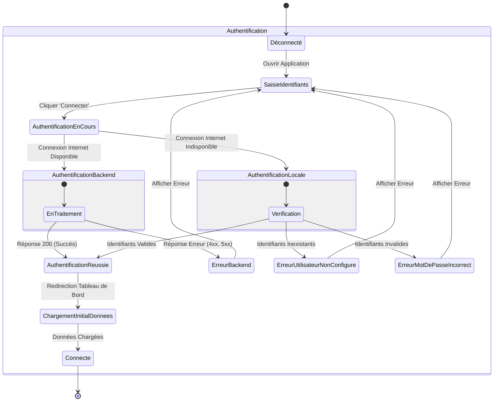

# US001 - Connexion Utilisateur

**Contexte :**

En tant que commercial, je souhaite me connecter à l'application mobile afin d'accéder à mes fonctionnalités et données, que je sois en ligne ou hors ligne, pour pouvoir travailler sans interruption.

**Description de la fonctionnalité :**

Cette fonctionnalité permet à l'utilisateur de s'authentifier auprès de l'application mobile. L'écran de connexion doit permettre la saisie d'un nom d'utilisateur et d'un mot de passe. Le processus d'authentification doit gérer les scénarios en ligne (connexion au serveur backend) et hors ligne (authentification locale).

**Règles Métiers :**

*   **RM-AUTH-001 :** L'application doit présenter un écran de connexion au démarrage si l'utilisateur n'est pas déjà authentifié.
*   **RM-AUTH-002 :** Les champs 

username et password sont obligatoires.
*   **RM-AUTH-003 :** Au clic sur le bouton 'Connecter', l'application tente d'abord une connexion au serveur backend via l'API `POST {{baseUrl}}/api/auth/signin`.
*   **RM-AUTH-004 :** En cas de succès (HTTP 200) de l'authentification backend, les informations suivantes sont stockées localement de manière sécurisée : `username`, `password` (crypté), `email`, `roles`, `refreshToken`, `accessToken`.
*   **RM-AUTH-005 :** Si la connexion au serveur échoue (pas de réseau, erreur 4xx, 5xx), l'application tente une authentification locale en utilisant les identifiants stockés.
*   **RM-AUTH-006 :** Si l'authentification locale échoue car l'utilisateur n'est pas trouvé dans la base de données locale, le message "Utilisateur non configuré pour cet appareil !" est affiché.
*   **RM-AUTH-007 :** Si l'authentification locale échoue en raison d'un mot de passe incorrect, le message "Nom d'utilisateur ou mot de passe incorrect" est affiché.
*   **RM-AUTH-008 :** Après une authentification réussie (locale ou backend), l'utilisateur est redirigé vers le tableau de bord. Un spinner ou une barre de progression avec un fond flou ou un effet de verre doit être affiché pendant le chargement des données initiales.

**Tests d'Acceptance :**

*   **TA-AUTH-001 :** **Scénario :** Connexion en ligne réussie.
    *   **Given :** L'utilisateur a une connexion internet et saisit des identifiants valides.
    *   **When :** L'utilisateur clique sur 'Connecter'.
    *   **Then :** L'application envoie la requête à l'API, reçoit une réponse 200, stocke les informations localement, et redirige vers le tableau de bord avec un indicateur de chargement.
*   **TA-AUTH-002 :** **Scénario :** Connexion en ligne échouée (identifiants invalides).
    *   **Given :** L'utilisateur a une connexion internet et saisit des identifiants invalides.
    *   **When :** L'utilisateur clique sur 'Connecter'.
    *   **Then :** L'application reçoit une réponse d'erreur (401, 403, 500) du backend et affiche le message d'erreur correspondant.
*   **TA-AUTH-003 :** **Scénario :** Connexion hors ligne réussie (identifiants synchronisés).
    *   **Given :** L'utilisateur n'a pas de connexion internet et a déjà synchronisé ses identifiants lors d'une connexion précédente.
    *   **When :** L'utilisateur saisit ses identifiants et clique sur 'Connecter'.
    *   **Then :** L'application authentifie localement et redirige vers le tableau de bord avec un indicateur de chargement.
*   **TA-AUTH-004 :** **Scénario :** Connexion hors ligne échouée (utilisateur non configuré).
    *   **Given :** L'utilisateur n'a pas de connexion internet et n'a jamais synchronisé ses identifiants sur cet appareil.
    *   **When :** L'utilisateur saisit ses identifiants et clique sur 'Connecter'.
    *   **Then :** L'application affiche le message "Utilisateur non configuré pour cet appareil !"
*   **TA-AUTH-005 :** **Scénario :** Connexion hors ligne échouée (mot de passe incorrect).
    *   **Given :** L'utilisateur n'a pas de connexion internet et a déjà synchronisé ses identifiants, mais saisit un mot de passe incorrect.
    *   **When :** L'utilisateur clique sur 'Connecter'.
    *   **Then :** L'application affiche le message "Nom d'utilisateur ou mot de passe incorrect".

**Diagramme d'État (PlantUML) :**

