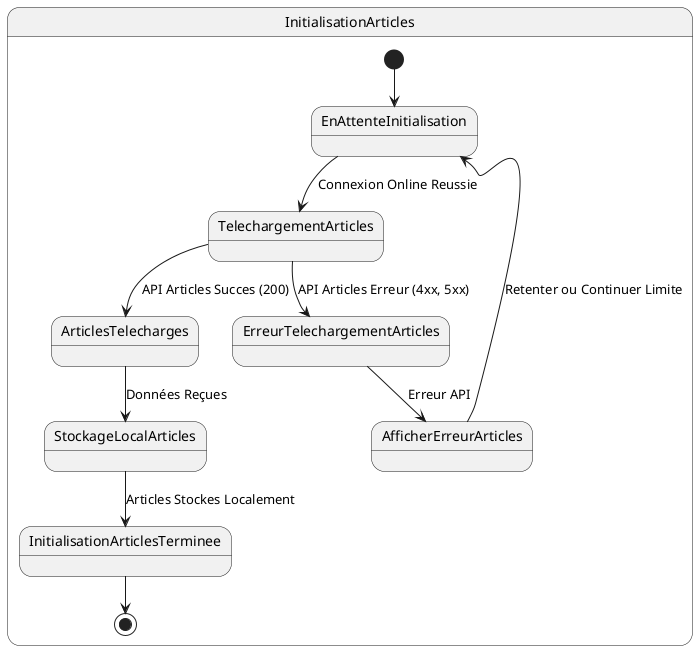
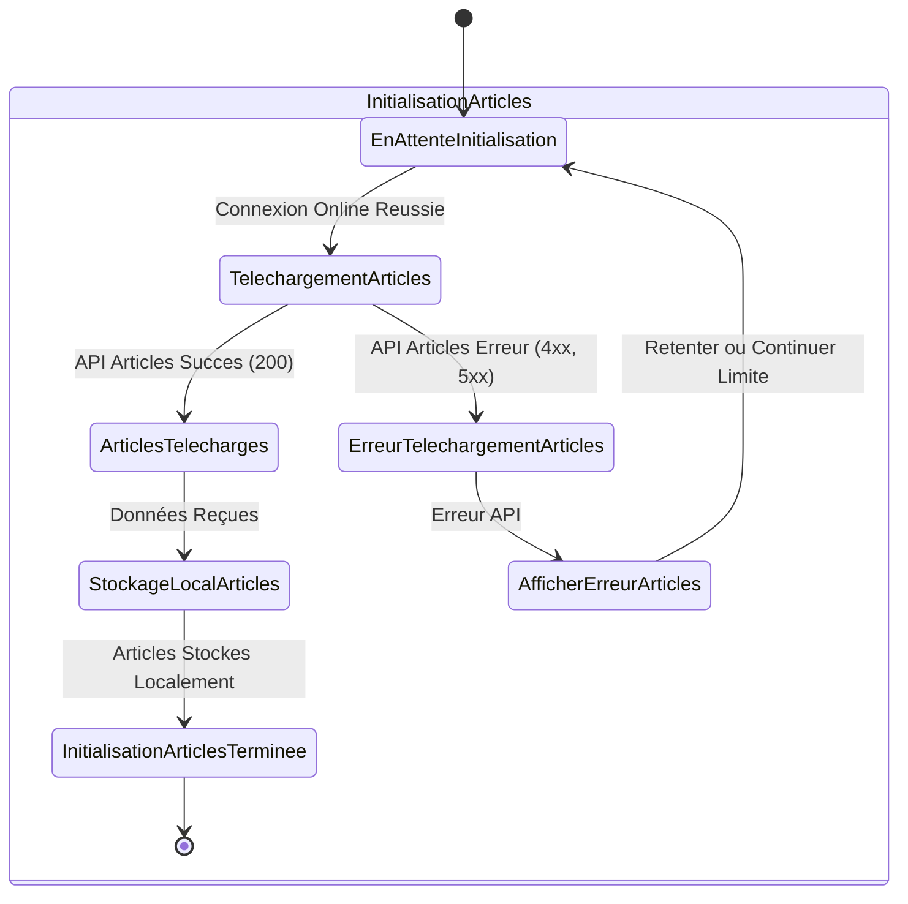

# US002 - Initialisation des Articles

**Contexte :**

En tant que commercial, après m'être connecté pour la première fois en ligne, je souhaite que l'application télécharge et stocke localement la liste des articles disponibles afin de pouvoir les consulter et les utiliser même sans connexion internet.

**Description de la fonctionnalité :**

Cette fonctionnalité permet à l'application de récupérer la liste complète des articles depuis le backend et de les enregistrer dans la base de données locale de l'appareil mobile. Ce processus se déclenche automatiquement après une authentification réussie en ligne.

**Règles Métiers :**

*   **RM-INIT-ART-001 :** L'application doit appeler l'API `GET {{baseUrl}}/api/v1/articles/all` après une connexion en ligne réussie.
*   **RM-INIT-ART-002 :** Seuls les champs `id`, `creditSalePrice`, `name`, `marque`, `model`, `type`, `stockQuantity`, et `commercialName` des articles doivent être stockés dans la base de données locale.
*   **RM-INIT-ART-003 :** Les champs `purchasePrice` et `sellingPrice` ne doivent pas être stockés localement car ils ne sont pas pertinents pour les opérations du commercial sur le terrain.
*   **RM-INIT-ART-004 :** En cas d'échec de la récupération des articles (réponse d'erreur de l'API), l'application doit afficher un message d'erreur informatif à l'utilisateur et proposer une option pour retenter l'initialisation ou continuer avec des données limitées.
*   **RM-INIT-ART-005 :** Un indicateur de progression (spinner ou barre de progression) doit être visible pendant le téléchargement des articles.

**Tests d'Acceptance :**

*   **TA-INIT-ART-001 :** **Scénario :** Initialisation des articles réussie.
    *   **Given :** L'utilisateur est connecté en ligne et l'initialisation des données est en cours.
    *   **When :** L'application appelle l'API des articles et reçoit une réponse 200 avec des données valides.
    *   **Then :** Les articles sont stockés localement avec les champs spécifiés, et l'indicateur de progression avance.
*   **TA-INIT-ART-002 :** **Scénario :** Initialisation des articles échouée (erreur API).
    *   **Given :** L'utilisateur est connecté en ligne et l'initialisation des données est en cours.
    *   **When :** L'application appelle l'API des articles et reçoit une réponse d'erreur (ex: 500).
    *   **Then :** Un message d'erreur est affiché à l'utilisateur, et l'application propose des options de récupération.

**Diagramme d'État (PlantUML) :**

