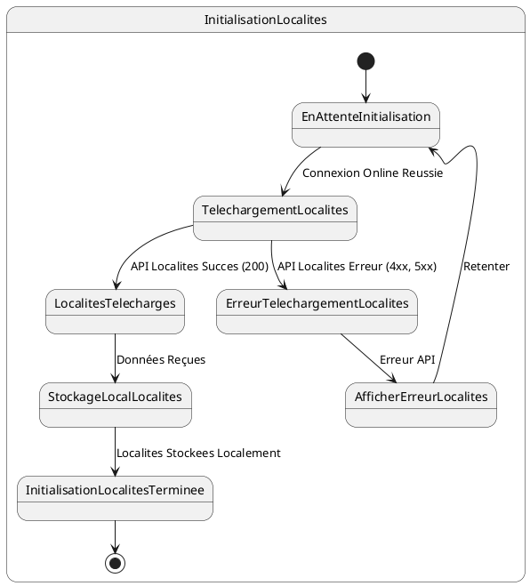

# US003 - Initialisation des Localités

**Contexte :**

En tant que commercial, après m'être connecté pour la première fois en ligne, je souhaite que l'application télécharge et stocke localement la liste des localités afin de pouvoir les utiliser lors de l'enregistrement de nouveaux clients, même sans connexion internet.

**Description de la fonctionnalité :**

Cette fonctionnalité permet à l'application de récupérer la liste complète des localités depuis le backend et de les enregistrer dans la base de données locale de l'appareil mobile. Ces localités seront utilisées pour associer les clients à des zones géographiques spécifiques.

**Règles Métiers :**

*   **RM-INIT-LOC-001 :** L'application doit appeler l'API `GET {{baseUrl}}/api/v1/localities/all` après une connexion en ligne réussie.
*   **RM-INIT-LOC-002 :** La liste des localités se trouve directement dans le champ `data` de la réponse API.
*   **RM-INIT-LOC-003 :** Toutes les localités retournées par l'API doivent être stockées localement avec leurs champs `id` et `name`.
*   **RM-INIT-LOC-004 :** En cas d'échec de la récupération des localités (réponse d'erreur de l'API), l'application doit afficher un message d'erreur informatif et proposer une option pour retenter l'initialisation.
*   **RM-INIT-LOC-005 :** Un indicateur de progression doit être visible pendant le téléchargement des localités.

**Tests d'Acceptance :**

*   **TA-INIT-LOC-001 :** **Scénario :** Initialisation des localités réussie.
    *   **Given :** L'utilisateur est connecté en ligne et l'initialisation des données est en cours.
    *   **When :** L'application appelle l'API des localités et reçoit une réponse 200 avec des données valides.
    *   **Then :** Les localités sont stockées localement avec leurs champs `id` et `name`, et l'indicateur de progression avance.
*   **TA-INIT-LOC-002 :** **Scénario :** Initialisation des localités échouée (erreur API).
    *   **Given :** L'utilisateur est connecté en ligne et l'initialisation des données est en cours.
    *   **When :** L'application appelle l'API des localités et reçoit une réponse d'erreur.
    *   **Then :** Un message d'erreur est affiché à l'utilisateur, et l'application propose des options de récupération.

**Diagramme d'État (PlantUML) :**



```mermaid
stateDiagram-v2
    [*] --> EnAttenteInitialisation
    
    state InitialisationLocalites {
        EnAttenteInitialisation --> TelechargementLocalites : Connexion Online Reussie
        
        TelechargementLocalites --> LocalitesTelecharges : API Localites Succes (200)
        TelechargementLocalites --> ErreurTelechargementLocalites : API Localites Erreur (4xx, 5xx)
        
        LocalitesTelecharges --> StockageLocalLocalites : Données Reçues
        StockageLocalLocalites --> InitialisationLocalitesTerminee : Localites Stockees Localement
        
        ErreurTelechargementLocalites --> AfficherErreurLocalites : Erreur API
        AfficherErreurLocalites --> EnAttenteInitialisation : Retenter
        
        InitialisationLocalitesTerminee --> [*]
    }
