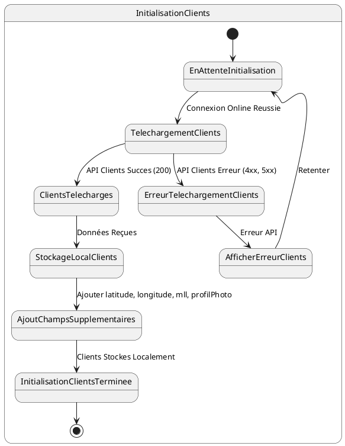

# US004 - Initialisation des Clients du Commercial

**Contexte :**

En tant que commercial, après m'être connecté pour la première fois en ligne, je souhaite que l'application télécharge et stocke localement la liste de mes clients afin de pouvoir les consulter et effectuer des opérations avec eux même sans connexion internet.

**Description de la fonctionnalité :**

Cette fonctionnalité permet à l'application de récupérer la liste des clients associés au commercial connecté depuis le backend et de les enregistrer dans la base de données locale de l'appareil mobile. Les données des clients incluent leurs informations personnelles et de contact.

**Règles Métiers :**

*   **RM-INIT-CLI-001 :** L'application doit appeler l'API `GET {{baseUrl}}/api/v1/clients/by-commercial/{commercial-username}?page=0&size=2000&sort=id,desc` après une connexion en ligne réussie.
*   **RM-INIT-CLI-002 :** La liste des clients se trouve dans le champ `data.content` de la réponse API.
*   **RM-INIT-CLI-003 :** Tous les champs des clients retournés par l'API doivent être stockés localement.
*   **RM-INIT-CLI-004 :** Pour la base de données locale, les attributs supplémentaires `latitude`, `longitude`, `mll` (map location link) et `profilPhoto` doivent être ajoutés à chaque client. Ces valeurs peuvent être nulles pour les données récupérées du serveur.
*   **RM-INIT-CLI-005 :** Pour les nouveaux clients enregistrés localement, les champs `latitude`, `longitude`, `mll` et `profilPhoto` seront obligatoires.
*   **RM-INIT-CLI-006 :** En cas d'échec de la récupération des clients (réponse d'erreur de l'API), l'application doit afficher un message d'erreur informatif et proposer une option pour retenter l'initialisation.
*   **RM-INIT-CLI-007 :** Un indicateur de progression doit être visible pendant le téléchargement des clients.

**Tests d'Acceptance :**

*   **TA-INIT-CLI-001 :** **Scénario :** Initialisation des clients réussie.
    *   **Given :** L'utilisateur est connecté en ligne et l'initialisation des données est en cours.
    *   **When :** L'application appelle l'API des clients et reçoit une réponse 200 avec des données valides.
    *   **Then :** Les clients sont stockés localement avec tous leurs champs, incluant les champs supplémentaires (latitude, longitude, mll, profilPhoto) initialisés à null, et l'indicateur de progression avance.
*   **TA-INIT-CLI-002 :** **Scénario :** Initialisation des clients échouée (erreur API).
    *   **Given :** L'utilisateur est connecté en ligne et l'initialisation des données est en cours.
    *   **When :** L'application appelle l'API des clients et reçoit une réponse d'erreur.
    *   **Then :** Un message d'erreur est affiché à l'utilisateur, et l'application propose des options de récupération.

**Diagramme d'État (PlantUML) :**



````mermaid
stateDiagram-v2
    [*] --> EnAttenteInitialisation
    
    state InitialisationClients {
        EnAttenteInitialisation --> TelechargementClients : Connexion Online Reussie
        
        TelechargementClients --> ClientsTelecharges : API Clients Succes (200)
        TelechargementClients --> ErreurTelechargementClients : API Clients Erreur (4xx, 5xx)
        
        ClientsTelecharges --> StockageLocalClients : Données Reçues
        StockageLocalClients --> AjoutChampsSupplementaires : Ajouter latitude, longitude, mll, profilPhoto
        AjoutChampsSupplementaires --> InitialisationClientsTerminee : Clients Stockes Localement
        
        ErreurTelechargementClients --> AfficherErreurClients : Erreur API
        AfficherErreurClients --> EnAttenteInitialisation : Retenter
        
        InitialisationClientsTerminee --> [*]
    }
````
