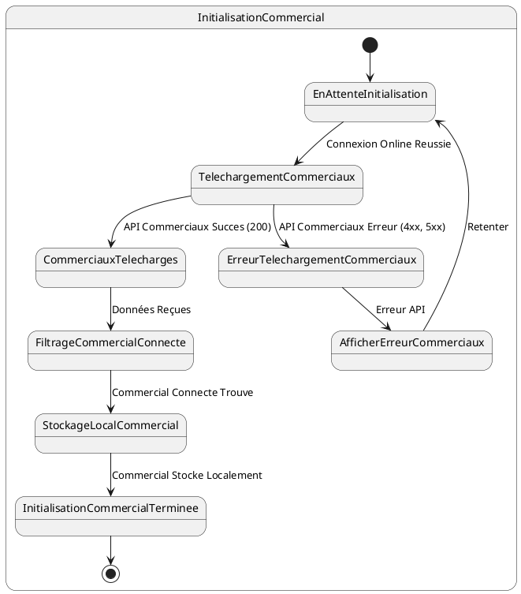

# US005 - Initialisation des Commerciaux

**Contexte :**

En tant que commercial, après m'être connecté pour la première fois en ligne, je souhaite que l'application télécharge et stocke localement mes propres informations de commercial afin de pouvoir les consulter et les utiliser pour mes rapports et activités.

**Description de la fonctionnalité :**

Cette fonctionnalité permet à l'application de récupérer la liste de tous les commerciaux depuis le backend et de n'enregistrer localement que les informations du commercial actuellement connecté. Cela assure que l'application dispose des détails nécessaires sur l'utilisateur principal.

**Règles Métiers :**

*   **RM-INIT-COM-001 :** L'application doit appeler l'API `GET {{baseUrl}}/api/v1/promoters/all` après une connexion en ligne réussie.
*   **RM-INIT-COM-002 :** La liste des commerciaux se trouve directement dans le champ `data` de la réponse API.
*   **RM-INIT-COM-003 :** Seul l'élément de la liste dont le `username` correspond au `username` de l'utilisateur connecté doit être enregistré localement.
*   **RM-INIT-COM-004 :** Tous les champs de l'objet commercial correspondant doivent être stockés localement.
*   **RM-INIT-COM-005 :** En cas d'échec de la récupération des commerciaux (réponse d'erreur de l'API), l'application doit afficher un message d'erreur informatif et proposer une option pour retenter l'initialisation.
*   **RM-INIT-COM-006 :** Un indicateur de progression doit être visible pendant le téléchargement des commerciaux.

**Tests d'Acceptance :**

*   **TA-INIT-COM-001 :** **Scénario :** Initialisation du commercial connecté réussie.
    *   **Given :** L'utilisateur est connecté en ligne et l'initialisation des données est en cours.
    *   **When :** L'application appelle l'API des commerciaux et reçoit une réponse 200 avec des données valides, incluant le commercial connecté.
    *   **Then :** Les informations du commercial connecté sont stockées localement, et l'indicateur de progression avance.
*   **TA-INIT-COM-002 :** **Scénario :** Initialisation des commerciaux échouée (erreur API).
    *   **Given :** L'utilisateur est connecté en ligne et l'initialisation des données est en cours.
    *   **When :** L'application appelle l'API des commerciaux et reçoit une réponse d'erreur.
    *   **Then :** Un message d'erreur est affiché à l'utilisateur, et l'application propose des options de récupération.

**Diagramme d'État (PlantUML) :**



```mermaid
stateDiagram-v2
    [*] --> EnAttenteInitialisation
    
    state InitialisationCommercial {
        EnAttenteInitialisation --> TelechargementCommerciaux : Connexion Online Reussie
        
        TelechargementCommerciaux --> CommerciauxTelecharges : API Commerciaux Succes (200)
        TelechargementCommerciaux --> ErreurTelechargementCommerciaux : API Commerciaux Erreur (4xx, 5xx)
        
        CommerciauxTelecharges --> FiltrageCommercialConnecte : Données Reçues
        FiltrageCommercialConnecte --> StockageLocalCommercial : Commercial Connecte Trouve
        StockageLocalCommercial --> InitialisationCommercialTerminee : Commercial Stocke Localement
        
        ErreurTelechargementCommerciaux --> AfficherErreurCommerciaux : Erreur API
        AfficherErreurCommerciaux --> EnAttenteInitialisation : Retenter
        
        InitialisationCommercialTerminee --> [*]
    }
````
