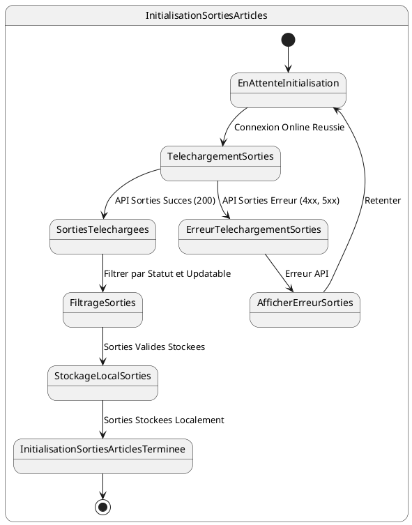

# US013 - Initialisation des Sorties d'Articles du Commercial

**Contexte :**

En tant que commercial, après m'être connecté pour la première fois en ligne, je souhaite que l'application télécharge et stocke localement la liste des articles que j'ai sortis du magasin et que je peux distribuer sur le terrain, afin de gérer mon stock mobile même sans connexion internet.

**Description de la fonctionnalité :**

Cette fonctionnalité permet à l'application de récupérer les enregistrements des sorties d'articles du magasin qui sont attribués au commercial connecté. Ces sorties représentent le stock d'articles que le commercial est autorisé à distribuer à crédit. Les données sont stockées localement pour une utilisation hors ligne.

**Règles Métiers :**

*   **RM-INIT-SORTIE-001 :** L'application doit appeler l'API `GET {{baseUrl}}/api/v1/credits/sorties-history/by-commercial/{{commercial-username}}?page=0&size=1000&sort=id,desc` après une connexion en ligne réussie.
*   **RM-INIT-SORTIE-002 :** La liste des sorties d'articles se trouve dans le champ `data.content` de la réponse API.
*   **RM-INIT-SORTIE-003 :** Seuls les éléments de la liste dont le `status` est égal à "INPROGRESS" et `updatable` est à "true" doivent être enregistrés localement.
*   **RM-INIT-SORTIE-004 :** Seules les références des entités liées (`client.id`, `articles.id`) doivent être stockées pour éviter la duplication des données complètes des clients et articles déjà initialisés.
*   **RM-INIT-SORTIE-005 :** En cas d'échec de la récupération des sorties d'articles (réponse d'erreur de l'API), l'application doit afficher un message d'erreur informatif et proposer une option pour retenter l'initialisation.
*   **RM-INIT-SORTIE-006 :** Un indicateur de progression doit être visible pendant le téléchargement des sorties d'articles.

**Tests d'Acceptance :**

*   **TA-INIT-SORTIE-001 :** **Scénario :** Initialisation des sorties d'articles réussie.
    *   **Given :** L'utilisateur est connecté en ligne et l'initialisation des données est en cours.
    *   **When :** L'application appelle l'API des sorties d'articles et reçoit une réponse 200 avec des données valides.
    *   **Then :** Les sorties d'articles sont stockées localement, filtrées par statut et `updatable`, et l'indicateur de progression avance.
*   **TA-INIT-SORTIE-002 :** **Scénario :** Initialisation des sorties d'articles échouée (erreur API).
    *   **Given :** L'utilisateur est connecté en ligne et l'initialisation des données est en cours.
    *   **When :** L'application appelle l'API des sorties d'articles et reçoit une réponse d'erreur.
    *   **Then :** Un message d'erreur est affiché à l'utilisateur, et l'application propose des options de récupération.

**Diagramme d'État (PlantUML) :**


````mermaid
stateDiagram-v2
    [*] --> EnAttenteInitialisation
    
    state InitialisationSortiesArticles {
        EnAttenteInitialisation --> TelechargementSorties : Connexion Online Reussie
        
        TelechargementSorties --> SortiesTelechargees : API Sorties Succes (200)
        TelechargementSorties --> ErreurTelechargementSorties : API Sorties Erreur (4xx, 5xx)
        
        SortiesTelechargees --> FiltrageSorties : Filtrer par Statut et Updatable
        FiltrageSorties --> StockageLocalSorties : Sorties Valides Stockees
        StockageLocalSorties --> InitialisationSortiesArticlesTerminee : Sorties Stockees Localement
        
        ErreurTelechargementSorties --> AfficherErreurSorties : Erreur API
        AfficherErreurSorties --> EnAttenteInitialisation : Retenter
        
        InitialisationSortiesArticlesTerminee --> [*]
    }
````
