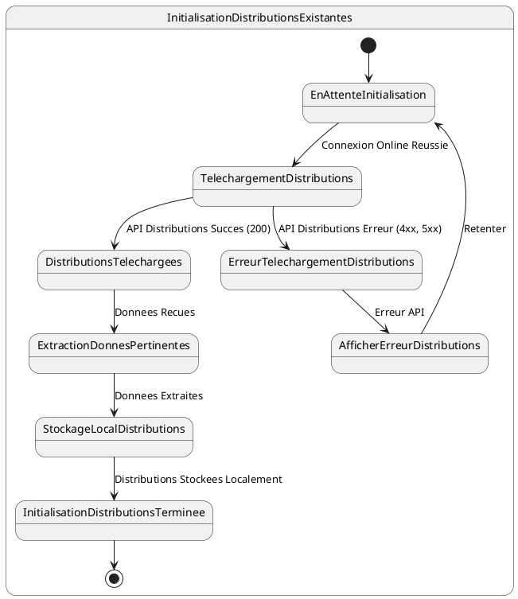

# US014 - Initialisation des Distributions Existantes du Commercial

**Contexte :**

En tant que commercial, après m'être connecté pour la première fois en ligne, je souhaite que l'application télécharge et stocke localement l'historique de mes distributions (ventes à crédit) existantes afin de pouvoir consulter et suivre les crédits en cours, même sans connexion internet.

**Description de la fonctionnalité :**

Cette fonctionnalité permet à l'application de récupérer l'historique complet des distributions (ventes à crédit) effectuées par le commercial connecté. Ces données incluent les crédits en cours et terminés, permettant au commercial de suivre l'état des remboursements et d'effectuer les recouvrements appropriés.

**Règles Métiers :**

*   **RM-INIT-DIST-001 :** L'application doit appeler l'API `GET {{baseUrl}}/api/v1/credits/by-commercial/{{commercial-username}}?page=0&size=10000&sort=id,desc` après une connexion en ligne réussie.
*   **RM-INIT-DIST-002 :** La liste des distributions se trouve dans le champ `data.content` de la réponse API.
*   **RM-INIT-DIST-003 :** Toutes les distributions retournées par l'API doivent être stockées localement, incluant les crédits en cours et terminés.
*   **RM-INIT-DIST-004 :** Les informations pertinentes pour le suivi des crédits et des recouvrements doivent être stockées, notamment :
    - ID de la distribution
    - Référence du crédit
    - Informations du client (ID de référence)
    - Articles distribués (ID de référence)
    - Montants (total, payé, restant)
    - Dates (début, fin prévue, fin effective)
    - Statut du crédit
    - Mise journalière
*   **RM-INIT-DIST-005 :** Seules les références des entités liées (`client.id`, `articles.id`) doivent être stockées pour éviter la duplication des données complètes des clients et articles déjà initialisés.
*   **RM-INIT-DIST-006 :** En cas d'échec de la récupération des distributions (réponse d'erreur de l'API), l'application doit afficher un message d'erreur informatif et proposer une option pour retenter l'initialisation.
*   **RM-INIT-DIST-007 :** Un indicateur de progression doit être visible pendant le téléchargement des distributions.

**Tests d'Acceptance :**

*   **TA-INIT-DIST-001 :** **Scénario :** Initialisation des distributions existantes réussie.
    *   **Given :** L'utilisateur est connecté en ligne et l'initialisation des données est en cours.
    *   **When :** L'application appelle l'API des distributions et reçoit une réponse 200 avec des données valides.
    *   **Then :** Les distributions sont stockées localement avec toutes les informations pertinentes, et l'indicateur de progression avance.
*   **TA-INIT-DIST-002 :** **Scénario :** Initialisation des distributions échouée (erreur API).
    *   **Given :** L'utilisateur est connecté en ligne et l'initialisation des données est en cours.
    *   **When :** L'application appelle l'API des distributions et reçoit une réponse d'erreur.
    *   **Then :** Un message d'erreur est affiché à l'utilisateur, et l'application propose des options de récupération.

**Diagramme d'État (PlantUML) :**



````mermaid
stateDiagram-v2
    [*] --> EnAttenteInitialisation
    
    state InitialisationDistributionsExistantes {
        EnAttenteInitialisation --> TelechargementDistributions : Connexion Online Reussie
        
        TelechargementDistributions --> DistributionsTelechargees : API Distributions Succes (200)
        TelechargementDistributions --> ErreurTelechargementDistributions : API Distributions Erreur (4xx, 5xx)
        
        DistributionsTelechargees --> ExtractionDonnesPertinentes : Donnees Recues
        ExtractionDonnesPertinentes --> StockageLocalDistributions : Donnees Extraites
        StockageLocalDistributions --> InitialisationDistributionsTerminee : Distributions Stockees Localement
        
        ErreurTelechargementDistributions --> AfficherErreurDistributions : Erreur API
        AfficherErreurDistributions --> EnAttenteInitialisation : Retenter
        
        InitialisationDistributionsTerminee --> [*]
    }
````
