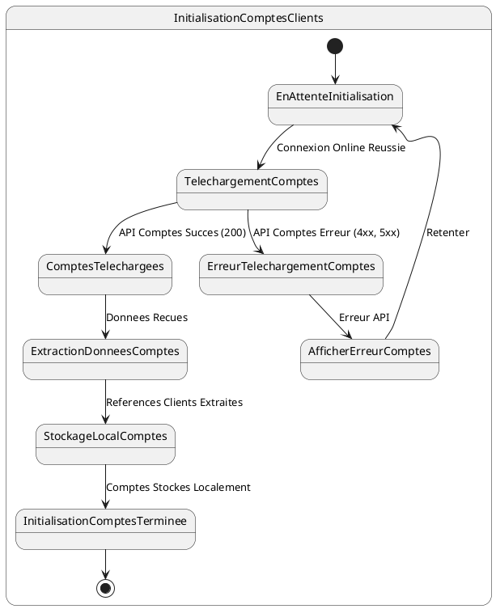

# US015 - Initialisation des Comptes Clients du Commercial

**Contexte :**

En tant que commercial, après m'être connecté pour la première fois en ligne, je souhaite que l'application télécharge et stocke localement les comptes de mes clients afin de pouvoir consulter leurs soldes et gérer les transactions financières, même sans connexion internet.

**Description de la fonctionnalité :**

Cette fonctionnalité permet à l'application de récupérer les informations des comptes clients associés au commercial connecté. Ces comptes contiennent les soldes actuels et les statuts des comptes, essentiels pour la gestion des crédits et des recouvrements.

**Règles Métiers :**

*   **RM-INIT-COMPTE-001 :** L'application doit appeler l'API `GET {{baseUrl}}/api/v1/accounts?page=0&size=2000&sort=id,desc&username=<commercial-username>` après une connexion en ligne réussie.
*   **RM-INIT-COMPTE-002 :** La liste des comptes clients se trouve dans le champ `data.content` de la réponse API.
*   **RM-INIT-COMPTE-003 :** Pour chaque compte, les informations suivantes doivent être stockées localement :
    - ID du compte
    - Numéro de compte
    - Solde du compte (accountBalance)
    - Statut du compte
    - ID du client associé (client.id) pour référence
*   **RM-INIT-COMPTE-004 :** Seul l'ID du client (`client.id`) doit être stocké pour référencer le client déjà enregistré localement, évitant la duplication des informations complètes du client.
*   **RM-INIT-COMPTE-005 :** En cas d'échec de la récupération des comptes (réponse d'erreur de l'API), l'application doit afficher un message d'erreur informatif et proposer une option pour retenter l'initialisation.
*   **RM-INIT-COMPTE-006 :** Un indicateur de progression doit être visible pendant le téléchargement des comptes clients.

**Tests d'Acceptance :**

*   **TA-INIT-COMPTE-001 :** **Scénario :** Initialisation des comptes clients réussie.
    *   **Given :** L'utilisateur est connecté en ligne et l'initialisation des données est en cours.
    *   **When :** L'application appelle l'API des comptes et reçoit une réponse 200 avec des données valides.
    *   **Then :** Les comptes clients sont stockés localement avec les informations essentielles et les références aux clients, et l'indicateur de progression avance.
*   **TA-INIT-COMPTE-002 :** **Scénario :** Initialisation des comptes clients échouée (erreur API).
    *   **Given :** L'utilisateur est connecté en ligne et l'initialisation des données est en cours.
    *   **When :** L'application appelle l'API des comptes et reçoit une réponse d'erreur.
    *   **Then :** Un message d'erreur est affiché à l'utilisateur, et l'application propose des options de récupération.

**Diagramme d'État (PlantUML) :**


````mermaid
stateDiagram-v2
    [*] --> EnAttenteInitialisation
    
    state InitialisationComptesClients {
        EnAttenteInitialisation --> TelechargementComptes : Connexion Online Reussie
        
        TelechargementComptes --> ComptesTelechargees : API Comptes Succes (200)
        TelechargementComptes --> ErreurTelechargementComptes : API Comptes Erreur (4xx, 5xx)
        
        ComptesTelechargees --> ExtractionDonneesComptes : Donnees Recues
        ExtractionDonneesComptes --> StockageLocalComptes : References Clients Extraites
        StockageLocalComptes --> InitialisationComptesTerminee : Comptes Stockes Localement
        
        ErreurTelechargementComptes --> AfficherErreurComptes : Erreur API
        AfficherErreurComptes --> EnAttenteInitialisation : Retenter
        
        InitialisationComptesTerminee --> [*]
    }
````
