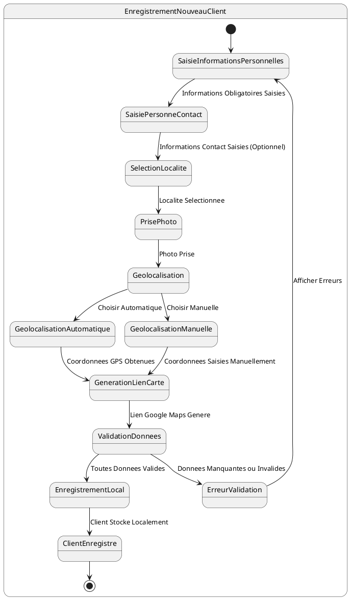

# US009 - Enregistrement d'un Nouveau Client

**Contexte :**

En tant que commercial sur le terrain, je souhaite enregistrer un nouveau client avec toutes ses informations personnelles, sa géolocalisation et sa photo de profil afin de pouvoir lui proposer des services et effectuer des distributions, même sans connexion internet.

**Description de la fonctionnalité :**

Cette fonctionnalité permet au commercial d'enregistrer un nouveau client directement sur le terrain. Le processus inclut la saisie des informations personnelles, la prise de photo de profil, la géolocalisation automatique ou manuelle, et la génération d'un lien de carte. Le nouveau client est enregistré localement et marqué pour synchronisation avec le serveur.

**Règles Métiers :**

*   **RM-NEWCLI-001 :** L'application doit permettre la saisie des informations obligatoires du client : Prénom, Nom, Adresse, Téléphone, Type de pièce d'identité, Numéro de pièce d'identité, Date de naissance, Profession.
*   **RM-NEWCLI-002 :** L'application doit permettre la saisie des informations optionnelles de la personne à contacter : Nom, Téléphone, Adresse.
*   **RM-NEWCLI-003 :** L'application doit permettre de sélectionner le quartier (localité) du client parmi la liste des localités synchronisées.
*   **RM-NEWCLI-004 :** La prise de photo de profil du client est obligatoire pour les nouveaux clients enregistrés localement.
*   **RM-NEWCLI-005 :** La géolocalisation (latitude, longitude) est obligatoire et peut être obtenue automatiquement via le GPS de l'appareil ou saisie manuellement.
*   **RM-NEWCLI-006 :** L'application doit générer automatiquement un lien Google Maps (mll) basé sur les coordonnées de géolocalisation.
*   **RM-NEWCLI-007 :** Le nouveau client doit être enregistré localement avec un statut "en attente de synchronisation".
*   **RM-NEWCLI-008 :** L'application doit générer un identifiant unique local temporaire pour le nouveau client en attendant la synchronisation avec le serveur.

**Tests d'Acceptance :**

*   **TA-NEWCLI-001 :** **Scénario :** Enregistrement d'un nouveau client réussi avec géolocalisation automatique.
    *   **Given :** Le commercial saisit toutes les informations obligatoires, prend une photo, et autorise la géolocalisation automatique.
    *   **When :** Le commercial confirme l'enregistrement du nouveau client.
    *   **Then :** Le client est enregistré localement avec toutes les informations, la géolocalisation automatique, et un lien Google Maps généré.
*   **TA-NEWCLI-002 :** **Scénario :** Enregistrement d'un nouveau client avec géolocalisation manuelle.
    *   **Given :** Le commercial saisit toutes les informations obligatoires, prend une photo, et saisit manuellement les coordonnées GPS.
    *   **When :** Le commercial confirme l'enregistrement du nouveau client.
    *   **Then :** Le client est enregistré localement avec les coordonnées manuelles et un lien Google Maps généré.
*   **TA-NEWCLI-003 :** **Scénario :** Tentative d'enregistrement sans photo de profil.
    *   **Given :** Le commercial saisit toutes les informations mais n'a pas pris de photo de profil.
    *   **When :** Le commercial tente de confirmer l'enregistrement.
    *   **Then :** L'application affiche un message d'erreur indiquant que la photo de profil est obligatoire.

**Diagramme d'État (PlantUML) :**

