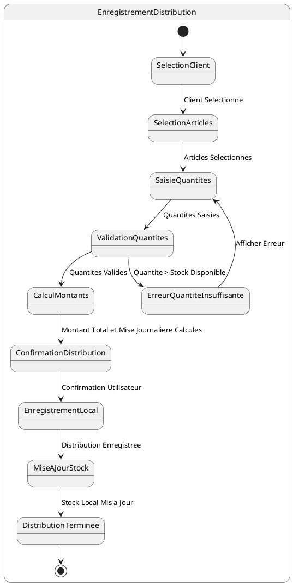

# US006 - Enregistrement d'une Distribution

**Contexte :**

En tant que commercial sur le terrain, je souhaite enregistrer une distribution d'articles à un client afin de documenter la vente à crédit et de pouvoir imprimer un reçu pour le client, même sans connexion internet.

**Description de la fonctionnalité :**

Cette fonctionnalité permet au commercial d'enregistrer une vente à crédit (distribution) d'articles à un client. Le commercial sélectionne le client, les articles et les quantités, et l'application calcule automatiquement le montant total et la mise journalière. La distribution est enregistrée localement et marquée pour synchronisation ultérieure.

**Règles Métiers :**

*   **RM-DIST-001 :** L'application doit permettre de sélectionner un client existant dans la liste des clients synchronisés localement.
*   **RM-DIST-002 :** L'application doit permettre de sélectionner les articles à distribuer parmi les sorties d'articles disponibles du commercial (stock local).
*   **RM-DIST-003 :** Pour chaque article sélectionné, le commercial doit pouvoir spécifier la quantité distribuée.
*   **RM-DIST-004 :** La quantité distribuée ne peut pas dépasser la quantité disponible dans le stock local du commercial.
*   **RM-DIST-005 :** L'application doit calculer automatiquement le montant total de la distribution en utilisant le `creditSalePrice` de chaque article.
*   **RM-DIST-006 :** L'application doit calculer automatiquement la mise journalière à collecter pour cette vente.
*   **RM-DIST-007 :** La distribution doit être enregistrée localement avec un statut "en attente de synchronisation".
*   **RM-DIST-008 :** Le stock local du commercial doit être mis à jour après l'enregistrement de la distribution.
*   **RM-DIST-009 :** L'application doit générer un identifiant unique local pour la distribution en attendant la synchronisation avec le serveur.

**Tests d'Acceptance :**

*   **TA-DIST-001 :** **Scénario :** Enregistrement d'une distribution réussie.
    *   **Given :** Le commercial a sélectionné un client et des articles avec des quantités valides.
    *   **When :** Le commercial confirme la distribution.
    *   **Then :** La distribution est enregistrée localement, le montant total et la mise journalière sont calculés correctement, et le stock local est mis à jour.
*   **TA-DIST-002 :** **Scénario :** Tentative de distribution avec quantité insuffisante.
    *   **Given :** Le commercial sélectionne une quantité d'articles supérieure à son stock disponible.
    *   **When :** Le commercial tente de confirmer la distribution.
    *   **Then :** L'application affiche un message d'erreur et empêche l'enregistrement de la distribution.

**Diagramme d'État (PlantUML) :**

