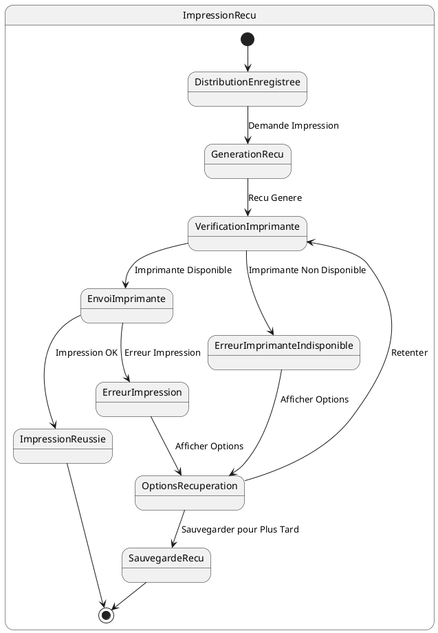

# US007 - Impression de Reçu de Distribution

**Contexte :**

En tant que commercial, après avoir enregistré une distribution d'articles à un client, je souhaite imprimer un reçu détaillé pour le client afin de lui fournir une preuve de la transaction et les informations sur la mise journalière à collecter.

**Description de la fonctionnalité :**

Cette fonctionnalité permet au commercial d'imprimer un reçu détaillé après l'enregistrement d'une distribution. Le reçu contient toutes les informations pertinentes de la transaction et peut être imprimé via une imprimante mobile Bluetooth.

**Règles Métiers :**

*   **RM-RECU-001 :** Le reçu doit contenir la liste complète des articles distribués avec leurs noms commerciaux, quantités et prix unitaires.
*   **RM-RECU-002 :** Le reçu doit afficher le montant total de la distribution.
*   **RM-RECU-003 :** Le reçu doit indiquer clairement la mise journalière à collecter pour cette vente.
*   **RM-RECU-004 :** Le reçu doit inclure les informations du client (nom complet, adresse, téléphone).
*   **RM-RECU-005 :** Le reçu doit inclure les informations du commercial (nom complet).
*   **RM-RECU-006 :** Le reçu doit afficher la date et l'heure de la transaction.
*   **RM-RECU-007 :** Le reçu doit inclure un numéro de référence unique de la distribution.
*   **RM-RECU-008 :** L'application doit s'interfacer avec une imprimante mobile compatible Bluetooth.
*   **RM-RECU-009 :** Le reçu doit être formaté de manière claire et lisible, adapté à l'impression sur papier thermique.
*   **RM-RECU-010 :** En cas d'échec de l'impression, l'application doit permettre de retenter l'impression ou de sauvegarder le reçu pour impression ultérieure.

**Tests d'Acceptance :**

*   **TA-RECU-001 :** **Scénario :** Impression de reçu réussie.
    *   **Given :** Une distribution a été enregistrée avec succès et une imprimante Bluetooth est connectée.
    *   **When :** Le commercial demande l'impression du reçu.
    *   **Then :** Le reçu est généré avec toutes les informations requises et envoyé à l'imprimante avec succès.
*   **TA-RECU-002 :** **Scénario :** Échec de l'impression (imprimante non disponible).
    *   **Given :** Une distribution a été enregistrée mais aucune imprimante n'est connectée.
    *   **When :** Le commercial demande l'impression du reçu.
    *   **Then :** L'application affiche un message d'erreur et propose des options de récupération (connecter imprimante, sauvegarder pour plus tard).

**Diagramme d'État (PlantUML) :**

