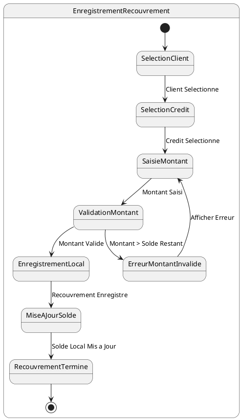

# US008 - Enregistrement d'un Recouvrement Journalier

**Contexte :**

En tant que commercial sur le terrain, je souhaite enregistrer les montants collectés auprès des clients pour leurs crédits en cours afin de mettre à jour leurs comptes et de suivre mes activités de recouvrement, même sans connexion internet.

**Description de la fonctionnalité :**

Cette fonctionnalité permet au commercial d'enregistrer un recouvrement (collecte d'argent) auprès d'un client pour un crédit spécifique. Le commercial sélectionne le client et le crédit, saisit le montant collecté, et l'application met à jour le solde local du crédit. Le recouvrement est enregistré localement et marqué pour synchronisation.

**Règles Métiers :**

*   **RM-RECOUV-001 :** L'application doit permettre de sélectionner un client parmi la liste des clients du commercial.
*   **RM-RECOUV-002 :** Après la sélection du client, l'application doit afficher la liste des crédits en cours de ce client.
*   **RM-RECOUV-003 :** Pour le crédit sélectionné, l'application doit afficher la mise journalière attendue et le solde restant dû.
*   **RM-RECOUV-004 :** Le commercial doit pouvoir saisir le montant collecté. Ce montant ne peut pas dépasser le solde restant dû.
*   **RM-RECOUV-005 :** Le recouvrement doit être enregistré localement avec un statut "en attente de synchronisation".
*   **RM-RECOUV-006 :** Le solde du crédit local du client doit être mis à jour après l'enregistrement du recouvrement.
*   **RM-RECOUV-007 :** L'application doit générer un identifiant unique local pour le recouvrement en attendant la synchronisation avec le serveur.

**Tests d'Acceptance :**

*   **TA-RECOUV-001 :** **Scénario :** Enregistrement d'un recouvrement réussi.
    *   **Given :** Le commercial a sélectionné un client et un crédit, et saisit un montant valide (inférieur ou égal au solde restant).
    *   **When :** Le commercial confirme le recouvrement.
    *   **Then :** Le recouvrement est enregistré localement, le solde du crédit est mis à jour, et la transaction est marquée pour synchronisation.
*   **TA-RECOUV-002 :** **Scénario :** Tentative d'enregistrement d'un recouvrement avec un montant supérieur au solde.
    *   **Given :** Le commercial saisit un montant collecté supérieur au solde restant dû du crédit.
    *   **When :** Le commercial tente de confirmer le recouvrement.
    *   **Then :** L'application affiche un message d'erreur et empêche l'enregistrement du recouvrement.

**Diagramme d'État (PlantUML) :**

