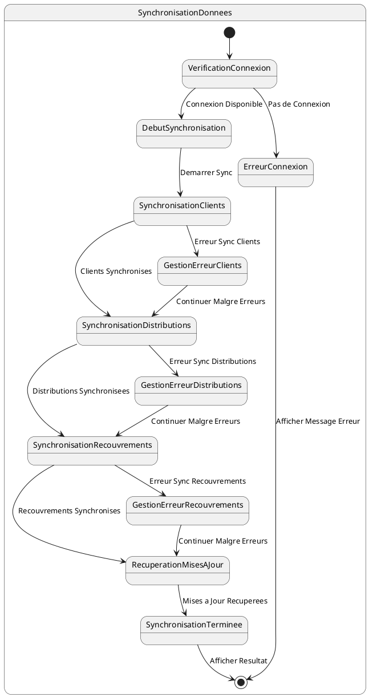

# US010 - Synchronisation des Données avec le Serveur

**Contexte :**

En tant que commercial de retour à l'agence, je souhaite synchroniser toutes les données collectées sur le terrain (distributions, recouvrements, nouveaux clients) avec le serveur backend afin de mettre à jour le système central et de récupérer les dernières informations.

**Description de la fonctionnalité :**

Cette fonctionnalité permet la synchronisation bidirectionnelle des données entre l'application mobile et le serveur backend. Elle envoie les données collectées localement (distributions, recouvrements, nouveaux clients) vers le serveur et récupère les mises à jour du serveur vers l'application locale.

**Règles Métiers :**

*   **RM-SYNC-001 :** La synchronisation ne peut être déclenchée que lorsqu'une connexion internet stable est disponible.
*   **RM-SYNC-002 :** L'application doit synchroniser les données dans l'ordre suivant : nouveaux clients, distributions, recouvrements.
*   **RM-SYNC-003 :** Pour chaque nouveau client, l'application doit appeler l'API de création de client et récupérer l'ID serveur pour mettre à jour la référence locale.
*   **RM-SYNC-004 :** Pour chaque distribution, l'application doit appeler l'API de création de distribution et mettre à jour le statut local.
*   **RM-SYNC-005 :** Pour chaque recouvrement, l'application doit appeler l'API de création de recouvrement et mettre à jour le statut local.
*   **RM-SYNC-006 :** Après l'envoi des données locales, l'application doit récupérer les mises à jour du serveur (nouveaux articles, clients modifiés, etc.).
*   **RM-SYNC-007 :** En cas d'erreur de synchronisation pour un élément spécifique, l'application doit continuer avec les autres éléments et marquer l'élément en erreur pour une nouvelle tentative.
*   **RM-SYNC-008 :** Un indicateur de progression détaillé doit être affiché pendant toute la durée de la synchronisation.
*   **RM-SYNC-009 :** L'utilisateur doit être informé du résultat de la synchronisation (succès complet, succès partiel, échec).

**Tests d'Acceptance :**

*   **TA-SYNC-001 :** **Scénario :** Synchronisation complète réussie.
    *   **Given :** Le commercial a des données en attente de synchronisation et une connexion internet stable.
    *   **When :** Le commercial déclenche la synchronisation.
    *   **Then :** Tous les nouveaux clients, distributions et recouvrements sont synchronisés avec succès, et les mises à jour du serveur sont récupérées.
*   **TA-SYNC-002 :** **Scénario :** Synchronisation partielle (certains éléments échouent).
    *   **Given :** Le commercial a des données en attente et certaines requêtes API échouent.
    *   **When :** Le commercial déclenche la synchronisation.
    *   **Then :** Les éléments synchronisés avec succès sont marqués comme tels, les éléments en erreur restent en attente, et l'utilisateur est informé du résultat partiel.
*   **TA-SYNC-003 :** **Scénario :** Échec de synchronisation (pas de connexion).
    *   **Given :** Le commercial tente de synchroniser sans connexion internet.
    *   **When :** Le commercial déclenche la synchronisation.
    *   **Then :** L'application affiche un message d'erreur indiquant l'absence de connexion et propose de retenter plus tard.

**Diagramme d'État (PlantUML) :**

