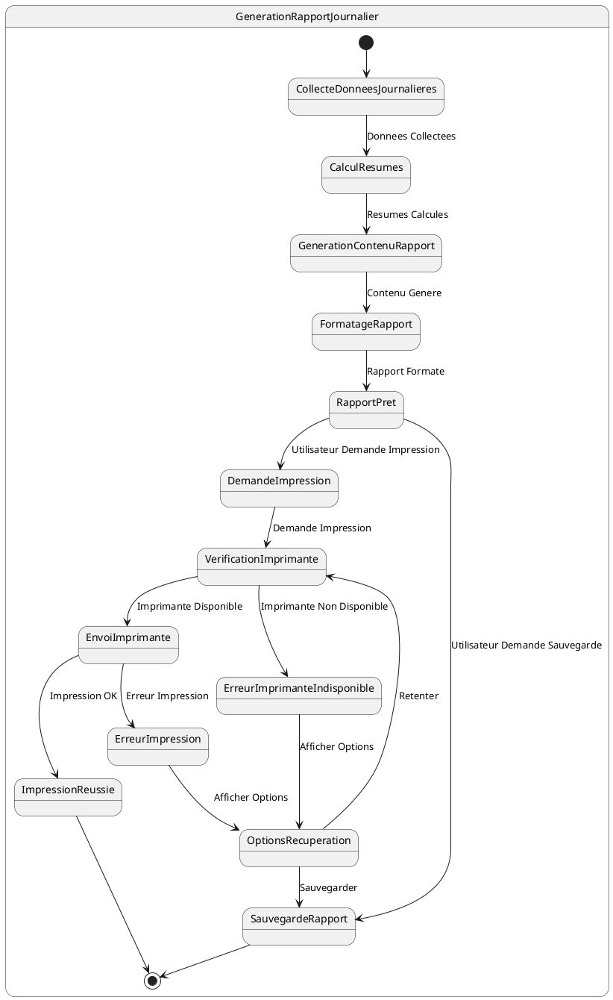

# US011 - Génération et Impression du Rapport Journalier

**Contexte :**

En tant que commercial, je souhaite générer et imprimer un rapport détaillé de mes activités journalières (distributions et recouvrements) afin de documenter mon travail et de fournir un compte-rendu à ma hiérarchie.

**Description de la fonctionnalité :**

Cette fonctionnalité permet au commercial de générer un rapport journalier complet de ses activités sur le terrain. Le rapport inclut un résumé des distributions et recouvrements effectués, ainsi que des détails pour chaque transaction. Le rapport peut être imprimé via une imprimante mobile.

**Règles Métiers :**

*   **RM-RAPPORT-001 :** Le rapport doit inclure un résumé des distributions : nombre total de distributions et montant total distribué.
*   **RM-RAPPORT-002 :** Le rapport doit inclure un résumé des recouvrements : nombre total de recouvrements et montant total collecté.
*   **RM-RAPPORT-003 :** Le rapport doit contenir une liste détaillée de toutes les distributions effectuées avec : nom du client, articles distribués (nom, quantité, prix unitaire), montant total de chaque distribution.
*   **RM-RAPPORT-004 :** Le rapport doit contenir une liste détaillée de tous les recouvrements effectués avec : nom du client, montant collecté, référence du crédit concerné.
*   **RM-RAPPORT-005 :** Le rapport doit inclure les informations du commercial (nom complet, username).
*   **RM-RAPPORT-006 :** Le rapport doit afficher la date de génération du rapport.
*   **RM-RAPPORT-007 :** Le rapport doit être généré à partir des données locales de l'appareil.
*   **RM-RAPPORT-008 :** L'application doit permettre l'impression du rapport via une imprimante mobile Bluetooth.
*   **RM-RAPPORT-009 :** Le rapport doit être formaté de manière claire et professionnelle, adapté à l'impression.
*   **RM-RAPPORT-010 :** En cas d'échec de l'impression, l'application doit permettre de sauvegarder le rapport ou de retenter l'impression.

**Tests d'Acceptance :**

*   **TA-RAPPORT-001 :** **Scénario :** Génération et impression de rapport réussies.
    *   **Given :** Le commercial a effectué des distributions et/ou recouvrements dans la journée et une imprimante est connectée.
    *   **When :** Le commercial demande la génération et l'impression du rapport journalier.
    *   **Then :** Le rapport est généré avec toutes les informations correctes et imprimé avec succès.
*   **TA-RAPPORT-002 :** **Scénario :** Génération de rapport sans activités.
    *   **Given :** Le commercial n'a effectué aucune distribution ni recouvrement dans la journée.
    *   **When :** Le commercial demande la génération du rapport journalier.
    *   **Then :** Un rapport est généré indiquant l'absence d'activités pour la journée.
*   **TA-RAPPORT-003 :** **Scénario :** Échec de l'impression du rapport.
    *   **Given :** Un rapport a été généré mais l'impression échoue.
    *   **When :** Le commercial tente d'imprimer le rapport.
    *   **Then :** L'application affiche un message d'erreur et propose des options de récupération (retenter, sauvegarder).

**Diagramme d'État (PlantUML) :**

