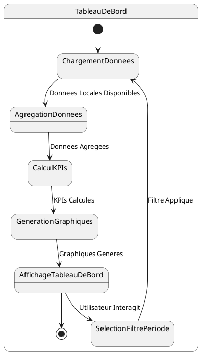

# US012 - Tableau de Bord Commercial

**Contexte :**

En tant que commercial, je souhaite avoir un tableau de bord visuel qui me donne un aperçu rapide de mes performances mensuelles afin de suivre mes progrès et d'identifier les domaines à améliorer.

**Description de la fonctionnalité :**

Cette fonctionnalité fournit un tableau de bord interactif avec des indicateurs clés de performance (KPIs) et des graphiques pour visualiser les activités du commercial sur différentes périodes (jour, semaine, mois). Le tableau de bord est la première page affichée après la connexion.

**Règles Métiers :**

*   **RM-DASH-001 :** Le tableau de bord doit afficher le montant total des ventes à crédit du mois en cours.
*   **RM-DASH-002 :** Le tableau de bord doit afficher le montant total des recouvrements du mois en cours.
*   **RM-DASH-003 :** Le tableau de bord doit afficher le nombre de nouveaux clients enregistrés dans le mois en cours.
*   **RM-DASH-004 :** Le tableau de bord doit inclure un graphique de tendance des ventes à crédit sur les 30 derniers jours.
*   **RM-DASH-005 :** Le tableau de bord doit inclure un graphique de tendance des recouvrements sur les 30 derniers jours.
*   **RM-DASH-006 :** Le tableau de bord doit permettre de filtrer les données par période : jour, semaine, mois.
*   **RM-DASH-007 :** Les données du tableau de bord doivent être agrégées à partir des données locales synchronisées.
*   **RM-DASH-008 :** Le tableau de bord doit être la première page affichée après une connexion réussie.
*   **RM-DASH-009 :** Le tableau de bord doit être visuellement attrayant, facile à lire et à comprendre.

**Tests d'Acceptance :**

*   **TA-DASH-001 :** **Scénario :** Affichage du tableau de bord avec des données.
    *   **Given :** Le commercial a des données d'activités pour le mois en cours.
    *   **When :** Le commercial se connecte à l'application.
    *   **Then :** Le tableau de bord s'affiche avec les KPIs et les graphiques corrects, reflétant les activités du mois.
*   **TA-DASH-002 :** **Scénario :** Affichage du tableau de bord sans données.
    *   **Given :** Le commercial n'a aucune activité enregistrée pour le mois en cours.
    *   **When :** Le commercial se connecte à l'application.
    *   **Then :** Le tableau de bord s'affiche avec des KPIs à zéro et des graphiques vides, indiquant l'absence d'activités.
*   **TA-DASH-003 :** **Scénario :** Filtrage du tableau de bord par période.
    *   **Given :** Le commercial est sur le tableau de bord.
    *   **When :** Le commercial sélectionne un filtre de période (ex: semaine).
    *   **Then :** Les KPIs et les graphiques se mettent à jour pour refléter les données de la période sélectionnée.

**Diagramme d'État (PlantUML) :**

