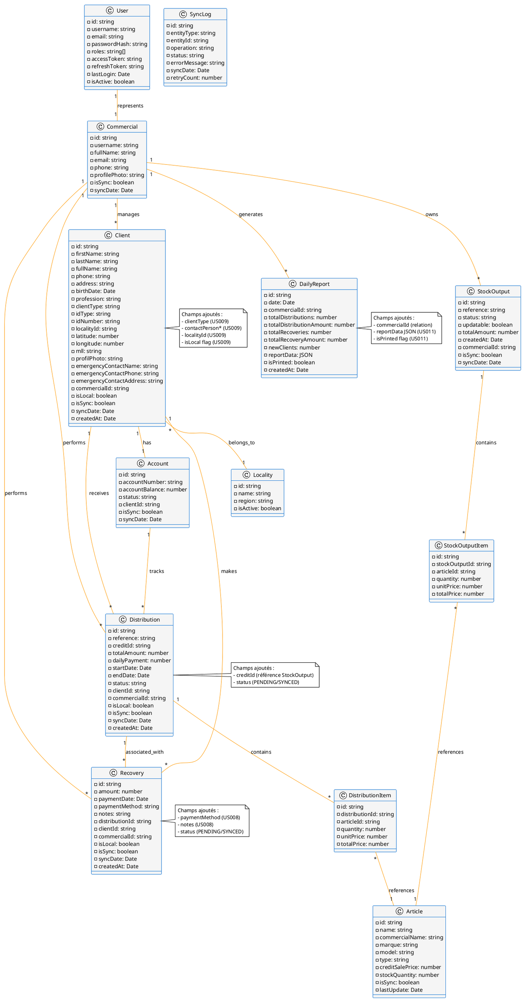

# 📊 Diagramme de Classes Final - Base de Données Locale

## ✅ Diagramme PlantUML Complet

```plantuml
@startuml
!theme plain

' Styles
skinparam class {
    BackgroundColor #F5F5F5
    BorderColor #1976D2
    ArrowColor #FF9800
}

' =======================
' ENTITÉS PRINCIPALES
' =======================

class User {
    - id: string
    - username: string
    - email: string
    - passwordHash: string
    - roles: string[]
    - accessToken: string
    - refreshToken: string
    - lastLogin: Date
    - isActive: boolean
}

class Commercial {
    - id: string
    - username: string
    - fullName: string
    - email: string
    - phone: string
    - profilePhoto: string
    - isSync: boolean
    - syncDate: Date
}

class Article {
    - id: string
    - name: string
    - commercialName: string
    - marque: string
    - model: string
    - type: string
    - creditSalePrice: number
    - stockQuantity: number
    - isSync: boolean
    - lastUpdate: Date
}

class Locality {
    - id: string
    - name: string
    - region: string
    - isActive: boolean
}

class Client {
    - id: string
    - firstName: string
    - lastName: string
    - fullName: string
    - phone: string
    - address: string
    - birthDate: Date
    - profession: string
    - clientType: string
    - idType: string
    - idNumber: string
    - localityId: string
    - latitude: number
    - longitude: number
    - mll: string
    - profilPhoto: string
    - emergencyContactName: string
    - emergencyContactPhone: string
    - emergencyContactAddress: string
    - commercialId: string
    - isLocal: boolean
    - isSync: boolean
    - syncDate: Date
    - createdAt: Date
}

' =======================
' COMPTES & FINANCES
' =======================

class Account {
    - id: string
    - accountNumber: string
    - accountBalance: number
    - status: string
    - clientId: string
    - isSync: boolean
    - syncDate: Date
}

' =======================
' STOCK & DISTRIBUTIONS
' =======================

class StockOutput {
    - id: string
    - reference: string
    - status: string
    - updatable: boolean
    - totalAmount: number
    - createdAt: Date
    - commercialId: string
    - isSync: boolean
    - syncDate: Date
}

class StockOutputItem {
    - id: string
    - stockOutputId: string
    - articleId: string
    - quantity: number
    - unitPrice: number
    - totalPrice: number
}

class Distribution {
    - id: string
    - reference: string
    - creditId: string
    - totalAmount: number
    - dailyPayment: number
    - startDate: Date
    - endDate: Date
    - status: string
    - clientId: string
    - commercialId: string
    - isLocal: boolean
    - isSync: boolean
    - syncDate: Date
    - createdAt: Date
}

class DistributionItem {
    - id: string
    - distributionId: string
    - articleId: string
    - quantity: number
    - unitPrice: number
    - totalPrice: number
}

' =======================
' RECOUVREMENTS
' =======================

class Recovery {
    - id: string
    - amount: number
    - paymentDate: Date
    - paymentMethod: string
    - notes: string
    - distributionId: string
    - clientId: string
    - commercialId: string
    - isLocal: boolean
    - isSync: boolean
    - syncDate: Date
    - createdAt: Date
}

' =======================
' SYNCHRONISATION & RAPPORTS
' =======================

class SyncLog {
    - id: string
    - entityType: string
    - entityId: string
    - operation: string
    - status: string
    - errorMessage: string
    - syncDate: Date
    - retryCount: number
}

class DailyReport {
    - id: string
    - date: Date
    - commercialId: string
    - totalDistributions: number
    - totalDistributionAmount: number
    - totalRecoveries: number
    - totalRecoveryAmount: number
    - newClients: number
    - reportData: JSON
    - isPrinted: boolean
    - createdAt: Date
}

' =======================
' RELATIONS
' =======================

User "1" -- "1" Commercial : represents
Commercial "1" -- "*" Client : manages
Commercial "1" -- "*" StockOutput : owns
Commercial "1" -- "*" Distribution : performs
Commercial "1" -- "*" Recovery : performs
Commercial "1" -- "*" DailyReport : generates

Client "1" -- "1" Account : has
Client "1" -- "*" Distribution : receives
Client "1" -- "*" Recovery : makes
Client "*" -- "1" Locality : belongs_to

Account "1" -- "*" Distribution : tracks

StockOutput "1" -- "*" StockOutputItem : contains
StockOutputItem "*" -- "1" Article : references

Distribution "1" -- "*" DistributionItem : contains
Distribution "1" -- "*" Recovery : associated_with
DistributionItem "*" -- "1" Article : references

' =======================
' NOTES
' =======================

note right of Client
    Champs ajoutés :
    - clientType (US009)
    - contactPerson* (US009)
    - localityId (US009)
    - isLocal flag (US009)
end note

note right of Distribution
    Champs ajoutés :
    - creditId (référence StockOutput)
    - status (PENDING/SYNCED)
end note

note right of Recovery
    Champs ajoutés :
    - paymentMethod (US008)
    - notes (US008)
    - status (PENDING/SYNCED)
end note

note right of DailyReport
    Champs ajoutés :
    - commercialId (relation)
    - reportData JSON (US011)
    - isPrinted flag (US011)
end note

@enduml
```

---

## 🎯 Version Mermaid Alternative

```mermaid
classDiagram
    class User {
        +String id
        +String username
        +String email
        +String passwordHash
        +List~String~ roles
        +String accessToken
        +String refreshToken
        +Date lastLogin
        +Boolean isActive
    }

    class Commercial {
        +String id
        +String username
        +String fullName
        +String email
        +String phone
        +String profilePhoto
        +Boolean isSync
        +Date syncDate
    }

    class Article {
        +String id
        +String name
        +String commercialName
        +String marque
        +String model
        +String type
        +Number creditSalePrice
        +Number stockQuantity
        +Boolean isSync
        +Date lastUpdate
    }

    class Locality {
        +String id
        +String name
        +String region
        +Boolean isActive
    }

    class Client {
        +String id
        +String firstName
        +String lastName
        +String fullName
        +String phone
        +String address
        +Date birthDate
        +String profession
        +String clientType
        +String idType
        +String idNumber
        +String localityId
        +Number latitude
        +Number longitude
        +String mll
        +String profilPhoto
        +String emergencyContactName
        +String emergencyContactPhone
        +String emergencyContactAddress
        +String commercialId
        +Boolean isLocal
        +Boolean isSync
        +Date syncDate
        +Date createdAt
    }

    class Account {
        +String id
        +String accountNumber
        +Number accountBalance
        +String status
        +String clientId
        +Boolean isSync
        +Date syncDate
    }

    class StockOutput {
        +String id
        +String reference
        +String status
        +Boolean updatable
        +Number totalAmount
        +Date createdAt
        +String commercialId
        +Boolean isSync
        +Date syncDate
    }

    class StockOutputItem {
        +String id
        +String stockOutputId
        +String articleId
        +Number quantity
        +Number unitPrice
        +Number totalPrice
    }

    class Distribution {
        +String id
        +String reference
        +String creditId
        +Number totalAmount
        +Number dailyPayment
        +Date startDate
        +Date endDate
        +String status
        +String clientId
        +String commercialId
        +Boolean isLocal
        +Boolean isSync
        +Date syncDate
        +Date createdAt
    }

    class DistributionItem {
        +String id
        +String distributionId
        +String articleId
        +Number quantity
        +Number unitPrice
        +Number totalPrice
    }

    class Recovery {
        +String id
        +Number amount
        +Date paymentDate
        +String paymentMethod
        +String notes
        +String distributionId
        +String clientId
        +String commercialId
        +Boolean isLocal
        +Boolean isSync
        +Date syncDate
        +Date createdAt
    }

    class SyncLog {
        +String id
        +String entityType
        +String entityId
        +String operation
        +String status
        +String errorMessage
        +Date syncDate
        +Number retryCount
    }

    class DailyReport {
        +String id
        +Date date
        +String commercialId
        +Number totalDistributions
        +Number totalDistributionAmount
        +Number totalRecoveries
        +Number totalRecoveryAmount
        +Number newClients
        +JSON reportData
        +Boolean isPrinted
        +Date createdAt
    }

    User "1" -- "1" Commercial : represents
    Commercial "1" -- "*" Client : manages
    Commercial "1" -- "*" StockOutput : owns
    Commercial "1" -- "*" Distribution : performs
    Commercial "1" -- "*" Recovery : performs
    Commercial "1" -- "*" DailyReport : generates

    Client "1" -- "1" Account : has
    Client "1" -- "*" Distribution : receives
    Client "1" -- "*" Recovery : makes
    Client "*" -- "1" Locality : belongs_to

    Account "1" -- "*" Distribution : tracks

    StockOutput "1" -- "*" StockOutputItem : contains
    StockOutputItem "*" -- "1" Article : references

    Distribution "1" -- "*" DistributionItem : contains
    Distribution "1" -- "*" Recovery : associated_with
    DistributionItem "*" -- "1" Article : references
```

---

