# TS000 - Setup du Projet Ionic Angular

**Contexte :**

En tant que développeur, je souhaite mettre en place l'environnement de développement et la structure de base du projet Ionic Angular afin de pouvoir commencer le développement de l'application mobile commerciale avec une architecture solide et des bonnes pratiques.

**Description de la fonctionnalité :**

Cette Technical Story couvre la mise en place complète de l'environnement de développement, l'initialisation du projet Ionic Angular, la configuration des dépendances, la structure des dossiers, et la mise en place des outils de développement nécessaires pour l'application mobile commerciale.

**Règles Techniques :**

*   **RT-SETUP-001 :** Le projet doit être initialisé avec Ionic CLI version 7.x et Angular version 16.x minimum.
*   **RT-SETUP-002 :** La structure de dossiers doit suivre les conventions Angular et Ionic avec séparation claire des modules, services, pages et composants.
*   **RT-SETUP-003 :** SQLite doit être configuré via Capacitor pour la base de données locale.
*   **RT-SETUP-004 :** NgRx doit être configuré pour la gestion d'état de l'application.
*   **RT-SETUP-005 :** Les plugins Capacitor nécessaires doivent être installés : Camera, Geolocation, Network, Storage.
*   **RT-SETUP-006 :** Un système de configuration d'environnement (dev, staging, prod) doit être mis en place.
*   **RT-SETUP-007 :** ESLint et Prettier doivent être configurés pour maintenir la qualité du code.
*   **RT-SETUP-008 :** Les tests unitaires doivent être configurés avec Jasmine et Karma.

**Tâches Techniques :**

### 1. Installation et Initialisation

```bash
# Installation des outils globaux
npm install -g @ionic/cli @angular/cli

# Création du projet
ionic start commercial-app tabs --type=angular --capacitor

# Navigation vers le projet
cd commercial-app

# Installation des dépendances supplémentaires
npm install @ngrx/store @ngrx/effects @ngrx/store-devtools
npm install @capacitor/sqlite @capacitor/camera @capacitor/geolocation
npm install @capacitor/network @capacitor/storage
npm install @ionic/storage-angular
```

### 2. Structure de Dossiers

```
src/
├── app/
│   ├── core/                    # Services core, guards, interceptors
│   │   ├── services/
│   │   ├── guards/
│   │   └── interceptors/
│   ├── shared/                  # Composants, pipes, directives partagés
│   │   ├── components/
│   │   ├── pipes/
│   │   └── directives/
│   ├── features/                # Modules fonctionnels
│   │   ├── auth/
│   │   ├── dashboard/
│   │   ├── clients/
│   │   ├── distributions/
│   │   ├── recouvrements/
│   │   └── synchronisation/
│   ├── store/                   # NgRx store
│   │   ├── actions/
│   │   ├── reducers/
│   │   ├── effects/
│   │   └── selectors/
│   └── models/                  # Interfaces et modèles
├── assets/
└── environments/
```

### 3. Configuration NgRx

```typescript
// app.module.ts
import { StoreModule } from '@ngrx/store';
import { EffectsModule } from '@ngrx/effects';
import { StoreDevtoolsModule } from '@ngrx/store-devtools';

@NgModule({
  imports: [
    StoreModule.forRoot(reducers),
    EffectsModule.forRoot([]),
    StoreDevtoolsModule.instrument({
      maxAge: 25,
      logOnly: environment.production
    })
  ]
})
export class AppModule { }
```

### 4. Configuration SQLite

```typescript
// core/services/database.service.ts
import { Injectable } from '@angular/core';
import { CapacitorSQLite, SQLiteConnection, SQLiteDBConnection } from '@capacitor-community/sqlite';

@Injectable({
  providedIn: 'root'
})
export class DatabaseService {
  private sqlite: SQLiteConnection = new SQLiteConnection(CapacitorSQLite);
  private db: SQLiteDBConnection | null = null;

  async initializeDatabase(): Promise<void> {
    try {
      this.db = await this.sqlite.createConnection('commercial_app.db', false, 'no-encryption', 1);
      await this.db.open();
      await this.createTables();
    } catch (error) {
      console.error('Database initialization error:', error);
    }
  }

  private async createTables(): Promise<void> {
    const createTables = `
      CREATE TABLE IF NOT EXISTS users (
        id INTEGER PRIMARY KEY AUTOINCREMENT,
        username TEXT UNIQUE NOT NULL,
        password TEXT NOT NULL,
        email TEXT,
        roles TEXT,
        created_at DATETIME DEFAULT CURRENT_TIMESTAMP
      );

      CREATE TABLE IF NOT EXISTS articles (
        id INTEGER PRIMARY KEY,
        name TEXT NOT NULL,
        marque TEXT,
        model TEXT,
        type TEXT,
        creditSalePrice REAL,
        stockQuantity INTEGER,
        commercialName TEXT,
        synced BOOLEAN DEFAULT 0
      );

      CREATE TABLE IF NOT EXISTS clients (
        id INTEGER PRIMARY KEY,
        firstname TEXT NOT NULL,
        lastname TEXT NOT NULL,
        address TEXT,
        phone TEXT,
        cardID TEXT,
        cardType TEXT,
        dateOfBirth TEXT,
        contactPersonName TEXT,
        contactPersonPhone TEXT,
        contactPersonAddress TEXT,
        collector TEXT,
        quarter TEXT,
        occupation TEXT,
        clientType TEXT,
        accountId INTEGER,
        latitude REAL,
        longitude REAL,
        mll TEXT,
        profilPhoto TEXT,
        synced BOOLEAN DEFAULT 0
      );
    `;
    
    await this.db?.execute(createTables);
  }
}
```

### 5. Configuration des Environnements

```typescript
// environments/environment.ts
export const environment = {
  production: false,
  apiUrl: 'http://localhost:8081',
  appName: 'Commercial App Dev'
};

// environments/environment.prod.ts
export const environment = {
  production: true,
  apiUrl: 'https://api.commercial-app.com',
  appName: 'Commercial App'
};
```

### 6. Configuration ESLint et Prettier

```json
// .eslintrc.json
{
  "root": true,
  "ignorePatterns": ["projects/**/*"],
  "overrides": [
    {
      "files": ["*.ts"],
      "extends": [
        "eslint:recommended",
        "@typescript-eslint/recommended",
        "@angular-eslint/recommended",
        "@angular-eslint/template/process-inline-templates"
      ],
      "rules": {
        "@angular-eslint/directive-selector": [
          "error",
          {
            "type": "attribute",
            "prefix": "app",
            "style": "camelCase"
          }
        ],
        "@angular-eslint/component-selector": [
          "error",
          {
            "type": "element",
            "prefix": "app",
            "style": "kebab-case"
          }
        ]
      }
    }
  ]
}
```

**Tests d'Acceptance :**

*   **TA-SETUP-001 :** **Scénario :** Projet initialisé avec succès.
    *   **Given :** L'environnement de développement est configuré.
    *   **When :** Le développeur exécute `ionic serve`.
    *   **Then :** L'application se lance sans erreur et affiche la page d'accueil par défaut.

*   **TA-SETUP-002 :** **Scénario :** Base de données locale fonctionnelle.
    *   **Given :** Le projet est configuré avec SQLite.
    *   **When :** L'application est lancée sur un appareil.
    *   **Then :** La base de données est créée et les tables sont initialisées.

*   **TA-SETUP-003 :** **Scénario :** NgRx configuré correctement.
    *   **Given :** NgRx est installé et configuré.
    *   **When :** Le développeur ouvre les DevTools Redux.
    *   **Then :** Le store NgRx est visible et fonctionnel.

**Critères de Définition de Fini (Definition of Done) :**

- [ ] Projet Ionic Angular créé et configuré
- [ ] Structure de dossiers mise en place selon les conventions
- [ ] SQLite configuré et tables créées
- [ ] NgRx installé et configuré
- [ ] Plugins Capacitor installés et configurés
- [ ] Environnements de développement configurés
- [ ] ESLint et Prettier configurés
- [ ] Tests unitaires configurés
- [ ] Documentation technique rédigée
- [ ] Application lance sans erreur en mode développement
- [ ] Build de production fonctionnel


# US001 - Connexion Utilisateur

**Contexte :**

En tant que commercial, je souhaite me connecter à l'application mobile afin d'accéder à mes fonctionnalités et données, que je sois en ligne ou hors ligne, pour pouvoir travailler sans interruption.

**Description de la fonctionnalité :**

Cette fonctionnalité permet à l'utilisateur de s'authentifier auprès de l'application mobile. L'écran de connexion doit permettre la saisie d'un nom d'utilisateur et d'un mot de passe. Le processus d'authentification doit gérer les scénarios en ligne (connexion au serveur backend) et hors ligne (authentification locale).

**Règles Métiers :**

*   **RM-AUTH-001 :** L'application doit présenter un écran de connexion au démarrage si l'utilisateur n'est pas déjà authentifié.
*   **RM-AUTH-002 :** Les champs 


username et password sont obligatoires.
*   **RM-AUTH-003 :** Au clic sur le bouton 'Connecter', l'application tente d'abord une connexion au serveur backend via l'API `POST {{baseUrl}}/api/auth/signin`.
*   **RM-AUTH-004 :** En cas de succès (HTTP 200) de l'authentification backend, les informations suivantes sont stockées localement de manière sécurisée : `username`, `password` (crypté), `email`, `roles`, `refreshToken`, `accessToken`.
*   **RM-AUTH-005 :** Si la connexion au serveur échoue (pas de réseau, erreur 4xx, 5xx), l'application tente une authentification locale en utilisant les identifiants stockés.
*   **RM-AUTH-006 :** Si l'authentification locale échoue car l'utilisateur n'est pas trouvé dans la base de données locale, le message "Utilisateur non configuré pour cet appareil !" est affiché.
*   **RM-AUTH-007 :** Si l'authentification locale échoue en raison d'un mot de passe incorrect, le message "Nom d'utilisateur ou mot de passe incorrect" est affiché.
*   **RM-AUTH-008 :** Après une authentification réussie (locale ou backend), l'utilisateur est redirigé vers le tableau de bord. Un spinner ou une barre de progression avec un fond flou ou un effet de verre doit être affiché pendant le chargement des données initiales.

**Tests d'Acceptance :**

*   **TA-AUTH-001 :** **Scénario :** Connexion en ligne réussie.
    *   **Given :** L'utilisateur a une connexion internet et saisit des identifiants valides.
    *   **When :** L'utilisateur clique sur 'Connecter'.
    *   **Then :** L'application envoie la requête à l'API, reçoit une réponse 200, stocke les informations localement, et redirige vers le tableau de bord avec un indicateur de chargement.
*   **TA-AUTH-002 :** **Scénario :** Connexion en ligne échouée (identifiants invalides).
    *   **Given :** L'utilisateur a une connexion internet et saisit des identifiants invalides.
    *   **When :** L'utilisateur clique sur 'Connecter'.
    *   **Then :** L'application reçoit une réponse d'erreur (401, 403, 500) du backend et affiche le message d'erreur correspondant.
*   **TA-AUTH-003 :** **Scénario :** Connexion hors ligne réussie (identifiants synchronisés).
    *   **Given :** L'utilisateur n'a pas de connexion internet et a déjà synchronisé ses identifiants lors d'une connexion précédente.
    *   **When :** L'utilisateur saisit ses identifiants et clique sur 'Connecter'.
    *   **Then :** L'application authentifie localement et redirige vers le tableau de bord avec un indicateur de chargement.
*   **TA-AUTH-004 :** **Scénario :** Connexion hors ligne échouée (utilisateur non configuré).
    *   **Given :** L'utilisateur n'a pas de connexion internet et n'a jamais synchronisé ses identifiants sur cet appareil.
    *   **When :** L'utilisateur saisit ses identifiants et clique sur 'Connecter'.
    *   **Then :** L'application affiche le message "Utilisateur non configuré pour cet appareil !"
*   **TA-AUTH-005 :** **Scénario :** Connexion hors ligne échouée (mot de passe incorrect).
    *   **Given :** L'utilisateur n'a pas de connexion internet et a déjà synchronisé ses identifiants, mais saisit un mot de passe incorrect.
    *   **When :** L'utilisateur clique sur 'Connecter'.
    *   **Then :** L'application affiche le message "Nom d'utilisateur ou mot de passe incorrect".

**Diagramme d'État (PlantUML) :**

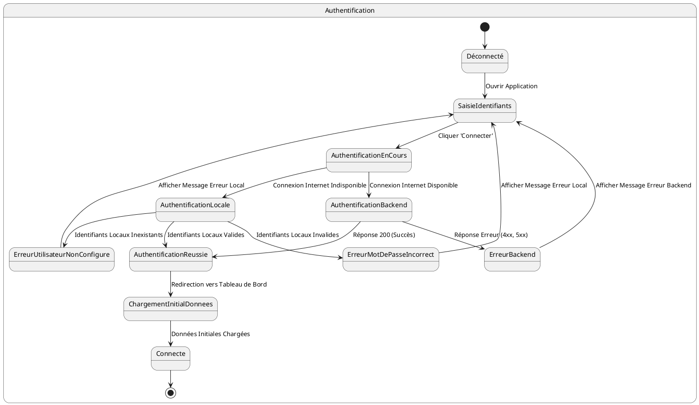

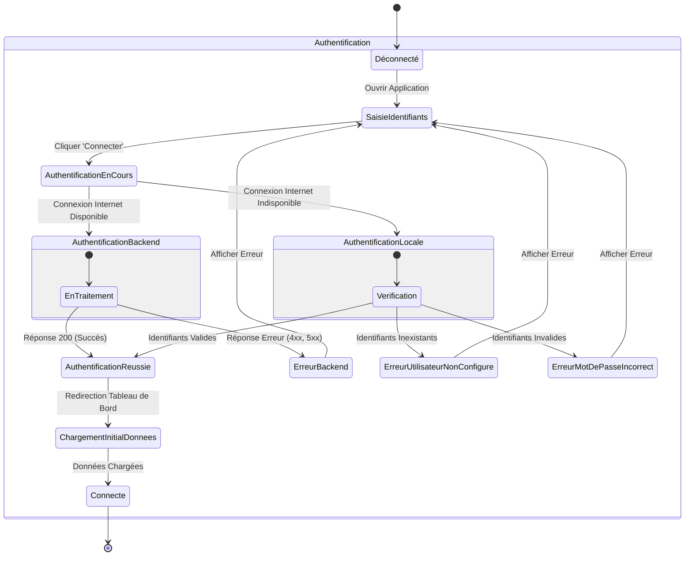

# US002 - Initialisation des Articles

**Contexte :**

En tant que commercial, après m'être connecté pour la première fois en ligne, je souhaite que l'application télécharge et stocke localement la liste des articles disponibles afin de pouvoir les consulter et les utiliser même sans connexion internet.

**Description de la fonctionnalité :**

Cette fonctionnalité permet à l'application de récupérer la liste complète des articles depuis le backend et de les enregistrer dans la base de données locale de l'appareil mobile. Ce processus se déclenche automatiquement après une authentification réussie en ligne.

**Règles Métiers :**

*   **RM-INIT-ART-001 :** L'application doit appeler l'API `GET {{baseUrl}}/api/v1/articles/all` après une connexion en ligne réussie.
*   **RM-INIT-ART-002 :** Seuls les champs `id`, `creditSalePrice`, `name`, `marque`, `model`, `type`, `stockQuantity`, et `commercialName` des articles doivent être stockés dans la base de données locale.
*   **RM-INIT-ART-003 :** Les champs `purchasePrice` et `sellingPrice` ne doivent pas être stockés localement car ils ne sont pas pertinents pour les opérations du commercial sur le terrain.
*   **RM-INIT-ART-004 :** En cas d'échec de la récupération des articles (réponse d'erreur de l'API), l'application doit afficher un message d'erreur informatif à l'utilisateur et proposer une option pour retenter l'initialisation ou continuer avec des données limitées.
*   **RM-INIT-ART-005 :** Un indicateur de progression (spinner ou barre de progression) doit être visible pendant le téléchargement des articles.

**Tests d'Acceptance :**

*   **TA-INIT-ART-001 :** **Scénario :** Initialisation des articles réussie.
    *   **Given :** L'utilisateur est connecté en ligne et l'initialisation des données est en cours.
    *   **When :** L'application appelle l'API des articles et reçoit une réponse 200 avec des données valides.
    *   **Then :** Les articles sont stockés localement avec les champs spécifiés, et l'indicateur de progression avance.
*   **TA-INIT-ART-002 :** **Scénario :** Initialisation des articles échouée (erreur API).
    *   **Given :** L'utilisateur est connecté en ligne et l'initialisation des données est en cours.
    *   **When :** L'application appelle l'API des articles et reçoit une réponse d'erreur (ex: 500).
    *   **Then :** Un message d'erreur est affiché à l'utilisateur, et l'application propose des options de récupération.

**Diagramme d'État (PlantUML) :**

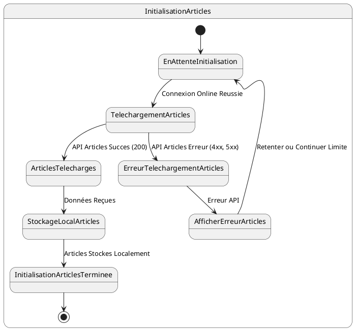

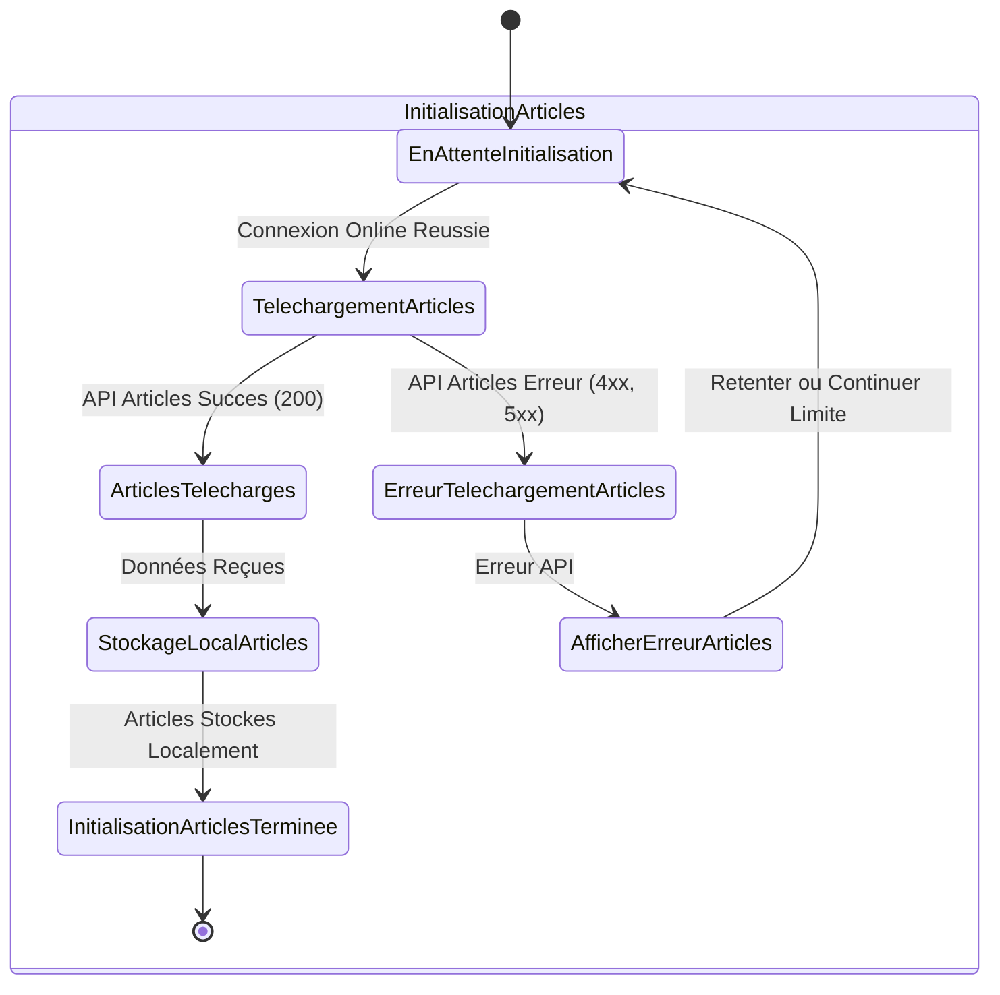

# US003 - Initialisation des Localités

**Contexte :**

En tant que commercial, après m'être connecté pour la première fois en ligne, je souhaite que l'application télécharge et stocke localement la liste des localités afin de pouvoir les utiliser lors de l'enregistrement de nouveaux clients, même sans connexion internet.

**Description de la fonctionnalité :**

Cette fonctionnalité permet à l'application de récupérer la liste complète des localités depuis le backend et de les enregistrer dans la base de données locale de l'appareil mobile. Ces localités seront utilisées pour associer les clients à des zones géographiques spécifiques.

**Règles Métiers :**

*   **RM-INIT-LOC-001 :** L'application doit appeler l'API `GET {{baseUrl}}/api/v1/localities/all` après une connexion en ligne réussie.
*   **RM-INIT-LOC-002 :** La liste des localités se trouve directement dans le champ `data` de la réponse API.
*   **RM-INIT-LOC-003 :** Toutes les localités retournées par l'API doivent être stockées localement avec leurs champs `id` et `name`.
*   **RM-INIT-LOC-004 :** En cas d'échec de la récupération des localités (réponse d'erreur de l'API), l'application doit afficher un message d'erreur informatif et proposer une option pour retenter l'initialisation.
*   **RM-INIT-LOC-005 :** Un indicateur de progression doit être visible pendant le téléchargement des localités.

**Tests d'Acceptance :**

*   **TA-INIT-LOC-001 :** **Scénario :** Initialisation des localités réussie.
    *   **Given :** L'utilisateur est connecté en ligne et l'initialisation des données est en cours.
    *   **When :** L'application appelle l'API des localités et reçoit une réponse 200 avec des données valides.
    *   **Then :** Les localités sont stockées localement avec leurs champs `id` et `name`, et l'indicateur de progression avance.
*   **TA-INIT-LOC-002 :** **Scénario :** Initialisation des localités échouée (erreur API).
    *   **Given :** L'utilisateur est connecté en ligne et l'initialisation des données est en cours.
    *   **When :** L'application appelle l'API des localités et reçoit une réponse d'erreur.
    *   **Then :** Un message d'erreur est affiché à l'utilisateur, et l'application propose des options de récupération.

**Diagramme d'État (PlantUML) :**

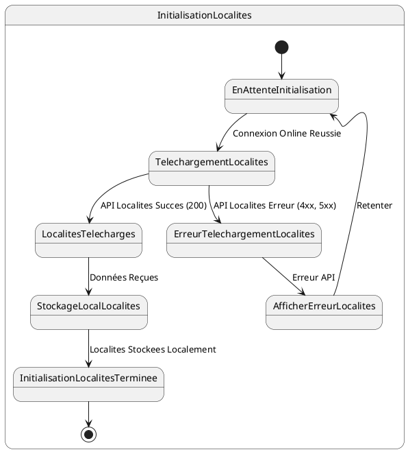

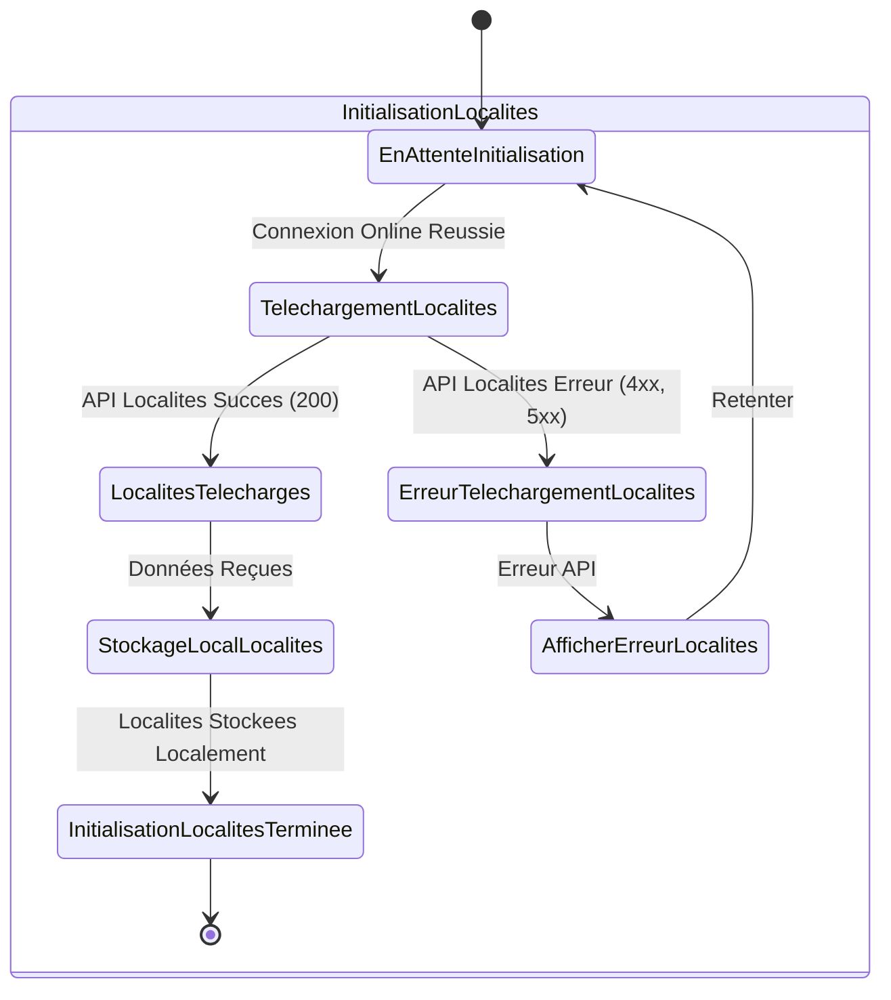

# US004 - Initialisation des Clients du Commercial

**Contexte :**

En tant que commercial, après m'être connecté pour la première fois en ligne, je souhaite que l'application télécharge et stocke localement la liste de mes clients afin de pouvoir les consulter et effectuer des opérations avec eux même sans connexion internet.

**Description de la fonctionnalité :**

Cette fonctionnalité permet à l'application de récupérer la liste des clients associés au commercial connecté depuis le backend et de les enregistrer dans la base de données locale de l'appareil mobile. Les données des clients incluent leurs informations personnelles et de contact.

**Règles Métiers :**

*   **RM-INIT-CLI-001 :** L'application doit appeler l'API `GET {{baseUrl}}/api/v1/clients/by-commercial/{commercial-username}?page=0&size=2000&sort=id,desc` après une connexion en ligne réussie.
*   **RM-INIT-CLI-002 :** La liste des clients se trouve dans le champ `data.content` de la réponse API.
*   **RM-INIT-CLI-003 :** Tous les champs des clients retournés par l'API doivent être stockés localement.
*   **RM-INIT-CLI-004 :** Pour la base de données locale, les attributs supplémentaires `latitude`, `longitude`, `mll` (map location link) et `profilPhoto` doivent être ajoutés à chaque client. Ces valeurs peuvent être nulles pour les données récupérées du serveur.
*   **RM-INIT-CLI-005 :** Pour les nouveaux clients enregistrés localement, les champs `latitude`, `longitude`, `mll` et `profilPhoto` seront obligatoires.
*   **RM-INIT-CLI-006 :** En cas d'échec de la récupération des clients (réponse d'erreur de l'API), l'application doit afficher un message d'erreur informatif et proposer une option pour retenter l'initialisation.
*   **RM-INIT-CLI-007 :** Un indicateur de progression doit être visible pendant le téléchargement des clients.

**Tests d'Acceptance :**

*   **TA-INIT-CLI-001 :** **Scénario :** Initialisation des clients réussie.
    *   **Given :** L'utilisateur est connecté en ligne et l'initialisation des données est en cours.
    *   **When :** L'application appelle l'API des clients et reçoit une réponse 200 avec des données valides.
    *   **Then :** Les clients sont stockés localement avec tous leurs champs, incluant les champs supplémentaires (latitude, longitude, mll, profilPhoto) initialisés à null, et l'indicateur de progression avance.
*   **TA-INIT-CLI-002 :** **Scénario :** Initialisation des clients échouée (erreur API).
    *   **Given :** L'utilisateur est connecté en ligne et l'initialisation des données est en cours.
    *   **When :** L'application appelle l'API des clients et reçoit une réponse d'erreur.
    *   **Then :** Un message d'erreur est affiché à l'utilisateur, et l'application propose des options de récupération.

**Diagramme d'État (PlantUML) :**

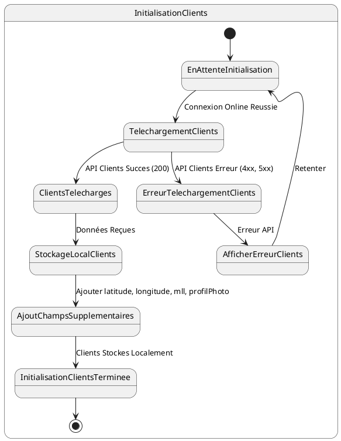

````mermaid
stateDiagram-v2
    [*] --> EnAttenteInitialisation
    
    state InitialisationClients {
        EnAttenteInitialisation --> TelechargementClients : Connexion Online Reussie
        
        TelechargementClients --> ClientsTelecharges : API Clients Succes (200)
        TelechargementClients --> ErreurTelechargementClients : API Clients Erreur (4xx, 5xx)
        
        ClientsTelecharges --> StockageLocalClients : Données Reçues
        StockageLocalClients --> AjoutChampsSupplementaires : Ajouter latitude, longitude, mll, profilPhoto
        AjoutChampsSupplementaires --> InitialisationClientsTerminee : Clients Stockes Localement
        
        ErreurTelechargementClients --> AfficherErreurClients : Erreur API
        AfficherErreurClients --> EnAttenteInitialisation : Retenter
        
        InitialisationClientsTerminee --> [*]
    }
````

# US005 - Initialisation des Commerciaux

**Contexte :**

En tant que commercial, après m'être connecté pour la première fois en ligne, je souhaite que l'application télécharge et stocke localement mes propres informations de commercial afin de pouvoir les consulter et les utiliser pour mes rapports et activités.

**Description de la fonctionnalité :**

Cette fonctionnalité permet à l'application de récupérer la liste de tous les commerciaux depuis le backend et de n'enregistrer localement que les informations du commercial actuellement connecté. Cela assure que l'application dispose des détails nécessaires sur l'utilisateur principal.

**Règles Métiers :**

*   **RM-INIT-COM-001 :** L'application doit appeler l'API `GET {{baseUrl}}/api/v1/promoters/all` après une connexion en ligne réussie.
*   **RM-INIT-COM-002 :** La liste des commerciaux se trouve directement dans le champ `data` de la réponse API.
*   **RM-INIT-COM-003 :** Seul l'élément de la liste dont le `username` correspond au `username` de l'utilisateur connecté doit être enregistré localement.
*   **RM-INIT-COM-004 :** Tous les champs de l'objet commercial correspondant doivent être stockés localement.
*   **RM-INIT-COM-005 :** En cas d'échec de la récupération des commerciaux (réponse d'erreur de l'API), l'application doit afficher un message d'erreur informatif et proposer une option pour retenter l'initialisation.
*   **RM-INIT-COM-006 :** Un indicateur de progression doit être visible pendant le téléchargement des commerciaux.

**Tests d'Acceptance :**

*   **TA-INIT-COM-001 :** **Scénario :** Initialisation du commercial connecté réussie.
    *   **Given :** L'utilisateur est connecté en ligne et l'initialisation des données est en cours.
    *   **When :** L'application appelle l'API des commerciaux et reçoit une réponse 200 avec des données valides, incluant le commercial connecté.
    *   **Then :** Les informations du commercial connecté sont stockées localement, et l'indicateur de progression avance.
*   **TA-INIT-COM-002 :** **Scénario :** Initialisation des commerciaux échouée (erreur API).
    *   **Given :** L'utilisateur est connecté en ligne et l'initialisation des données est en cours.
    *   **When :** L'application appelle l'API des commerciaux et reçoit une réponse d'erreur.
    *   **Then :** Un message d'erreur est affiché à l'utilisateur, et l'application propose des options de récupération.

**Diagramme d'État (PlantUML) :**

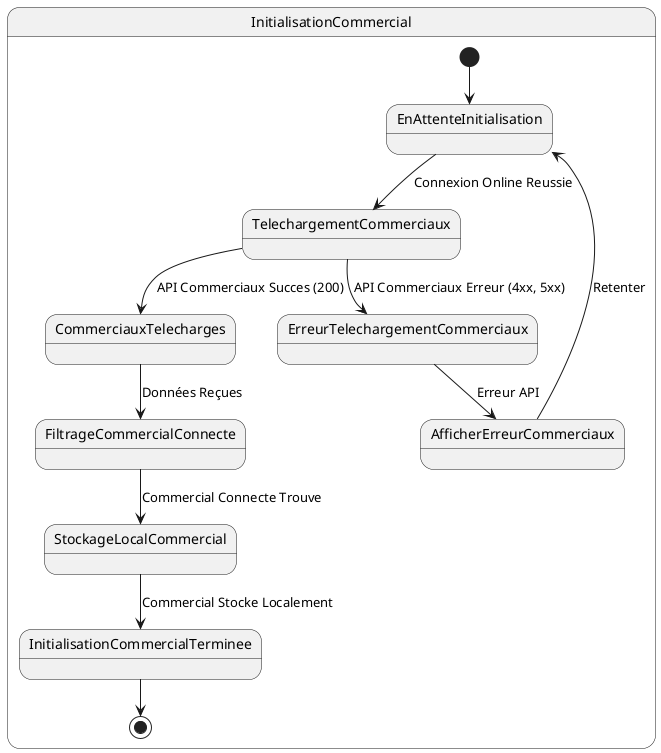

```mermaid
stateDiagram-v2
    [*] --> EnAttenteInitialisation
    
    state InitialisationCommercial {
        EnAttenteInitialisation --> TelechargementCommerciaux : Connexion Online Reussie
        
        TelechargementCommerciaux --> CommerciauxTelecharges : API Commerciaux Succes (200)
        TelechargementCommerciaux --> ErreurTelechargementCommerciaux : API Commerciaux Erreur (4xx, 5xx)
        
        CommerciauxTelecharges --> FiltrageCommercialConnecte : Données Reçues
        FiltrageCommercialConnecte --> StockageLocalCommercial : Commercial Connecte Trouve
        StockageLocalCommercial --> InitialisationCommercialTerminee : Commercial Stocke Localement
        
        ErreurTelechargementCommerciaux --> AfficherErreurCommerciaux : Erreur API
        AfficherErreurCommerciaux --> EnAttenteInitialisation : Retenter
        
        InitialisationCommercialTerminee --> [*]
    }
````

# US013 - Initialisation des Sorties d'Articles du Commercial

**Contexte :**

En tant que commercial, après m'être connecté pour la première fois en ligne, je souhaite que l'application télécharge et stocke localement la liste des articles que j'ai sortis du magasin et que je peux distribuer sur le terrain, afin de gérer mon stock mobile même sans connexion internet.

**Description de la fonctionnalité :**

Cette fonctionnalité permet à l'application de récupérer les enregistrements des sorties d'articles du magasin qui sont attribués au commercial connecté. Ces sorties représentent le stock d'articles que le commercial est autorisé à distribuer à crédit. Les données sont stockées localement pour une utilisation hors ligne.

**Règles Métiers :**

*   **RM-INIT-SORTIE-001 :** L'application doit appeler l'API `GET {{baseUrl}}/api/v1/credits/sorties-history/by-commercial/{{commercial-username}}?page=0&size=1000&sort=id,desc` après une connexion en ligne réussie.
*   **RM-INIT-SORTIE-002 :** La liste des sorties d'articles se trouve dans le champ `data.content` de la réponse API.
*   **RM-INIT-SORTIE-003 :** Seuls les éléments de la liste dont le `status` est égal à "INPROGRESS" et `updatable` est à "true" doivent être enregistrés localement.
*   **RM-INIT-SORTIE-004 :** Seules les références des entités liées (`client.id`, `articles.id`) doivent être stockées pour éviter la duplication des données complètes des clients et articles déjà initialisés.
*   **RM-INIT-SORTIE-005 :** En cas d'échec de la récupération des sorties d'articles (réponse d'erreur de l'API), l'application doit afficher un message d'erreur informatif et proposer une option pour retenter l'initialisation.
*   **RM-INIT-SORTIE-006 :** Un indicateur de progression doit être visible pendant le téléchargement des sorties d'articles.

**Tests d'Acceptance :**

*   **TA-INIT-SORTIE-001 :** **Scénario :** Initialisation des sorties d'articles réussie.
    *   **Given :** L'utilisateur est connecté en ligne et l'initialisation des données est en cours.
    *   **When :** L'application appelle l'API des sorties d'articles et reçoit une réponse 200 avec des données valides.
    *   **Then :** Les sorties d'articles sont stockées localement, filtrées par statut et `updatable`, et l'indicateur de progression avance.
*   **TA-INIT-SORTIE-002 :** **Scénario :** Initialisation des sorties d'articles échouée (erreur API).
    *   **Given :** L'utilisateur est connecté en ligne et l'initialisation des données est en cours.
    *   **When :** L'application appelle l'API des sorties d'articles et reçoit une réponse d'erreur.
    *   **Then :** Un message d'erreur est affiché à l'utilisateur, et l'application propose des options de récupération.

**Diagramme d'État (PlantUML) :**

```plantuml
@startuml
state InitialisationSortiesArticles {
  [*] --> EnAttenteInitialisation
  EnAttenteInitialisation --> TelechargementSorties : Connexion Online Reussie
  TelechargementSorties --> SortiesTelechargees : API Sorties Succes (200)
  TelechargementSorties --> ErreurTelechargementSorties : API Sorties Erreur (4xx, 5xx)

  SortiesTelechargees --> FiltrageSorties : Filtrer par Statut et Updatable
  FiltrageSorties --> StockageLocalSorties : Sorties Valides Stockees
  StockageLocalSorties --> InitialisationSortiesArticlesTerminee : Sorties Stockees Localement

  ErreurTelechargementSorties --> AfficherErreurSorties : Erreur API
  AfficherErreurSorties --> EnAttenteInitialisation : Retenter

  InitialisationSortiesArticlesTerminee --> [*]
}
@enduml
```
````mermaid
stateDiagram-v2
    [*] --> EnAttenteInitialisation
    
    state InitialisationSortiesArticles {
        EnAttenteInitialisation --> TelechargementSorties : Connexion Online Reussie
        
        TelechargementSorties --> SortiesTelechargees : API Sorties Succes (200)
        TelechargementSorties --> ErreurTelechargementSorties : API Sorties Erreur (4xx, 5xx)
        
        SortiesTelechargees --> FiltrageSorties : Filtrer par Statut et Updatable
        FiltrageSorties --> StockageLocalSorties : Sorties Valides Stockees
        StockageLocalSorties --> InitialisationSortiesArticlesTerminee : Sorties Stockees Localement
        
        ErreurTelechargementSorties --> AfficherErreurSorties : Erreur API
        AfficherErreurSorties --> EnAttenteInitialisation : Retenter
        
        InitialisationSortiesArticlesTerminee --> [*]
    }
````

# US014 - Initialisation des Distributions Existantes du Commercial

**Contexte :**

En tant que commercial, après m'être connecté pour la première fois en ligne, je souhaite que l'application télécharge et stocke localement l'historique de mes distributions (ventes à crédit) existantes afin de pouvoir consulter et suivre les crédits en cours, même sans connexion internet.

**Description de la fonctionnalité :**

Cette fonctionnalité permet à l'application de récupérer l'historique complet des distributions (ventes à crédit) effectuées par le commercial connecté. Ces données incluent les crédits en cours et terminés, permettant au commercial de suivre l'état des remboursements et d'effectuer les recouvrements appropriés.

**Règles Métiers :**

*   **RM-INIT-DIST-001 :** L'application doit appeler l'API `GET {{baseUrl}}/api/v1/credits/by-commercial/{{commercial-username}}?page=0&size=10000&sort=id,desc` après une connexion en ligne réussie.
*   **RM-INIT-DIST-002 :** La liste des distributions se trouve dans le champ `data.content` de la réponse API.
*   **RM-INIT-DIST-003 :** Toutes les distributions retournées par l'API doivent être stockées localement, incluant les crédits en cours et terminés.
*   **RM-INIT-DIST-004 :** Les informations pertinentes pour le suivi des crédits et des recouvrements doivent être stockées, notamment :
    - ID de la distribution
    - Référence du crédit
    - Informations du client (ID de référence)
    - Articles distribués (ID de référence)
    - Montants (total, payé, restant)
    - Dates (début, fin prévue, fin effective)
    - Statut du crédit
    - Mise journalière
*   **RM-INIT-DIST-005 :** Seules les références des entités liées (`client.id`, `articles.id`) doivent être stockées pour éviter la duplication des données complètes des clients et articles déjà initialisés.
*   **RM-INIT-DIST-006 :** En cas d'échec de la récupération des distributions (réponse d'erreur de l'API), l'application doit afficher un message d'erreur informatif et proposer une option pour retenter l'initialisation.
*   **RM-INIT-DIST-007 :** Un indicateur de progression doit être visible pendant le téléchargement des distributions.

**Tests d'Acceptance :**

*   **TA-INIT-DIST-001 :** **Scénario :** Initialisation des distributions existantes réussie.
    *   **Given :** L'utilisateur est connecté en ligne et l'initialisation des données est en cours.
    *   **When :** L'application appelle l'API des distributions et reçoit une réponse 200 avec des données valides.
    *   **Then :** Les distributions sont stockées localement avec toutes les informations pertinentes, et l'indicateur de progression avance.
*   **TA-INIT-DIST-002 :** **Scénario :** Initialisation des distributions échouée (erreur API).
    *   **Given :** L'utilisateur est connecté en ligne et l'initialisation des données est en cours.
    *   **When :** L'application appelle l'API des distributions et reçoit une réponse d'erreur.
    *   **Then :** Un message d'erreur est affiché à l'utilisateur, et l'application propose des options de récupération.

**Diagramme d'État (PlantUML) :**

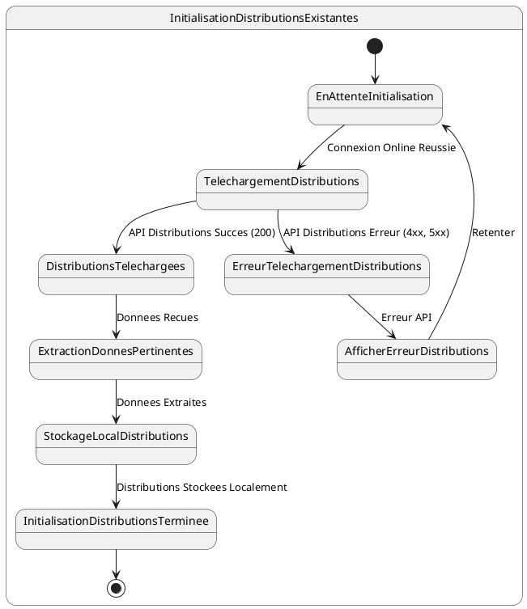

````mermaid
stateDiagram-v2
    [*] --> EnAttenteInitialisation
    
    state InitialisationDistributionsExistantes {
        EnAttenteInitialisation --> TelechargementDistributions : Connexion Online Reussie
        
        TelechargementDistributions --> DistributionsTelechargees : API Distributions Succes (200)
        TelechargementDistributions --> ErreurTelechargementDistributions : API Distributions Erreur (4xx, 5xx)
        
        DistributionsTelechargees --> ExtractionDonnesPertinentes : Donnees Recues
        ExtractionDonnesPertinentes --> StockageLocalDistributions : Donnees Extraites
        StockageLocalDistributions --> InitialisationDistributionsTerminee : Distributions Stockees Localement
        
        ErreurTelechargementDistributions --> AfficherErreurDistributions : Erreur API
        AfficherErreurDistributions --> EnAttenteInitialisation : Retenter
        
        InitialisationDistributionsTerminee --> [*]
    }
````

# US015 - Initialisation des Comptes Clients du Commercial

**Contexte :**

En tant que commercial, après m'être connecté pour la première fois en ligne, je souhaite que l'application télécharge et stocke localement les comptes de mes clients afin de pouvoir consulter leurs soldes et gérer les transactions financières, même sans connexion internet.

**Description de la fonctionnalité :**

Cette fonctionnalité permet à l'application de récupérer les informations des comptes clients associés au commercial connecté. Ces comptes contiennent les soldes actuels et les statuts des comptes, essentiels pour la gestion des crédits et des recouvrements.

**Règles Métiers :**

*   **RM-INIT-COMPTE-001 :** L'application doit appeler l'API `GET {{baseUrl}}/api/v1/accounts?page=0&size=2000&sort=id,desc&username=<commercial-username>` après une connexion en ligne réussie.
*   **RM-INIT-COMPTE-002 :** La liste des comptes clients se trouve dans le champ `data.content` de la réponse API.
*   **RM-INIT-COMPTE-003 :** Pour chaque compte, les informations suivantes doivent être stockées localement :
    - ID du compte
    - Numéro de compte
    - Solde du compte (accountBalance)
    - Statut du compte
    - ID du client associé (client.id) pour référence
*   **RM-INIT-COMPTE-004 :** Seul l'ID du client (`client.id`) doit être stocké pour référencer le client déjà enregistré localement, évitant la duplication des informations complètes du client.
*   **RM-INIT-COMPTE-005 :** En cas d'échec de la récupération des comptes (réponse d'erreur de l'API), l'application doit afficher un message d'erreur informatif et proposer une option pour retenter l'initialisation.
*   **RM-INIT-COMPTE-006 :** Un indicateur de progression doit être visible pendant le téléchargement des comptes clients.

**Tests d'Acceptance :**

*   **TA-INIT-COMPTE-001 :** **Scénario :** Initialisation des comptes clients réussie.
    *   **Given :** L'utilisateur est connecté en ligne et l'initialisation des données est en cours.
    *   **When :** L'application appelle l'API des comptes et reçoit une réponse 200 avec des données valides.
    *   **Then :** Les comptes clients sont stockés localement avec les informations essentielles et les références aux clients, et l'indicateur de progression avance.
*   **TA-INIT-COMPTE-002 :** **Scénario :** Initialisation des comptes clients échouée (erreur API).
    *   **Given :** L'utilisateur est connecté en ligne et l'initialisation des données est en cours.
    *   **When :** L'application appelle l'API des comptes et reçoit une réponse d'erreur.
    *   **Then :** Un message d'erreur est affiché à l'utilisateur, et l'application propose des options de récupération.

**Diagramme d'État (PlantUML) :**

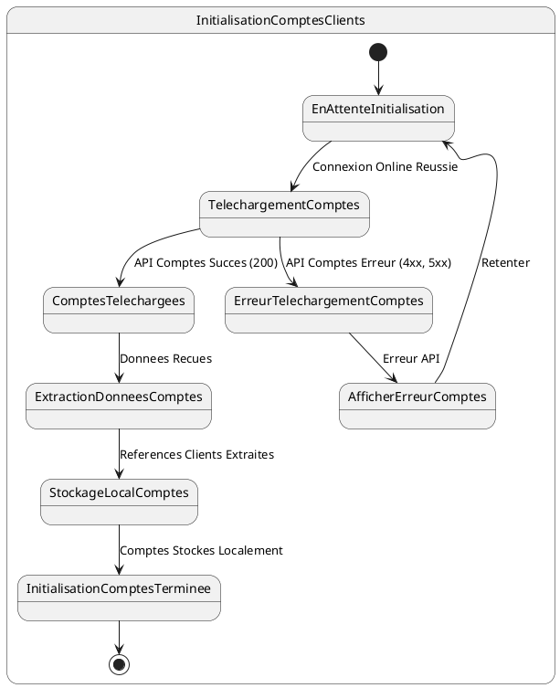
````mermaid
stateDiagram-v2
    [*] --> EnAttenteInitialisation
    
    state InitialisationComptesClients {
        EnAttenteInitialisation --> TelechargementComptes : Connexion Online Reussie
        
        TelechargementComptes --> ComptesTelechargees : API Comptes Succes (200)
        TelechargementComptes --> ErreurTelechargementComptes : API Comptes Erreur (4xx, 5xx)
        
        ComptesTelechargees --> ExtractionDonneesComptes : Donnees Recues
        ExtractionDonneesComptes --> StockageLocalComptes : References Clients Extraites
        StockageLocalComptes --> InitialisationComptesTerminee : Comptes Stockes Localement
        
        ErreurTelechargementComptes --> AfficherErreurComptes : Erreur API
        AfficherErreurComptes --> EnAttenteInitialisation : Retenter
        
        InitialisationComptesTerminee --> [*]
    }
````

# US009 - Enregistrement d'un Nouveau Client

**Contexte :**

En tant que commercial sur le terrain, je souhaite enregistrer un nouveau client avec toutes ses informations personnelles, sa géolocalisation et sa photo de profil afin de pouvoir lui proposer des services et effectuer des distributions, même sans connexion internet.

**Description de la fonctionnalité :**

Cette fonctionnalité permet au commercial d'enregistrer un nouveau client directement sur le terrain. Le processus inclut la saisie des informations personnelles, la prise de photo de profil, la géolocalisation automatique ou manuelle, et la génération d'un lien de carte. Le nouveau client est enregistré localement et marqué pour synchronisation avec le serveur.

**Règles Métiers :**

*   **RM-NEWCLI-001 :** L'application doit permettre la saisie des informations obligatoires du client : Prénom, Nom, Adresse, Téléphone, Type de pièce d'identité, Numéro de pièce d'identité, Date de naissance, Profession.
*   **RM-NEWCLI-002 :** L'application doit permettre la saisie des informations optionnelles de la personne à contacter : Nom, Téléphone, Adresse.
*   **RM-NEWCLI-003 :** L'application doit permettre de sélectionner le quartier (localité) du client parmi la liste des localités synchronisées.
*   **RM-NEWCLI-004 :** La prise de photo de profil du client est obligatoire pour les nouveaux clients enregistrés localement.
*   **RM-NEWCLI-005 :** La géolocalisation (latitude, longitude) est obligatoire et peut être obtenue automatiquement via le GPS de l'appareil ou saisie manuellement.
*   **RM-NEWCLI-006 :** L'application doit générer automatiquement un lien Google Maps (mll) basé sur les coordonnées de géolocalisation.
*   **RM-NEWCLI-007 :** Le nouveau client doit être enregistré localement avec un statut "en attente de synchronisation".
*   **RM-NEWCLI-008 :** L'application doit générer un identifiant unique local temporaire pour le nouveau client en attendant la synchronisation avec le serveur.

**Tests d'Acceptance :**

*   **TA-NEWCLI-001 :** **Scénario :** Enregistrement d'un nouveau client réussi avec géolocalisation automatique.
    *   **Given :** Le commercial saisit toutes les informations obligatoires, prend une photo, et autorise la géolocalisation automatique.
    *   **When :** Le commercial confirme l'enregistrement du nouveau client.
    *   **Then :** Le client est enregistré localement avec toutes les informations, la géolocalisation automatique, et un lien Google Maps généré.
*   **TA-NEWCLI-002 :** **Scénario :** Enregistrement d'un nouveau client avec géolocalisation manuelle.
    *   **Given :** Le commercial saisit toutes les informations obligatoires, prend une photo, et saisit manuellement les coordonnées GPS.
    *   **When :** Le commercial confirme l'enregistrement du nouveau client.
    *   **Then :** Le client est enregistré localement avec les coordonnées manuelles et un lien Google Maps généré.
*   **TA-NEWCLI-003 :** **Scénario :** Tentative d'enregistrement sans photo de profil.
    *   **Given :** Le commercial saisit toutes les informations mais n'a pas pris de photo de profil.
    *   **When :** Le commercial tente de confirmer l'enregistrement.
    *   **Then :** L'application affiche un message d'erreur indiquant que la photo de profil est obligatoire.

**Diagramme d'État (PlantUML) :**

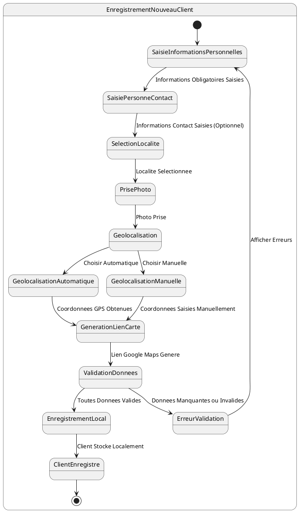

# US006 - Enregistrement d'une Distribution

**Contexte :**

En tant que commercial sur le terrain, je souhaite enregistrer une distribution d'articles à un client afin de documenter la vente à crédit et de pouvoir imprimer un reçu pour le client, même sans connexion internet.

**Description de la fonctionnalité :**

Cette fonctionnalité permet au commercial d'enregistrer une vente à crédit (distribution) d'articles à un client. Le commercial sélectionne le client, les articles et les quantités, et l'application calcule automatiquement le montant total et la mise journalière. La distribution est enregistrée localement et marquée pour synchronisation ultérieure.

**Règles Métiers :**

*   **RM-DIST-001 :** L'application doit permettre de sélectionner un client existant dans la liste des clients synchronisés localement.
*   **RM-DIST-002 :** L'application doit permettre de sélectionner les articles à distribuer parmi les sorties d'articles disponibles du commercial (stock local).
*   **RM-DIST-003 :** Pour chaque article sélectionné, le commercial doit pouvoir spécifier la quantité distribuée.
*   **RM-DIST-004 :** La quantité distribuée ne peut pas dépasser la quantité disponible dans le stock local du commercial.
*   **RM-DIST-005 :** L'application doit calculer automatiquement le montant total de la distribution en utilisant le `creditSalePrice` de chaque article.
*   **RM-DIST-006 :** L'application doit calculer automatiquement la mise journalière à collecter pour cette vente.
*   **RM-DIST-007 :** La distribution doit être enregistrée localement avec un statut "en attente de synchronisation".
*   **RM-DIST-008 :** Le stock local du commercial doit être mis à jour après l'enregistrement de la distribution.
*   **RM-DIST-009 :** L'application doit générer un identifiant unique local pour la distribution en attendant la synchronisation avec le serveur.

**Tests d'Acceptance :**

*   **TA-DIST-001 :** **Scénario :** Enregistrement d'une distribution réussie.
    *   **Given :** Le commercial a sélectionné un client et des articles avec des quantités valides.
    *   **When :** Le commercial confirme la distribution.
    *   **Then :** La distribution est enregistrée localement, le montant total et la mise journalière sont calculés correctement, et le stock local est mis à jour.
*   **TA-DIST-002 :** **Scénario :** Tentative de distribution avec quantité insuffisante.
    *   **Given :** Le commercial sélectionne une quantité d'articles supérieure à son stock disponible.
    *   **When :** Le commercial tente de confirmer la distribution.
    *   **Then :** L'application affiche un message d'erreur et empêche l'enregistrement de la distribution.

**Diagramme d'État (PlantUML) :**

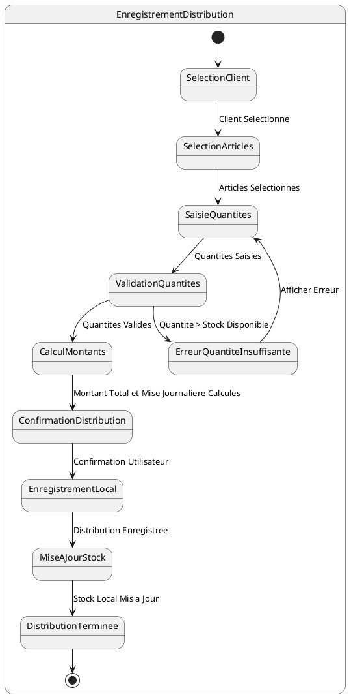

# US007 - Impression de Reçu de Distribution

**Contexte :**

En tant que commercial, après avoir enregistré une distribution d'articles à un client, je souhaite imprimer un reçu détaillé pour le client afin de lui fournir une preuve de la transaction et les informations sur la mise journalière à collecter.

**Description de la fonctionnalité :**

Cette fonctionnalité permet au commercial d'imprimer un reçu détaillé après l'enregistrement d'une distribution. Le reçu contient toutes les informations pertinentes de la transaction et peut être imprimé via une imprimante mobile Bluetooth.

**Règles Métiers :**

*   **RM-RECU-001 :** Le reçu doit contenir la liste complète des articles distribués avec leurs noms commerciaux, quantités et prix unitaires.
*   **RM-RECU-002 :** Le reçu doit afficher le montant total de la distribution.
*   **RM-RECU-003 :** Le reçu doit indiquer clairement la mise journalière à collecter pour cette vente.
*   **RM-RECU-004 :** Le reçu doit inclure les informations du client (nom complet, adresse, téléphone).
*   **RM-RECU-005 :** Le reçu doit inclure les informations du commercial (nom complet).
*   **RM-RECU-006 :** Le reçu doit afficher la date et l'heure de la transaction.
*   **RM-RECU-007 :** Le reçu doit inclure un numéro de référence unique de la distribution.
*   **RM-RECU-008 :** L'application doit s'interfacer avec une imprimante mobile compatible Bluetooth.
*   **RM-RECU-009 :** Le reçu doit être formaté de manière claire et lisible, adapté à l'impression sur papier thermique.
*   **RM-RECU-010 :** En cas d'échec de l'impression, l'application doit permettre de retenter l'impression ou de sauvegarder le reçu pour impression ultérieure.

**Tests d'Acceptance :**

*   **TA-RECU-001 :** **Scénario :** Impression de reçu réussie.
    *   **Given :** Une distribution a été enregistrée avec succès et une imprimante Bluetooth est connectée.
    *   **When :** Le commercial demande l'impression du reçu.
    *   **Then :** Le reçu est généré avec toutes les informations requises et envoyé à l'imprimante avec succès.
*   **TA-RECU-002 :** **Scénario :** Échec de l'impression (imprimante non disponible).
    *   **Given :** Une distribution a été enregistrée mais aucune imprimante n'est connectée.
    *   **When :** Le commercial demande l'impression du reçu.
    *   **Then :** L'application affiche un message d'erreur et propose des options de récupération (connecter imprimante, sauvegarder pour plus tard).

**Diagramme d'État (PlantUML) :**

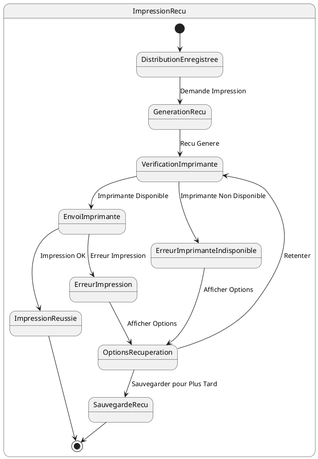

# US008 - Enregistrement d'un Recouvrement Journalier

**Contexte :**

En tant que commercial sur le terrain, je souhaite enregistrer les montants collectés auprès des clients pour leurs crédits en cours afin de mettre à jour leurs comptes et de suivre mes activités de recouvrement, même sans connexion internet.

**Description de la fonctionnalité :**

Cette fonctionnalité permet au commercial d'enregistrer un recouvrement (collecte d'argent) auprès d'un client pour un crédit spécifique. Le commercial sélectionne le client et le crédit, saisit le montant collecté, et l'application met à jour le solde local du crédit. Le recouvrement est enregistré localement et marqué pour synchronisation.

**Règles Métiers :**

*   **RM-RECOUV-001 :** L'application doit permettre de sélectionner un client parmi la liste des clients du commercial.
*   **RM-RECOUV-002 :** Après la sélection du client, l'application doit afficher la liste des crédits en cours de ce client.
*   **RM-RECOUV-003 :** Pour le crédit sélectionné, l'application doit afficher la mise journalière attendue et le solde restant dû.
*   **RM-RECOUV-004 :** Le commercial doit pouvoir saisir le montant collecté. Ce montant ne peut pas dépasser le solde restant dû.
*   **RM-RECOUV-005 :** Le recouvrement doit être enregistré localement avec un statut "en attente de synchronisation".
*   **RM-RECOUV-006 :** Le solde du crédit local du client doit être mis à jour après l'enregistrement du recouvrement.
*   **RM-RECOUV-007 :** L'application doit générer un identifiant unique local pour le recouvrement en attendant la synchronisation avec le serveur.

**Tests d'Acceptance :**

*   **TA-RECOUV-001 :** **Scénario :** Enregistrement d'un recouvrement réussi.
    *   **Given :** Le commercial a sélectionné un client et un crédit, et saisit un montant valide (inférieur ou égal au solde restant).
    *   **When :** Le commercial confirme le recouvrement.
    *   **Then :** Le recouvrement est enregistré localement, le solde du crédit est mis à jour, et la transaction est marquée pour synchronisation.
*   **TA-RECOUV-002 :** **Scénario :** Tentative d'enregistrement d'un recouvrement avec un montant supérieur au solde.
    *   **Given :** Le commercial saisit un montant collecté supérieur au solde restant dû du crédit.
    *   **When :** Le commercial tente de confirmer le recouvrement.
    *   **Then :** L'application affiche un message d'erreur et empêche l'enregistrement du recouvrement.

**Diagramme d'État (PlantUML) :**

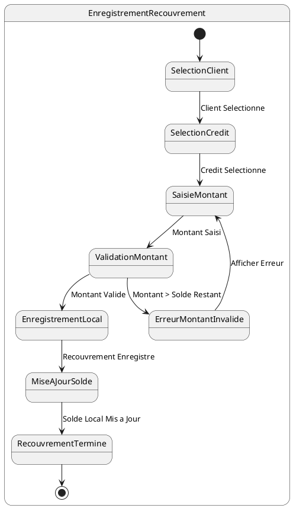

# US010 - Synchronisation des Données avec le Serveur

**Contexte :**

En tant que commercial de retour à l'agence, je souhaite synchroniser toutes les données collectées sur le terrain (distributions, recouvrements, nouveaux clients) avec le serveur backend afin de mettre à jour le système central et de récupérer les dernières informations.

**Description de la fonctionnalité :**

Cette fonctionnalité permet la synchronisation bidirectionnelle des données entre l'application mobile et le serveur backend. Elle envoie les données collectées localement (distributions, recouvrements, nouveaux clients) vers le serveur et récupère les mises à jour du serveur vers l'application locale.

**Règles Métiers :**

*   **RM-SYNC-001 :** La synchronisation ne peut être déclenchée que lorsqu'une connexion internet stable est disponible.
*   **RM-SYNC-002 :** L'application doit synchroniser les données dans l'ordre suivant : nouveaux clients, distributions, recouvrements.
*   **RM-SYNC-003 :** Pour chaque nouveau client, l'application doit appeler l'API de création de client et récupérer l'ID serveur pour mettre à jour la référence locale.
*   **RM-SYNC-004 :** Pour chaque distribution, l'application doit appeler l'API de création de distribution et mettre à jour le statut local.
*   **RM-SYNC-005 :** Pour chaque recouvrement, l'application doit appeler l'API de création de recouvrement et mettre à jour le statut local.
*   **RM-SYNC-006 :** Après l'envoi des données locales, l'application doit récupérer les mises à jour du serveur (nouveaux articles, clients modifiés, etc.).
*   **RM-SYNC-007 :** En cas d'erreur de synchronisation pour un élément spécifique, l'application doit continuer avec les autres éléments et marquer l'élément en erreur pour une nouvelle tentative.
*   **RM-SYNC-008 :** Un indicateur de progression détaillé doit être affiché pendant toute la durée de la synchronisation.
*   **RM-SYNC-009 :** L'utilisateur doit être informé du résultat de la synchronisation (succès complet, succès partiel, échec).

**Tests d'Acceptance :**

*   **TA-SYNC-001 :** **Scénario :** Synchronisation complète réussie.
    *   **Given :** Le commercial a des données en attente de synchronisation et une connexion internet stable.
    *   **When :** Le commercial déclenche la synchronisation.
    *   **Then :** Tous les nouveaux clients, distributions et recouvrements sont synchronisés avec succès, et les mises à jour du serveur sont récupérées.
*   **TA-SYNC-002 :** **Scénario :** Synchronisation partielle (certains éléments échouent).
    *   **Given :** Le commercial a des données en attente et certaines requêtes API échouent.
    *   **When :** Le commercial déclenche la synchronisation.
    *   **Then :** Les éléments synchronisés avec succès sont marqués comme tels, les éléments en erreur restent en attente, et l'utilisateur est informé du résultat partiel.
*   **TA-SYNC-003 :** **Scénario :** Échec de synchronisation (pas de connexion).
    *   **Given :** Le commercial tente de synchroniser sans connexion internet.
    *   **When :** Le commercial déclenche la synchronisation.
    *   **Then :** L'application affiche un message d'erreur indiquant l'absence de connexion et propose de retenter plus tard.

**Diagramme d'État (PlantUML) :**

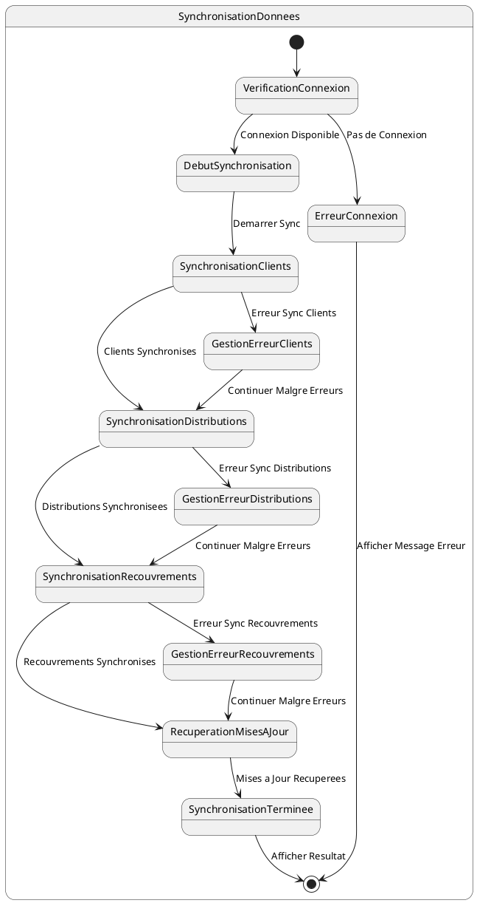

# US011 - Génération et Impression du Rapport Journalier

**Contexte :**

En tant que commercial, je souhaite générer et imprimer un rapport détaillé de mes activités journalières (distributions et recouvrements) afin de documenter mon travail et de fournir un compte-rendu à ma hiérarchie.

**Description de la fonctionnalité :**

Cette fonctionnalité permet au commercial de générer un rapport journalier complet de ses activités sur le terrain. Le rapport inclut un résumé des distributions et recouvrements effectués, ainsi que des détails pour chaque transaction. Le rapport peut être imprimé via une imprimante mobile.

**Règles Métiers :**

*   **RM-RAPPORT-001 :** Le rapport doit inclure un résumé des distributions : nombre total de distributions et montant total distribué.
*   **RM-RAPPORT-002 :** Le rapport doit inclure un résumé des recouvrements : nombre total de recouvrements et montant total collecté.
*   **RM-RAPPORT-003 :** Le rapport doit contenir une liste détaillée de toutes les distributions effectuées avec : nom du client, articles distribués (nom, quantité, prix unitaire), montant total de chaque distribution.
*   **RM-RAPPORT-004 :** Le rapport doit contenir une liste détaillée de tous les recouvrements effectués avec : nom du client, montant collecté, référence du crédit concerné.
*   **RM-RAPPORT-005 :** Le rapport doit inclure les informations du commercial (nom complet, username).
*   **RM-RAPPORT-006 :** Le rapport doit afficher la date de génération du rapport.
*   **RM-RAPPORT-007 :** Le rapport doit être généré à partir des données locales de l'appareil.
*   **RM-RAPPORT-008 :** L'application doit permettre l'impression du rapport via une imprimante mobile Bluetooth.
*   **RM-RAPPORT-009 :** Le rapport doit être formaté de manière claire et professionnelle, adapté à l'impression.
*   **RM-RAPPORT-010 :** En cas d'échec de l'impression, l'application doit permettre de sauvegarder le rapport ou de retenter l'impression.

**Tests d'Acceptance :**

*   **TA-RAPPORT-001 :** **Scénario :** Génération et impression de rapport réussies.
    *   **Given :** Le commercial a effectué des distributions et/ou recouvrements dans la journée et une imprimante est connectée.
    *   **When :** Le commercial demande la génération et l'impression du rapport journalier.
    *   **Then :** Le rapport est généré avec toutes les informations correctes et imprimé avec succès.
*   **TA-RAPPORT-002 :** **Scénario :** Génération de rapport sans activités.
    *   **Given :** Le commercial n'a effectué aucune distribution ni recouvrement dans la journée.
    *   **When :** Le commercial demande la génération du rapport journalier.
    *   **Then :** Un rapport est généré indiquant l'absence d'activités pour la journée.
*   **TA-RAPPORT-003 :** **Scénario :** Échec de l'impression du rapport.
    *   **Given :** Un rapport a été généré mais l'impression échoue.
    *   **When :** Le commercial tente d'imprimer le rapport.
    *   **Then :** L'application affiche un message d'erreur et propose des options de récupération (retenter, sauvegarder).

**Diagramme d'État (PlantUML) :**

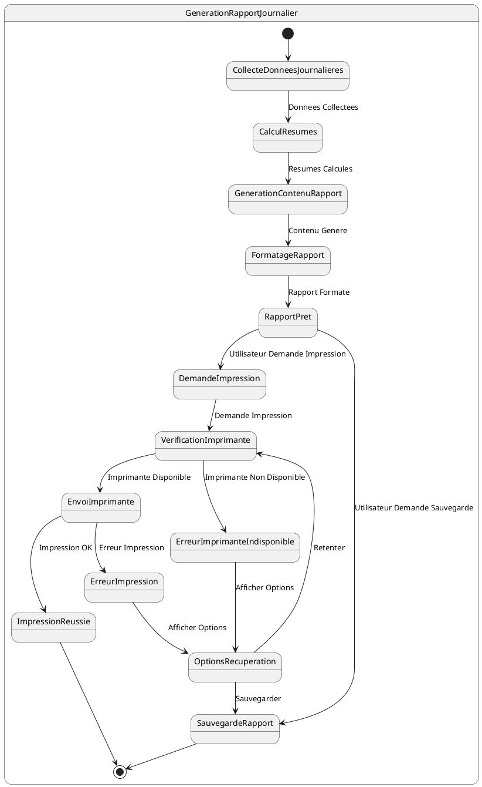

# US012 - Tableau de Bord Commercial

**Contexte :**

En tant que commercial, je souhaite avoir un tableau de bord visuel qui me donne un aperçu rapide de mes performances mensuelles afin de suivre mes progrès et d'identifier les domaines à améliorer.

**Description de la fonctionnalité :**

Cette fonctionnalité fournit un tableau de bord interactif avec des indicateurs clés de performance (KPIs) et des graphiques pour visualiser les activités du commercial sur différentes périodes (jour, semaine, mois). Le tableau de bord est la première page affichée après la connexion.

**Règles Métiers :**

*   **RM-DASH-001 :** Le tableau de bord doit afficher le montant total des ventes à crédit du mois en cours.
*   **RM-DASH-002 :** Le tableau de bord doit afficher le montant total des recouvrements du mois en cours.
*   **RM-DASH-003 :** Le tableau de bord doit afficher le nombre de nouveaux clients enregistrés dans le mois en cours.
*   **RM-DASH-004 :** Le tableau de bord doit inclure un graphique de tendance des ventes à crédit sur les 30 derniers jours.
*   **RM-DASH-005 :** Le tableau de bord doit inclure un graphique de tendance des recouvrements sur les 30 derniers jours.
*   **RM-DASH-006 :** Le tableau de bord doit permettre de filtrer les données par période : jour, semaine, mois.
*   **RM-DASH-007 :** Les données du tableau de bord doivent être agrégées à partir des données locales synchronisées.
*   **RM-DASH-008 :** Le tableau de bord doit être la première page affichée après une connexion réussie.
*   **RM-DASH-009 :** Le tableau de bord doit être visuellement attrayant, facile à lire et à comprendre.

**Tests d'Acceptance :**

*   **TA-DASH-001 :** **Scénario :** Affichage du tableau de bord avec des données.
    *   **Given :** Le commercial a des données d'activités pour le mois en cours.
    *   **When :** Le commercial se connecte à l'application.
    *   **Then :** Le tableau de bord s'affiche avec les KPIs et les graphiques corrects, reflétant les activités du mois.
*   **TA-DASH-002 :** **Scénario :** Affichage du tableau de bord sans données.
    *   **Given :** Le commercial n'a aucune activité enregistrée pour le mois en cours.
    *   **When :** Le commercial se connecte à l'application.
    *   **Then :** Le tableau de bord s'affiche avec des KPIs à zéro et des graphiques vides, indiquant l'absence d'activités.
*   **TA-DASH-003 :** **Scénario :** Filtrage du tableau de bord par période.
    *   **Given :** Le commercial est sur le tableau de bord.
    *   **When :** Le commercial sélectionne un filtre de période (ex: semaine).
    *   **Then :** Les KPIs et les graphiques se mettent à jour pour refléter les données de la période sélectionnée.

**Diagramme d'État (PlantUML) :**

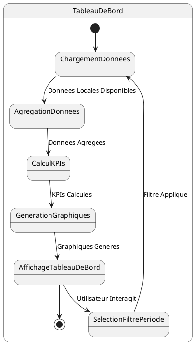


