```markdown
# TS000 - Setup du Projet Ionic Angular

**Contexte :**

En tant que développeur, je souhaite mettre en place l'environnement de développement et la structure de base du projet Ionic Angular afin de pouvoir commencer le développement de l'application mobile commerciale avec une architecture solide et des bonnes pratiques.

**Description de la fonctionnalité :**

Cette Technical Story couvre la mise en place complète de l'environnement de développement, l'initialisation du projet Ionic Angular, la configuration des dépendances, la structure des dossiers, et la mise en place des outils de développement nécessaires pour l'application mobile commerciale.

**Règles Techniques :**

*   **RT-SETUP-001 :** Le projet doit être initialisé avec Ionic CLI version 7.x et Angular version 16.x minimum.
*   **RT-SETUP-002 :** La structure de dossiers doit suivre les conventions Angular et Ionic avec séparation claire des modules, services, pages et composants.
*   **RT-SETUP-003 :** SQLite doit être configuré via Capacitor pour la base de données locale.
*   **RT-SETUP-004 :** NgRx doit être configuré pour la gestion d'état de l'application.
*   **RT-SETUP-005 :** Les plugins Capacitor nécessaires doivent être installés : Camera, Geolocation, Network, Storage.
*   **RT-SETUP-006 :** Un système de configuration d'environnement (dev, staging, prod) doit être mis en place.
*   **RT-SETUP-007 :** ESLint et Prettier doivent être configurés pour maintenir la qualité du code.
*   **RT-SETUP-008 :** Les tests unitaires doivent être configurés avec Jasmine et Karma.

**Tâches Techniques :**

### 1. Installation et Initialisation

```bash
# Installation des outils globaux
npm install -g @ionic/cli @angular/cli

# Création du projet
ionic start commercial-app tabs --type=angular --capacitor

# Navigation vers le projet
cd commercial-app

# Installation des dépendances supplémentaires
npm install @ngrx/store @ngrx/effects @ngrx/store-devtools
npm install @capacitor/sqlite @capacitor/camera @capacitor/geolocation
npm install @capacitor/network @capacitor/storage
npm install @ionic/storage-angular
```

### 2. Structure de Dossiers

```
src/
├── app/
│   ├── core/                    # Services core, guards, interceptors
│   │   ├── services/
│   │   ├── guards/
│   │   └── interceptors/
│   ├── shared/                  # Composants, pipes, directives partagés
│   │   ├── components/
│   │   ├── pipes/
│   │   └── directives/
│   ├── features/                # Modules fonctionnels
│   │   ├── auth/
│   │   ├── dashboard/
│   │   ├── clients/
│   │   ├── distributions/
│   │   ├── recouvrements/
│   │   └── synchronisation/
│   ├── store/                   # NgRx store
│   │   ├── actions/
│   │   ├── reducers/
│   │   ├── effects/
│   │   └── selectors/
│   └── models/                  # Interfaces et modèles
├── assets/
└── environments/
```

### 3. Configuration NgRx

```typescript
// app.module.ts
import { StoreModule } from '@ngrx/store';
import { EffectsModule } from '@ngrx/effects';
import { StoreDevtoolsModule } from '@ngrx/store-devtools';

@NgModule({
  imports: [
    StoreModule.forRoot(reducers),
    EffectsModule.forRoot([]),
    StoreDevtoolsModule.instrument({
      maxAge: 25,
      logOnly: environment.production
    })
  ]
})
export class AppModule { }
```

### 4. Configuration SQLite

```typescript
// core/services/database.service.ts
import { Injectable } from '@angular/core';
import { CapacitorSQLite, SQLiteConnection, SQLiteDBConnection } from '@capacitor-community/sqlite';

@Injectable({
  providedIn: 'root'
})
export class DatabaseService {
  private sqlite: SQLiteConnection = new SQLiteConnection(CapacitorSQLite);
  private db: SQLiteDBConnection | null = null;

  async initializeDatabase(): Promise<void> {
    try {
      this.db = await this.sqlite.createConnection('commercial_app.db', false, 'no-encryption', 1);
      await this.db.open();
      await this.createTables();
    } catch (error) {
      console.error('Database initialization error:', error);
    }
  }

  // core/services/database.service.ts
private async createTables(): Promise<void> {
    const createTables = `
        -- Table des utilisateurs
        CREATE TABLE IF NOT EXISTS users (
            id TEXT PRIMARY KEY,
            username TEXT UNIQUE NOT NULL,
            email TEXT,
            passwordHash TEXT NOT NULL,
            roles TEXT,
            accessToken TEXT,
            refreshToken TEXT,
            lastLogin DATETIME,
            isActive BOOLEAN DEFAULT 1
        );

        -- Table des commerciaux
        CREATE TABLE IF NOT EXISTS commercials (
            id TEXT PRIMARY KEY,
            username TEXT UNIQUE NOT NULL,
            fullName TEXT,
            email TEXT,
            phone TEXT,
            profilePhoto TEXT,
            isSync BOOLEAN DEFAULT 0,
            syncDate DATETIME
        );

        -- Table des articles
        CREATE TABLE IF NOT EXISTS articles (
            id TEXT PRIMARY KEY,
            name TEXT NOT NULL,
            commercialName TEXT,
            marque TEXT,
            model TEXT,
            type TEXT,
            creditSalePrice REAL,
            stockQuantity INTEGER,
            isSync BOOLEAN DEFAULT 0,
            lastUpdate DATETIME
        );

        -- Table des localités
        CREATE TABLE IF NOT EXISTS localities (
            id TEXT PRIMARY KEY,
            name TEXT NOT NULL,
            region TEXT,
            isActive BOOLEAN DEFAULT 1
        );

        -- Table des clients
        CREATE TABLE IF NOT EXISTS clients (
            id TEXT PRIMARY KEY,
            firstName TEXT NOT NULL,
            lastName TEXT NOT NULL,
            fullName TEXT,
            phone TEXT,
            address TEXT,
            birthDate TEXT,
            profession TEXT,
            clientType TEXT,
            idType TEXT,
            idNumber TEXT,
            localityId TEXT,
            latitude REAL,
            longitude REAL,
            mll TEXT,
            profilPhoto TEXT,
            emergencyContactName TEXT,
            emergencyContactPhone TEXT,
            emergencyContactAddress TEXT,
            commercialId TEXT,
            isLocal BOOLEAN DEFAULT 1,
            isSync BOOLEAN DEFAULT 0,
            syncDate DATETIME,
            createdAt DATETIME DEFAULT CURRENT_TIMESTAMP,
            FOREIGN KEY(localityId) REFERENCES localities(id)
        );

        -- Table des comptes clients
        CREATE TABLE IF NOT EXISTS accounts (
            id TEXT PRIMARY KEY,
            accountNumber TEXT UNIQUE NOT NULL,
            accountBalance REAL,
            status TEXT,
            clientId TEXT,
            isSync BOOLEAN DEFAULT 0,
            syncDate DATETIME,
            FOREIGN KEY(clientId) REFERENCES clients(id)
        );

        -- Table des sorties d'articles
        CREATE TABLE IF NOT EXISTS stock_outputs (
            id TEXT PRIMARY KEY,
            reference TEXT,
            status TEXT,
            updatable BOOLEAN DEFAULT 1,
            totalAmount REAL,
            createdAt DATETIME,
            commercialId TEXT,
            isSync BOOLEAN DEFAULT 0,
            syncDate DATETIME
        );

        -- Table des items de sortie
        CREATE TABLE IF NOT EXISTS stock_output_items (
            id TEXT PRIMARY KEY,
            stockOutputId TEXT,
            articleId TEXT,
            quantity INTEGER,
            unitPrice REAL,
            totalPrice REAL,
            FOREIGN KEY(stockOutputId) REFERENCES stock_outputs(id),
            FOREIGN KEY(articleId) REFERENCES articles(id)
        );

        -- Table des distributions
        CREATE TABLE IF NOT EXISTS distributions (
            id TEXT PRIMARY KEY,
            reference TEXT,
            creditId TEXT,
            totalAmount REAL,
            dailyPayment REAL,
            startDate TEXT,
            endDate TEXT,
            status TEXT DEFAULT 'PENDING',
            clientId TEXT,
            commercialId TEXT,
            isLocal BOOLEAN DEFAULT 1,
            isSync BOOLEAN DEFAULT 0,
            syncDate DATETIME,
            createdAt DATETIME DEFAULT CURRENT_TIMESTAMP,
            FOREIGN KEY(creditId) REFERENCES stock_outputs(id),
            FOREIGN KEY(clientId) REFERENCES clients(id)
        );

        -- Table des items de distribution
        CREATE TABLE IF NOT EXISTS distribution_items (
            id TEXT PRIMARY KEY,
            distributionId TEXT,
            articleId TEXT,
            quantity INTEGER,
            unitPrice REAL,
            totalPrice REAL,
            FOREIGN KEY(distributionId) REFERENCES distributions(id),
            FOREIGN KEY(articleId) REFERENCES articles(id)
        );

        -- Table des recouvrements
        CREATE TABLE IF NOT EXISTS recoveries (
            id TEXT PRIMARY KEY,
            amount REAL,
            paymentDate TEXT,
            paymentMethod TEXT,
            notes TEXT,
            distributionId TEXT,
            clientId TEXT,
            commercialId TEXT,
            isLocal BOOLEAN DEFAULT 1,
            isSync BOOLEAN DEFAULT 0,
            syncDate DATETIME,
            createdAt DATETIME DEFAULT CURRENT_TIMESTAMP,
            FOREIGN KEY(distributionId) REFERENCES distributions(id),
            FOREIGN KEY(clientId) REFERENCES clients(id)
        );

        -- Table de suivi de synchronisation
        CREATE TABLE IF NOT EXISTS sync_logs (
            id TEXT PRIMARY KEY,
            entityType TEXT,
            entityId TEXT,
            operation TEXT,
            status TEXT,
            errorMessage TEXT,
            syncDate DATETIME,
            retryCount INTEGER DEFAULT 0
        );

        -- Table des rapports journaliers
        CREATE TABLE IF NOT EXISTS daily_reports (
            id TEXT PRIMARY KEY,
            date TEXT,
            commercialId TEXT,
            totalDistributions INTEGER,
            totalDistributionAmount REAL,
            totalRecoveries INTEGER,
            totalRecoveryAmount REAL,
            newClients INTEGER,
            reportData TEXT,
            isPrinted BOOLEAN DEFAULT 0,
            createdAt DATETIME DEFAULT CURRENT_TIMESTAMP,
            FOREIGN KEY(commercialId) REFERENCES commercials(id)
        );
    `;
    
    await this.db?.execute(createTables);
}
}
```

### 5. Configuration des Environnements

```typescript
// environments/environment.ts
export const environment = {
  production: false,
  apiUrl: 'http://localhost:8081',
  appName: 'Commercial App Dev'
};

// environments/environment.prod.ts
export const environment = {
  production: true,
  apiUrl: 'https://api.commercial-app.com',
  appName: 'Commercial App'
};
```

### 6. Configuration ESLint et Prettier

```json
// .eslintrc.json
{
  "root": true,
  "ignorePatterns": ["projects/**/*"],
  "overrides": [
    {
      "files": ["*.ts"],
      "extends": [
        "eslint:recommended",
        "@typescript-eslint/recommended",
        "@angular-eslint/recommended",
        "@angular-eslint/template/process-inline-templates"
      ],
      "rules": {
        "@angular-eslint/directive-selector": [
          "error",
          {
            "type": "attribute",
            "prefix": "app",
            "style": "camelCase"
          }
        ],
        "@angular-eslint/component-selector": [
          "error",
          {
            "type": "element",
            "prefix": "app",
            "style": "kebab-case"
          }
        ]
      }
    }
  ]
}
```

**Tests d'Acceptance :**

*   **TA-SETUP-001 :** **Scénario :** Projet initialisé avec succès.
    *   **Given :** L'environnement de développement est configuré.
    *   **When :** Le développeur exécute `ionic serve`.
    *   **Then :** L'application se lance sans erreur et affiche la page d'accueil par défaut.

*   **TA-SETUP-002 :** **Scénario :** Base de données locale fonctionnelle.
    *   **Given :** Le projet est configuré avec SQLite.
    *   **When :** L'application est lancée sur un appareil.
    *   **Then :** La base de données est créée et les tables sont initialisées.

*   **TA-SETUP-003 :** **Scénario :** NgRx configuré correctement.
    *   **Given :** NgRx est installé et configuré.
    *   **When :** Le développeur ouvre les DevTools Redux.
    *   **Then :** Le store NgRx est visible et fonctionnel.

**Critères de Définition de Fini (Definition of Done) :**

- [ ] Projet Ionic Angular créé et configuré
- [ ] Structure de dossiers mise en place selon les conventions
- [ ] SQLite configuré et tables créées
- [ ] NgRx installé et configuré
- [ ] Plugins Capacitor installés et configurés
- [ ] Environnements de développement configurés
- [ ] ESLint et Prettier configurés
- [ ] Tests unitaires configurés
- [ ] Documentation technique rédigée
- [ ] Application lance sans erreur en mode développement
- [ ] Build de production fonctionnel

---

# US001 - Connexion Utilisateur

**Contexte :**

En tant que commercial, je souhaite me connecter à l'application mobile afin d'accéder à mes fonctionnalités et données, que je sois en ligne ou hors ligne, pour pouvoir travailler sans interruption.

**Description de la fonctionnalité :**

Cette fonctionnalité permet à l'utilisateur de s'authentifier auprès de l'application mobile. L'écran de connexion doit permettre la saisie d'un nom d'utilisateur et d'un mot de passe. Le processus d'authentification doit gérer les scénarios en ligne (connexion au serveur backend) et hors ligne (authentification locale).

**Règles Métiers :**

*   **RM-AUTH-001 :** L'application doit présenter un écran de connexion au démarrage si l'utilisateur n'est pas déjà authentifié.
*   **RM-AUTH-002 :** Les champs username et password sont obligatoires.
*   **RM-AUTH-003 :** Au clic sur le bouton 'Connecter', l'application tente d'abord une connexion au serveur backend via l'API `POST {{baseUrl}}/api/auth/signin`.
*   **RM-AUTH-004 :** En cas de succès (HTTP 200) de l'authentification backend, les informations suivantes sont stockées localement de manière sécurisée : `username`, `password` (crypté), `email`, `roles`, `refreshToken`, `accessToken`.
*   **RM-AUTH-005 :** Si la connexion au serveur échoue (pas de réseau, erreur 4xx, 5xx), l'application tente une authentification locale en utilisant les identifiants stockés.
*   **RM-AUTH-006 :** Si l'authentification locale échoue car l'utilisateur n'est pas trouvé dans la base de données locale, le message "Utilisateur non configuré pour cet appareil !" est affiché.
*   **RM-AUTH-007 :** Si l'authentification locale échoue en raison d'un mot de passe incorrect, le message "Nom d'utilisateur ou mot de passe incorrect" est affiché.
*   **RM-AUTH-008 :** Après une authentification réussie (locale ou backend), l'utilisateur est redirigé vers le tableau de bord. Un spinner ou une barre de progression avec un fond flou ou un effet de verre doit être affiché pendant le chargement des données initiales.

#### 🔌 Détails Techniques des API

| Étape | API | Méthode | URL | Requête | Succès 200 | Erreurs |
|------|-----|---------|-----|---------|-----------|---------|
| Authentification online | Auth | POST | `{{baseUrl}}/api/auth/signin` | `{ "username": string, "password": string }` | `{ id, username, email, roles[], refreshToken, tokenType, accessToken }` | 400/401/403/500 – `{ status, statusCode, message }` |

**Tests d'Acceptance :**

*   **TA-AUTH-001 :** **Scénario :** Connexion en ligne réussie.
    *   **Given :** L'utilisateur a une connexion internet et saisit des identifiants valides.
    *   **When :** L'utilisateur clique sur 'Connecter'.
    *   **Then :** L'application envoie la requête à l'API, reçoit une réponse 200, stocke les informations localement, et redirige vers le tableau de bord avec un indicateur de chargement.
*   **TA-AUTH-002 :** **Scénario :** Connexion en ligne échouée (identifiants invalides).
    *   **Given :** L'utilisateur a une connexion internet et saisit des identifiants invalides.
    *   **When :** L'utilisateur clique sur 'Connecter'.
    *   **Then :** L'application reçoit une réponse d'erreur (401, 403, 500) du backend et affiche le message d'erreur correspondant.
*   **TA-AUTH-003 :** **Scénario :** Connexion hors ligne réussie (identifiants synchronisés).
    *   **Given :** L'utilisateur n'a pas de connexion internet et a déjà synchronisé ses identifiants lors d'une connexion précédente.
    *   **When :** L'utilisateur saisit ses identifiants et clique sur 'Connecter'.
    *   **Then :** L'application authentifie localement et redirige vers le tableau de bord avec un indicateur de chargement.
*   **TA-AUTH-004 :** **Scénario :** Connexion hors ligne échouée (utilisateur non configuré).
    *   **Given :** L'utilisateur n'a pas de connexion internet et n'a jamais synchronisé ses identifiants sur cet appareil.
    *   **When :** L'utilisateur saisit ses identifiants et clique sur 'Connecter'.
    *   **Then :** L'application affiche le message "Utilisateur non configuré pour cet appareil !"
*   **TA-AUTH-005 :** **Scénario :** Connexion hors ligne échouée (mot de passe incorrect).
    *   **Given :** L'utilisateur n'a pas de connexion internet et a déjà synchronisé ses identifiants, mais saisit un mot de passe incorrect.
    *   **When :** L'utilisateur clique sur 'Connecter'.
    *   **Then :** L'application affiche le message "Nom d'utilisateur ou mot de passe incorrect".

**Diagramme d'État (PlantUML) :**

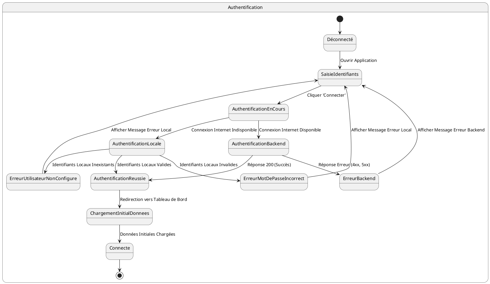
```plantuml
@startuml
state Authentification {
  [*] --> Déconnecté
  Déconnecté --> SaisieIdentifiants : Ouvrir Application
  SaisieIdentifiants --> AuthentificationEnCours : Cliquer 'Connecter'
  AuthentificationEnCours --> AuthentificationBackend : Connexion Internet Disponible
  AuthentificationEnCours --> AuthentificationLocale : Connexion Internet Indisponible

  AuthentificationBackend --> AuthentificationReussie : Réponse 200 (Succès)
  AuthentificationBackend --> ErreurBackend : Réponse Erreur (4xx, 5xx)

  AuthentificationLocale --> AuthentificationReussie : Identifiants Locaux Valides
  AuthentificationLocale --> ErreurUtilisateurNonConfigure : Identifiants Locaux Inexistants
  AuthentificationLocale --> ErreurMotDePasseIncorrect : Identifiants Locaux Invalides

  AuthentificationReussie --> ChargementInitialDonnees : Redirection vers Tableau de Bord
  ChargementInitialDonnees --> Connecte : Données Initiales Chargées

  ErreurBackend --> SaisieIdentifiants : Afficher Message Erreur Backend
  ErreurUtilisateurNonConfigure --> SaisieIdentifiants : Afficher Message Erreur Local
  ErreurMotDePasseIncorrect --> SaisieIdentifiants : Afficher Message Erreur Local

  Connecte --> [*]
}
@enduml
```

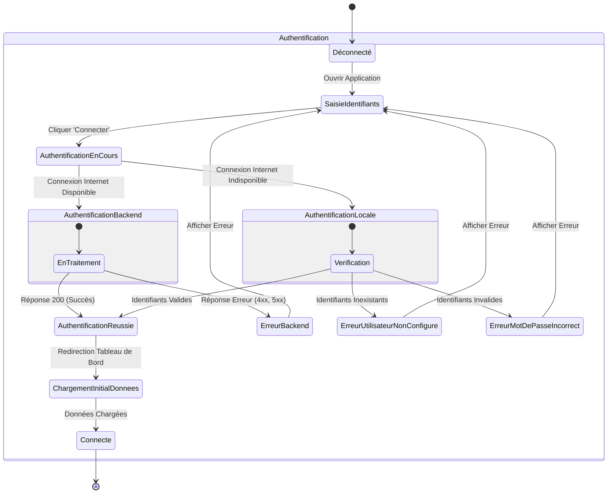
```mermaid
stateDiagram-v2
    [*] --> Déconnecté
    
    state Authentification {
        Déconnecté --> SaisieIdentifiants : Ouvrir Application
        SaisieIdentifiants --> AuthentificationEnCours : Cliquer 'Connecter'
        
        AuthentificationEnCours --> AuthentificationBackend : Connexion Internet Disponible
        AuthentificationEnCours --> AuthentificationLocale : Connexion Internet Indisponible
        
        state AuthentificationBackend {
            [*] --> EnTraitement
            EnTraitement --> AuthentificationReussie : Réponse 200 (Succès)
            EnTraitement --> ErreurBackend : Réponse Erreur (4xx, 5xx)
        }
        
        state AuthentificationLocale {
            [*] --> Verification
            Verification --> AuthentificationReussie : Identifiants Valides
            Verification --> ErreurUtilisateurNonConfigure : Identifiants Inexistants
            Verification --> ErreurMotDePasseIncorrect : Identifiants Invalides
        }
        
        AuthentificationReussie --> ChargementInitialDonnees : Redirection Tableau de Bord
        ChargementInitialDonnees --> Connecte : Données Chargées
        
        ErreurBackend --> SaisieIdentifiants : Afficher Erreur
        ErreurUtilisateurNonConfigure --> SaisieIdentifiants : Afficher Erreur
        ErreurMotDePasseIncorrect --> SaisieIdentifiants : Afficher Erreur
    }
    
    Connecte --> [*]
```

---

# US002 - Initialisation des Articles

**Contexte :**

En tant que commercial, après m'être connecté pour la première fois en ligne, je souhaite que l'application télécharge et stocke localement la liste des articles disponibles afin de pouvoir les consulter et les utiliser même sans connexion internet.

**Description de la fonctionnalité :**

Cette fonctionnalité permet à l'application de récupérer la liste complète des articles depuis le backend et de les enregistrer dans la base de données locale de l'appareil mobile. Ce processus se déclenche automatiquement après une authentification réussie en ligne.

**Règles Métiers :**

*   **RM-INIT-ART-001 :** L'application doit appeler l'API `GET {{baseUrl}}/api/v1/articles/all` après une connexion en ligne réussie.
*   **RM-INIT-ART-002 :** Seuls les champs `id`, `creditSalePrice`, `name`, `marque`, `model`, `type`, `stockQuantity`, et `commercialName` des articles doivent être stockés dans la base de données locale.
*   **RM-INIT-ART-003 :** Les champs `purchasePrice` et `sellingPrice` ne doivent pas être stockés localement car ils ne sont pas pertinents pour les opérations du commercial sur le terrain.
*   **RM-INIT-ART-004 :** En cas d'échec de la récupération des articles (réponse d'erreur de l'API), l'application doit afficher un message d'erreur informatif à l'utilisateur et proposer une option pour retenter l'initialisation ou continuer avec des données limitées.
*   **RM-INIT-ART-005 :** Un indicateur de progression (spinner ou barre de progression) doit être visible pendant le téléchargement des articles.

#### 🔌 Détails Techniques des API

| API | Méthode | URL | Requête | Succès 200 | Champs à stocker localement |
|-----|---------|-----|---------|-----------|-----------------------------|
| Articles | GET | `{{baseUrl}}/api/v1/articles/all` | — | `{ status, statusCode, message, service, data: [ { id, creditSalePrice, name, marque, model, type, stockQuantity, commercialName } ] }` | id, creditSalePrice, name, marque, model, type, stockQuantity, commercialName |

**Tests d'Acceptance :**

*   **TA-INIT-ART-001 :** **Scénario :** Initialisation des articles réussie.
    *   **Given :** L'utilisateur est connecté en ligne et l'initialisation des données est en cours.
    *   **When :** L'application appelle l'API des articles et reçoit une réponse 200 avec des données valides.
    *   **Then :** Les articles sont stockés localement avec les champs spécifiés, et l'indicateur de progression avance.
*   **TA-INIT-ART-002 :** **Scénario :** Initialisation des articles échouée (erreur API).
    *   **Given :** L'utilisateur est connecté en ligne et l'initialisation des données est en cours.
    *   **When :** L'application appelle l'API des articles et reçoit une réponse d'erreur (ex: 500).
    *   **Then :** Un message d'erreur est affiché à l'utilisateur, et l'application propose des options de récupération.

**Diagramme d'État (PlantUML) :**

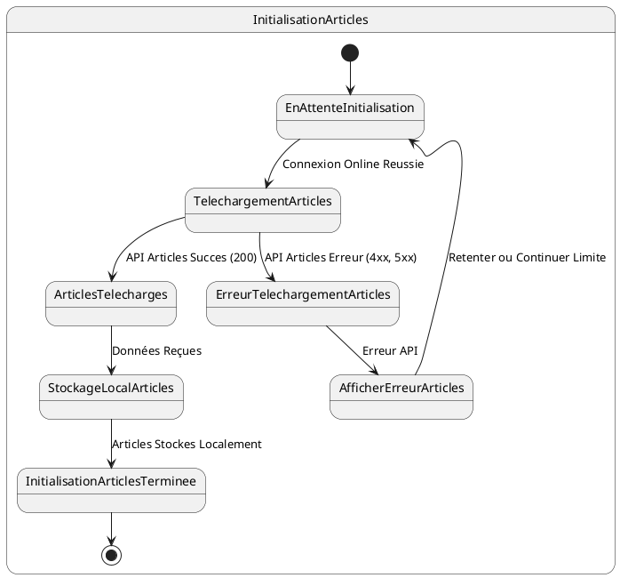
```plantuml
@startuml
state InitialisationArticles {
  [*] --> EnAttenteInitialisation
  EnAttenteInitialisation --> TelechargementArticles : Connexion Online Reussie
  TelechargementArticles --> ArticlesTelecharges : API Articles Succes (200)
  TelechargementArticles --> ErreurTelechargementArticles : API Articles Erreur (4xx, 5xx)

  ArticlesTelecharges --> StockageLocalArticles : Données Reçues
  StockageLocalArticles --> InitialisationArticlesTerminee : Articles Stockes Localement

  ErreurTelechargementArticles --> AfficherErreurArticles : Erreur API
  AfficherErreurArticles --> EnAttenteInitialisation : Retenter ou Continuer Limite

  InitialisationArticlesTerminee --> [*]
}
@enduml
```

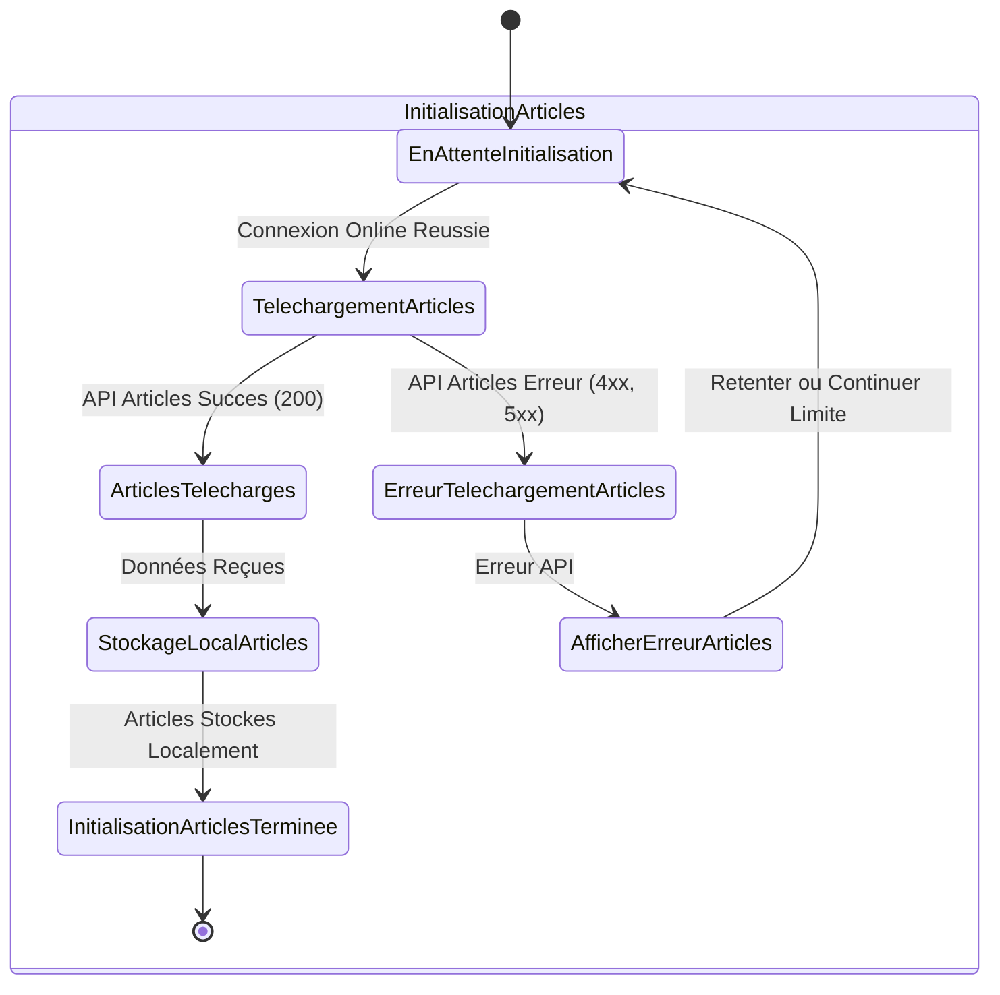
```mermaid
stateDiagram-v2
    [*] --> EnAttenteInitialisation
    
    state InitialisationArticles {
        EnAttenteInitialisation --> TelechargementArticles : Connexion Online Reussie
        
        TelechargementArticles --> ArticlesTelecharges : API Articles Succes (200)
        TelechargementArticles --> ErreurTelechargementArticles : API Articles Erreur (4xx, 5xx)
        
        ArticlesTelecharges --> StockageLocalArticles : Données Reçues
        StockageLocalArticles --> InitialisationArticlesTerminee : Articles Stockes Localement
        
        ErreurTelechargementArticles --> AfficherErreurArticles : Erreur API
        AfficherErreurArticles --> EnAttenteInitialisation : Retenter ou Continuer Limite
        
        InitialisationArticlesTerminee --> [*]
    }
```

---

# US003 - Initialisation des Localités

**Contexte :**

En tant que commercial, après m'être connecté pour la première fois en ligne, je souhaite que l'application télécharge et stocke localement la liste des localités afin de pouvoir les utiliser lors de l'enregistrement de nouveaux clients, même sans connexion internet.

**Description de la fonctionnalité :**

Cette fonctionnalité permet à l'application de récupérer la liste complète des localités depuis le backend et de les enregistrer dans la base de données locale de l'appareil mobile. Ces localités seront utilisées pour associer les clients à des zones géographiques spécifiques.

**Règles Métiers :**

*   **RM-INIT-LOC-001 :** L'application doit appeler l'API `GET {{baseUrl}}/api/v1/localities/all` après une connexion en ligne réussie.
*   **RM-INIT-LOC-002 :** La liste des localités se trouve directement dans le champ `data` de la réponse API.
*   **RM-INIT-LOC-003 :** Toutes les localités retournées par l'API doivent être stockées localement avec leurs champs `id` et `name`.
*   **RM-INIT-LOC-004 :** En cas d'échec de la récupération des localités (réponse d'erreur de l'API), l'application doit afficher un message d'erreur informatif et proposer une option pour retenter l'initialisation.
*   **RM-INIT-LOC-005 :** Un indicateur de progression doit être visible pendant le téléchargement des localités.

#### 🔌 Détails Techniques des API

| API | Méthode | URL | Requête | Succès 200 | Champs à stocker localement |
|-----|---------|-----|---------|-----------|-----------------------------|
| Localités | GET | `{{baseUrl}}/api/v1/localities/all` | — | `{ status, statusCode, message, service, data: [ { id, name } ] }` | id, name |

**Tests d'Acceptance :**

*   **TA-INIT-LOC-001 :** **Scénario :** Initialisation des localités réussie.
    *   **Given :** L'utilisateur est connecté en ligne et l'initialisation des données est en cours.
    *   **When :** L'application appelle l'API des localités et reçoit une réponse 200 avec des données valides.
    *   **Then :** Les localités sont stockées localement avec leurs champs `id` et `name`, et l'indicateur de progression avance.
*   **TA-INIT-LOC-002 :** **Scénario :** Initialisation des localités échouée (erreur API).
    *   **Given :** L'utilisateur est connecté en ligne et l'initialisation des données est en cours.
    *   **When :** L'application appelle l'API des localités et reçoit une réponse d'erreur.
    *   **Then :** Un message d'erreur est affiché à l'utilisateur, et l'application propose des options de récupération.

**Diagramme d'État (PlantUML) :**

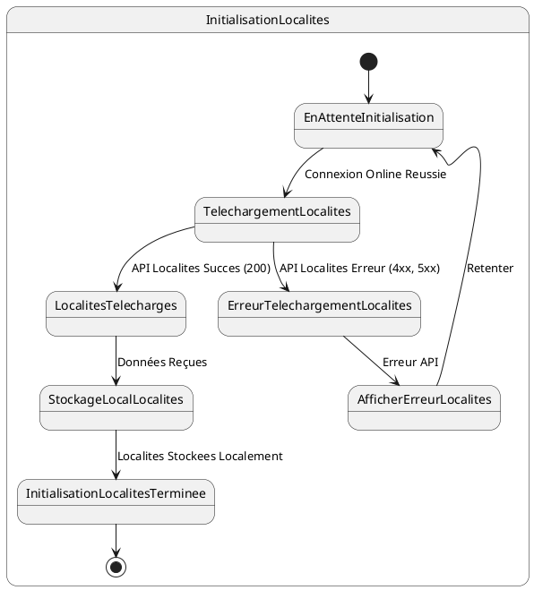
```plantuml
@startuml
state InitialisationLocalites {
  [*] --> EnAttenteInitialisation
  EnAttenteInitialisation --> TelechargementLocalites : Connexion Online Reussie
  TelechargementLocalites --> LocalitesTelecharges : API Localites Succes (200)
  TelechargementLocalites --> ErreurTelechargementLocalites : API Localites Erreur (4xx, 5xx)

  LocalitesTelecharges --> StockageLocalLocalites : Données Reçues
  StockageLocalLocalites --> InitialisationLocalitesTerminee : Localites Stockees Localement

  ErreurTelechargementLocalites --> AfficherErreurLocalites : Erreur API
  AfficherErreurLocalites --> EnAttenteInitialisation : Retenter

  InitialisationLocalitesTerminee --> [*]
}
@enduml
```

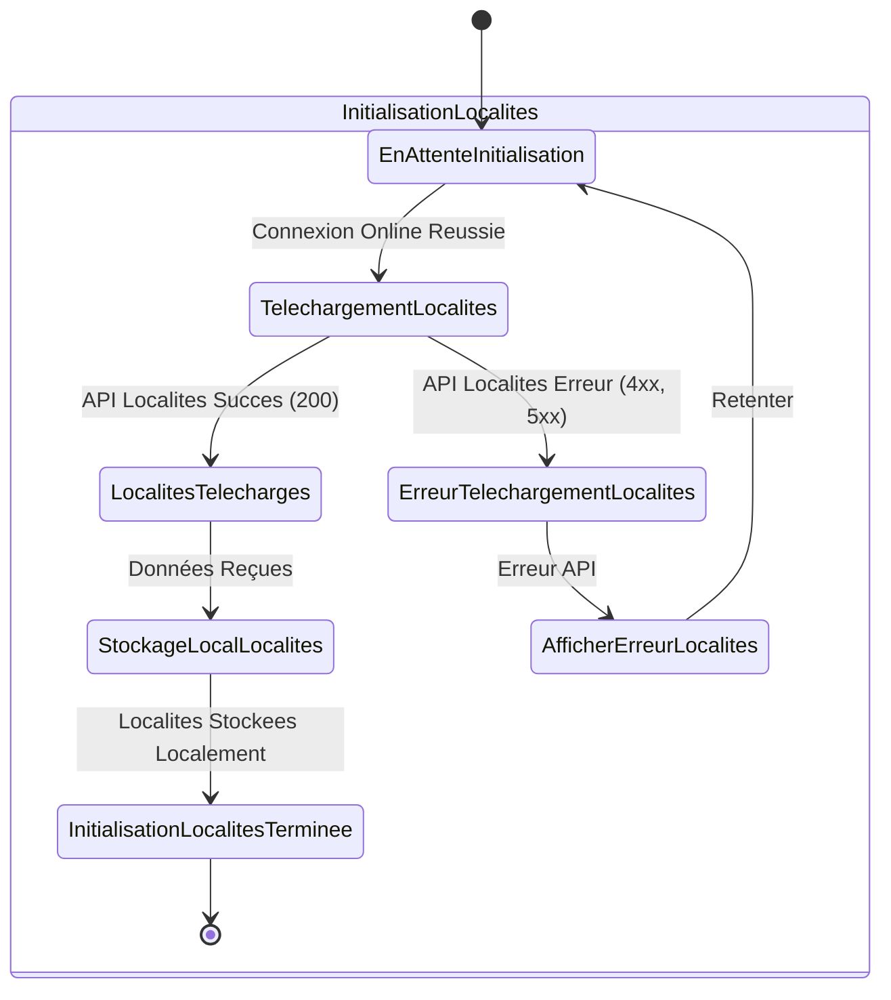
```mermaid
stateDiagram-v2
    [*] --> EnAttenteInitialisation
    
    state InitialisationLocalites {
        EnAttenteInitialisation --> TelechargementLocalites : Connexion Online Reussie
        
        TelechargementLocalites --> LocalitesTelecharges : API Localites Succes (200)
        TelechargementLocalites --> ErreurTelechargementLocalites : API Localites Erreur (4xx, 5xx)
        
        LocalitesTelecharges --> StockageLocalLocalites : Données Reçues
        StockageLocalLocalites --> InitialisationLocalitesTerminee : Localites Stockees Localement
        
        ErreurTelechargementLocalites --> AfficherErreurLocalites : Erreur API
        AfficherErreurLocalites --> EnAttenteInitialisation : Retenter
        
        InitialisationLocalitesTerminee --> [*]
    }
```

---

# US004 - Initialisation des Clients du Commercial

**Contexte :**

En tant que commercial, après m'être connecté pour la première fois en ligne, je souhaite que l'application télécharge et stocke localement la liste de mes clients afin de pouvoir les consulter et effectuer des opérations avec eux même sans connexion internet.

**Description de la fonctionnalité :**

Cette fonctionnalité permet à l'application de récupérer la liste des clients associés au commercial connecté depuis le backend et de les enregistrer dans la base de données locale de l'appareil mobile. Les données des clients incluent leurs informations personnelles et de contact.

**Règles Métiers :**

*   **RM-INIT-CLI-001 :** L'application doit appeler l'API `GET {{baseUrl}}/api/v1/clients/by-commercial/{commercial-username}?page=0&size=2000&sort=id,desc` après une connexion en ligne réussie.
*   **RM-INIT-CLI-002 :** La liste des clients se trouve dans le champ `data.content` de la réponse API.
*   **RM-INIT-CLI-003 :** Tous les champs des clients retournés par l'API doivent être stockés localement.
*   **RM-INIT-CLI-004 :** Pour la base de données locale, les attributs supplémentaires `latitude`, `longitude`, `mll` (map location link) et `profilPhoto` doivent être ajoutés à chaque client. Ces valeurs peuvent être nulles pour les données récupérées du serveur.
*   **RM-INIT-CLI-005 :** Pour les nouveaux clients enregistrés localement, les champs `latitude`, `longitude`, `mll` et `profilPhoto` seront obligatoires.
*   **RM-INIT-CLI-006 :** En cas d'échec de la récupération des clients (réponse d'erreur de l'API), l'application doit afficher un message d'erreur informatif et proposer une option pour retenter l'initialisation.
*   **RM-INIT-CLI-007 :** Un indicateur de progression doit être visible pendant le téléchargement des clients.

#### 🔌 Détails Techniques des API

| API | Méthode | URL | Requête | Succès 200 | Champs à stocker localement |
|-----|---------|-----|---------|-----------|-----------------------------|
| Clients | GET | `{{baseUrl}}/api/v1/clients/by-commercial/{commercial-username}?page=0&size=2000&sort=id,desc` | — | `{ status, statusCode, message, service, data: { content: [ …client… ] } }` | tout le contenu de chaque objet client + latitude, longitude, mll, profilPhoto (nullables) |

**Tests d'Acceptance :**

*   **TA-INIT-CLI-001 :** **Scénario :** Initialisation des clients réussie.
    *   **Given :** L'utilisateur est connecté en ligne et l'initialisation des données est en cours.
    *   **When :** L'application appelle l'API des clients et reçoit une réponse 200 avec des données valides.
    *   **Then :** Les clients sont stockés localement avec tous leurs champs, incluant les champs supplémentaires (latitude, longitude, mll, profilPhoto) initialisés à null, et l'indicateur de progression avance.
*   **TA-INIT-CLI-002 :** **Scénario :** Initialisation des clients échouée (erreur API).
    *   **Given :** L'utilisateur est connecté en ligne et l'initialisation des données est en cours.
    *   **When :** L'application appelle l'API des clients et reçoit une réponse d'erreur.
    *   **Then :** Un message d'erreur est affiché à l'utilisateur, et l'application propose des options de récupération.

**Diagramme d'État (PlantUML) :**

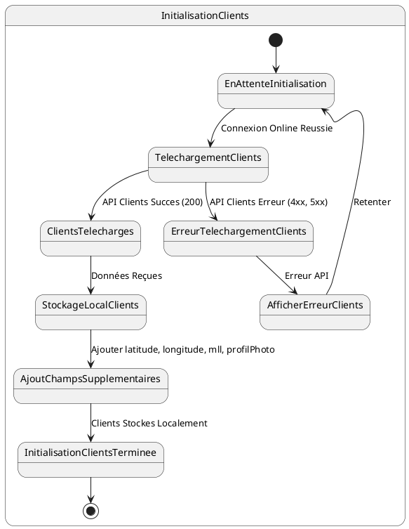
```plantuml
@startuml
state InitialisationClients {
  [*] --> EnAttenteInitialisation
  EnAttenteInitialisation --> TelechargementClients : Connexion Online Reussie
  TelechargementClients --> ClientsTelecharges : API Clients Succes (200)
  TelechargementClients --> ErreurTelechargementClients : API Clients Erreur (4xx, 5xx)

  ClientsTelecharges --> StockageLocalClients : Données Reçues
  StockageLocalClients --> AjoutChampsSupplementaires : Ajouter latitude, longitude, mll, profilPhoto
  AjoutChampsSupplementaires --> InitialisationClientsTerminee : Clients Stockes Localement

  ErreurTelechargementClients --> AfficherErreurClients : Erreur API
  AfficherErreurClients --> EnAttenteInitialisation : Retenter

  InitialisationClientsTerminee --> [*]
}
@enduml
```

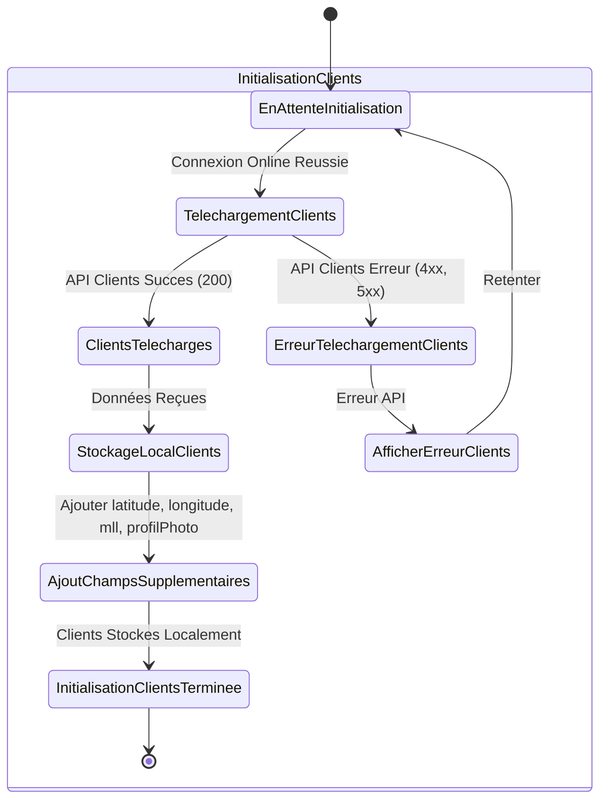
```mermaid
stateDiagram-v2
    [*] --> EnAttenteInitialisation
    
    state InitialisationClients {
        EnAttenteInitialisation --> TelechargementClients : Connexion Online Reussie
        
        TelechargementClients --> ClientsTelecharges : API Clients Succes (200)
        TelechargementClients --> ErreurTelechargementClients : API Clients Erreur (4xx, 5xx)
        
        ClientsTelecharges --> StockageLocalClients : Données Reçues
        StockageLocalClients --> AjoutChampsSupplementaires : Ajouter latitude, longitude, mll, profilPhoto
        AjoutChampsSupplementaires --> InitialisationClientsTerminee : Clients Stockes Localement
        
        ErreurTelechargementClients --> AfficherErreurClients : Erreur API
        AfficherErreurClients --> EnAttenteInitialisation : Retenter
        
        InitialisationClientsTerminee --> [*]
    }
```

---

# US005 - Initialisation des Commerciaux

**Contexte :**

En tant que commercial, après m'être connecté pour la première fois en ligne, je souhaite que l'application télécharge et stocke localement mes propres informations de commercial afin de pouvoir les consulter et les utiliser pour mes rapports et activités.

**Description de la fonctionnalité :**

Cette fonctionnalité permet à l'application de récupérer la liste de tous les commerciaux depuis le backend et de n'enregistrer localement que les informations du commercial actuellement connecté. Cela assure que l'application dispose des détails nécessaires sur l'utilisateur principal.

**Règles Métiers :**

*   **RM-INIT-COM-001 :** L'application doit appeler l'API `GET {{baseUrl}}/api/v1/promoters/all` après une connexion en ligne réussie.
*   **RM-INIT-COM-002 :** La liste des commerciaux se trouve directement dans le champ `data` de la réponse API.
*   **RM-INIT-COM-003 :** Seul l'élément de la liste dont le `username` correspond au `username` de l'utilisateur connecté doit être enregistré localement.
*   **RM-INIT-COM-004 :** Tous les champs de l'objet commercial correspondant doivent être stockés localement.
*   **RM-INIT-COM-005 :** En cas d'échec de la récupération des commerciaux (réponse d'erreur de l'API), l'application doit afficher un message d'erreur informatif et proposer une option pour retenter l'initialisation.
*   **RM-INIT-COM-006 :** Un indicateur de progression doit être visible pendant le téléchargement des commerciaux.

#### 🔌 Détails Techniques des API

| API | Méthode | URL | Requête | Succès 200 | Champs à stocker localement |
|-----|---------|-----|---------|-----------|-----------------------------|
| Commerciaux | GET | `{{baseUrl}}/api/v1/promoters/all` | — | `{ status, statusCode, message, service, data: [ …promoter… ] }` | uniquement l'objet dont username == commercial connecté |

**Tests d'Acceptance :**

*   **TA-INIT-COM-001 :** **Scénario :** Initialisation du commercial connecté réussie.
    *   **Given :** L'utilisateur est connecté en ligne et l'initialisation des données est en cours.
    *   **When :** L'application appelle l'API des commerciaux et reçoit une réponse 200 avec des données valides, incluant le commercial connecté.
    *   **Then :** Les informations du commercial connecté sont stockées localement, et l'indicateur de progression avance.
*   **TA-INIT-COM-002 :** **Scénario :** Initialisation des commerciaux échouée (erreur API).
    *   **Given :** L'utilisateur est connecté en ligne et l'initialisation des données est en cours.
    *   **When :** L'application appelle l'API des commerciaux et reçoit une réponse d'erreur.
    *   **Then :** Un message d'erreur est affiché à l'utilisateur, et l'application propose des options de récupération.

**Diagramme d'État (PlantUML) :**

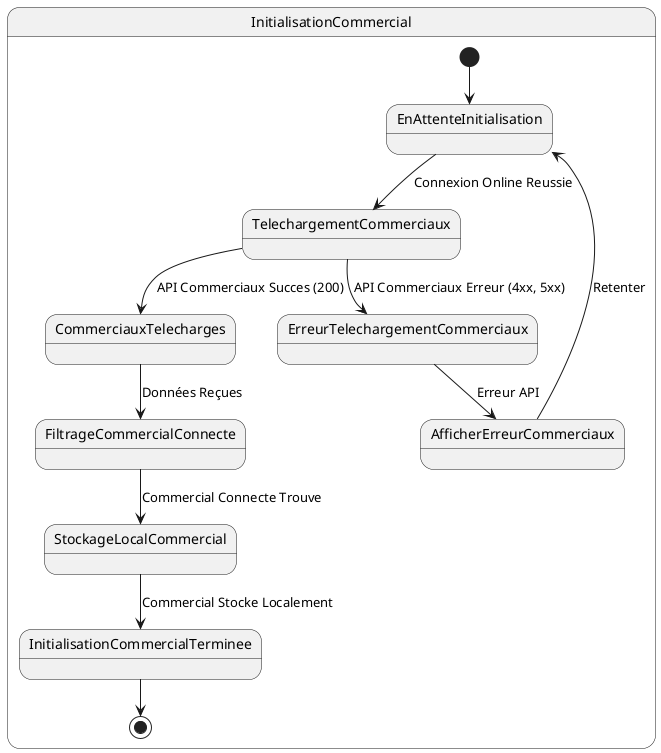
```plantuml
@startuml
state InitialisationCommercial {
  [*] --> EnAttenteInitialisation
  EnAttenteInitialisation --> TelechargementCommerciaux : Connexion Online Reussie
  TelechargementCommerciaux --> CommerciauxTelecharges : API Commerciaux Succes (200)
  TelechargementCommerciaux --> ErreurTelechargementCommerciaux : API Commerciaux Erreur (4xx, 5xx)

  CommerciauxTelecharges --> FiltrageCommercialConnecte : Données Reçues
  FiltrageCommercialConnecte --> StockageLocalCommercial : Commercial Connecte Trouve
  StockageLocalCommercial --> InitialisationCommercialTerminee : Commercial Stocke Localement

  ErreurTelechargementCommerciaux --> AfficherErreurCommerciaux : Erreur API
  AfficherErreurCommerciaux --> EnAttenteInitialisation : Retenter

  InitialisationCommercialTerminee --> [*]
}
@enduml
```

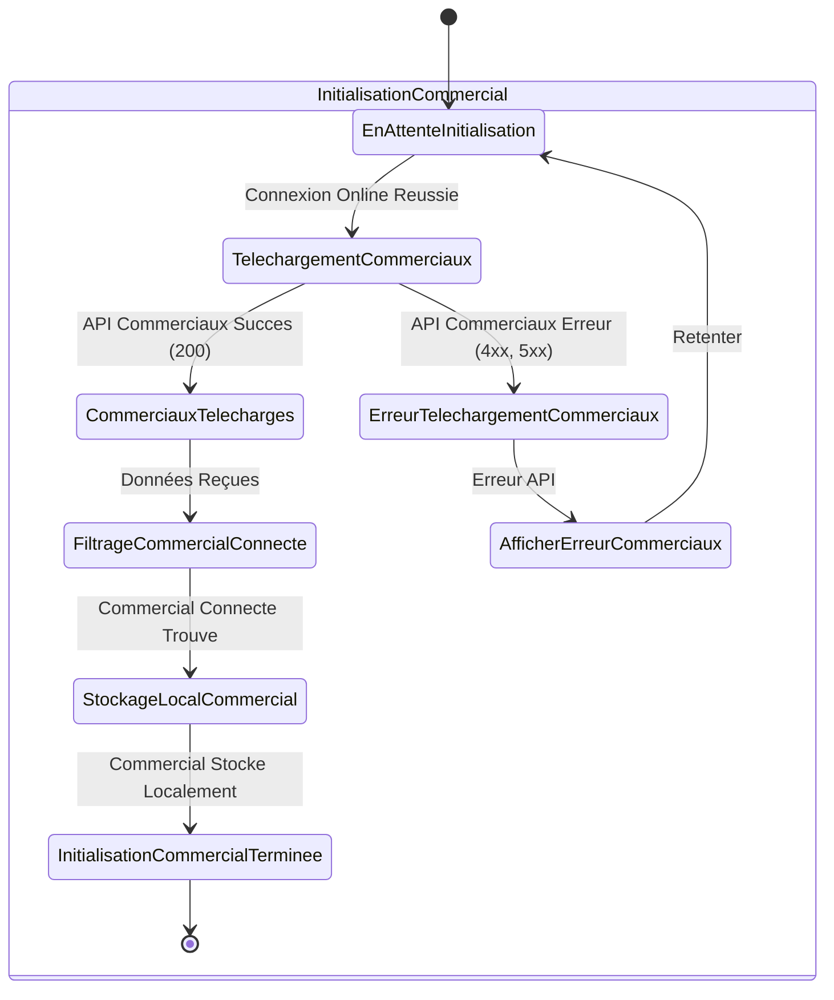
```mermaid
stateDiagram-v2
    [*] --> EnAttenteInitialisation
    
    state InitialisationCommercial {
        EnAttenteInitialisation --> TelechargementCommerciaux : Connexion Online Reussie
        
        TelechargementCommerciaux --> CommerciauxTelecharges : API Commerciaux Succes (200)
        TelechargementCommerciaux --> ErreurTelechargementCommerciaux : API Commerciaux Erreur (4xx, 5xx)
        
        CommerciauxTelecharges --> FiltrageCommercialConnecte : Données Reçues
        FiltrageCommercialConnecte --> StockageLocalCommercial : Commercial Connecte Trouve
        StockageLocalCommercial --> InitialisationCommercialTerminee : Commercial Stocke Localement
        
        ErreurTelechargementCommerciaux --> AfficherErreurCommerciaux : Erreur API
        AfficherErreurCommerciaux --> EnAttenteInitialisation : Retenter
        
        InitialisationCommercialTerminee --> [*]
    }
```

---

# US013 - Initialisation des Sorties d'Articles du Commercial

**Contexte :**

En tant que commercial, après m'être connecté pour la première fois en ligne, je souhaite que l'application télécharge et stocke localement la liste des articles que j'ai sortis du magasin et que je peux distribuer sur le terrain, afin de gérer mon stock mobile même sans connexion internet.

**Description de la fonctionnalité :**

Cette fonctionnalité permet à l'application de récupérer les enregistrements des sorties d'articles du magasin qui sont attribués au commercial connecté. Ces sorties représentent le stock d'articles que le commercial est autorisé à distribuer à crédit. Les données sont stockées localement pour une utilisation hors ligne.

**Règles Métiers :**

*   **RM-INIT-SORTIE-001 :** L'application doit appeler l'API `GET {{baseUrl}}/api/v1/credits/sorties-history/by-commercial/{{commercial-username}}?page=0&size=1000&sort=id,desc` après une connexion en ligne réussie.
*   **RM-INIT-SORTIE-002 :** La liste des sorties d'articles se trouve dans le champ `data.content` de la réponse API.
*   **RM-INIT-SORTIE-003 :** Seuls les éléments de la liste dont le `status` est égal à "INPROGRESS" et `updatable` est à "true" doivent être enregistrés localement.
*   **RM-INIT-SORTIE-004 :** Seules les références des entités liées (`client.id`, `articles.id`) doivent être stockées pour éviter la duplication des données complètes des clients et articles déjà initialisés.
*   **RM-INIT-SORTIE-005 :** En cas d'échec de la récupération des sorties d'articles (réponse d'erreur de l'API), l'application doit afficher un message d'erreur informatif et proposer une option pour retenter l'initialisation.
*   **RM-INIT-SORTIE-006 :** Un indicateur de progression doit être visible pendant le téléchargement des sorties d'articles.

#### 🔌 Détails Techniques des API

| API | Méthode | URL | Requête | Succès 200 | Champs à stocker localement |
|-----|---------|-----|---------|-----------|-----------------------------|
| Sorties d'articles | GET | `{{baseUrl}}/api/v1/credits/sorties-history/by-commercial/{commercial-username}?page=0&size=1000&sort=id,desc` | — | `{ status, statusCode, message, service, data: { content: [ … ] } }` | éléments où status=="INPROGRESS" **et** updatable==true ; stocker uniquement les références client.id et articles[].id |

**Tests d'Acceptance :**

*   **TA-INIT-SORTIE-001 :** **Scénario :** Initialisation des sorties d'articles réussie.
    *   **Given :** L'utilisateur est connecté en ligne et l'initialisation des données est en cours.
    *   **When :** L'application appelle l'API des sorties d'articles et reçoit une réponse 200 avec des données valides.
    *   **Then :** Les sorties d'articles sont stockées localement, filtrées par statut et `updatable`, et l'indicateur de progression avance.
*   **TA-INIT-SORTIE-002 :** **Scénario :** Initialisation des sorties d'articles échouée (erreur API).
    *   **Given :** L'utilisateur est connecté en ligne et l'initialisation des données est en cours.
    *   **When :** L'application appelle l'API des sorties d'articles et reçoit une réponse d'erreur.
    *   **Then :** Un message d'erreur est affiché à l'utilisateur, et l'application propose des options de récupération.

**Diagramme d'État (PlantUML) :**

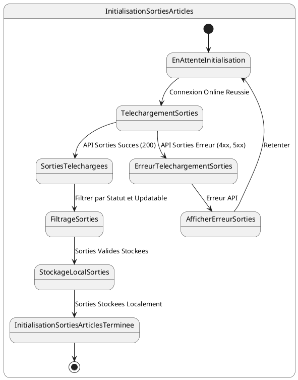
```plantuml
@startuml
state InitialisationSortiesArticles {
  [*] --> EnAttenteInitialisation
  EnAttenteInitialisation --> TelechargementSorties : Connexion Online Reussie
  TelechargementSorties --> SortiesTelechargees : API Sorties Succes (200)
  TelechargementSorties --> ErreurTelechargementSorties : API Sorties Erreur (4xx, 5xx)

  SortiesTelechargees --> FiltrageSorties : Filtrer par Statut et Updatable
  FiltrageSorties --> StockageLocalSorties : Sorties Valides Stockees
  StockageLocalSorties --> InitialisationSortiesArticlesTerminee : Sorties Stockees Localement

  ErreurTelechargementSorties --> AfficherErreurSorties : Erreur API
  AfficherErreurSorties --> EnAttenteInitialisation : Retenter

  InitialisationSortiesArticlesTerminee --> [*]
}
@enduml
```

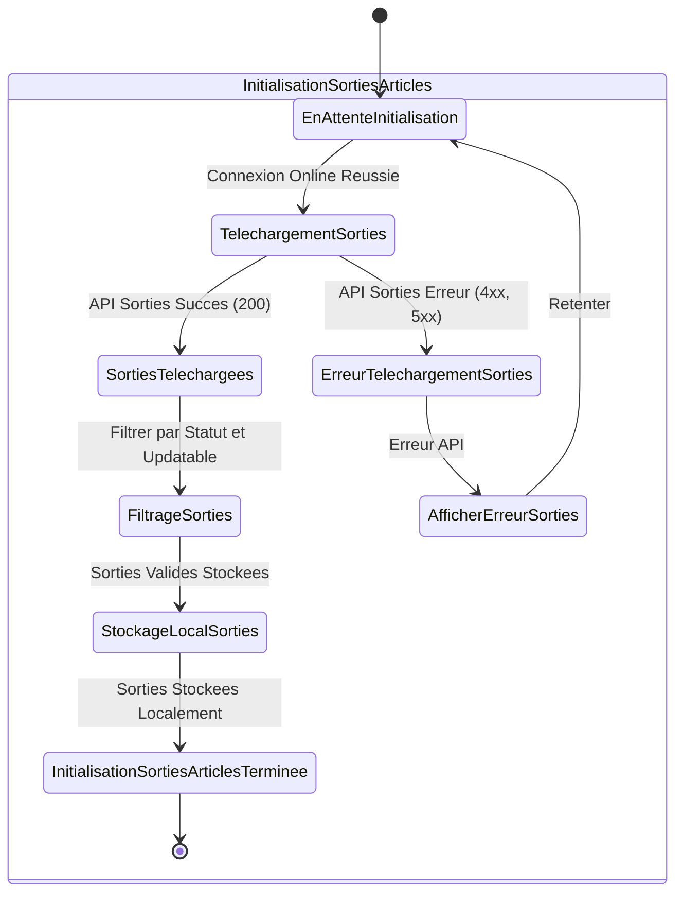
```mermaid
stateDiagram-v2
    [*] --> EnAttenteInitialisation
    
    state InitialisationSortiesArticles {
        EnAttenteInitialisation --> TelechargementSorties : Connexion Online Reussie
        
        TelechargementSorties --> SortiesTelechargees : API Sorties Succes (200)
        TelechargementSorties --> ErreurTelechargementSorties : API Sorties Erreur (4xx, 5xx)
        
        SortiesTelechargees --> FiltrageSorties : Filtrer par Statut et Updatable
        FiltrageSorties --> StockageLocalSorties : Sorties Valides Stockees
        StockageLocalSorties --> InitialisationSortiesArticlesTerminee : Sorties Stockees Localement
        
        ErreurTelechargementSorties --> AfficherErreurSorties : Erreur API
        AfficherErreurSorties --> EnAttenteInitialisation : Retenter
        
        InitialisationSortiesArticlesTerminee --> [*]
    }
```

---

# US014 - Initialisation des Distributions Existantes du Commercial

**Contexte :**

En tant que commercial, après m'être connecté pour la première fois en ligne, je souhaite que l'application télécharge et stocke localement l'historique de mes distributions (ventes à crédit) existantes afin de pouvoir consulter et suivre les crédits en cours, même sans connexion internet.

**Description de la fonctionnalité :**

Cette fonctionnalité permet à l'application de récupérer l'historique complet des distributions (ventes à crédit) effectuées par le commercial connecté. Ces données incluent les crédits en cours et terminés, permettant au commercial de suivre l'état des remboursements et d'effectuer les recouvrements appropriés.

**Règles Métiers :**

*   **RM-INIT-DIST-001 :** L'application doit appeler l'API `GET {{baseUrl}}/api/v1/credits/by-commercial/{{commercial-username}}?page=0&size=10000&sort=id,desc` après une connexion en ligne réussie.
*   **RM-INIT-DIST-002 :** La liste des distributions se trouve dans le champ `data.content` de la réponse API.
*   **RM-INIT-DIST-003 :** Toutes les distributions retournées par l'API doivent être stockées localement, incluant les crédits en cours et terminés.
*   **RM-INIT-DIST-004 :** Les informations pertinentes pour le suivi des crédits et des recouvrements doivent être stockées, notamment :
    - ID de la distribution
    - Référence du crédit
    - Informations du client (ID de référence)
    - Articles distribués (ID de référence)
    - Montants (total, payé, restant)
    - Dates (début, fin prévue, fin effective)
    - Statut du crédit
    - Mise journalière
*   **RM-INIT-DIST-005 :** Seules les références des entités liées (`client.id`, `articles.id`) doivent être stockées pour éviter la duplication des données complètes des clients et articles déjà initialisés.
*   **RM-INIT-DIST-006 :** En cas d'échec de la récupération des distributions (réponse d'erreur de l'API), l'application doit afficher un message d'erreur informatif et proposer une option pour retenter l'initialisation.
*   **RM-INIT-DIST-007 :** Un indicateur de progression doit être visible pendant le téléchargement des distributions.

#### 🔌 Détails Techniques des API

| API | Méthode | URL | Requête | Succès 200 | Champs à stocker localement |
|-----|---------|-----|---------|-----------|-----------------------------|
| Distributions existantes | GET | `{{baseUrl}}/api/v1/credits/by-commercial/{commercial-username}?page=0&size=10000&sort=id,desc` | — | `{ status, statusCode, message, service, data: { content: [ …distribution… ] } }` | toutes les distributions ; stocker uniquement les références client.id et articles[].id |

**Tests d'Acceptance :**

*   **TA-INIT-DIST-001 :** **Scénario :** Initialisation des distributions existantes réussie.
    *   **Given :** L'utilisateur est connecté en ligne et l'initialisation des données est en cours.
    *   **When :** L'application appelle l'API des distributions et reçoit une réponse 200 avec des données valides.
    *   **Then :** Les distributions sont stockées localement avec toutes les informations pertinentes, et l'indicateur de progression avance.
*   **TA-INIT-DIST-002 :** **Scénario :** Initialisation des distributions échouée (erreur API).
    *   **Given :** L'utilisateur est connecté en ligne et l'initialisation des données est en cours.
    *   **When :** L'application appelle l'API des distributions et reçoit une réponse d'erreur.
    *   **Then :** Un message d'erreur est affiché à l'utilisateur, et l'application propose des options de récupération.

**Diagramme d'État (PlantUML) :**

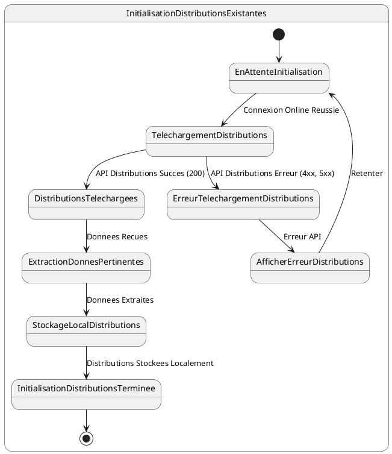
```plantuml
@startuml
state InitialisationDistributionsExistantes {
  [*] --> EnAttenteInitialisation
  EnAttenteInitialisation --> TelechargementDistributions : Connexion Online Reussie
  TelechargementDistributions --> DistributionsTelechargees : API Distributions Succes (200)
  TelechargementDistributions --> ErreurTelechargementDistributions : API Distributions Erreur (4xx, 5xx)

  DistributionsTelechargees --> ExtractionDonnesPertinentes : Donnees Recues
  ExtractionDonnesPertinentes --> StockageLocalDistributions : Donnees Extraites
  StockageLocalDistributions --> InitialisationDistributionsTerminee : Distributions Stockees Localement

  ErreurTelechargementDistributions --> AfficherErreurDistributions : Erreur API
  AfficherErreurDistributions --> EnAttenteInitialisation : Retenter

  InitialisationDistributionsTerminee --> [*]
}
@enduml
```

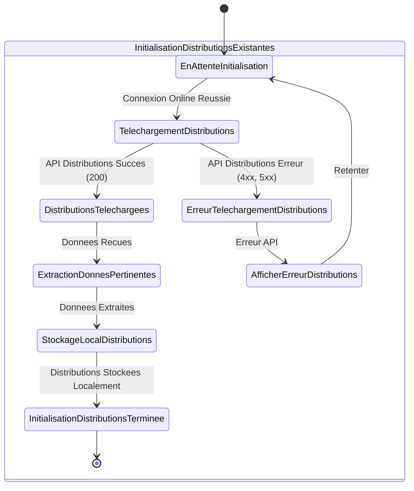
```mermaid
stateDiagram-v2
    [*] --> EnAttenteInitialisation
    
    state InitialisationDistributionsExistantes {
        EnAttenteInitialisation --> TelechargementDistributions : Connexion Online Reussie
        
        TelechargementDistributions --> DistributionsTelechargees : API Distributions Succes (200)
        TelechargementDistributions --> ErreurTelechargementDistributions : API Distributions Erreur (4xx, 5xx)
        
        DistributionsTelechargees --> ExtractionDonnesPertinentes : Donnees Recues
        ExtractionDonnesPertinentes --> StockageLocalDistributions : Donnees Extraites
        StockageLocalDistributions --> InitialisationDistributionsTerminee : Distributions Stockees Localement
        
        ErreurTelechargementDistributions --> AfficherErreurDistributions : Erreur API
        AfficherErreurDistributions --> EnAttenteInitialisation : Retenter
        
        InitialisationDistributionsTerminee --> [*]
    }
```

---

# US015 - Initialisation des Comptes Clients du Commercial

**Contexte :**

En tant que commercial, après m'être connecté pour la première fois en ligne, je souhaite que l'application télécharge et stocke localement les comptes de mes clients afin de pouvoir consulter leurs soldes et gérer les transactions financières, même sans connexion internet.

**Description de la fonctionnalité :**

Cette fonctionnalité permet à l'application de récupérer les informations des comptes clients associés au commercial connecté. Ces comptes contiennent les soldes actuels et les statuts des comptes, essentiels pour la gestion des crédits et des recouvrements.

**Règles Métiers :**

*   **RM-INIT-COMPTE-001 :** L'application doit appeler l'API `GET {{baseUrl}}/api/v1/accounts?page=0&size=2000&sort=id,desc&username=<commercial-username>` après une connexion en ligne réussie.
*   **RM-INIT-COMPTE-002 :** La liste des comptes clients se trouve dans le champ `data.content` de la réponse API.
*   **RM-INIT-COMPTE-003 :** Pour chaque compte, les informations suivantes doivent être stockées localement :
    - ID du compte
    - Numéro de compte
    - Solde du compte (accountBalance)
    - Statut du compte
    - ID du client associé (client.id) pour référence
*   **RM-INIT-COMPTE-004 :** Seul l'ID du client (`client.id`) doit être stocké pour référencer le client déjà enregistré localement, évitant la duplication des informations complètes du client.
*   **RM-INIT-COMPTE-005 :** En cas d'échec de la récupération des comptes (réponse d'erreur de l'API), l'application doit afficher un message d'erreur informatif et proposer une option pour retenter l'initialisation.
*   **RM-INIT-COMPTE-006 :** Un indicateur de progression doit être visible pendant le téléchargement des comptes clients.

#### 🔌 Détails Techniques des API

| API | Méthode | URL | Requête | Succès 200 | Champs à stocker localement |
|-----|---------|-----|---------|-----------|-----------------------------|
| Comptes clients | GET | `{{baseUrl}}/api/v1/accounts?page=0&size=2000&sort=id,desc&username={commercial-username}` | — | `{ status, statusCode, message, service, data: { content: [ { id, accountNumber, accountBalance, status, client: { id } } ] } }` | id, accountNumber, accountBalance, status, client.id |

**Tests d'Acceptance :**

*   **TA-INIT-COMPTE-001 :** **Scénario :** Initialisation des comptes clients réussie.
    *   **Given :** L'utilisateur est connecté en ligne et l'initialisation des données est en cours.
    *   **When :** L'application appelle l'API des comptes et reçoit une réponse 200 avec des données valides.
    *   **Then :** Les comptes clients sont stockés localement avec les informations essentielles et les références aux clients, et l'indicateur de progression avance.
*   **TA-INIT-COMPTE-002 :** **Scénario :** Initialisation des comptes clients échouée (erreur API).
    *   **Given :** L'utilisateur est connecté en ligne et l'initialisation des données est en cours.
    *   **When :** L'application appelle l'API des comptes et reçoit une réponse d'erreur.
    *   **Then :** Un message d'erreur est affiché à l'utilisateur, et l'application propose des options de récupération.

**Diagramme d'État (PlantUML) :**

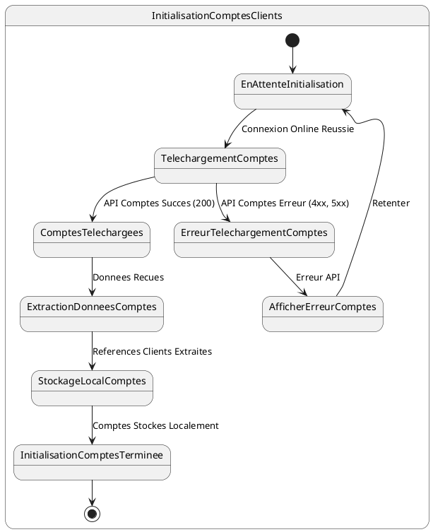
```plantuml
@startuml
state InitialisationComptesClients {
  [*] --> EnAttenteInitialisation
  EnAttenteInitialisation --> TelechargementComptes : Connexion Online Reussie
  TelechargementComptes --> ComptesTelechargees : API Comptes Succes (200)
  TelechargementComptes --> ErreurTelechargementComptes : API Comptes Erreur (4xx, 5xx)

  ComptesTelechargees --> ExtractionDonneesComptes : Donnees Recues
  ExtractionDonneesComptes --> StockageLocalComptes : References Clients Extraites
  StockageLocalComptes --> InitialisationComptesTerminee : Comptes Stockes Localement

  ErreurTelechargementComptes --> AfficherErreurComptes : Erreur API
  AfficherErreurComptes --> EnAttenteInitialisation : Retenter

  InitialisationComptesTerminee --> [*]
}
@enduml
```

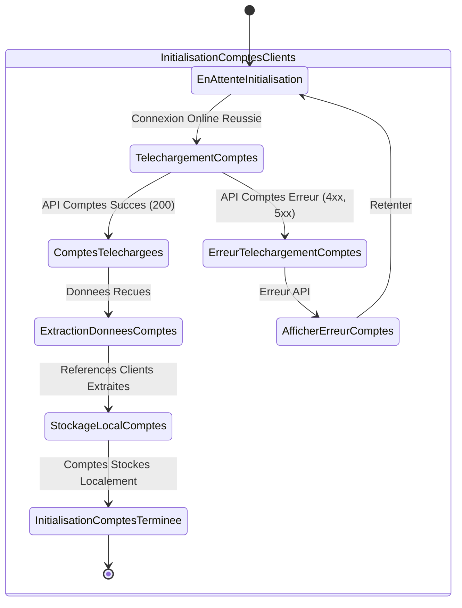
```mermaid
stateDiagram-v2
    [*] --> EnAttenteInitialisation
    
    state InitialisationComptesClients {
        EnAttenteInitialisation --> TelechargementComptes : Connexion Online Reussie
        
        TelechargementComptes --> ComptesTelechargees : API Comptes Succes (200)
        TelechargementComptes --> ErreurTelechargementComptes : API Comptes Erreur (4xx, 5xx)
        
        ComptesTelechargees --> ExtractionDonneesComptes : Donnees Recues
        ExtractionDonneesComptes --> StockageLocalComptes : References Clients Extraites
        StockageLocalComptes --> InitialisationComptesTerminee : Comptes Stockes Localement
        
        ErreurTelechargementComptes --> AfficherErreurComptes : Erreur API
        AfficherErreurComptes --> EnAttenteInitialisation : Retenter
        
        InitialisationComptesTerminee --> [*]
    }
```

---

# US009 - Enregistrement d'un Nouveau Client

**Contexte :**

En tant que commercial sur le terrain, je souhaite enregistrer un nouveau client avec toutes ses informations personnelles, sa géolocalisation et sa photo de profil afin de pouvoir lui proposer des services et effectuer des distributions, même sans connexion internet.

**Description de la fonctionnalité :**

Cette fonctionnalité permet au commercial d'enregistrer un nouveau client directement sur le terrain. Le processus inclut la saisie des informations personnelles, la prise de photo de profil, la géolocalisation automatique ou manuelle, et la génération d'un lien de carte. Le nouveau client est enregistré localement et marqué pour synchronisation avec le serveur.

**Règles Métiers :**

*   **RM-NEWCLI-001 :** L'application doit permettre la saisie des informations obligatoires du client : Prénom, Nom, Adresse, Téléphone, Type de pièce d'identité, Numéro de pièce d'identité, Date de naissance, Profession.
*   **RM-NEWCLI-002 :** L'application doit permettre la saisie des informations optionnelles de la personne à contacter : Nom, Téléphone, Adresse.
*   **RM-NEWCLI-003 :** L'application doit permettre de sélectionner le quartier (localité) du client parmi la liste des localités synchronisées.
*   **RM-NEWCLI-004 :** La prise de photo de profil du client est obligatoire pour les nouveaux clients enregistrés localement.
*   **RM-NEWCLI-005 :** La géolocalisation (latitude, longitude) est obligatoire et peut être obtenue automatiquement via le GPS de l'appareil ou saisie manuellement.
*   **RM-NEWCLI-006 :** L'application doit générer automatiquement un lien Google Maps (mll) basé sur les coordonnées de géolocalisation.
*   **RM-NEWCLI-007 :** Le nouveau client doit être enregistré localement avec un statut "en attente de synchronisation".
*   **RM-NEWCLI-008 :** L'application doit générer un identifiant unique local temporaire pour le nouveau client en attendant la synchronisation avec le serveur.

#### 🔌 Détails Techniques des API (Synchronisation vers serveur)

| API | Méthode | URL | Requête | Succès 201 |
|-----|---------|-----|---------|-----------|
| Création client | POST | `{{baseUrl}}/api/v1/clients` | `{ firstname, lastname, address, phone, cardID, cardType, dateOfBirth, occupation, quarter, collector, clientType, contactPersonName, contactPersonPhone, contactPersonAddress, longitude, latitude, mll, iddoc, profilPhoto, code }` | retourne l'objet complet incluant `data.id` |
| Création compte | POST | `{{baseUrl}}/api/v1/accounts` | `{ accountNumber, clientId, accountBalance }` | retourne l'objet complet incluant `data.id` |

> `code` généré localement : 2 derniers car. du username + (nb clients locaux + 1, sur 3 digits).  
> `accountNumber` généré localement : 0021 + 2 derniers car. username + (nb comptes + 1, sur 4 digits).

**Tests d'Acceptance :**

*   **TA-NEWCLI-001 :** **Scénario :** Enregistrement d'un nouveau client réussi avec géolocalisation automatique.
    *   **Given :** Le commercial saisit toutes les informations obligatoires, prend une photo, et autorise la géolocalisation automatique.
    *   **When :** Le commercial confirme l'enregistrement du nouveau client.
    *   **Then :** Le client est enregistré localement avec toutes les informations, la géolocalisation automatique, et un lien Google Maps généré.
*   **TA-NEWCLI-002 :** **Scénario :** Enregistrement d'un nouveau client avec géolocalisation manuelle.
    *   **Given :** Le commercial saisit toutes les informations obligatoires, prend une photo, et saisit manuellement les coordonnées GPS.
    *   **When :** Le commercial confirme l'enregistrement du nouveau client.
    *   **Then :** Le client est enregistré localement avec les coordonnées manuelles et un lien Google Maps généré.
*   **TA-NEWCLI-003 :** **Scénario :** Tentative d'enregistrement sans photo de profil.
    *   **Given :** Le commercial saisit toutes les informations mais n'a pas pris de photo de profil.
    *   **When :** Le commercial tente de confirmer l'enregistrement.
    *   **Then :** L'application affiche un message d'erreur indiquant que la photo de profil est obligatoire.

**Diagramme d'État (PlantUML) :**

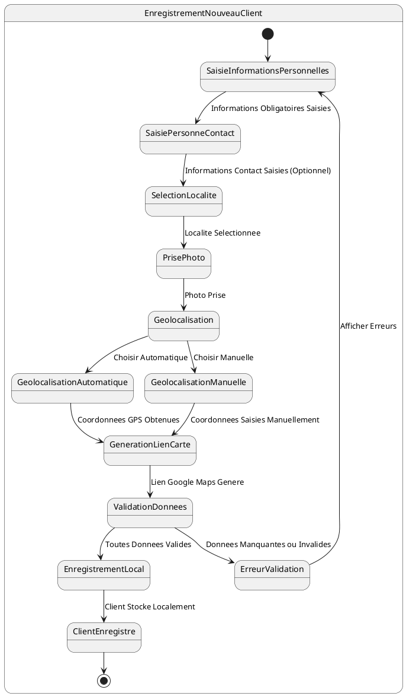
```plantuml
@startuml
state EnregistrementNouveauClient {
  [*] --> SaisieInformationsPersonnelles
  SaisieInformationsPersonnelles --> SaisiePersonneContact : Informations Obligatoires Saisies
  SaisiePersonneContact --> SelectionLocalite : Informations Contact Saisies (Optionnel)
  SelectionLocalite --> PrisePhoto : Localite Selectionnee
  PrisePhoto --> Geolocalisation : Photo Prise
  Geolocalisation --> GeolocalisationAutomatique : Choisir Automatique
  Geolocalisation --> GeolocalisationManuelle : Choisir Manuelle

  GeolocalisationAutomatique --> GenerationLienCarte : Coordonnees GPS Obtenues
  GeolocalisationManuelle --> GenerationLienCarte : Coordonnees Saisies Manuellement

  GenerationLienCarte --> ValidationDonnees : Lien Google Maps Genere
  ValidationDonnees --> EnregistrementLocal : Toutes Donnees Valides
  ValidationDonnees --> ErreurValidation : Donnees Manquantes ou Invalides

  EnregistrementLocal --> ClientEnregistre : Client Stocke Localement

  ErreurValidation --> SaisieInformationsPersonnelles : Afficher Erreurs

  ClientEnregistre --> [*]
}
@enduml
```

---

# US006 - Enregistrement d'une Distribution

**Contexte :**

En tant que commercial sur le terrain, je souhaite enregistrer une distribution d'articles à un client afin de documenter la vente à crédit et de pouvoir imprimer un reçu pour le client, même sans connexion internet.

---

**Description de la fonctionnalité :**

Cette fonctionnalité permet au commercial d’enregistrer une vente à crédit (distribution) d’articles à un client. Le commercial sélectionne le client, les articles et les quantités, et l’application calcule automatiquement le montant total et la mise journalière. La distribution est enregistrée localement et marquée pour synchronisation ultérieure.

---

**Règles Métiers :**

| ID | Règle |
|----|-------|
| RM-DIST-001 | L’application doit permettre de sélectionner un client existant dans la liste des clients synchronisés localement. |
| RM-DIST-002 | L’application doit permettre de sélectionner les articles à distribuer parmi les sorties d’articles disponibles du commercial (stock local). |
| RM-DIST-003 | Pour chaque article sélectionné, le commercial doit pouvoir spécifier la quantité distribuée. |
| RM-DIST-004 | La quantité distribuée ne peut pas dépasser la quantité disponible dans le stock local du commercial. |
| RM-DIST-005 | L’application doit calculer automatiquement le montant total de la distribution en utilisant le `creditSalePrice` de chaque article. |
| RM-DIST-006 | L’application doit calculer automatiquement la mise journalière à collecter (montant total ÷ 30 jours). |
| RM-DIST-007 | La distribution doit être enregistrée localement avec le statut **"en attente de synchronisation"**. |
| RM-DIST-008 | Le stock local du commercial doit être mis à jour après l’enregistrement de la distribution. |
| RM-DIST-009 | L’application doit générer un identifiant unique local pour la distribution en attendant la synchronisation avec le serveur. |
| RM-DIST-010 | Le montant total distribué pour un client ne doit pas dépasser **6 × le solde de son compte**. |
| RM-DIST-011 | Si le solde est insuffisant, une alerte claire doit être affichée. |
| RM-DIST-012 | Lorsque toutes les quantités d’une sortie ont été distribuées, `updatable` doit passer à **false** et la sortie disparaîtra de la liste active. |

---

#### 🔌 Détails Techniques des API (Synchronisation vers serveur)

| API | Méthode | URL | Requête | Succès 200 |
|-----|---------|-----|---------|-----------|
| Distribution | PATCH | `{{baseUrl}}/api/v1/credits/distribute-articles` | `{ clientId, creditId, articles: { articleEntries: [ { articleId, quantity } ] } }` | retourne la distribution complète avec `data.id` |

- `creditId` = id local de la sortie (parent.id)  
- `clientId` = id serveur du client synchronisé

---

**Tests d'Acceptance :**

| ID | Scénario | Given | When | Then |
|----|----------|-------|------|------|
| TA-DIST-001 | Distribution réussie | Client et articles valides sélectionnés | Commercial confirme la distribution | Distribution enregistrée localement, stock mis à jour, mise calculée et impression proposée |
| TA-DIST-002 | Quantité insuffisante | Quantité demandée > quantité disponible | Validation tentée | Message d’erreur bloquant et correction demandée |
| TA-DIST-003 | Solde client insuffisant | Montant > 6 × solde client | Validation tentée | Alerte explicite et blocage jusqu’à correction |
| TA-DIST-004 | Sortie épuisée | Tous les articles d’une sortie distribués | Dernière distribution validée | `updatable = false`, sortie retirée de la liste active, visible en historique |
| TA-DIST-005 | Impression reçu | Distribution validée et imprimante connectée | Bouton « Imprimer » pressé | Reçu généré et imprimé (voir US007) |

---

**Diagramme d'État (PlantUML)**

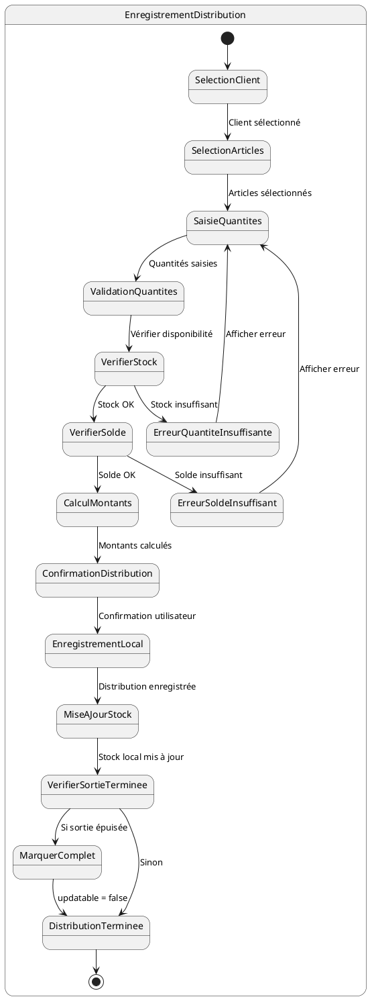
```plantuml
@startuml
state EnregistrementDistribution {
  [*] --> SelectionClient
  SelectionClient --> SelectionArticles : Client sélectionné
  SelectionArticles --> SaisieQuantites : Articles sélectionnés
  SaisieQuantites --> ValidationQuantites : Quantités saisies
  ValidationQuantites --> VerifierStock : Vérifier disponibilité
  VerifierStock --> VerifierSolde : Stock OK
  VerifierStock --> ErreurQuantiteInsuffisante : Stock insuffisant
  VerifierSolde --> CalculMontants : Solde OK
  VerifierSolde --> ErreurSoldeInsuffisant : Solde insuffisant
  CalculMontants --> ConfirmationDistribution : Montants calculés
  ConfirmationDistribution --> EnregistrementLocal : Confirmation utilisateur
  EnregistrementLocal --> MiseAJourStock : Distribution enregistrée
  MiseAJourStock --> VerifierSortieTerminee : Stock local mis à jour
  VerifierSortieTerminee --> MarquerComplet : Si sortie épuisée
  MarquerComplet --> DistributionTerminee : updatable = false
  VerifierSortieTerminee --> DistributionTerminee : Sinon
  ErreurQuantiteInsuffisante --> SaisieQuantites : Afficher erreur
  ErreurSoldeInsuffisant --> SaisieQuantites : Afficher erreur
  DistributionTerminee --> [*]
}
@enduml
```

---

**Suivi Technique**

1. **Stock local :**  
   - Table `distributions` :  
     ```sql
     id_local INTEGER PRIMARY KEY AUTOINCREMENT,
     id_serveur INTEGER,
     client_id INTEGER,
     parent_id INTEGER, -- FK sortie
     total_amount REAL,
     daily_stake REAL,
     status TEXT DEFAULT 'PENDING',
     created_at DATETIME,
     synced BOOLEAN DEFAULT 0
     ```

2. **Mise à jour d’un article dans la sortie :**  
   ```ts
   const distribue = sum(distributions.filter(d => d.parent_id === sortie.id && d.article_id === article.id)
                                  .map(d => d.quantity));
   const restant = sortie.stockQuantity - distribue;
   if (restant <= 0) {
     sortie.updatable = false;
   }
   ```

3. **Calcul automatique :**  
   - `totalAmount = Σ(article.creditSalePrice × quantity)`  
   - `dailyStake = totalAmount / 30`

4. **Vérification solde client :**  
   ```ts
   const totalCreditsEnCours = sum(creditsActifs.filter(c => c.client_id === client.id)
                                               .map(c => c.totalAmountRemaining));
   const plafond = client.accountBalance * 6;
   if (totalCreditsEnCours + nouvelleDistribution.totalAmount > plafond) {
     // Afficher alerte
   }
   ```

---

---

# US007 – Impression de Reçu de Distribution

**Contexte :**  
Après avoir enregistré une distribution, le commercial doit pouvoir imprimer immédiatement un reçu pour le client.

**Règles Métiers :**

| ID | Règle |
|----|-------|
| RM-RECU-001 | Le reçu doit lister chaque article (nom commercial, quantité, prix unitaire). |
| RM-RECU-002 | Le montant total de la distribution doit apparaître. |
| RM-RECU-003 | La mise journalière (total ÷ 30) doit être clairement indiquée. |
| RM-RECU-004 | Informations client : nom complet, adresse, téléphone. |
| RM-RECU-005 | Informations commercial : nom complet. |
| RM-RECU-006 | Date et heure de la transaction. |
| RM-RECU-007 | Numéro unique de référence (référence locale ou serveur). |
| RM-RECU-008 | Impression via imprimante Bluetooth (format thermique 58 mm). |
| RM-RECU-009 | Si aucune imprimante connectée : proposer sauvegarde PDF ou retenter. |

#### 🔌 Détails Techniques d’impression

| Élément | Source |
|---------|--------|
| Texte du reçu | Template HTML/CSS → canvas → image ou direct ESC/POS |
| Bibliothèque | `cordova-plugin-bluetooth-printer` ou `ngx-printer` |
| Nom fichier PDF | `distribution_<ref>_<date>.pdf` (stocké dans `Documents/`) |

---

**Tests d’Acceptance :**

| ID | Scénario | Given | When | Then |
|----|----------|-------|------|------|
| TA-RECU-001 | Impression OK | Distribution validée + imprimante Bluetooth | Tap « Imprimer » | Reçu imprimé |
| TA-RECU-002 | Pas d’imprimante | Distribution validée, Bluetooth OFF | Tap « Imprimer » | Alerte + bouton « Sauvegarder PDF » |
| TA-RECU-003 | Retenter impression | Échec précédent | Tap « Retenter » | Recherche imprimante puis impression |

---

**Diagramme d’État (PlantUML)**

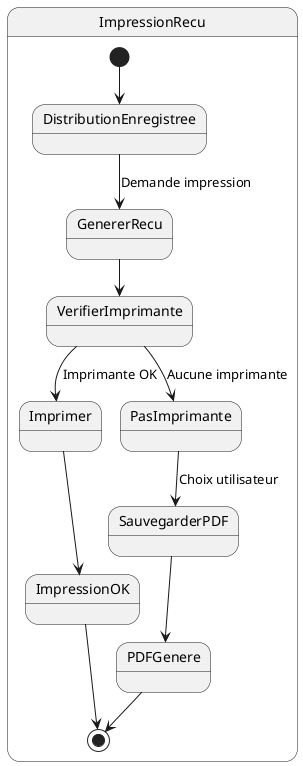
```plantuml
@startuml
state ImpressionRecu {
  [*] --> DistributionEnregistree
  DistributionEnregistree --> GenererRecu : Demande impression
  GenererRecu --> VerifierImprimante
  VerifierImprimante --> Imprimer : Imprimante OK
  VerifierImprimante --> PasImprimante : Aucune imprimante
  PasImprimante --> SauvegarderPDF : Choix utilisateur
  Imprimer --> ImpressionOK
  SauvegarderPDF --> PDFGenere
  ImpressionOK --> [*]
  PDFGenere --> [*]
}
@enduml
```

---

# US008 – Enregistrement d’un Recouvrement Journalier

**Contexte :**  
Chaque jour, le commercial collecte la mise journalière auprès des clients.

**Règles Métiers :**

| ID | Règle |
|----|-------|
| RM-RECOUV-001 | Sélectionner un client dans la liste locale. |
| RM-RECOUV-002 | Afficher les crédits en cours de ce client (montant restant, mise). |
| RM-RECOUV-003 | Saisir le montant collecté (doit être ≤ solde restant). |
| RM-RECOUV-004 | Montant doit être un multiple de la mise journalière (sauf autorisation). |
| RM-RECOUV-005 | Enregistrer localement et flag « PENDING_SYNC ». |
| RM-RECOUV-006 | Mettre à jour les soldes de la distribution (remainingAmount -= mise; paidAmount+=mise) . |
| RM-RECOUV-007 | Générer un identifiant unique local temporaire. |

#### 🔌 Détails Techniques des API (synchronisation)

| Type | Méthode | URL | Corps | Succès 200 |
|------|---------|-----|-------|-----------|
| Mise normale | POST | `{{baseUrl}}/api/v1/credits/default-daily-stake` | `{ collector, clientIds[], creditIds[] }` | `data: [ids]` |
| Mise spéciale | POST | `{{baseUrl}}/api/v1/credits/special-daily-stake` | `{ collector, stakeUnits: [{ creditId, clientId, amount }] }` | `data: [ids]` |

**Tests d’Acceptance :**

| ID | Scénario | Given | When | Then |
|----|----------|-------|------|------|
| TA-RECOUV-001 | Mise normale | Client sélectionné, mise = 500 F | Tap « Mise normale » | Enregistrement 500 F, remainingAmount-500 F, paidAmount+500 F |
| TA-RECOUV-002 | Mise spéciale | Client veut payer 2000 F (mise 500 F) | Sélection « 4× » | Enregistrement 2000 F, remainingAmount-2000 F, paidAmount+2000 F |
| TA-RECOUV-003 | Montant invalide | Saisie 750 F (non multiple) | Validation | Message « montant doit être multiple de 500 F » |
| TA-RECOUV-004 | Solde atteint | Solde restant = 300 F | Saisie 400 F | Message bloquant « solde insuffisant » |

---

**Diagramme d’État (PlantUML)**

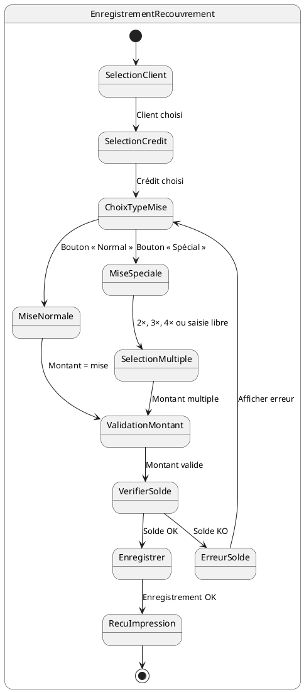
```plantuml
@startuml
state EnregistrementRecouvrement {
  [*] --> SelectionClient
  SelectionClient --> SelectionCredit : Client choisi
  SelectionCredit --> ChoixTypeMise : Crédit choisi
  ChoixTypeMise --> MiseNormale : Bouton « Normal »
  ChoixTypeMise --> MiseSpeciale : Bouton « Spécial »
  MiseSpeciale --> SelectionMultiple : 2×, 3×, 4× ou saisie libre
  MiseNormale --> ValidationMontant : Montant = mise
  SelectionMultiple --> ValidationMontant : Montant multiple
  ValidationMontant --> VerifierSolde : Montant valide
  VerifierSolde --> Enregistrer : Solde OK
  VerifierSolde --> ErreurSolde : Solde KO
  Enregistrer --> RecuImpression : Enregistrement OK
  RecuImpression --> [*]
  ErreurSolde --> ChoixTypeMise : Afficher erreur
}
@enduml
```

---

# US010 – Synchronisation des Données avec le Serveur

**Contexte :**  
De retour à l’agence, le commercial synchronise les données collectées.

**Règles Métiers :**

| ID | Règle |
|----|-------|
| RM-SYNC-001 | Disponible uniquement si connexion stable. |
| RM-SYNC-002 | Vérifier caisse ouverte d’abord (`/cash-desks/is-opened`). |
| RM-SYNC-003 | Si caisse fermée → appel `/cash-desks/open`. |
| RM-SYNC-004 | Ordre de sync : clients → distributions → recouvrements. |
| RM-SYNC-005 | Chaque élément reçoit l’ID serveur et est flagué `SYNCED`. |
| RM-SYNC-006 | Progress-bar globale et message final récapitulatif. |
| RM-SYNC-007 | Gestion d’erreur par élément, possibilité de relancer. |
| RM-SYNC-008 | Token expiré → déconnexion + redirection login. |

#### 🔌 Détails API pré-synchronisation

| API | Méthode | URL | Succès 200 |
|-----|---------|-----|-----------|
| Caisse ouverte ? | GET | `{{baseUrl}}/api/v1/cash-desks/is-opened` | `{ data: boolean }` |
| Ouvrir caisse | GET | `{{baseUrl}}/api/v1/cash-desks/open` | `{ data: { id, systemBalance, realBalance, status, collector, isOpened } }` |

**Écran « Synchronisation »**

- Boutons :
  - « Clients »
  - « Distributions »
  - « Collectes »
  - « Tout synchroniser »
- Case « Tout sélectionner ».
- Spinner « Synchronisation en cours ».
- Modal récapitulatif : nombre de succès / échecs.

---

# US011 – Génération et Impression du Rapport Journalier

**Contexte :**  
À la fin de la journée, le commercial génère et imprime un rapport récapitulatif.

**Règles Métiers :**

| ID | Règle |
|----|-------|
| RM-RAPPORT-001 | Liste des clients créés dans la journée, groupés par localité. |
| RM-RAPPORT-002 | Liste des distributions du jour, groupées par localité. |
| RM-RAPPORT-003 | Liste des recouvrements du jour, groupés par localité. |
| RM-RAPPORT-004 | Montant total des collectes + solde des nouveaux comptes = montant à verser. |
| RM-RAPPORT-005 | Bouton « Imprimer » ou « Sauvegarder PDF » si aucune imprimante. |
| RM-RAPPORT-006 | Nom de fichier PDF : `rapport_<type>_<YYYY-MM-DD>.pdf`. |

**Extrait de structure PDF**

| Type | Colonnes |
|------|----------|
| Clients créés | code, nom, prénom, téléphone, n° compte, solde |
| Distributions | code client, nom client, montant total |
| Collectes | code client, montant collecté, restant |

---

**Tests d’Acceptance :**

| ID | Scénario | Given | When | Then |
|----|----------|-------|------|------|
| TA-RAPPORT-001 | Rapports avec activités | Activités du jour | Tap « Générer » | Rapports affichés et imprimables |
| TA-RAPPORT-002 | Pas d’activité | Aucune donnée | Tap « Générer » | Message « Aucune activité » |
| TA-RAPPORT-003 | Impression échouée | Imprimante déconnectée | Tap « Imprimer » | Alerte + bouton « Sauvegarder PDF » |

---

# US012 – Tableau de Bord Commercial

**Contexte :**  
Page d’accueil après connexion, visuel et synthétique.

**Règles Métiers :**

| ID | Règle |
|----|-------|
| RM-DASH-001 | KPI : ventes crédit du mois (montant). |
| RM-DASH-002 | KPI : recouvrements du mois (montant). |
| RM-DASH-003 | KPI : nouveaux clients du mois (nombre). |
| RM-DASH-004 | Graphique linéaire : ventes / recouvrements 30 derniers jours. |
| RM-DASH-005 | Filtres : jour, semaine, mois, année. |
| RM-DASH-006 | Données issues du local storage. |
| RM-DASH-007 | Indicateur visuel si première initialisation échouée : message + bouton « Réessayer ». |

**Wireframe simplifié**

```
┌─────────────────────────────┐
│  KPI VENTES      KPI RECOUV │
│  1 250 000 F     800 000 F  │
├─────────────────────────────┤
│  Nouveaux clients : 14      │
├─────────────────────────────┤
│  [ Jour | Semaine | Mois ]  │
│  ┌─────────────────────┐    │
│  │      Graphique      │    │
│  └─────────────────────┘    │
└─────────────────────────────┘
```

**Tests d’Acceptance :**

| ID | Scénario | Given | When | Then |
|----|----------|-------|------|------|
| TA-DASH-001 | Données présentes | Activités en local | Connexion | KPI et graphiques affichés |
| TA-DASH-002 | Aucune donnée | Pas d’activité | Connexion | KPI à 0, graphique vide |
| TA-DASH-003 | Filtrer | Dashboard visible | Sélection « Semaine » | Graphique mis à jour |

---
