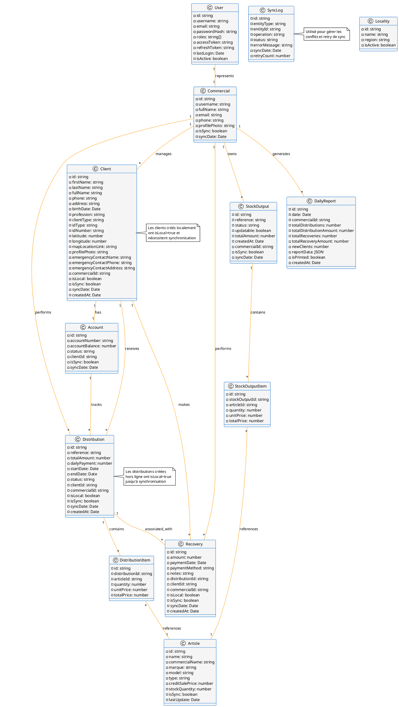

# 📊 Diagramme de Classes - Base de Données Locale Application Mobile Commerciale

## Vue d'ensemble
Ce diagramme représente la structure des entités nécessaires pour stocker les données localement dans l'application mobile, optimisée pour le mode offline et la synchronisation.

## Diagramme PlantUML



## Diagramme Mermaid (Alternative)

```mermaid
classDiagram
    class User {
        +String id
        +String username
        +String email
        +String passwordHash
        +List~String~ roles
        +String accessToken
        +String refreshToken
        +Date lastLogin
        +Boolean isActive
    }

    class Commercial {
        +String id
        +String username
        +String fullName
        +String email
        +String phone
        +String profilePhoto
        +Boolean isSync
        +Date syncDate
    }

    class Article {
        +String id
        +String name
        +String commercialName
        +String marque
        +String model
        +String type
        +Number creditSalePrice
        +Number stockQuantity
        +Boolean isSync
        +Date lastUpdate
    }

    class Locality {
        +String id
        +String name
        +String region
        +Boolean isActive
    }

    class Client {
        +String id
        +String firstName
        +String lastName
        +String fullName
        +String phone
        +String address
        +Date birthDate
        +String profession
        +String clientType
        +String idType
        +String idNumber
        +Number latitude
        +Number longitude
        +String mapLocationLink
        +String profilePhoto
        +String emergencyContactName
        +String emergencyContactPhone
        +String emergencyContactAddress
        +String commercialId
        +Boolean isLocal
        +Boolean isSync
        +Date syncDate
        +Date createdAt
    }

    class Account {
        +String id
        +String accountNumber
        +Number accountBalance
        +String status
        +String clientId
        +Boolean isSync
        +Date syncDate
    }

    class StockOutput {
        +String id
        +String reference
        +String status
        +Boolean updatable
        +Number totalAmount
        +Date createdAt
        +String commercialId
        +Boolean isSync
        +Date syncDate
    }

    class StockOutputItem {
        +String id
        +String stockOutputId
        +String articleId
        +Number quantity
        +Number unitPrice
        +Number totalPrice
    }

    class Distribution {
        +String id
        +String reference
        +Number totalAmount
        +Number dailyPayment
        +Date startDate
        +Date endDate
        +String status
        +String clientId
        +String commercialId
        +Boolean isLocal
        +Boolean isSync
        +Date syncDate
        +Date createdAt
    }

    class DistributionItem {
        +String id
        +String distributionId
        +String articleId
        +Number quantity
        +Number unitPrice
        +Number totalPrice
    }

    class Recovery {
        +String id
        +Number amount
        +Date paymentDate
        +String paymentMethod
        +String notes
        +String distributionId
        +String clientId
        +String commercialId
        +Boolean isLocal
        +Boolean isSync
        +Date syncDate
        +Date createdAt
    }

    class SyncLog {
        +String id
        +String entityType
        +String entityId
        +String operation
        +String status
        +String errorMessage
        +Date syncDate
        +Number retryCount
    }

    class DailyReport {
        +String id
        +Date date
        +String commercialId
        +Number totalDistributions
        +Number totalDistributionAmount
        +Number totalRecoveries
        +Number totalRecoveryAmount
        +Number newClients
        +JSON reportData
        +Boolean isPrinted
        +Date createdAt
    }

    User "1" -- "1" Commercial : represents
    Commercial "1" -- "*" Client : manages
    Commercial "1" -- "*" StockOutput : owns
    Commercial "1" -- "*" Distribution : performs
    Commercial "1" -- "*" Recovery : performs
    Commercial "1" -- "*" DailyReport : generates

    Client "1" -- "1" Account : has
    Client "1" -- "*" Distribution : receives
    Client "1" -- "*" Recovery : makes

    Account "1" -- "*" Distribution : tracks

    StockOutput "1" -- "*" StockOutputItem : contains
    StockOutputItem "*" -- "1" Article : references

    Distribution "1" -- "*" DistributionItem : contains
    Distribution "1" -- "*" Recovery : associated_with
    DistributionItem "*" -- "1" Article : references
```



## 🔑 Points Clés de Conception

### 1. **Système de Synchronisation**
- Chaque entité possède des champs `isLocal`, `isSync`, et `syncDate` pour gérer l'état de synchronisation
- Le `SyncLog` permet de tracer les opérations et gérer les conflits

### 2. **Support Offline**
- Toutes les données sont stockées localement avec SQLite
- Les relations sont maintenues via des IDs de référence
- Les nouvelles entités locales sont marquées avec `isLocal = true`

### 3. **Optimisation des Performances**
- Stockage des références plutôt que des objets complets dans les relations
- Indexation sur les champs de recherche fréquents (clientId, commercialId, etc.)
- Denormalisation stratégique pour les rapports

### 4. **Sécurité**
- Les tokens et mots de passe sont stockés de manière sécurisée
- Les données sensibles sont chiffrées avant stockage

### 5. **Évolutivité**
- Structure modulaire permettant l'ajout de nouvelles entités
- Support des types JSON pour les données extensibles


````mermaid
classDiagram
    %% Configuration du style
    class User {
        -id: string
        -username: string
        -email: string
        -passwordHash: string
        -roles: string[]
        -accessToken: string
        -refreshToken: string
        -lastLogin: Date
        -isActive: boolean
    }

    class Commercial {
        -id: string
        -username: string
        -fullName: string
        -email: string
        -phone: string
        -profilePhoto: string
        -isSync: boolean
        -syncDate: Date
    }

    class Article {
        -id: string
        -name: string
        -commercialName: string
        -marque: string
        -model: string
        -type: string
        -creditSalePrice: number
        -stockQuantity: number
        -isSync: boolean
        -lastUpdate: Date
    }

    class Locality {
        -id: string
        -name: string
        -region: string
        -isActive: boolean
    }

    class Client {
        -id: string
        -firstName: string
        -lastName: string
        -fullName: string
        -phone: string
        -address: string
        -birthDate: Date
        -profession: string
        -clientType: string
        -idType: string
        -idNumber: string
        -latitude: number
        -longitude: number
        -mapLocationLink: string
        -profilePhoto: string
        -emergencyContactName: string
        -emergencyContactPhone: string
        -emergencyContactAddress: string
        -commercialId: string
        -isLocal: boolean
        -isSync: boolean
        -syncDate: Date
        -createdAt: Date
    }

    class Account {
        -id: string
        -accountNumber: string
        -accountBalance: number
        -status: string
        -clientId: string
        -isSync: boolean
        -syncDate: Date
    }

    class StockOutput {
        -id: string
        -reference: string
        -status: string
        -updatable: boolean
        -totalAmount: number
        -createdAt: Date
        -commercialId: string
        -isSync: boolean
        -syncDate: Date
    }

    class StockOutputItem {
        -id: string
        -stockOutputId: string
        -articleId: string
        -quantity: number
        -unitPrice: number
        -totalPrice: number
    }

    class Distribution {
        -id: string
        -reference: string
        -totalAmount: number
        -dailyPayment: number
        -startDate: Date
        -endDate: Date
        -status: string
        -clientId: string
        -commercialId: string
        -isLocal: boolean
        -isSync: boolean
        -syncDate: Date
        -createdAt: Date
    }

    class DistributionItem {
        -id: string
        -distributionId: string
        -articleId: string
        -quantity: number
        -unitPrice: number
        -totalPrice: number
    }

    class Recovery {
        -id: string
        -amount: number
        -paymentDate: Date
        -paymentMethod: string
        -notes: string
        -distributionId: string
        -clientId: string
        -commercialId: string
        -isLocal: boolean
        -isSync: boolean
        -syncDate: Date
        -createdAt: Date
    }

    class SyncLog {
        -id: string
        -entityType: string
        -entityId: string
        -operation: string
        -status: string
        -errorMessage: string
        -syncDate: Date
        -retryCount: number
    }

    class DailyReport {
        -id: string
        -date: Date
        -commercialId: string
        -totalDistributions: number
        -totalDistributionAmount: number
        -totalRecoveries: number
        -totalRecoveryAmount: number
        -newClients: number
        -reportData: JSON
        -isPrinted: boolean
        -createdAt: Date
    }

    %% Relations
    User "1" -- "1" Commercial : represents
    Commercial "1" -- "*" Client : manages
    Commercial "1" -- "*" StockOutput : owns
    Commercial "1" -- "*" Distribution : performs
    Commercial "1" -- "*" Recovery : performs
    Commercial "1" -- "*" DailyReport : generates

    Client "1" -- "1" Account : has
    Client "1" -- "*" Distribution : receives
    Client "1" -- "*" Recovery : makes

    Account "1" -- "*" Distribution : tracks

    StockOutput "1" -- "*" StockOutputItem : contains
    StockOutputItem "*" -- "1" Article : references

    Distribution "1" -- "*" DistributionItem : contains
    Distribution "1" -- "*" Recovery : associated_with
    DistributionItem "*" -- "1" Article : references

    %% Notes
    note for Client "Les clients créés localement\nont isLocal=true et\nnécessitent synchronisation"
    note for Distribution "Les distributions créées\nhors ligne ont isLocal=true\njusqu'à synchronisation"
    note for SyncLog "Utilisé pour gérer les\nconflits et retry de sync"
````
