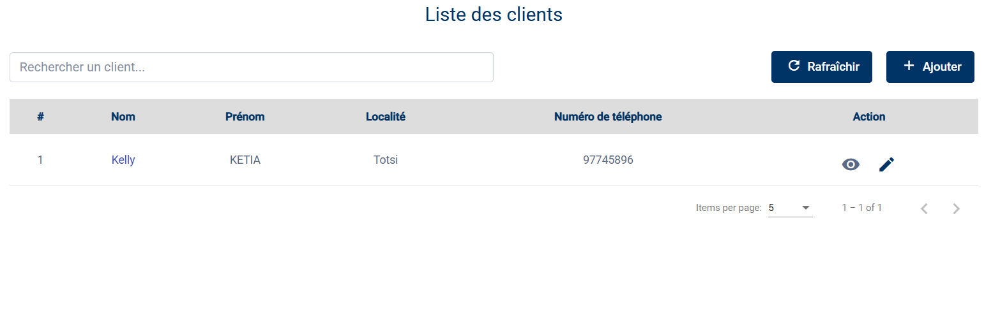
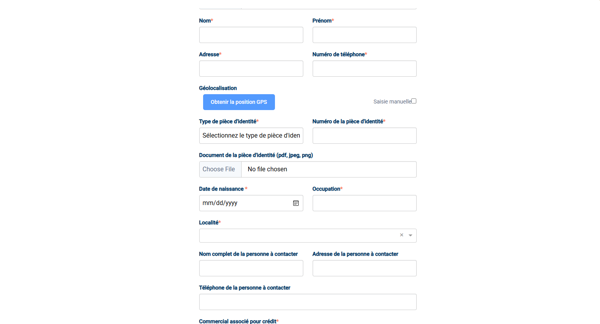

# Gérer vos Clients et leurs Comptes

Le cœur de votre métier, c'est votre relation avec le client. Dans cette section, nous allons voir comment enregistrer proprement un nouveau prospect et comment gérer son compte financier pour qu'il puisse acheter à crédit.

L'accès se fait tout simplement via les menus **Clients** ou **Comptes** dans la barre latérale.

---

## 1. Votre Carnet de Clients

Rendez-vous dans le menu **Clients**. Ici, vous retrouvez la liste complète de toutes les personnes que vous avez enregistrées.

C'est votre base de données personnelle. Vous pouvez y rechercher un client par son nom ou son numéro de téléphone pour vérifier ses informations ou le contacter rapidement.

### Comment enregistrer un nouveau client ?

C'est une étape cruciale. Plus les informations sont précises, plus le recouvrement sera facile plus tard.

1.  Cliquez sur le bouton **+ Nouveau** en haut à droite.
2.  Le formulaire s'ouvre. Prenons le temps de bien le remplir :
    *   **Qui est-ce ?** Commencez par son Nom, Prénom et une photo si possible (c'est toujours plus convivial).
    *   **Où habite-t-il ?** Notez son adresse et son numéro de téléphone.
    *   **Géolocalisation** : C'est très important pour retrouver le client. Si vous êtes sur mobile ou tablette, cliquez simplement sur "Obtenir la position GPS". Sinon, vous pouvez le faire manuellement.
    *   **Papiers d'identité** : Pour sécuriser le crédit, nous avons besoin d'une preuve. Sélectionnez le type de pièce et prenez une photo du document.
    *   **Associations** : C'est ici que vous dites au système "C'est mon client". Sélectionnez-vous dans les champs *Commercial Crédit* et *Commercial Tontine*.
    *   **Le premier versement** : Pour valider l'ouverture du dossier, le client doit verser un solde initial (minimum 500 FCFA).

Une fois que tout est bon, cliquez sur **Enregistrer**. Bravo, votre portefeuille s'agrandit !

Votre client est maintenant bien enregistré. Voyons comment gérer son argent.

---

## 2. La Gestion des Comptes Financiers

Maintenant que le client existe, il lui faut un "compte" pour pouvoir acheter à crédit. C'est un peu comme lui ouvrir un compte en banque chez nous.

Allez dans le menu **Comptes**.

### Comprendre le tableau des comptes

Ici, vous avez une vision financière. Pour chaque client, vous voyez :
*   Son **Numéro de Compte** (unique).
*   Son **Solde** actuel.
*   Son **Statut** : C'est le point le plus important.
    *   Si le statut est **Actif**, tout va bien, vous pouvez lui vendre à crédit.
    *   Si le statut est **Bloqué** (ou désactivé), le système refusera toute nouvelle vente.

### Que pouvez-vous faire ici ?

Au bout de chaque ligne, vous avez des petits boutons d'action :

*   **Besoin de bloquer un mauvais payeur ?** Cliquez sur l'icône "Power" (Activer/Désactiver). Cela gèle son compte instantanément.
*   **Une erreur de saisie ?** Le crayon vous permet de corriger le solde ou le numéro de compte.
*   **Voir l'historique ?** L'icône "Œil" vous permet de voir tous les mouvements sur ce compte.

**Note importante** : Généralement, le compte est créé automatiquement lors de l'inscription du client. Mais si vous avez besoin d'en ajouter un manuellement pour un ancien client, utilisez le bouton **Ajouter** et suivez les instructions.

Vous savez maintenant gérer vos clients de A à Z. Passons à la gestion de votre stock.
