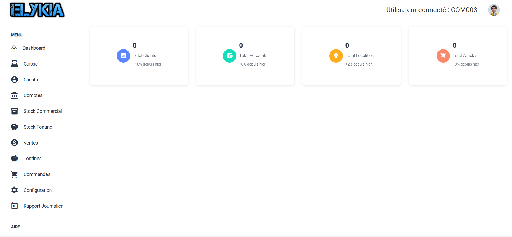

# Bienvenue dans votre Espace Commercial

Bonjour et bienvenue dans votre guide utilisateur.

En tant que commercial chez **AMENOUVEVE-YAVEH**, vous êtes le moteur de l'entreprise. Votre rôle ne se limite pas à vendre ; vous êtes le lien de confiance avec nos clients, vous gérez votre propre stock mobile et vous assurez le suivi des tontines.

Ce guide a été conçu comme une formation continue pour vous aider à maîtriser vos outils quotidiens.

## Votre Tableau de Bord : Le centre de contrôle

Dès que vous vous connectez, vous arrivez sur votre **Tableau de Bord (Dashboard)**. Considérez cet écran comme votre boussole pour la journée. Il a été pensé pour vous donner l'information essentielle en un coup d'œil, sans avoir à fouiller dans les menus.

### Que regardons-nous ici ?

Tout en haut, vous avez vos **Indicateurs Clés**. Ce sont les chiffres qui résument votre activité :
*   La taille de votre portefeuille (**Total Clients**).
*   Le nombre de comptes actifs que vous gérez.
*   Un aperçu rapide de votre stock ou catalogue.

Sur la gauche (ou via le menu), vous trouverez vos outils de travail classés par activité :
1.  **Clients & Comptes** : C'est votre carnet d'adresses et la gestion financière de vos clients.
2.  **Stock** : C'est la gestion de votre "magasin mobile". Vous y verrez ce que vous avez dans votre sac ou votre véhicule.
3.  **Ventes & Commandes** : C'est ici que vous enregistrez vos contrats et vos ventes.
4.  **Tontines** : L'espace dédié à la gestion de l'épargne produit.

Vous avez maintenant une vue d'ensemble de votre cockpit. Passons à la pratique !

## Et pour le terrain ?

Nous savons que l'essentiel de votre travail se passe dehors, souvent sans connexion internet. C'est pourquoi nous avons développé une **Application Mobile** spécifique pour vous.

Si vous cherchez comment utiliser l'application sur votre téléphone (faire une vente, synchroniser, encaisser), je vous invite à consulter directement le [Guide de l'Application Mobile](./mobile.pdf).

Prêt à commencer ? Explorons d'abord comment gérer vos clients.
