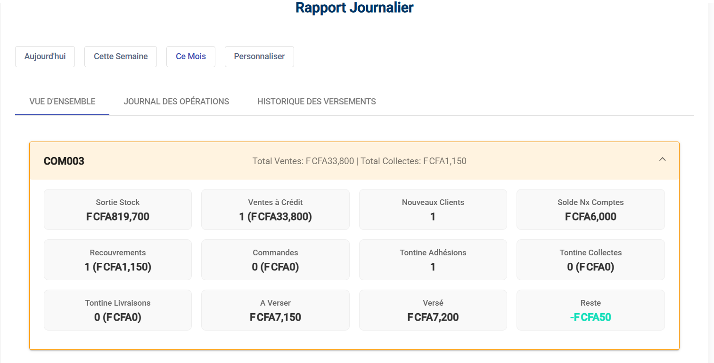

# Rapports & Outils

## 1. Rapport Journalier
Le menu **Rapport Journalier** est votre outil de suivi personnel.

Il vous permet de voir :
*   **Vos Ventes du jour**.
*   **Les encaissements** réalisés.
*   Le point sur votre situation financière vis-à-vis de l'entreprise (Dépôts à effectuer).

## 2. Caisse (Si disponible)
> [!NOTE]
> Ce menu n'est visible que si vous avez les droits "Promoteur" ou Responsable de Caisse.

Il permet d'enregistrer les opérations d'encaissement et de gérer l'ouverture/fermeture de votre caisse personnelle si vous collectez des fonds.

## 3. Configuration
Vous avez un accès limité à la configuration pour consulter :
*   **Localités** : La liste des quartiers/zones définies.
*   **Types de Dépense** : Les catégories autorisées pour vos déclarations de frais.
