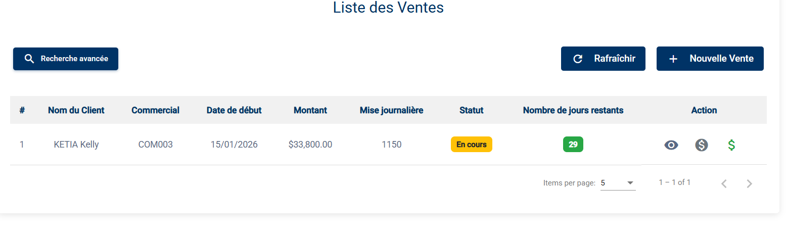
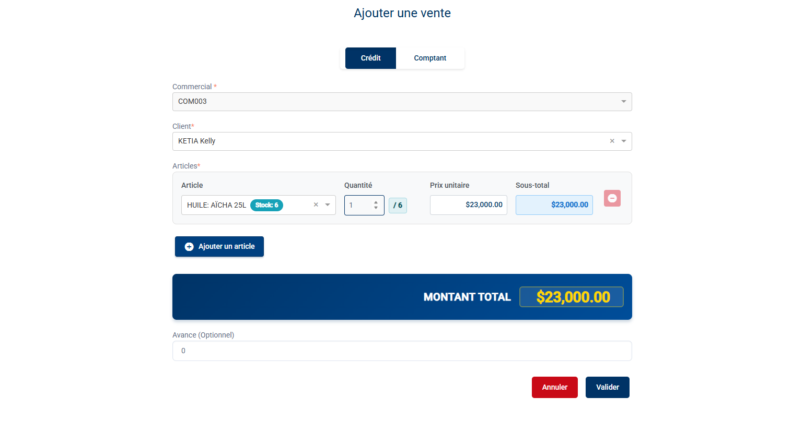
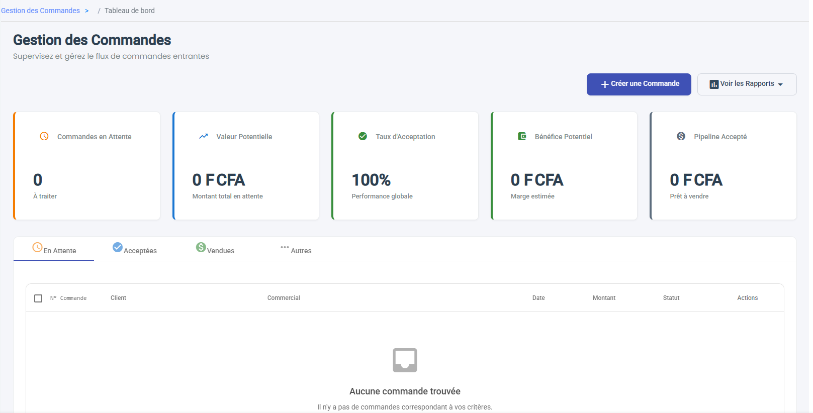

# Ventes & Commandes

Ce module vous permet de réaliser les actes de vente et de passer des commandes pour vos clients.

## 1. Réaliser une Vente (« Ventes »)
Ce menu gère principalement les **Ventes à Crédit** (Contrats).

### a. Liste des Ventes

Vous y retrouvez l'historique de vos contrats :
*   **Référence** du contrat.
*   **Client** bénéficiaire.
*   **Montant Total**.
*   **Reste à Payer**.
*   **Statut** (En cours, Soldé, En retard).

### b. Nouvelle Vente (Contrat)

1.  Cliquez sur **Ajouter**.
2.  **Type de Vente** : Sélectionnez "Crédit" ou "Comptant" (Par défaut Crédit).
3.  **Commercial** : Sélectionnez le commercial responsable (Obligatoire pour une vente à Crédit).
4.  **Client** : Recherchez le client par nom.
5.  **Articles** :
    *   Sélectionnez les produits dans la liste.
    *   Le prix affiché dépend du type de vente (Prix Crédit vs Prix Comptant).
    *   *Note : Le système vérifie que vous avez ces articles dans votre Stock Personnel.*
6.  **Avance** : Saisissez le montant versé immédiatement par le client (Optionnel).
7.  Cliquez sur **Valider**.
    *   Cela génère le contrat et édite l'échéancier de paiement.

## 2. Commandes (« Commandes »)
Utilisez ce menu pour enregistrer une intention d'achat ou une réservation.

### a. Tableau de Bord Commandes

L'interface vous présente :
*   **KPIs** : Indicateurs de performance en haut de page.
*   **Onglets Statuts** : Naviguez entre "En attente", "Validé", "Annulé" pour filtrer vos commandes.
*   **Actions** : Boutonne **+ Créer une Commande** et accès aux rapports.

### b. Créer une Commande

1.  Cliquez sur **Créer une Commande**.
2.  **Client** :
    *   Recherchez votre client par nom ou code.
    *   Si sélectionné, il apparaît sous forme de "puce" (Chip).
3.  **Articles** :
    *   Recherchez un article (Nom/Code).
    *   Saisissez la **Quantité**.
    *   Cliquez sur **Ajouter un article**. Répétez pour chaque produit.
5.  Cliquez sur **Valider**.
    *   Un message de succès **"Commande créée avec succès"** apparaît.
    *   Vous êtes automatiquement redirigé vers la liste des commandes où votre nouvelle commande s'affiche avec le statut *Créé*.

### c. Traitement (Transformer en Vente)
Une fois la commande créée, vous pouvez la visualiser en détail.
1.  Cliquez sur une commande pour voir les **Détails** (Infos, Articles, Historique).
2.  **Transformer en Vente** :
    *   Utilisez le menu d'actions pour convertir la commande en contrat de vente effectif.
    *   Un message de confirmation vous avertira que cette action est définitive et génère un crédit.
