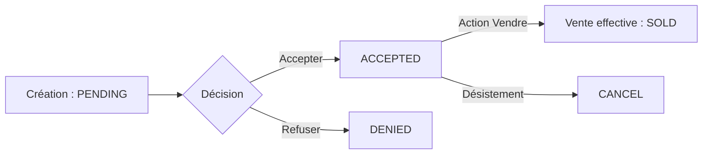

# Ventes, crédits, recouvrements et commandes

Le module **Ventes** (`ROLE_CONSULT_CREDIT`) et le module **Commandes** (`ROLE_CONSULT_ORDER`) constituent le cœur commercial et transactionnel de la plateforme ELYKIA. Ils permettent de piloter tout le cycle de vie des ventes à crédit et au comptant, d'organiser les encaissements quotidiens, de gérer les retards et les échéances, d'auditer les passations de portefeuille entre commerciaux, d'injecter des ventes de rattrapage et de convertir des réservations en ventes effectives.

---

## 1. Vue d'ensemble de la navigation commerciale

Le menu latéral gauche donne accès aux sous-modules suivants selon les permissions du compte utilisateur :

| Menu / Sous-menu | Route Frontend | Permission requise | Description opérationnelle |
|---|---|---|---|
| **Ventes > Liste** | `/credit/list` | `ROLE_CONSULT_CREDIT` | Tableau de bord principal des ventes, recherche avancée, actions sur cycle de vie, fusion et réassignation en lot. |
| **Ventes > Retards** | `/credit/late` | `ROLE_CONSULT_CREDIT` | Suivi des crédits accusant un retard (délai dépassé ou échéance), clôtures d'urgence et contrôles terrain. |
| **Ventes > Échéances** | `/credit/echeance` | `ROLE_CONSULT_CREDIT` | Calendrier des échéances de paiement attendues aujourd'hui, cette semaine ou sur date ciblée. |
| **Ventes > Recouvrements** | `/credit/recouvrements` | `ROLE_CONSULT_CREDIT` | Journal chronologique de toutes les mises encaissées avec droit d'annulation contrôlé. |
| **Ventes > Transfert Ventes** | `/credit/transferts-commerciaux` | `ROLE_KPI_FINANCIER_TRANSFERT_VENTE` | Audit et statistiques des transferts de dossiers de crédit entre commerciaux sortants et entrants. |
| **Ventes > Rattrapages** | `/stock/credit/rattrapage` | `ROLE_RATTRAPAGE` | Régularisation de ventes passées adossées à des stocks mensuels résiduels sans déduction du stock central physique actuel. |
| **Ventes > Articles** | `/credit/articles-vendus` | `ROLE_CONSULT_CREDIT` | Analyse consolidée des quantités et montants vendus par article et par commercial sur une période. |
| **Commandes** | `/orders` | `ROLE_CONSULT_ORDER` | Gestion du pipeline des commandes clients (réservations) depuis l'enregistrement jusqu'à la conversion en vente. |

---

## 2. Liste des ventes et cycle de vie (`/credit/list`)

L'écran `/credit/list` centralise l'ensemble des ventes de l'agence.

### Bandeau des KPIs Financiers Vente (`ROLE_KPI_FINANCIER_VENTE`)
En haut de la page, un bandeau financier dynamique consolide les chiffres clés sur la période active :
- **Total Ventes** : Nombre d'opérations de vente enregistrées.
- **Montant Total** : Valeur faciale totale des contrats de vente (FCFA).
- **Montant Encaissé** : Cumul des acomptes initiaux et des mises journalières perçues.
- **Solde Restant** : Montant global restant à recouvrer.
- **Taux de Recouvrement** : Pourcentage financier recouvré (`Encaissé / Montant Total`).

> [!NOTE]
> L'affichage du bandeau KPI requiert la permission `ROLE_KPI_FINANCIER_VENTE`. Si l'utilisateur ne dispose pas de ce droit, la liste des crédits s'affiche directement sans le bandeau récapitulatif.

### Filtres temporels rapides et recherche avancée
1. **Sélecteur de période prédéfinie** :
   - `Aujourd'hui` : Ventes créées le jour même.
   - `Cette semaine` : Ventes du lundi au dimanche en cours.
   - `Ce mois` : Ventes depuis le 1er jour du mois courant.
   - `Personnalisée` : Définition d'un intervalle de dates (`Date début` $\rightarrow$ `Date fin`).
2. **Recherche rapide** : Champ de saisie instantanée pour filtrer par référence contrat ou nom de client.
3. **Recherche avancée multi-critères** :
   - Mot-clé général (nom client, référence de rattrapage ou contrat).
   - Type de client (`Individuel`, `Entreprise`, etc.).
   - Type de vente (`Crédit` ou `Comptant`).
   - Statut du crédit (`CREATED`, `VALIDATED`, `INPROGRESS`, `SETTLED`).
   - Commercial assigné (filtrage sur un agent spécifique).

### Indicateurs de criticité d'échéance (Badges colorés)
Chaque ligne de vente affiche un badge visuel sur les jours restants avant l'échéance contractuelle :
- 🟢 **Vert** (`days-success`) : Plus de 5 jours restants avant la date limite.
- 🟡 **Orange** (`days-warning`) : Moins de 5 jours restants (alerte échéance imminente).
- 🔴 **Rouge** (`days-danger`) : 0 jour restant ou date de fin contractuelle dépassée.

### Tableau des statuts et transitions du cycle de vente
Une vente évolue selon un cycle strict d'autorisations et d'actions physiques :

| Statut | Signification métier | Actions disponibles dans l'interface | Rôle / Permission |
|---|---|---|---|
| `CREATED` | Vente nouvellement saisie en attente d'approbation. La marchandise n'est pas encore sortie du stock. | - **Valider** : Approuve le contrat et le plan de paiement. - **Modifier** (`/credit/add/:id`) : Corrige les articles, acomptes ou client. - **Supprimer** : Annule et supprime la saisie erronée. | Responsable d'agence / Gestionnaire |
| `VALIDATED` | Vente approuvée administrativement. Prête pour la livraison physique au client. | - **Démarrer** : Confirme la remise physique des articles au client et effectue la sortie effective du stock commercial. - **Détails** (`/credit/details/:id`). | Magasinier / Promoteur habilité |
| `INPROGRESS` | Marchandise livrée, crédit actif. Le contrat est en cours de remboursement. | - **Encaisser** : Ouvre la boîte de dialogue de saisie d'une mise journalière avec affichage automatique du reliquat disponible. - **Modifier la mise** (`/credit/change-daily-stake/:id`) : Ajuste l'échéancier. - **Détails** : Consultation 360°. | Commercial, Chef de recouvrement, Caissier |
| `SETTLED` | Crédit entièrement soldé. Le solde restant dû est égal à zéro. | - **Consulter les détails** : Historique complet, date de clôture effective, archivage. Les crédits soldés ne sont plus modifiables ni réassignables. | Tout utilisateur autorisé |

### Actions groupées : Réaffectation commerciale et Fusion de crédits
- **Réaffectation commerciale en lot** (`ROLE_ASSIGN_CLIENT_COLLECTOR`) :
  1. Cochez les cases des crédits en cours à transférer (les crédits `SETTLED` sont automatiquement exclus de la sélection).
  2. Cliquez sur **Changer le commercial**.
  3. Dans la boîte de dialogue, sélectionnez le nouveau commercial parmi les agents actifs.
  4. Le système vérifie que le commercial choisi est distinct du commercial actuel et met à jour l'affectation de tous les dossiers sélectionnés en une seule transaction.
- **Fusion de crédits** :
  1. Cliquez sur le bouton **Fusionner**.
  2. Sélectionnez le commercial concerné.
  3. Choisissez entre **2 et 10 crédits en cours** appartenant à ce commercial pour un même client.
  4. Cliquez sur **Confirmer la fusion**.
  5. Le système consolide les soldes restants et les articles en un seul contrat avec une nouvelle référence générée, puis clôture les anciens dossiers.

---

## 3. Formulaire de création d'une vente (`/credit/add`)

L'enregistrement d'une nouvelle vente se fait via la route `/credit/add` (ou `/credit/add/:id` pour la modification d'un dossier en statut `CREATED`).

<!-- CAPTURE À INSÉRER : Formulaire de création de vente avec sélecteur Crédit / Comptant, sélection du commercial, client et panier d'articles. -->

### Choix du type de vente : Crédit vs Comptant

| Caractéristique | Vente à Crédit (`CREDIT`) | Vente au Comptant (`CASH`) |
|---|---|---|
| **Commercial responsable** | **Obligatoire**. Si l'utilisateur connecté est un Promoteur, le champ est automatiquement pré-rempli avec son compte et verrouillé. | Non requis (désactivé). La vente est directe en boutique. |
| **Sélection du Client** | Filtrée automatiquement sur le portefeuille rattaché au commercial sélectionné. | Recherche universelle parmi tous les clients actifs de l'agence. |
| **Catalogue Articles & Stock** | Déduit du **Stock Commercial** de l'agent (`CommercialStockService`). Seuls les articles actuellement en possession du commercial sont sélectionnables avec leur stock restant. | Chargement à la demande (lazy-loading) sur l'ensemble des articles du magasin général. |
| **Tarification appliquée** | Prix de vente crédit (`creditSalePrice`). | Prix de vente comptant (`sellingPrice`). |
| **Échéancier & Avance** | Saisie d'une avance optionnelle, calcul du solde restant et de la mise journalière, définition de la date de début et calcul automatique de la date de fin prévue. | Paiement intégral immédiat. Aucun suivi de mise journalière. |
| **Finalité du Crédit** | Sélecteur **Personnel** ou **Professionnel** si le client bénéficie du badge `businessCreditAuthorized` et que le feature flag `DualCreditAuthorization` est actif. | Sans objet. |

### Reçu de vente thermique et impression immédiate
Si l'option de configuration `PrintReceiptAfterSale` est active :
1. Dès validation du formulaire, une boîte de dialogue s'ouvre avec l'aperçu du ticket de caisse thermique (format 80 mm).
2. Le ticket récapitule :
   - L'en-tête ELYKIA (contact, agence, date et heure).
   - La référence unique de la transaction.
   - Les coordonnées du client (nom, code, téléphone, adresse).
   - Le nom du commercial.
   - Le détail des articles (quantités, prix unitaires, sous-totaux).
   - Le montant total, l'acompte versé, le reste à payer et la mise journalière convenue.
3. Le bouton **Imprimer** déclenche l'impression vers l'imprimante thermique de caisse ou génère le reçu papier client.

---

## 4. Fiche 360° Détail du Crédit (`/credit/details/:id`)

La vue détaillée d'un crédit regroupe toutes les informations contractuelles, logistiques, financières et de contrôle sur un écran unique :

### 1. Barre de progression visuelle du remboursement
- Jauge d'avancement exprimée en pourcentage (`Montant Payé / Montant Total`).
- Rappel du montant déjà payé par rapport au montant total du contrat.
- Décompte du montant restant dû et du nombre de jours contractuels restants.
- Rappel de la date de début et de la date de fin prévue (ou date de clôture effective si soldé).

### 2. Cartes KPIs financières
- **Montant Total** : Valeur globale du crédit (FCFA).
- **Déjà Payé** : Cumul des règlements enregistrés, avec mention explicite de l'acompte initial.
- **Restant Dû** : Solde net restant à recouvrer.
- **Mise Journalière** : Montant quotidien exigé selon le contrat.

### 3. Bloc Client & Reliquat
- Identité complète du client (Nom, Prénom, CNI, Téléphone, Adresse).
- Lien hypertexte cliquable menant directement à sa fiche 360° (`/client/details/:id`).
- **Affichage du Reliquat** : Le solde reliquat du client est mis en évidence (affiché en vert vif et gras s'il est supérieur à 0 FCFA), permettant de savoir immédiatement si le client dispose d'un avoir mobilisable.

### 4. Bloc Agent Collecteur & Historique des transferts
- Identité du commercial actuellement en charge du contrat.
- Bouton **Modifier** (`ROLE_ASSIGN_CREDIT_COLLECTOR`) : Permet de réassigner ce crédit spécifique à un autre agent avec journalisation.
- **Lien vers le stock mensuel source** : Bouton cliquable menant vers `/stock/my-stock?collector=...&year=...&month=...&openSales=1` pour identifier le lot mensuel exact duquel les articles distribués proviennent.
- **Timeline de l'historique des transferts** : Historique chronologique de chaque passation indiquant la date, l'ancien commercial, le repreneur, et le solde restant au moment du transfert.

### 5. Consentement numérique et Contrôle terrain
- **Bloc Consentement** : Affiche le Code de Consentement Opération, le Code de Synchronisation et le Montant Confirmé par le client lors des opérations mobiles.
- **Bloc Contrôle Terrain** :
  - Montant total payé enregistré dans le système ELYKIA.
  - Montant total constaté sur le **carnet physique du client**.
  - Écart calculé (`Système - Carnet`).
  - Statut : 🟢 **Conforme** (écart = 0) ou 🔴 **Disparité** (écart $\ne$ 0).
  - Date de vérification, nom du contrôleur et observations saisies.

### 6. Articles et Détail logistique
Tableau complet listant pour chaque article : nom commercial, catégorie/type, quantité livrée, prix unitaire appliqué, et sous-total de la ligne.

### 7. Suivi du recouvrement et compteurs de retard
Un bandeau dynamique évalue la situation de paiement du client à l'instant T :
- **Bandeau de statut** :
  - 🟢 *À jour — aucun retard* (0 jour de retard).
  - 🟡 *Léger retard de paiement* (1 à 5 jours de retard).
  - 🔴 *Retard significatif* (> 5 jours de retard).
- **Les 4 compteurs clés** :
  1. *Jours écoulés* : Nombre de jours passés depuis la date de début (plafonné à la durée totale).
  2. *Jours payés* : Ratio `Total Montant Payé / Mise Journalière`.
  3. *Jours de retard* : Formule `Jours Écoulés - Jours Payés` (minimum 0).
  4. *Jours restants* : Jours restants avant l'échéance finale.

### 8. Historique chronologique des recouvrements & Droit d'annulation
Chaque encaissement apparaît dans une timeline détaillée :
- Date et heure précise du versement, référence de quittance, agent collecteur.
- Badge indicateur : **Mise normale** (montant égal à la mise journalière) ou **Mise spéciale** (montant supérieur ou partiel).
- Cumul payé et reste à payer actualisé après l'opération.
- **Annulation de recouvrement** (`ROLE_CANCEL_RECOVERY` ou `ROLE_ADMIN`) :
  - Un bouton **Annuler** permet d'annuler un encaissement erroné.
  - Une boîte de confirmation rappelle la référence du reçu et prévient que les montants du crédit ainsi que le Rapport Journalier de caisse seront immédiatement recalculés pour préserver l'intégrité comptable.

### 9. Historique des changements de mise journalière
Timeline chronologique enregistrant chaque modification de mise : ancienne mise $\rightarrow$ nouvelle mise, solde restant à ce moment-là, auteur de la modification et date.

---

## 5. Gestion des retards de paiement (`/credit/late`)

L'écran `/credit/late` est l'outil quotidien du Chef de recouvrement et du Gestionnaire pour traiter les impayés.

### KPIs Retards (`ROLE_KPI_FINANCIER_RETARD`)
- **Total Retards** : Nombre total de dossiers en retard.
- **Total Délai Dépassé** : Crédits dont la date d'échéance finale est dépassée.
- **Total Échéances du Jour** : Crédits dont l'échéance arrive à terme aujourd'hui.
- **Montant Restant Retards** : Somme des soldes restant dus sur les dossiers en retard.
- **Montant Restant Délais** : Somme des soldes sur les contrats dont le délai contractuel est expiré.

### Filtres et fonctionnalités opérationnelles
- **Filtres** : Par commercial, par mois, par localité géographique et par type (`Tous`, `Délai dépassé`, `Échéance`).
- **Clôture exceptionnelle** : Boîte de dialogue permettant de clôturer un ou plusieurs crédits compromis (avec sélection du motif administratif ou financier).
- **Contrôle terrain direct** : Saisie rapide du montant relevé sur le carnet client directement depuis la liste des retards.
- **Export PDF** : Génération d'une fiche de tournée pour le recouvrement terrain avec les adresses, téléphones et montants dus.

---

## 6. Calendrier des échéances (`/credit/echeance`)

L'écran `/credit/echeance` permet d'anticiper les encaissements à venir :
- **KPIs Échéances** (`ROLE_KPI_FINANCIER_ECHEANCE`) : Total aujourd'hui, total de la semaine, total non soldé, montant global restant dû.
- **Filtres de période** :
  - `Aujourd'hui` : Échéances du jour.
  - `Cette semaine` : Vue hebdomadaire.
  - `Date personnalisée` : Sélection d'un jour précis sur calendrier.
- **Filtre commercial** : Permet d'isoler la charge de recouvrement d'un commercial donné.

---

## 7. Journal des recouvrements (`/credit/recouvrements`)

L'écran `/credit/recouvrements` fournit la traçabilité intégrale des flux d'encaissement :
- **Bandeau KPIs** : Nombre total de mises encaissées et volume financier total collecté sur la période sélectionnée.
- **Filtres** : Intervalle de dates (`Du` ... `Au` ...) et filtre commercial (pour un Promoteur connecté, ce filtre est automatiquement verrouillé sur son propre compte).
- **Tableau des encaissements** : Affiche la date/heure, la référence de reçu, le client, le commercial encaisseur, le montant versé et les détails d'imputation.
- **Action Annuler** : Réservée aux profils dotés de `ROLE_CANCEL_RECOVERY` ou `ROLE_ADMIN`. L'annulation recalcule instantanément le solde du crédit et le journal de caisse.

---

## 8. Rapport de transfert des ventes (`/credit/transferts-commerciaux`)

Le rapport de passation (`ROLE_KPI_FINANCIER_TRANSFERT_VENTE`) permet d'auditer les mouvements de dossiers entre commerciaux sortants et entrants.

### Critères et matrice de passation
- **Filtres** : Commercial cédant (`oldCollector`), Commercial repreneur (`newCollector`), Date début, Date fin.
- **Cartes KPIs globales** :
  - *Nombre de crédits transférés*.
  - *Montant total des ventes concernées*.
  - *Cumul déjà payé au moment du transfert*.
  - *Solde total restant transféré*.
- **Sélecteur de paires d'agents** : Liste interactive de toutes les paires actives (ex. `agent_A → agent_B`). Un clic sur une paire filtre instantanément le tableau détaillé des dossiers concernés.

> [!IMPORTANT]
> **Règle d'unicité et de déduplication** : Si un même dossier de crédit a fait l'objet de plusieurs transferts successifs au cours de la même période d'analyse, il n'est comptabilisé **qu'une seule fois**, sur sa passation la plus récente, garantissant ainsi l'exactitude des totaux financiers.

---

## 9. Rattrapage de ventes antérieures (`/stock/credit/rattrapage`)

Le sous-module de rattrapage (`ROLE_RATTRAPAGE`) est une procédure exceptionnelle destinée à régulariser des ventes historiques :
1. **Contexte métier** : Permet de saisir une vente effectuée dans le passé sans impacter négativement les stocks physiques actuels du magasin central.
2. **Fonctionnement en 3 étapes** :
   - *Étape 1* : Sélection du commercial et choix d'un **stock mensuel résiduel archivé** (`residualStocks`).
   - *Étape 2* : Choix des articles vendus parmi ceux présents dans ce stock résiduel, avec quantité et prix.
   - *Étape 3* : Sélection du client, enregistrement de l'avance, calcul de la mise journalière et validation du contrat.
3. Les ventes de rattrapage portent une référence spécifique permettant de les identifier dans les recherches et les états comptables.

---

## 10. Rapport des articles vendus (`/credit/articles-vendus`)

L'écran `/credit/articles-vendus` offre une vision agrégée des sorties commerciales :
- Regroupement des ventes par **Article** et par **Commercial**.
- Affichage des quantités totales vendues, des prix unitaires moyens et du chiffre d'affaires généré par article.
- Filtres par période prédéfinie (`Aujourd'hui`, `Cette semaine`, `Ce mois`, `Personnalisée`) et par commercial.
- Export des données vers Excel / PDF pour les revues commerciales de fin de mois.

---

## 11. Gestion des commandes clients (`/orders`)

Le module Commandes (`ROLE_CONSULT_ORDER`, `ROLE_EDIT_ORDER`) permet de gérer les précommandes et réservations clients avant leur contractualisation définitive.

<!-- CAPTURE À INSÉRER : Tableau de bord des commandes avec onglets de statuts PENDING, ACCEPTED, DENIED, CANCEL, SOLD et bouton Créer une commande. -->

### Onglets de navigation par statut
Le tableau de bord `/orders` organise le flux des commandes par statut :
- **En attente** (`PENDING`) : Nouvelles commandes saisies en attente d'approbation commerciale.
- **Acceptée** (`ACCEPTED`) : Commandes validées dont le stock et les conditions de paiement sont confirmés.
- **Refusée** (`DENIED`) : Commandes rejetées (client insolvable, rupture d'approvisionnement).
- **Annulée** (`CANCEL`) : Commandes annulées par le client ou le commercial.
- **Vendue** (`SOLD`) : Commandes converties avec succès en vente effective.
- **Toutes** (`ALL`) : Vue d'ensemble du registre des commandes.

### KPIs du pipeline de commandes
- **Commandes en attente** : Nombre de demandes nécessitant une décision.
- **Valeur potentielle** : Montant total prévisionnel des commandes `PENDING`.
- **Taux d'acceptation** : Pourcentage des commandes approuvées sur la période.
- **Pipeline accepté** : Chiffre d'affaires sécurisé en attente de livraison.
- **Marge potentielle** : Marge brute estimée sur les commandes en cours.
- **Croissance mensuelle** : Évolution relative par rapport au mois précédent.

### Cycle opérationnel d'une commande

```mermaid
flowchart LR
    A[Création : PENDING] --> B{Décision}
    B -->|Accepter| C[ACCEPTED]
    B -->|Refuser| D[DENIED]
    C -->|Action Vendre| E[Vente effective : SOLD]
    C -->|Désistement| F[CANCEL]
```

1. **Création d'une commande** (`/orders/create`) :
   - Sélection du client (avec rappel de ses coordonnées et de son statut crédit).
   - Ajout des articles du catalogue avec quantité souhaitée et prix unitaire proposé.
   - Enregistrement de la commande avec horodatage et auteur.
2. **Approbation ou Refus** :
   - Les responsables peuvent valider (**Accepter**) ou rejeter (**Refuser**) une commande individuellement ou par sélection groupée.
3. **Conversion en vente (Action "Vendre")** :
   - Depuis une commande en statut `ACCEPTED`, l'action **Vendre** bascule directement les articles vers le formulaire de vente (`/credit/add`) pour créer le contrat crédit ou la vente comptant sans ressaisie, puis passe la commande au statut `SOLD`.
